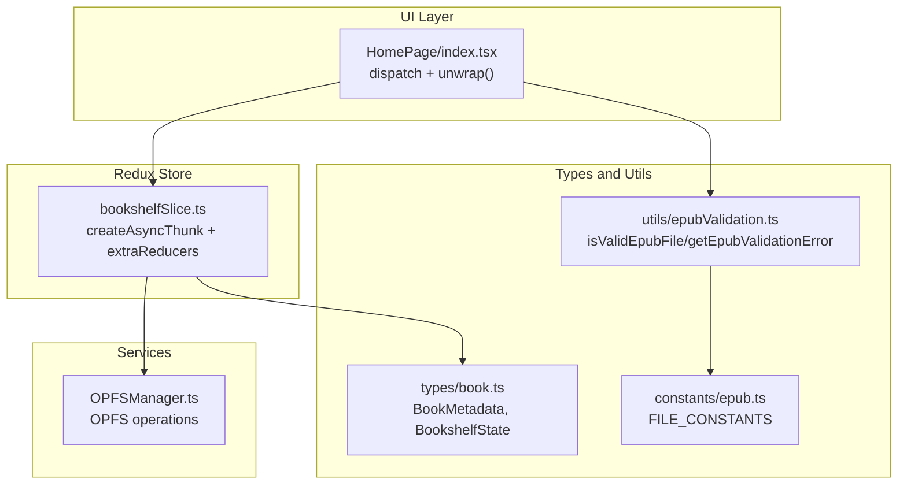
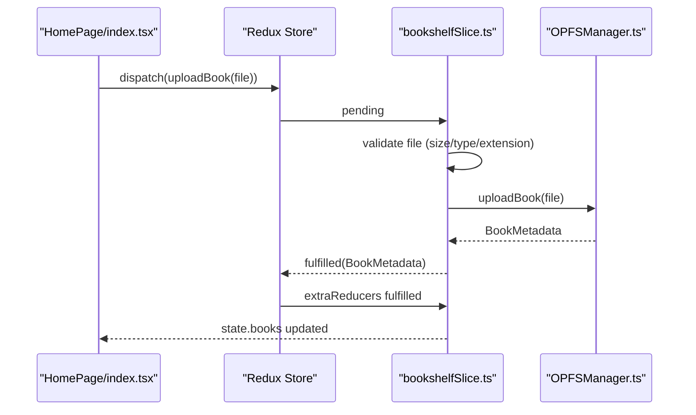
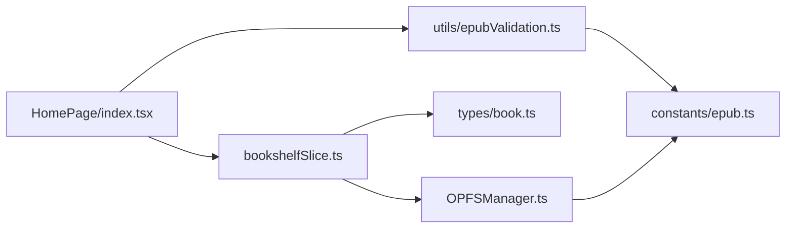

# Async Thunks

<cite>
**Referenced Files in This Document**
- [bookshelfSlice.ts](file://src/store/slices/bookshelfSlice.ts)
- [OPFSManager.ts](file://src/services/OPFSManager.ts)
- [index.tsx](file://src/pages/HomePage/index.tsx)
- [book.ts](file://src/types/book.ts)
- [epubValidation.ts](file://src/utils/epubValidation.ts)
- [epub.ts](file://src/constants/epub.ts)
- [index.ts](file://src/store/index.ts)
</cite>

## Table of Contents
1. [Introduction](#introduction)
2. [Project Structure](#project-structure)
3. [Core Components](#core-components)
4. [Architecture Overview](#architecture-overview)
5. [Detailed Component Analysis](#detailed-component-analysis)
6. [Dependency Analysis](#dependency-analysis)
7. [Performance Considerations](#performance-considerations)
8. [Troubleshooting Guide](#troubleshooting-guide)
9. [Conclusion](#conclusion)

## Introduction
This document explains the async thunk middleware implementation for managing a local EPUB bookshelf backed by the Origin Private File System (OPFS). It focuses on four thunks: initializeBookshelf, uploadBook, deleteBook, and loadBooks. It covers their async logic, error handling with rejectWithValue, integration with OPFSManager services, the pending/fulfilled/rejected lifecycle, and how extraReducers handle these states. It also demonstrates promise-based handling in HomePage with dispatch(uploadBook(file)).unwrap(), outlines parameter validation patterns, and provides best practices for async error handling, loading state management, and avoiding race conditions.

## Project Structure
The async logic is encapsulated in a Redux slice that defines thunks and reducers. The HomePage component orchestrates user interactions and dispatches thunks. OPFSManager provides the underlying file system operations. Validation utilities ensure consistent checks across the app.

**Diagram sources**
- [bookshelfSlice.ts](file://src/store/slices/bookshelfSlice.ts#L1-L189)
- [index.tsx](file://src/pages/HomePage/index.tsx#L1-L292)
- [OPFSManager.ts](file://src/services/OPFSManager.ts#L1-L510)
- [book.ts](file://src/types/book.ts#L1-L116)
- [epubValidation.ts](file://src/utils/epubValidation.ts#L1-L77)
- [epub.ts](file://src/constants/epub.ts#L1-L61)

**Section sources**
- [bookshelfSlice.ts](file://src/store/slices/bookshelfSlice.ts#L1-L189)
- [index.tsx](file://src/pages/HomePage/index.tsx#L1-L292)
- [OPFSManager.ts](file://src/services/OPFSManager.ts#L1-L510)
- [book.ts](file://src/types/book.ts#L1-L116)
- [epubValidation.ts](file://src/utils/epubValidation.ts#L1-L77)
- [epub.ts](file://src/constants/epub.ts#L1-L61)

## Core Components
- Thunks: initializeBookshelf, uploadBook, deleteBook, loadBooks
- Slice state: BookshelfState with books, isLoading, error, uploadProgress
- Reducers: setUploadProgress, clearError
- ExtraReducers: pending/fulfilled/rejected handlers for each thunk
- OPFSManager integration: initialize, uploadBook, deleteBook, getAllBooks
- Validation: getEpubValidationError and isValidEpubFile

Key responsibilities:
- Thunks validate inputs, call OPFSManager, and return payload or reject with message
- ExtraReducers manage loading/error states and update books list
- HomePage uses unwrap() to handle promise-based results and propagate errors to the UI

**Section sources**
- [bookshelfSlice.ts](file://src/store/slices/bookshelfSlice.ts#L1-L189)
- [book.ts](file://src/types/book.ts#L93-L116)
- [index.tsx](file://src/pages/HomePage/index.tsx#L1-L292)
- [OPFSManager.ts](file://src/services/OPFSManager.ts#L1-L510)
- [epubValidation.ts](file://src/utils/epubValidation.ts#L1-L77)

## Architecture Overview
The async flow follows a predictable pattern:
- UI triggers a thunk via dispatch
- Thunk executes async logic, validates inputs, and calls OPFSManager
- Thunk resolves with fulfilled payload or rejects with a message via rejectWithValue
- Redux automatically dispatches pending/fulfilled/rejected actions
- extraReducers update the slice state accordingly

**Diagram sources**
- [index.tsx](file://src/pages/HomePage/index.tsx#L60-L80)
- [bookshelfSlice.ts](file://src/store/slices/bookshelfSlice.ts#L40-L56)
- [OPFSManager.ts](file://src/services/OPFSManager.ts#L123-L219)

## Detailed Component Analysis

### Thunk: initializeBookshelf
- Purpose: Check OPFS support, initialize OPFS directory, and load all books
- Validation: Checks OPFS support before proceeding
- Core processing: Calls OPFSManager.initialize() and OPFSManager.getAllBooks()
- Fulfill payload: Returns array of BookMetadata
- Rejection: Uses rejectWithValue with error message

Lifecycle handling:
- pending: sets isLoading true and clears error
- fulfilled: sets isLoading false and replaces books with payload
- rejected: sets isLoading false and sets error to payload string

Integration with OPFSManager:
- Uses OPFSManager.isSupported(), OPFSManager.initialize(), OPFSManager.getAllBooks()

**Section sources**
- [bookshelfSlice.ts](file://src/store/slices/bookshelfSlice.ts#L19-L38)
- [OPFSManager.ts](file://src/services/OPFSManager.ts#L28-L60)
- [OPFSManager.ts](file://src/services/OPFSManager.ts#L326-L332)

### Thunk: uploadBook
- Purpose: Upload an EPUB file, persist it to OPFS, extract metadata and cover, and update config
- Validation: Centralized validation via getEpubValidationError and size limits
- Core processing: Calls OPFSManager.uploadBook(file) which creates book directory, writes EPUB, extracts cover, builds BookMetadata, updates config
- Fulfill payload: Returns BookMetadata
- Rejection: Uses rejectWithValue with error message

Lifecycle handling:
- pending: sets isLoading true and clears error
- fulfilled: sets isLoading false and pushes payload to books
- rejected: sets isLoading false and sets error to payload string

Parameter validation patterns:
- File extension check (.epub)
- Non-zero size and size limit (100MB)
- MIME type or extension fallback validation

Error propagation:
- HomePage catches unwrap() rejection and alerts the user

**Section sources**
- [bookshelfSlice.ts](file://src/store/slices/bookshelfSlice.ts#L40-L56)
- [OPFSManager.ts](file://src/services/OPFSManager.ts#L123-L219)
- [epubValidation.ts](file://src/utils/epubValidation.ts#L23-L61)
- [epub.ts](file://src/constants/epub.ts#L31-L39)
- [index.tsx](file://src/pages/HomePage/index.tsx#L60-L80)

### Thunk: deleteBook
- Purpose: Delete a book directory and update config
- Validation: Ensures bookId is provided
- Core processing: Calls OPFSManager.deleteBook(bookId) and updates config
- Fulfill payload: Returns the deleted bookId
- Rejection: Uses rejectWithValue with error message

Lifecycle handling:
- pending: sets isLoading true and clears error
- fulfilled: sets isLoading false and filters out the deleted book
- rejected: sets isLoading false and sets error to payload string

**Section sources**
- [bookshelfSlice.ts](file://src/store/slices/bookshelfSlice.ts#L58-L76)
- [OPFSManager.ts](file://src/services/OPFSManager.ts#L240-L261)

### Thunk: loadBooks
- Purpose: Refresh the books list from config
- Core processing: Calls OPFSManager.getAllBooks()
- Fulfill payload: Returns array of BookMetadata
- Rejection: Uses rejectWithValue with error message

Lifecycle handling:
- pending: sets isLoading true and clears error
- fulfilled: sets isLoading false and replaces books with payload
- rejected: sets isLoading false and sets error to payload string

**Section sources**
- [bookshelfSlice.ts](file://src/store/slices/bookshelfSlice.ts#L78-L88)
- [OPFSManager.ts](file://src/services/OPFSManager.ts#L326-L332)

### Slice State and Reducers
- State fields: books[], isLoading, error, uploadProgress
- Reducers:
  - setUploadProgress: updates uploadProgress
  - clearError: resets error to null

extraReducers:
- Pending: set isLoading true and clear error
- Fulfilled: set isLoading false and update books
- Rejected: set isLoading false and set error to payload string

**Section sources**
- [bookshelfSlice.ts](file://src/store/slices/bookshelfSlice.ts#L90-L111)
- [bookshelfSlice.ts](file://src/store/slices/bookshelfSlice.ts#L112-L181)
- [book.ts](file://src/types/book.ts#L93-L116)

### UI Integration: HomePage
- Initialization: dispatch(initializeBookshelf()).unwrap() handles OPFS support and loads books
- Upload flow: dispatch(uploadBook(file)).unwrap() followed by dispatch(loadBooks())
- Deletion: dispatch(deleteBook(bookId)).unwrap() with confirmation
- Error handling: unwrap() rethrows errors caught by try/catch blocks; UI displays alerts and dismissible error banner
- Loading states: Spinner shown when isLoading is true and books list is empty

Promise-based handling:
- unwrap() converts thunk result into a promise that either resolves with payload or rejects with the error message

**Section sources**
- [index.tsx](file://src/pages/HomePage/index.tsx#L31-L43)
- [index.tsx](file://src/pages/HomePage/index.tsx#L50-L58)
- [index.tsx](file://src/pages/HomePage/index.tsx#L60-L80)
- [index.tsx](file://src/pages/HomePage/index.tsx#L200-L244)

### OPFSManager Services
- isSupported(): Feature detection for OPFS
- initialize(): Creates root and books directories, ensures config.json exists
- uploadBook(file): Writes EPUB, extracts metadata and cover, updates config, returns BookMetadata
- deleteBook(bookId): Removes book directory and updates config
- getAllBooks(): Reads config and returns books
- Additional helpers: loadConfig, saveConfig, getBookFile, getCoverBase64ByPath, getStorageStats, resetAllData, updateContextMenuSettings, getContextMenuSettings

**Section sources**
- [OPFSManager.ts](file://src/services/OPFSManager.ts#L28-L60)
- [OPFSManager.ts](file://src/services/OPFSManager.ts#L123-L219)
- [OPFSManager.ts](file://src/services/OPFSManager.ts#L240-L261)
- [OPFSManager.ts](file://src/services/OPFSManager.ts#L326-L332)
- [OPFSManager.ts](file://src/services/OPFSManager.ts#L478-L509)

### Parameter Validation Patterns
- File extension validation: Must end with .epub
- Size validation: Non-zero and ≤ 100MB
- MIME type validation: Supports application/epub+zip and others
- Centralized validation: getEpubValidationError returns a user-friendly message or null

**Section sources**
- [bookshelfSlice.ts](file://src/store/slices/bookshelfSlice.ts#L5-L16)
- [epubValidation.ts](file://src/utils/epubValidation.ts#L23-L61)
- [epub.ts](file://src/constants/epub.ts#L31-L39)

### Error Propagation to the UI
- Thunks reject with messages via rejectWithValue
- extraReducers set error state on rejected
- HomePage uses unwrap() to surface errors to the UI
- UI components display error banners and alerts

**Section sources**
- [bookshelfSlice.ts](file://src/store/slices/bookshelfSlice.ts#L33-L36)
- [bookshelfSlice.ts](file://src/store/slices/bookshelfSlice.ts#L51-L54)
- [bookshelfSlice.ts](file://src/store/slices/bookshelfSlice.ts#L70-L74)
- [bookshelfSlice.ts](file://src/store/slices/bookshelfSlice.ts#L84-L87)
- [index.tsx](file://src/pages/HomePage/index.tsx#L33-L40)
- [index.tsx](file://src/pages/HomePage/index.tsx#L50-L58)
- [index.tsx](file://src/pages/HomePage/index.tsx#L60-L80)

## Dependency Analysis
- bookshelfSlice.ts depends on:
  - OPFSManager.ts for all file operations
  - types/book.ts for BookMetadata and BookshelfState
  - utils/epubValidation.ts for file validation
- HomePage/index.tsx depends on:
  - bookshelfSlice.ts for thunks and actions
  - OPFSManager.ts for runtime support checks
  - utils/epubValidation.ts for pre-upload validation
- OPFSManager.ts depends on:
  - constants/epub.ts for file size limits
  - utils/fileOperations.ts for safe filesystem operations
  - EPUBMetadataService for metadata extraction

**Diagram sources**
- [index.tsx](file://src/pages/HomePage/index.tsx#L1-L292)
- [bookshelfSlice.ts](file://src/store/slices/bookshelfSlice.ts#L1-L189)
- [OPFSManager.ts](file://src/services/OPFSManager.ts#L1-L510)
- [book.ts](file://src/types/book.ts#L1-L116)
- [epubValidation.ts](file://src/utils/epubValidation.ts#L1-L77)
- [epub.ts](file://src/constants/epub.ts#L1-L61)

**Section sources**
- [index.ts](file://src/store/index.ts#L1-L23)
- [index.tsx](file://src/pages/HomePage/index.tsx#L1-L292)
- [bookshelfSlice.ts](file://src/store/slices/bookshelfSlice.ts#L1-L189)
- [OPFSManager.ts](file://src/services/OPFSManager.ts#L1-L510)
- [book.ts](file://src/types/book.ts#L1-L116)
- [epubValidation.ts](file://src/utils/epubValidation.ts#L1-L77)
- [epub.ts](file://src/constants/epub.ts#L1-L61)

## Performance Considerations
- Prefer unwrap() only when you need immediate UI feedback; otherwise rely on extraReducers for state-driven UI updates
- Avoid redundant loadBooks calls immediately after upload; batch operations when possible
- Use optimistic updates cautiously; ensure rollback on failure
- Debounce or throttle drag-and-drop events to prevent excessive state churn
- Consider caching frequently accessed metadata to reduce repeated reads

[No sources needed since this section provides general guidance]

## Troubleshooting Guide
Common issues and resolutions:
- OPFS not supported: The app detects unsupported browsers and shows a warning; initializeBookshelf thunk rejects with a message
- Upload failures: Validate file with getEpubValidationError before dispatch; unwrap() will surface the error to the UI
- Deletion failures: Ensure bookId is valid; unwrap() will surface the error to the UI
- Stale book lists: Dispatch loadBooks after successful upload to refresh the UI

**Section sources**
- [index.tsx](file://src/pages/HomePage/index.tsx#L226-L244)
- [bookshelfSlice.ts](file://src/store/slices/bookshelfSlice.ts#L23-L26)
- [index.tsx](file://src/pages/HomePage/index.tsx#L60-L80)

## Conclusion
The async thunk implementation cleanly separates concerns: UI dispatches thunks, thunks validate inputs and orchestrate OPFS operations, and extraReducers manage state transitions. The HomePage demonstrates robust promise-based handling with unwrap(), while centralized validation and error propagation ensure a consistent user experience. Following the outlined best practices will help maintain reliability and responsiveness as the application scales.