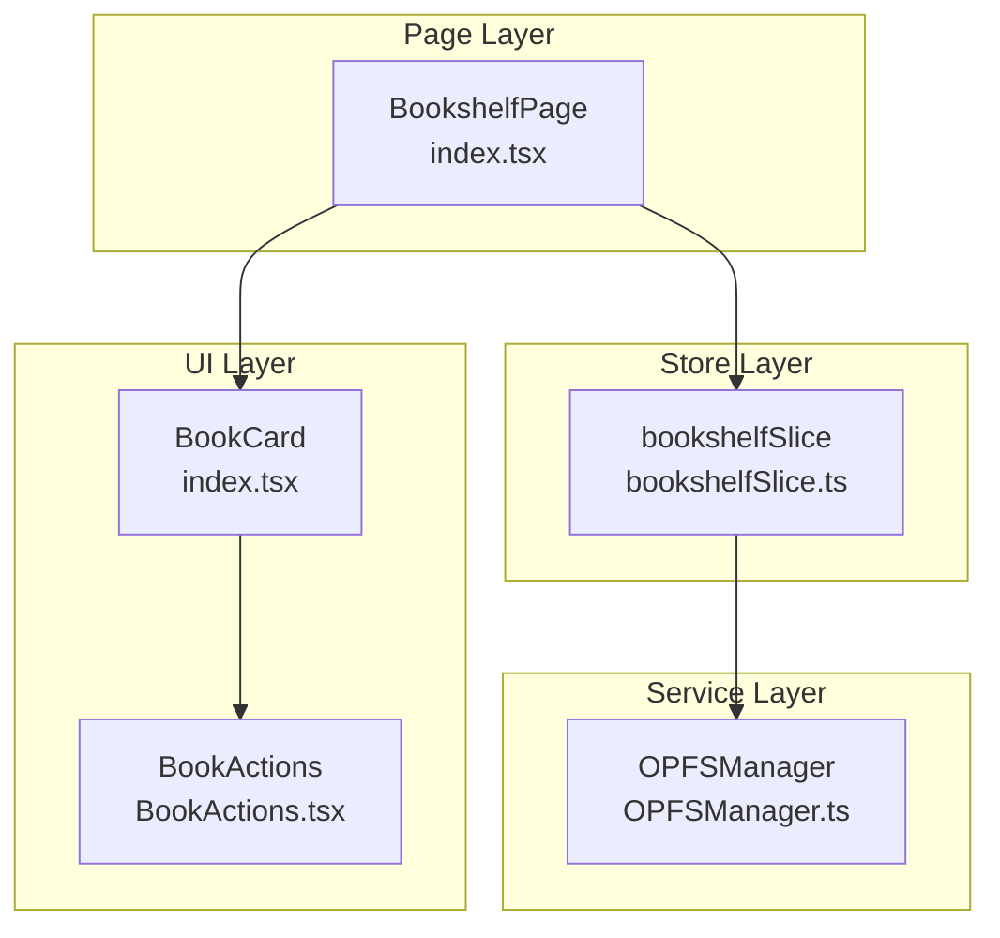
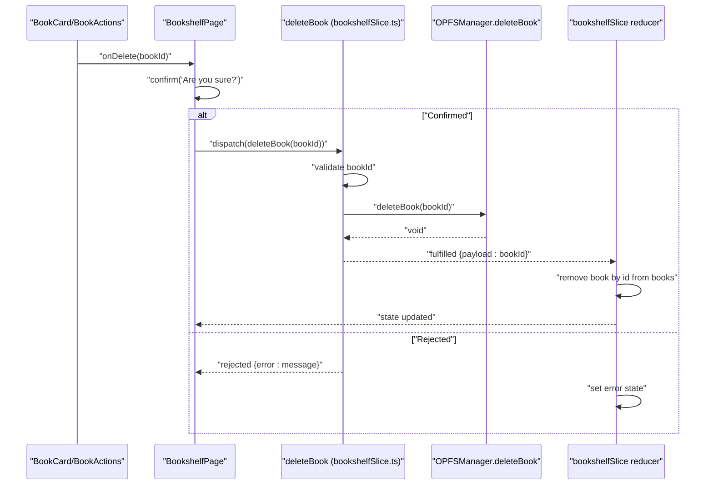
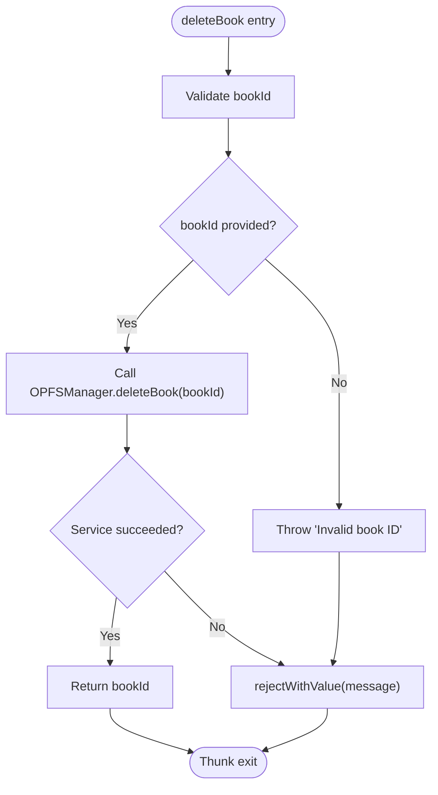
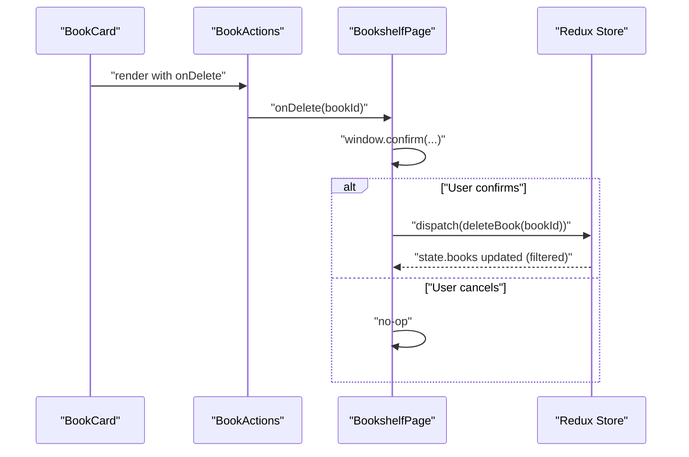
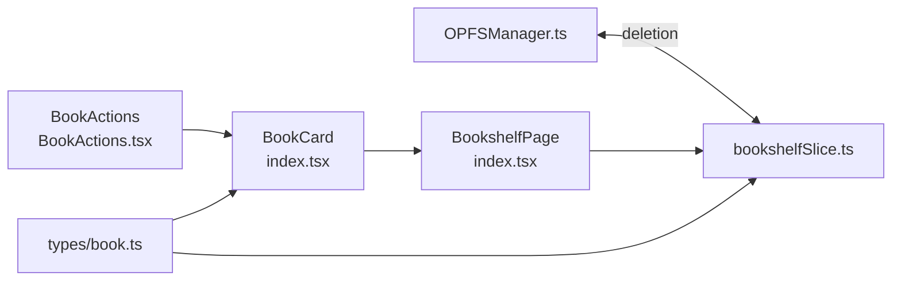

# Delete Book

<cite>
**Referenced Files in This Document**
- [bookshelfSlice.ts](file://src/store/slices/bookshelfSlice.ts)
- [OPFSManager.ts](file://src/services/OPFSManager.ts)
- [index.tsx](file://src/pages/HomePage/index.tsx)
- [index.tsx](file://src/components/BookCard/index.tsx)
- [BookActions.tsx](file://src/components/BookCard/BookActions.tsx)
- [book.ts](file://src/types/book.ts)
</cite>

## Table of Contents
1. [Introduction](#introduction)
2. [Project Structure](#project-structure)
3. [Core Components](#core-components)
4. [Architecture Overview](#architecture-overview)
5. [Detailed Component Analysis](#detailed-component-analysis)
6. [Dependency Analysis](#dependency-analysis)
7. [Performance Considerations](#performance-considerations)
8. [Troubleshooting Guide](#troubleshooting-guide)
9. [Conclusion](#conclusion)

## Introduction
This document explains the deleteBook async thunk responsible for removing books from OPFS storage by ID. It covers input validation, integration with OPFSManager.deleteBook(bookId), successful return of the deleted book ID, state mutation in the bookshelf slice, error handling, and typical usage from BookCard components with confirmation dialogs.

## Project Structure
The delete operation spans three layers:
- UI layer: BookCard and BookActions components trigger deletion via callbacks.
- Page layer: BookshelfPage orchestrates user confirmation and dispatches the thunk.
- Store layer: bookshelfSlice defines the deleteBook async thunk and updates state.
- Service layer: OPFSManager performs the actual OPFS deletion and config updates.

**Diagram sources**
- [index.tsx](file://src/components/BookCard/index.tsx#L1-L86)
- [BookActions.tsx](file://src/components/BookCard/BookActions.tsx#L1-L66)
- [index.tsx](file://src/pages/HomePage/index.tsx#L1-L292)
- [bookshelfSlice.ts](file://src/store/slices/bookshelfSlice.ts#L57-L76)
- [OPFSManager.ts](file://src/services/OPFSManager.ts#L242-L261)

**Section sources**
- [bookshelfSlice.ts](file://src/store/slices/bookshelfSlice.ts#L57-L76)
- [OPFSManager.ts](file://src/services/OPFSManager.ts#L242-L261)
- [index.tsx](file://src/pages/HomePage/index.tsx#L45-L60)
- [index.tsx](file://src/components/BookCard/index.tsx#L1-L86)
- [BookActions.tsx](file://src/components/BookCard/BookActions.tsx#L1-L66)

## Core Components
- deleteBook async thunk: Validates input, calls OPFSManager.deleteBook(bookId), and returns the deleted book ID on success.
- bookshelf slice extraReducer: On fulfilled, removes the book from the books array by ID; on rejected, sets error state.
- OPFSManager.deleteBook: Deletes the book directory and updates config.json accordingly.
- BookshelfPage: Dispatches deleteBook with confirmation and surfaces errors to the UI.
- BookCard and BookActions: Provide the Delete action and pass the book ID to the parent handler.

**Section sources**
- [bookshelfSlice.ts](file://src/store/slices/bookshelfSlice.ts#L57-L76)
- [bookshelfSlice.ts](file://src/store/slices/bookshelfSlice.ts#L148-L164)
- [OPFSManager.ts](file://src/services/OPFSManager.ts#L242-L261)
- [index.tsx](file://src/pages/HomePage/index.tsx#L45-L60)
- [index.tsx](file://src/components/BookCard/index.tsx#L1-L86)
- [BookActions.tsx](file://src/components/BookCard/BookActions.tsx#L1-L66)

## Architecture Overview
The delete workflow follows Redux’s async thunk pattern:
- UI triggers deletion via BookCard/BookActions.
- BookshelfPage confirms and dispatches deleteBook(bookId).
- Thunk validates bookId, calls OPFSManager.deleteBook(bookId).
- On success, thunk resolves with bookId; extraReducer filters the book from state.books.
- On failure, thunk rejects with an error payload; extraReducer sets error state.

**Diagram sources**
- [index.tsx](file://src/components/BookCard/index.tsx#L1-L86)
- [BookActions.tsx](file://src/components/BookCard/BookActions.tsx#L1-L66)
- [index.tsx](file://src/pages/HomePage/index.tsx#L45-L60)
- [bookshelfSlice.ts](file://src/store/slices/bookshelfSlice.ts#L57-L76)
- [bookshelfSlice.ts](file://src/store/slices/bookshelfSlice.ts#L148-L164)
- [OPFSManager.ts](file://src/services/OPFSManager.ts#L242-L261)

## Detailed Component Analysis

### deleteBook async thunk
Purpose:
- Validate the incoming bookId.
- Call OPFSManager.deleteBook(bookId) to remove the book directory and update config.
- Return the deleted book ID on success for downstream state updates.

Input validation:
- Ensures bookId is truthy; otherwise throws an error indicating invalid ID.

Integration with OPFSManager.deleteBook(bookId):
- Delegates deletion to OPFSManager.deleteBook(bookId), which removes the book directory recursively and updates config.json to exclude the book.

Return value:
- On success, returns the bookId payload so the extraReducer can filter it out of state.books.

State mutation on fulfillment:
- extraReducers.handle deleteBook.fulfilled by setting isLoading false and filtering state.books to exclude the book whose id equals the payload.

Error handling:
- On thrown errors, the thunk returns rejectWithValue with a message; extraReducers.handle deleteBook.rejected by setting isLoading false and assigning action.payload to state.error.

**Diagram sources**
- [bookshelfSlice.ts](file://src/store/slices/bookshelfSlice.ts#L57-L76)
- [OPFSManager.ts](file://src/services/OPFSManager.ts#L242-L261)

**Section sources**
- [bookshelfSlice.ts](file://src/store/slices/bookshelfSlice.ts#L57-L76)
- [bookshelfSlice.ts](file://src/store/slices/bookshelfSlice.ts#L148-L164)

### OPFSManager.deleteBook(bookId)
Responsibilities:
- Retrieve or initialize OPFS directory structure.
- Attempt to remove the book directory recursively by bookId.
- Load config.json, filter out the book with the given ID, update lastSync, and save config.json.

Behavior on missing directory:
- Ignores removal errors if the directory does not exist, ensuring idempotent deletion.

Error propagation:
- Throws descriptive errors on failures (e.g., initialization or IO issues), which bubble up to the thunk’s reject path.

**Section sources**
- [OPFSManager.ts](file://src/services/OPFSManager.ts#L242-L261)

### bookshelf slice extraReducer for deleteBook
- pending: Sets isLoading true and clears error.
- fulfilled: Sets isLoading false and filters state.books to remove the book whose id equals action.payload.
- rejected: Sets isLoading false and assigns action.payload to state.error.

**Section sources**
- [bookshelfSlice.ts](file://src/store/slices/bookshelfSlice.ts#L148-L164)

### Usage context: BookCard and BookshelfPage
- BookCard/BookActions:
  - Exposes a Delete action bound to onDelete callback.
  - Passes the book’s id to the parent handler on click.
- BookshelfPage:
  - Receives onDelete from BookCard and wraps deletion in a confirmation dialog.
  - Dispatches deleteBook(bookId) and awaits unwrap().
  - On rejection, shows an alert with the error message.
  - The UI reflects state changes automatically via Redux selectors.

**Diagram sources**
- [index.tsx](file://src/components/BookCard/index.tsx#L1-L86)
- [BookActions.tsx](file://src/components/BookCard/BookActions.tsx#L1-L66)
- [index.tsx](file://src/pages/HomePage/index.tsx#L45-L60)

**Section sources**
- [index.tsx](file://src/components/BookCard/index.tsx#L1-L86)
- [BookActions.tsx](file://src/components/BookCard/BookActions.tsx#L1-L66)
- [index.tsx](file://src/pages/HomePage/index.tsx#L45-L60)

## Dependency Analysis
- bookshelfSlice.ts depends on OPFSManager.ts for deletion operations.
- BookshelfPage depends on bookshelfSlice for dispatching deleteBook and on BookCard for rendering and triggering deletion.
- BookCard depends on BookActions for UI actions and passes callbacks upward.
- Types define BookMetadata and BookshelfState shapes used across components and slices.

**Diagram sources**
- [bookshelfSlice.ts](file://src/store/slices/bookshelfSlice.ts#L57-L76)
- [OPFSManager.ts](file://src/services/OPFSManager.ts#L242-L261)
- [index.tsx](file://src/pages/HomePage/index.tsx#L1-L292)
- [index.tsx](file://src/components/BookCard/index.tsx#L1-L86)
- [BookActions.tsx](file://src/components/BookCard/BookActions.tsx#L1-L66)
- [book.ts](file://src/types/book.ts#L93-L116)

**Section sources**
- [bookshelfSlice.ts](file://src/store/slices/bookshelfSlice.ts#L57-L76)
- [OPFSManager.ts](file://src/services/OPFSManager.ts#L242-L261)
- [index.tsx](file://src/pages/HomePage/index.tsx#L1-L292)
- [index.tsx](file://src/components/BookCard/index.tsx#L1-L86)
- [BookActions.tsx](file://src/components/BookCard/BookActions.tsx#L1-L66)
- [book.ts](file://src/types/book.ts#L93-L116)

## Performance Considerations
- Deletion is a single async operation that removes a directory and updates a small JSON file. Complexity is dominated by filesystem operations and JSON parsing.
- The UI update is O(n) to filter the books array by ID; this is efficient for typical library sizes.
- Confirming before dispatch reduces accidental deletions and avoids unnecessary network or filesystem calls.

## Troubleshooting Guide
Common error scenarios:
- Invalid bookId:
  - Symptom: Rejected action with an error message indicating invalid ID.
  - Cause: Missing or falsy bookId passed to the thunk.
  - Resolution: Ensure BookCard/BookActions always pass a valid book id.
- OPFS not supported:
  - Symptom: Browser compatibility warning and potential initialization errors upstream.
  - Resolution: Use a compatible browser or disable OPFS-dependent features.
- Deletion failure:
  - Symptom: Rejected action with a descriptive error message.
  - Causes: OPFS unavailable, permission issues, or IO errors while removing the directory or updating config.
  - Resolution: Retry after ensuring OPFS availability; inspect browser console for details.
- UI not reflecting changes:
  - Symptom: Book remains visible after deletion.
  - Resolution: Verify that deleteBook.fulfilled is handled and state.books is filtered; confirm the payload equals the book id.

Where to surface errors in UI:
- BookshelfPage displays error messages and provides a dismiss action.
- On rejected, BookshelfPage shows an alert with the error message.

**Section sources**
- [bookshelfSlice.ts](file://src/store/slices/bookshelfSlice.ts#L148-L164)
- [index.tsx](file://src/pages/HomePage/index.tsx#L200-L224)
- [index.tsx](file://src/pages/HomePage/index.tsx#L45-L60)

## Conclusion
The deleteBook async thunk provides a robust, validated pathway to remove books from OPFS storage. It integrates cleanly with OPFSManager, updates state deterministically, and surfaces errors to the UI. The BookCard and BookshelfPage components coordinate user confirmation and dispatch, ensuring a safe and predictable deletion experience.