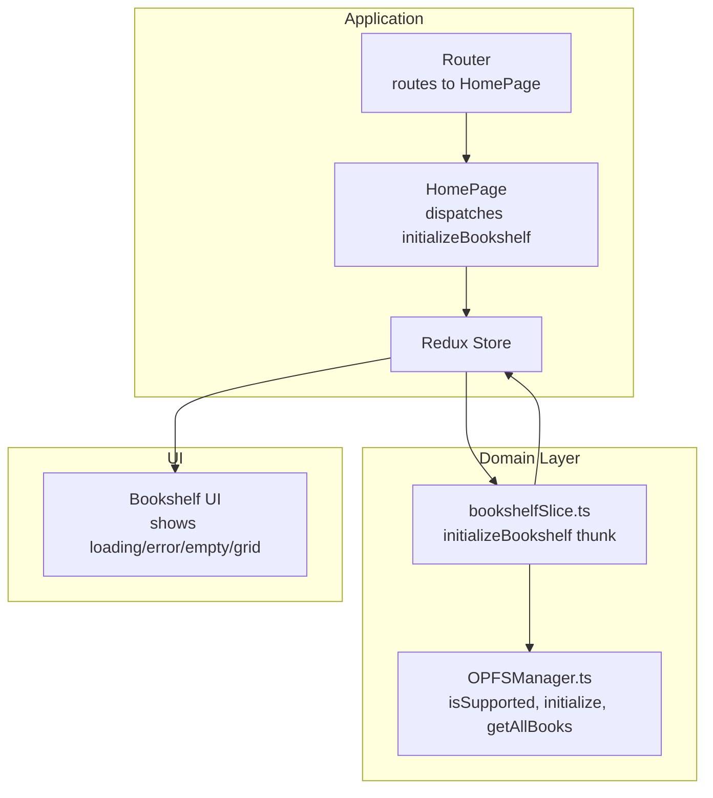
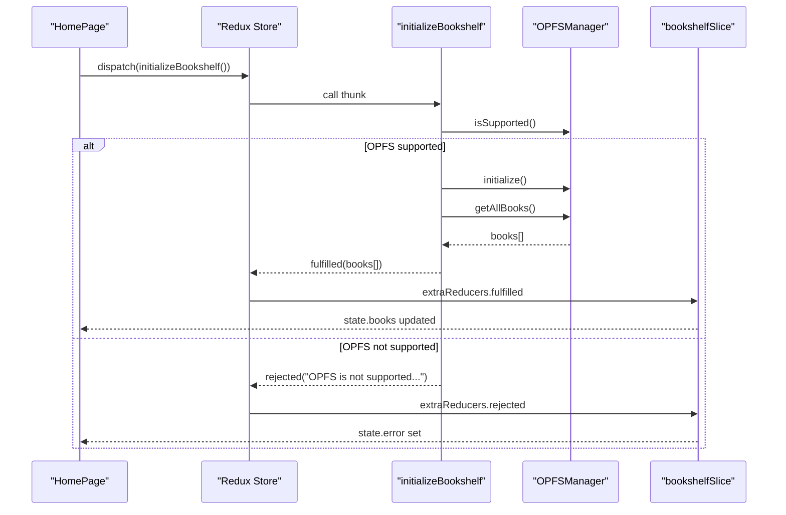
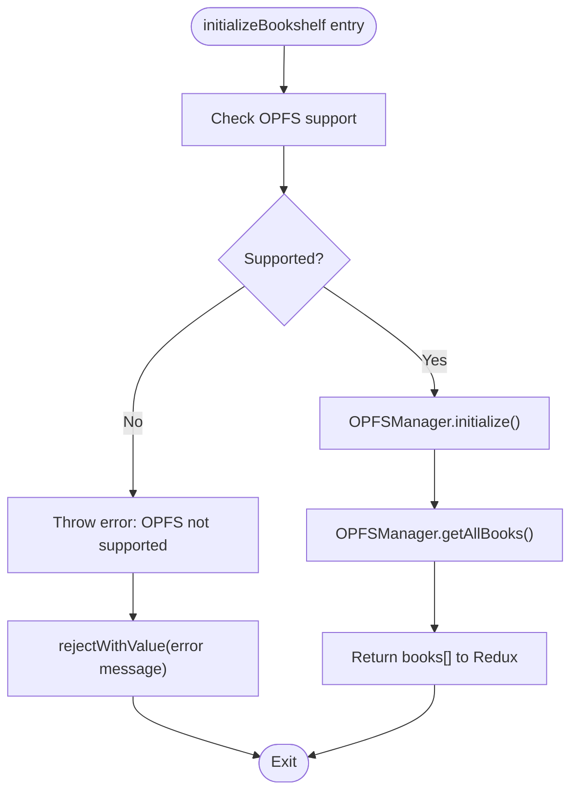
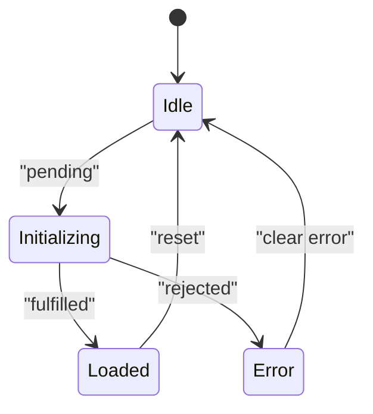
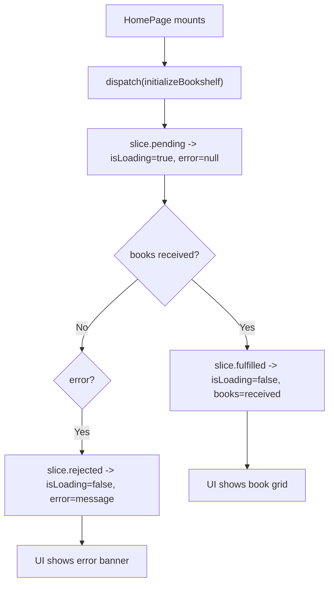
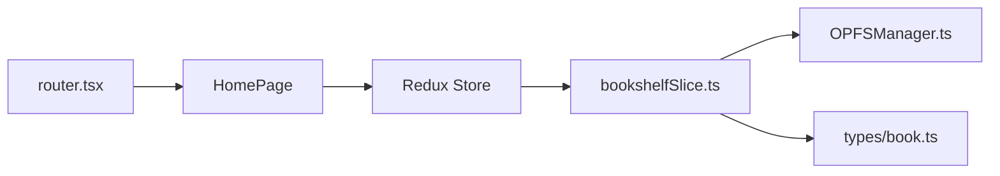

# Initialize Bookshelf

<cite>
**Referenced Files in This Document**
- [bookshelfSlice.ts](file://src/store/slices/bookshelfSlice.ts)
- [OPFSManager.ts](file://src/services/OPFSManager.ts)
- [index.tsx](file://src/pages/HomePage/index.tsx)
- [router.tsx](file://src/config/router.tsx)
- [index.ts](file://src/store/index.ts)
- [book.ts](file://src/types/book.ts)
- [StoragePage.tsx](file://src/pages/SettingsPage/StoragePage.tsx)
</cite>

## Table of Contents
1. [Introduction](#introduction)
2. [Project Structure](#project-structure)
3. [Core Components](#core-components)
4. [Architecture Overview](#architecture-overview)
5. [Detailed Component Analysis](#detailed-component-analysis)
6. [Dependency Analysis](#dependency-analysis)
7. [Performance Considerations](#performance-considerations)
8. [Troubleshooting Guide](#troubleshooting-guide)
9. [Conclusion](#conclusion)

## Introduction
This document explains the initializeBookshelf async thunk and its role in setting up the OPFS storage system and loading existing books on application startup. It describes the three-phase logic (input handling, core processing, output handling), how it integrates with OPFSManager.initialize() and OPFSManager.getAllBooks(), and how errors propagate through rejectWithValue. It also covers state transitions in the bookshelf slice via extraReducers and how the UI responds to loading and error states during initialization.

## Project Structure
The initializeBookshelf thunk lives in the Redux slice dedicated to the bookshelf domain. It orchestrates OPFS initialization and book retrieval, updates the Redux state, and informs the UI about loading and error conditions. The HomePage component triggers the thunk on mount, and the router defines the route that renders the bookshelf page.

**Diagram sources**
- [router.tsx](file://src/config/router.tsx#L1-L58)
- [index.ts](file://src/store/index.ts#L1-L23)
- [index.tsx](file://src/pages/HomePage/index.tsx#L1-L120)
- [bookshelfSlice.ts](file://src/store/slices/bookshelfSlice.ts#L1-L189)
- [OPFSManager.ts](file://src/services/OPFSManager.ts#L1-L120)

**Section sources**
- [router.tsx](file://src/config/router.tsx#L1-L58)
- [index.ts](file://src/store/index.ts#L1-L23)
- [index.tsx](file://src/pages/HomePage/index.tsx#L1-L120)
- [bookshelfSlice.ts](file://src/store/slices/bookshelfSlice.ts#L1-L189)
- [OPFSManager.ts](file://src/services/OPFSManager.ts#L1-L120)

## Core Components
- initializeBookshelf async thunk: Validates OPFS support, initializes OPFS, retrieves all books, and returns book metadata. It uses rejectWithValue to propagate errors.
- OPFSManager: Provides isSupported(), initialize(), getAllBooks(), and other OPFS operations.
- bookshelfSlice: Defines the initial state, reducers, and extraReducers for pending/fulfilled/rejected handlers.
- HomePage: Dispatches initializeBookshelf on mount and renders loading/error/empty states.
- StoragePage: Demonstrates OPFS support checks and error messaging for storage-related operations.

**Section sources**
- [bookshelfSlice.ts](file://src/store/slices/bookshelfSlice.ts#L1-L189)
- [OPFSManager.ts](file://src/services/OPFSManager.ts#L1-L120)
- [index.tsx](file://src/pages/HomePage/index.tsx#L1-L120)
- [StoragePage.tsx](file://src/pages/SettingsPage/StoragePage.tsx#L1-L130)

## Architecture Overview
The initializeBookshelf thunk coordinates three steps:
1. Input handling: Check OPFS support.
2. Core processing: Initialize OPFS and retrieve all books.
3. Output handling: Return book metadata to Redux.

It integrates with OPFSManager.initialize() and OPFSManager.getAllBooks() and updates the bookshelf slice’s state accordingly.

**Diagram sources**
- [index.tsx](file://src/pages/HomePage/index.tsx#L31-L43)
- [bookshelfSlice.ts](file://src/store/slices/bookshelfSlice.ts#L19-L38)
- [OPFSManager.ts](file://src/services/OPFSManager.ts#L28-L60)

## Detailed Component Analysis

### initializeBookshelf Thunk
- Purpose: On application startup, ensure OPFS is available, initialize the OPFS directory structure, and load all previously saved books into the Redux store.
- Three-phase logic:
  - Input handling: Verify OPFS support via OPFSManager.isSupported().
  - Core processing: Call OPFSManager.initialize() to set up the directory structure and ensure config, then call OPFSManager.getAllBooks() to read persisted metadata.
  - Output handling: Return the retrieved books to Redux; on failure, propagate the error via rejectWithValue.
- Integration points:
  - Calls OPFSManager.initialize() and OPFSManager.getAllBooks().
  - Uses rejectWithValue to pass error messages to extraReducers.rejected.
- Error propagation:
  - Throws an error when OPFS is not supported; rejectWithValue converts it to a rejected action payload.
  - Catches exceptions from OPFS operations and returns rejectWithValue with a string message.

**Diagram sources**
- [bookshelfSlice.ts](file://src/store/slices/bookshelfSlice.ts#L19-L38)
- [OPFSManager.ts](file://src/services/OPFSManager.ts#L28-L60)

**Section sources**
- [bookshelfSlice.ts](file://src/store/slices/bookshelfSlice.ts#L19-L38)
- [OPFSManager.ts](file://src/services/OPFSManager.ts#L28-L60)

### OPFSManager Services Used by the Thunk
- isSupported(): Determines whether the browser supports the required OPFS APIs.
- initialize(): Creates the OPFS root and books directories, ensures config.json exists, and returns the directory structure.
- getAllBooks(): Reads the config.json and returns the array of book metadata.

These services encapsulate all OPFS-specific logic, keeping the thunk focused on orchestration.

**Section sources**
- [OPFSManager.ts](file://src/services/OPFSManager.ts#L28-L60)
- [OPFSManager.ts](file://src/services/OPFSManager.ts#L329-L332)

### State Transitions in the Bookshelf Slice
The bookshelf slice manages three states for initializeBookshelf:
- pending: Sets isLoading to true and clears error.
- fulfilled: Sets isLoading to false and replaces state.books with the returned books.
- rejected: Sets isLoading to false and sets state.error to the string payload.

**Diagram sources**
- [bookshelfSlice.ts](file://src/store/slices/bookshelfSlice.ts#L112-L130)

**Section sources**
- [bookshelfSlice.ts](file://src/store/slices/bookshelfSlice.ts#L112-L130)

### UI Behavior During Initialization
- HomePage dispatches initializeBookshelf on mount and unwraps the result. If OPFS is not supported, it logs the error and allows the UI to continue rendering.
- The UI displays:
  - A browser compatibility warning when OPFS is not supported.
  - A loading spinner while isLoading is true and there are no books.
  - An error banner with dismiss action when error is set.
  - A grid of books when fulfilled.

**Diagram sources**
- [index.tsx](file://src/pages/HomePage/index.tsx#L31-L43)
- [bookshelfSlice.ts](file://src/store/slices/bookshelfSlice.ts#L112-L130)

**Section sources**
- [index.tsx](file://src/pages/HomePage/index.tsx#L1-L120)
- [bookshelfSlice.ts](file://src/store/slices/bookshelfSlice.ts#L112-L130)

### Error Handling Scenarios
- OPFS not supported: The thunk throws an error in input handling, which is caught and passed to rejectWithValue. The UI receives a rejected action and sets state.error. The HomePage catches unwrap() errors and logs them, allowing the UI to remain functional.
- OPFS initialization failures: Errors thrown by OPFSManager.initialize() are caught and returned via rejectWithValue, updating the slice’s error state.
- OPFS getAllBooks failures: Errors from OPFSManager.getAllBooks() are caught and returned via rejectWithValue, updating the slice’s error state.

Propagation path:
- Thunk -> rejectWithValue -> Redux rejected action -> extraReducers.rejected -> slice.error -> UI error banner.

**Section sources**
- [bookshelfSlice.ts](file://src/store/slices/bookshelfSlice.ts#L19-L38)
- [index.tsx](file://src/pages/HomePage/index.tsx#L31-L43)

### Data Models Involved
- BookMetadata: The shape of each book returned by OPFSManager.getAllBooks() and stored in state.books.
- BookshelfState: Holds books[], isLoading, error, and uploadProgress.

**Section sources**
- [book.ts](file://src/types/book.ts#L30-L55)
- [book.ts](file://src/types/book.ts#L94-L116)

## Dependency Analysis
- The HomePage depends on the bookshelf slice and dispatches initializeBookshelf.
- The bookshelf slice depends on OPFSManager for all OPFS operations.
- The router routes to the HomePage, which triggers initialization.

**Diagram sources**
- [router.tsx](file://src/config/router.tsx#L1-L58)
- [index.ts](file://src/store/index.ts#L1-L23)
- [index.tsx](file://src/pages/HomePage/index.tsx#L1-L120)
- [bookshelfSlice.ts](file://src/store/slices/bookshelfSlice.ts#L1-L189)
- [OPFSManager.ts](file://src/services/OPFSManager.ts#L1-L120)
- [book.ts](file://src/types/book.ts#L1-L116)

**Section sources**
- [router.tsx](file://src/config/router.tsx#L1-L58)
- [index.ts](file://src/store/index.ts#L1-L23)
- [index.tsx](file://src/pages/HomePage/index.tsx#L1-L120)
- [bookshelfSlice.ts](file://src/store/slices/bookshelfSlice.ts#L1-L189)
- [OPFSManager.ts](file://src/services/OPFSManager.ts#L1-L120)
- [book.ts](file://src/types/book.ts#L1-L116)

## Performance Considerations
- OPFS operations are asynchronous and may incur latency depending on storage size and device performance. The UI should remain responsive by avoiding heavy synchronous work during initialization.
- The thunk performs two async calls: initialize() and getAllBooks(). Consider batching or deferring non-critical operations if needed.
- The UI currently shows a spinner while loading; ensure that the spinner is only shown when there are no books to avoid unnecessary UI churn.

## Troubleshooting Guide
Common issues and resolutions:
- OPFS not supported: The UI shows a browser compatibility warning. The thunk rejects with a message indicating lack of support. The HomePage catches unwrap() errors and logs them.
- Initialization fails: Errors from OPFSManager.initialize() are propagated to the slice’s error state. Check browser permissions and storage availability.
- Retrieving books fails: Errors from OPFSManager.getAllBooks() are propagated similarly. Verify that config.json exists and is readable.

Where to look:
- Thunk error handling and rejectWithValue usage.
- Slice extraReducers for pending/fulfilled/rejected transitions.
- HomePage error handling around unwrap().

**Section sources**
- [bookshelfSlice.ts](file://src/store/slices/bookshelfSlice.ts#L19-L38)
- [bookshelfSlice.ts](file://src/store/slices/bookshelfSlice.ts#L112-L130)
- [index.tsx](file://src/pages/HomePage/index.tsx#L31-L43)

## Conclusion
The initializeBookshelf thunk centralizes OPFS initialization and book loading on startup. It validates OPFS support, initializes the storage, retrieves persisted book metadata, and propagates errors gracefully through Redux. The bookshelf slice’s extraReducers drive UI state transitions, and the HomePage renders appropriate feedback during loading and error scenarios. This design keeps OPFS concerns isolated in OPFSManager while maintaining a clean, predictable initialization flow.