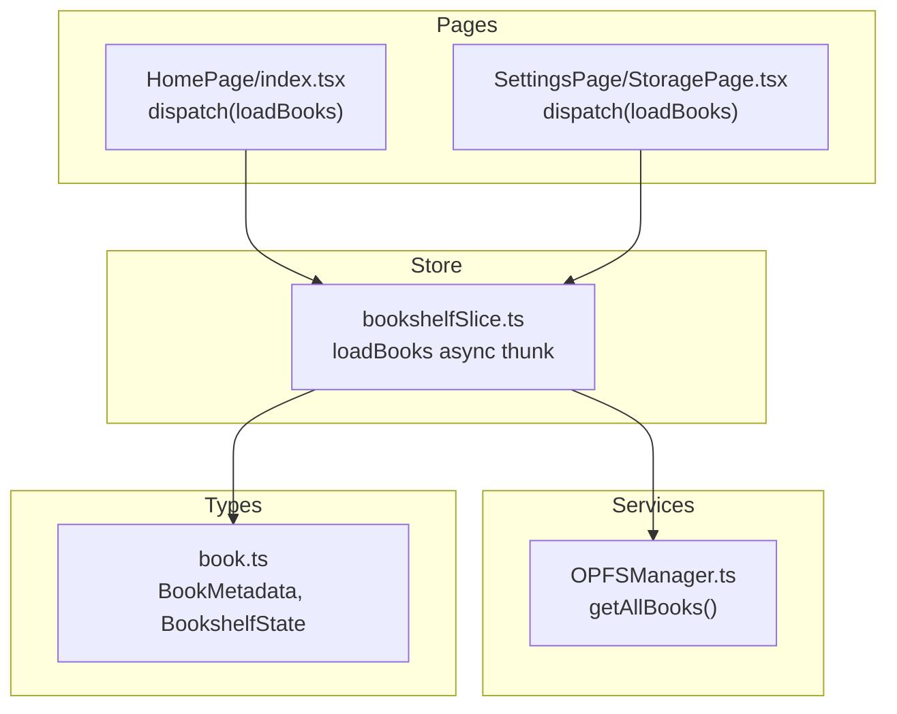
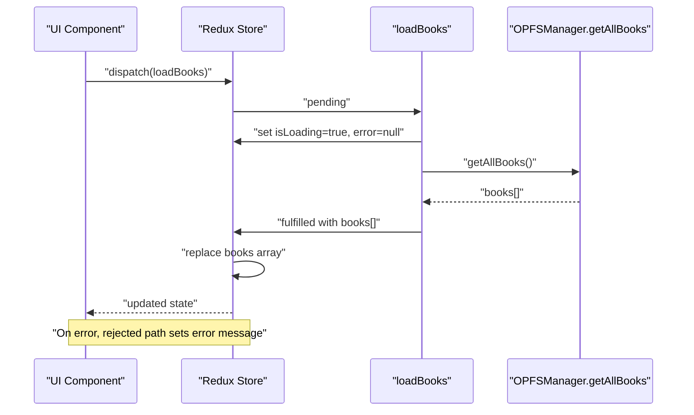
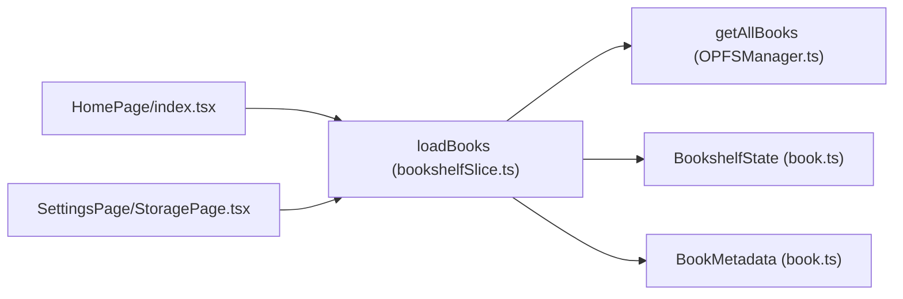

# Load Books

<cite>
**Referenced Files in This Document**
- [bookshelfSlice.ts](file://src/store/slices/bookshelfSlice.ts)
- [OPFSManager.ts](file://src/services/OPFSManager.ts)
- [book.ts](file://src/types/book.ts)
- [index.tsx](file://src/pages/HomePage/index.tsx)
- [StoragePage.tsx](file://src/pages/SettingsPage/StoragePage.tsx)
</cite>

## Table of Contents
1. [Introduction](#introduction)
2. [Project Structure](#project-structure)
3. [Core Components](#core-components)
4. [Architecture Overview](#architecture-overview)
5. [Detailed Component Analysis](#detailed-component-analysis)
6. [Dependency Analysis](#dependency-analysis)
7. [Performance Considerations](#performance-considerations)
8. [Troubleshooting Guide](#troubleshooting-guide)
9. [Conclusion](#conclusion)

## Introduction
This document explains the loadBooks async thunk, which refreshes the bookshelf by retrieving all books from OPFS storage. It focuses on the core processing step that calls OPFSManager.getAllBooks(), how errors are handled using rejectWithValue, and how the thunk differs from initializeBookshelf. It also documents the state update pattern in the bookshelf slice where the entire books array is replaced upon fulfillment, and provides usage scenarios such as manual refresh actions and post-deletion reloads, along with guidance on managing loading states to prevent UI flicker.

## Project Structure
The loadBooks thunk lives in the bookshelf slice and orchestrates data retrieval from OPFS via OPFSManager. The HomePage and Settings pages demonstrate usage scenarios where loadBooks is dispatched after operations that change the underlying storage.

**Diagram sources**
- [bookshelfSlice.ts](file://src/store/slices/bookshelfSlice.ts#L77-L88)
- [OPFSManager.ts](file://src/services/OPFSManager.ts#L326-L332)
- [book.ts](file://src/types/book.ts#L30-L105)
- [index.tsx](file://src/pages/HomePage/index.tsx#L60-L79)
- [StoragePage.tsx](file://src/pages/SettingsPage/StoragePage.tsx#L63-L87)

**Section sources**
- [bookshelfSlice.ts](file://src/store/slices/bookshelfSlice.ts#L77-L88)
- [OPFSManager.ts](file://src/services/OPFSManager.ts#L326-L332)
- [book.ts](file://src/types/book.ts#L30-L105)
- [index.tsx](file://src/pages/HomePage/index.tsx#L60-L79)
- [StoragePage.tsx](file://src/pages/SettingsPage/StoragePage.tsx#L63-L87)

## Core Components
- loadBooks async thunk: Dispatches a request to retrieve all books from OPFS storage and returns the list. On failure, it returns a payload via rejectWithValue containing the error message.
- OPFSManager.getAllBooks(): Reads the configuration file and returns the stored list of books.
- bookshelf slice: Manages isLoading, error, and books state. It replaces the entire books array on fulfilled loadBooks.

Key implementation references:
- Thunk definition and error handling: [bookshelfSlice.ts](file://src/store/slices/bookshelfSlice.ts#L77-L88)
- OPFS retrieval: [OPFSManager.ts](file://src/services/OPFSManager.ts#L326-L332)
- State updates on pending/fulfilled/rejected: [bookshelfSlice.ts](file://src/store/slices/bookshelfSlice.ts#L165-L180)

**Section sources**
- [bookshelfSlice.ts](file://src/store/slices/bookshelfSlice.ts#L77-L88)
- [OPFSManager.ts](file://src/services/OPFSManager.ts#L326-L332)
- [bookshelfSlice.ts](file://src/store/slices/bookshelfSlice.ts#L165-L180)

## Architecture Overview
The loadBooks thunk follows a predictable Redux pattern:
- Pending: sets isLoading true and clears error.
- Fulfilled: replaces the books array with the returned list.
- Rejected: sets isLoading false and stores the error message.

**Diagram sources**
- [bookshelfSlice.ts](file://src/store/slices/bookshelfSlice.ts#L165-L180)
- [OPFSManager.ts](file://src/services/OPFSManager.ts#L326-L332)

## Detailed Component Analysis

### loadBooks Thunk
- Purpose: Refresh the bookshelf by fetching all books from OPFS storage.
- Core processing: Calls OPFSManager.getAllBooks() and returns the resulting array.
- Error handling: Uses rejectWithValue to propagate the error message to the rejected case.
- Fulfillment behavior: The bookshelf slice replaces the entire books array with the returned list.

Implementation references:
- Thunk definition: [bookshelfSlice.ts](file://src/store/slices/bookshelfSlice.ts#L77-L88)
- OPFS retrieval: [OPFSManager.ts](file://src/services/OPFSManager.ts#L326-L332)
- State transitions: [bookshelfSlice.ts](file://src/store/slices/bookshelfSlice.ts#L165-L180)

**Section sources**
- [bookshelfSlice.ts](file://src/store/slices/bookshelfSlice.ts#L77-L88)
- [OPFSManager.ts](file://src/services/OPFSManager.ts#L326-L332)
- [bookshelfSlice.ts](file://src/store/slices/bookshelfSlice.ts#L165-L180)

### Difference Between loadBooks and initializeBookshelf
- initializeBookshelf:
  - Checks OPFS support.
  - Initializes OPFS directories.
  - Loads books afterward.
  - Used during initial app setup.
- loadBooks:
  - Assumes OPFS is already initialized.
  - Only retrieves books from storage.
  - Used for refreshes after mutations or manual triggers.

Implementation references:
- initializeBookshelf: [bookshelfSlice.ts](file://src/store/slices/bookshelfSlice.ts#L18-L37)
- loadBooks: [bookshelfSlice.ts](file://src/store/slices/bookshelfSlice.ts#L77-L88)
- OPFS initialization: [OPFSManager.ts](file://src/services/OPFSManager.ts#L38-L60)

**Section sources**
- [bookshelfSlice.ts](file://src/store/slices/bookshelfSlice.ts#L18-L37)
- [bookshelfSlice.ts](file://src/store/slices/bookshelfSlice.ts#L77-L88)
- [OPFSManager.ts](file://src/services/OPFSManager.ts#L38-L60)

### State Update Pattern
- Pending: isLoading becomes true; error is cleared.
- Fulfilled: isLoading becomes false; the entire books array is replaced with the returned list.
- Rejected: isLoading becomes false; error is set to the message returned by rejectWithValue.

Implementation references:
- Pending/fulfilled/rejected handlers: [bookshelfSlice.ts](file://src/store/slices/bookshelfSlice.ts#L165-L180)

**Section sources**
- [bookshelfSlice.ts](file://src/store/slices/bookshelfSlice.ts#L165-L180)

### Usage Scenarios
- Manual refresh actions:
  - Triggered by UI actions to reload the bookshelf after external changes.
  - Example usage in Settings page after resetting OPFS data: [StoragePage.tsx](file://src/pages/SettingsPage/StoragePage.tsx#L63-L87)
- Post-deletion reloads:
  - After deleting a book, dispatch loadBooks to reflect the updated list.
  - Example usage in HomePage after successful deletion: [index.tsx](file://src/pages/HomePage/index.tsx#L60-L79)

**Section sources**
- [StoragePage.tsx](file://src/pages/SettingsPage/StoragePage.tsx#L63-L87)
- [index.tsx](file://src/pages/HomePage/index.tsx#L60-L79)

### Loading States and UI Flicker Prevention
- The bookshelf slice sets isLoading true on pending and false on fulfilled/rejected.
- UI components can conditionally render loading spinners or empty states while isLoading is true.
- To prevent flicker:
  - Avoid re-rendering the grid when isLoading is true and books length is zero.
  - HomePage demonstrates conditional rendering of a loading spinner and empty state based on isLoading and books length: [index.tsx](file://src/pages/HomePage/index.tsx#L246-L270)

**Section sources**
- [bookshelfSlice.ts](file://src/store/slices/bookshelfSlice.ts#L165-L180)
- [index.tsx](file://src/pages/HomePage/index.tsx#L246-L270)

## Dependency Analysis
- loadBooks depends on OPFSManager.getAllBooks() to retrieve the book list.
- The bookshelf slice manages state transitions for loadBooks and exposes actions to clear error and manage upload progress.
- Types define BookMetadata and BookshelfState shapes used across the thunk and slice.

**Diagram sources**
- [bookshelfSlice.ts](file://src/store/slices/bookshelfSlice.ts#L77-L88)
- [OPFSManager.ts](file://src/services/OPFSManager.ts#L326-L332)
- [book.ts](file://src/types/book.ts#L30-L105)
- [index.tsx](file://src/pages/HomePage/index.tsx#L60-L79)
- [StoragePage.tsx](file://src/pages/SettingsPage/StoragePage.tsx#L63-L87)

**Section sources**
- [bookshelfSlice.ts](file://src/store/slices/bookshelfSlice.ts#L77-L88)
- [OPFSManager.ts](file://src/services/OPFSManager.ts#L326-L332)
- [book.ts](file://src/types/book.ts#L30-L105)
- [index.tsx](file://src/pages/HomePage/index.tsx#L60-L79)
- [StoragePage.tsx](file://src/pages/SettingsPage/StoragePage.tsx#L63-L87)

## Performance Considerations
- loadBooks performs a single read of the configuration file to return the books list. This is efficient for typical library sizes.
- If the book list grows very large, consider pagination or lazy loading in future iterations.
- Avoid unnecessary re-renders by relying on isLoading to gate UI updates.

[No sources needed since this section provides general guidance]

## Troubleshooting Guide
Common issues and resolutions:
- OPFS not supported:
  - The initializeBookshelf thunk checks support and throws an error if unsupported. loadBooks does not perform this check; ensure OPFS is initialized before calling loadBooks.
  - Reference: [bookshelfSlice.ts](file://src/store/slices/bookshelfSlice.ts#L18-L37), [OPFSManager.ts](file://src/services/OPFSManager.ts#L31-L33)
- Storage access failures:
  - loadBooks uses rejectWithValue to propagate errors. Inspect the error state in the bookshelf slice to display user-friendly messages.
  - Reference: [bookshelfSlice.ts](file://src/store/slices/bookshelfSlice.ts#L77-L88), [bookshelfSlice.ts](file://src/store/slices/bookshelfSlice.ts#L165-L180)
- Unexpected empty bookshelf:
  - Verify that OPFS initialization occurred and that config.json contains the expected book entries.
  - Reference: [OPFSManager.ts](file://src/services/OPFSManager.ts#L326-L332), [OPFSManager.ts](file://src/services/OPFSManager.ts#L478-L509)

**Section sources**
- [bookshelfSlice.ts](file://src/store/slices/bookshelfSlice.ts#L18-L37)
- [bookshelfSlice.ts](file://src/store/slices/bookshelfSlice.ts#L77-L88)
- [bookshelfSlice.ts](file://src/store/slices/bookshelfSlice.ts#L165-L180)
- [OPFSManager.ts](file://src/services/OPFSManager.ts#L31-L33)
- [OPFSManager.ts](file://src/services/OPFSManager.ts#L326-L332)
- [OPFSManager.ts](file://src/services/OPFSManager.ts#L478-L509)

## Conclusion
The loadBooks async thunk provides a focused mechanism to refresh the bookshelf by retrieving all books from OPFS storage. It replaces the entire books array upon fulfillment and uses rejectWithValue for robust error propagation. Compared to initializeBookshelf, loadBooks omits initialization steps and is ideal for refresh scenarios after mutations or manual triggers. The bookshelf slice’s state transitions and UI patterns help prevent flicker and provide clear feedback during loading.

[No sources needed since this section summarizes without analyzing specific files]