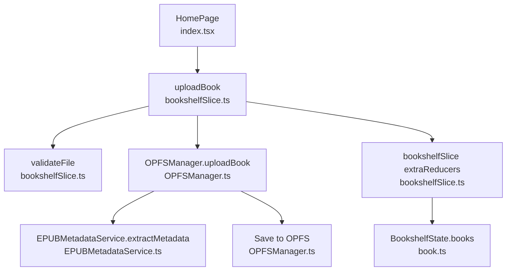
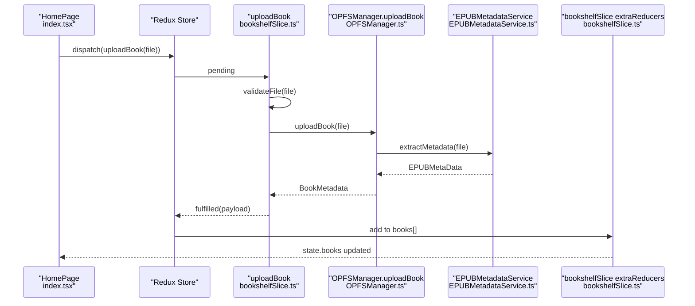
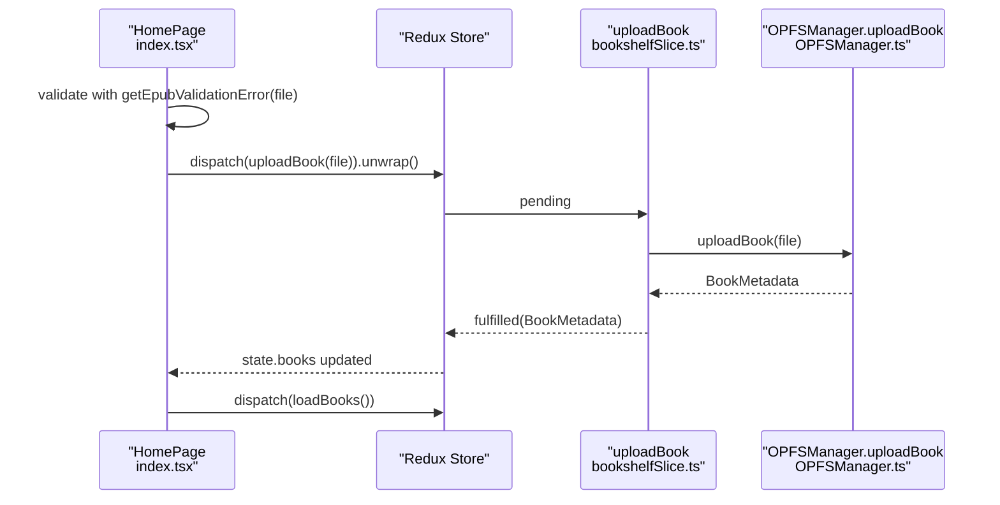
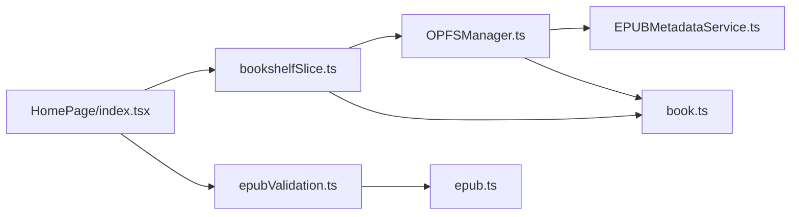

# Upload Book

<cite>
**Referenced Files in This Document**
- [bookshelfSlice.ts](file://src/store/slices/bookshelfSlice.ts)
- [OPFSManager.ts](file://src/services/OPFSManager.ts)
- [epubValidation.ts](file://src/utils/epubValidation.ts)
- [HomePage/index.tsx](file://src/pages/HomePage/index.tsx)
- [EPUBMetadataService.ts](file://src/services/EPUBMetadataService.ts)
- [book.ts](file://src/types/book.ts)
- [epub.ts](file://src/constants/epub.ts)
- [index.ts](file://src/store/index.ts)
</cite>

## Table of Contents
1. [Introduction](#introduction)
2. [Project Structure](#project-structure)
3. [Core Components](#core-components)
4. [Architecture Overview](#architecture-overview)
5. [Detailed Component Analysis](#detailed-component-analysis)
6. [Dependency Analysis](#dependency-analysis)
7. [Performance Considerations](#performance-considerations)
8. [Troubleshooting Guide](#troubleshooting-guide)
9. [Conclusion](#conclusion)

## Introduction
This document explains the uploadBook async thunk responsible for validating, processing, and storing EPUB files in the browser’s Origin Private File System (OPFS). It covers:
- Validation logic using the validateFile utility and the reusable getEpubValidationError helper
- Integration with OPFSManager.uploadBook() service
- Transformation of a File input into a BookMetadata output
- State management flow through pending/fulfilled/rejected actions in the bookshelf slice
- Practical usage in HomePage with dispatch(uploadBook(file)).unwrap() for promise-based success/error handling
- Best practices for progress tracking and user feedback during upload

## Project Structure
The uploadBook flow spans several layers:
- UI layer: HomePage handles user interactions and dispatches the thunk
- Store layer: bookshelfSlice defines the uploadBook async thunk and manages state transitions
- Services layer: OPFSManager orchestrates OPFS operations and metadata extraction
- Utilities: epubValidation provides consistent validation logic
- Types: book.ts defines BookMetadata and related structures

**Diagram sources**
- [HomePage/index.tsx](file://src/pages/HomePage/index.tsx#L60-L90)
- [bookshelfSlice.ts](file://src/store/slices/bookshelfSlice.ts#L40-L56)
- [OPFSManager.ts](file://src/services/OPFSManager.ts#L126-L219)
- [EPUBMetadataService.ts](file://src/services/EPUBMetadataService.ts#L1-L63)
- [book.ts](file://src/types/book.ts#L27-L55)

**Section sources**
- [bookshelfSlice.ts](file://src/store/slices/bookshelfSlice.ts#L1-L188)
- [OPFSManager.ts](file://src/services/OPFSManager.ts#L1-L219)
- [epubValidation.ts](file://src/utils/epubValidation.ts#L1-L76)
- [HomePage/index.tsx](file://src/pages/HomePage/index.tsx#L60-L90)
- [book.ts](file://src/types/book.ts#L27-L55)

## Core Components
- uploadBook async thunk: Validates input, delegates to OPFSManager.uploadBook(), and returns BookMetadata payload for Redux updates
- OPFSManager.uploadBook: Centralized service that writes EPUB to OPFS, extracts metadata and cover, persists config, and returns BookMetadata
- Validation utilities: validateFile (slice-level) and getEpubValidationError (utility-level) ensure consistent checks
- State model: BookshelfState tracks books, loading, error, and optional uploadProgress
- UI integration: HomePage uses dispatch(uploadBook(file)).unwrap() to await completion and surface success/error messages

**Section sources**
- [bookshelfSlice.ts](file://src/store/slices/bookshelfSlice.ts#L40-L56)
- [OPFSManager.ts](file://src/services/OPFSManager.ts#L126-L219)
- [epubValidation.ts](file://src/utils/epubValidation.ts#L1-L76)
- [book.ts](file://src/types/book.ts#L93-L116)
- [HomePage/index.tsx](file://src/pages/HomePage/index.tsx#L60-L90)

## Architecture Overview
The uploadBook flow follows a clean separation of concerns:
- Input validation occurs in two places: a dedicated validator in the slice and a reusable validator in the utilities
- OPFSManager encapsulates all filesystem operations and metadata extraction
- Redux state is updated via extraReducers in response to thunk lifecycle events
- UI triggers the thunk and reacts to the result using .unwrap()

**Diagram sources**
- [HomePage/index.tsx](file://src/pages/HomePage/index.tsx#L60-L90)
- [bookshelfSlice.ts](file://src/store/slices/bookshelfSlice.ts#L40-L56)
- [OPFSManager.ts](file://src/services/OPFSManager.ts#L126-L219)
- [EPUBMetadataService.ts](file://src/services/EPUBMetadataService.ts#L1-L63)

## Detailed Component Analysis

### uploadBook async thunk
Role:
- Validates the incoming File using validateFile
- Delegates to OPFSManager.uploadBook(file) to persist and process the EPUB
- Returns BookMetadata for Redux to add to the state

Processing logic:
- Input handling: validateFile enforces extension, non-empty size, and size cap
- Core processing: OPFSManager.uploadBook(file) performs filesystem writes, metadata extraction, and config updates
- Output handling: returns BookMetadata payload for Redux

State management:
- pending: sets isLoading true and clears error
- fulfilled: sets isLoading false and appends payload to books
- rejected: sets isLoading false and sets error payload

Integration with HomePage:
- HomePage validates with getEpubValidationError before dispatching
- Uses unwrap() to await success or catch error for user feedback

Best practices:
- Prefer UI-level validation for immediate feedback
- Use unwrap() to centralize error handling in UI
- Trigger loadBooks() after successful upload to refresh the shelf

**Section sources**
- [bookshelfSlice.ts](file://src/store/slices/bookshelfSlice.ts#L40-L56)
- [bookshelfSlice.ts](file://src/store/slices/bookshelfSlice.ts#L131-L146)
- [HomePage/index.tsx](file://src/pages/HomePage/index.tsx#L60-L90)

### Validation logic
Two validation layers ensure robustness:
- validateFile (slice): strict checks for extension, non-empty size, and size threshold
- getEpubValidationError (utility): reusable helper used by HomePage and OPFSManager for consistent messaging

Validation criteria:
- Extension check (.epub)
- Non-zero size
- Size ≤ 100 MB
- MIME-type compatibility (via constants)

Error handling:
- Throws descriptive errors for invalid inputs
- HomePage displays user-friendly alerts based on getEpubValidationError

**Section sources**
- [bookshelfSlice.ts](file://src/store/slices/bookshelfSlice.ts#L6-L16)
- [epubValidation.ts](file://src/utils/epubValidation.ts#L1-L76)
- [epub.ts](file://src/constants/epub.ts#L28-L40)
- [HomePage/index.tsx](file://src/pages/HomePage/index.tsx#L60-L90)

### OPFSManager.uploadBook service
Responsibilities:
- Ensures OPFS support and initializes directory structure
- Validates file using getEpubValidationError
- Creates a unique book directory and writes the EPUB file
- Loads EPUB to extract metadata and cover image
- Persists BookMetadata into config.json and returns BookMetadata

Key steps:
- Directory creation under books/{bookId}/
- File writing via writable streams
- Metadata extraction via EPUBMetadataService.extractMetadata
- Cover extraction and saving with detected format
- Config update with new book entry

Output:
- BookMetadata with id, name, path, author, createdAt, size, chapterCount, coverPath, and metaData

**Section sources**
- [OPFSManager.ts](file://src/services/OPFSManager.ts#L126-L219)
- [EPUBMetadataService.ts](file://src/services/EPUBMetadataService.ts#L1-L63)
- [book.ts](file://src/types/book.ts#L27-L55)

### State management flow
Redux lifecycle:
- pending: isLoading true, error cleared
- fulfilled: isLoading false, payload appended to books
- rejected: isLoading false, error set to payload

Additional helpers:
- setUploadProgress: allows updating uploadProgress state if needed
- clearError: resets error state

Integration points:
- bookshelfSlice reducer maintains BookshelfState
- store/index.ts wires up the bookshelf reducer

**Section sources**
- [bookshelfSlice.ts](file://src/store/slices/bookshelfSlice.ts#L90-L188)
- [book.ts](file://src/types/book.ts#L93-L116)
- [index.ts](file://src/store/index.ts#L1-L23)

### Practical usage in HomePage
- Pre-validation: HomePage uses getEpubValidationError(file) to provide immediate feedback
- Dispatch: dispatch(uploadBook(file)).unwrap() enables promise-based handling
- Success: On fulfillment, HomePage dispatches loadBooks() to refresh the shelf
- Error: Catches and alerts user-friendly messages

**Diagram sources**
- [HomePage/index.tsx](file://src/pages/HomePage/index.tsx#L60-L90)
- [bookshelfSlice.ts](file://src/store/slices/bookshelfSlice.ts#L40-L56)
- [OPFSManager.ts](file://src/services/OPFSManager.ts#L126-L219)

**Section sources**
- [HomePage/index.tsx](file://src/pages/HomePage/index.tsx#L60-L90)
- [bookshelfSlice.ts](file://src/store/slices/bookshelfSlice.ts#L131-L146)

### Progress tracking and user feedback
Current implementation:
- The uploadBook thunk does not expose uploadProgress in the slice
- OPFSManager.uploadBook writes the file synchronously; there is no built-in progress callback

Recommended enhancements:
- Introduce a progress channel in OPFSManager.uploadBook to emit UploadProgress updates
- Dispatch setUploadProgress from the UI or a saga/thunk middleware
- Update the slice to manage uploadProgress state and render progress bars in HomePage

Benefits:
- Immediate user feedback during long uploads
- Better UX for large EPUBs
- Consistent with UploadProgress type in types/book.ts

**Section sources**
- [book.ts](file://src/types/book.ts#L80-L91)
- [OPFSManager.ts](file://src/services/OPFSManager.ts#L126-L219)

## Dependency Analysis
Relationships:
- bookshelfSlice.ts depends on OPFSManager for persistence and metadata extraction
- OPFSManager.ts depends on EPUBMetadataService.ts for metadata extraction and EPUBMetadataService.ts for cover handling
- HomePage.tsx depends on bookshelfSlice.ts for dispatching and on epubValidation.ts for pre-upload checks
- Types in book.ts define the contract for BookMetadata and BookshelfState

**Diagram sources**
- [HomePage/index.tsx](file://src/pages/HomePage/index.tsx#L60-L90)
- [bookshelfSlice.ts](file://src/store/slices/bookshelfSlice.ts#L1-L188)
- [OPFSManager.ts](file://src/services/OPFSManager.ts#L1-L219)
- [EPUBMetadataService.ts](file://src/services/EPUBMetadataService.ts#L1-L63)
- [epubValidation.ts](file://src/utils/epubValidation.ts#L1-L76)
- [book.ts](file://src/types/book.ts#L27-L55)
- [epub.ts](file://src/constants/epub.ts#L28-L40)

**Section sources**
- [bookshelfSlice.ts](file://src/store/slices/bookshelfSlice.ts#L1-L188)
- [OPFSManager.ts](file://src/services/OPFSManager.ts#L1-L219)
- [EPUBMetadataService.ts](file://src/services/EPUBMetadataService.ts#L1-L63)
- [epubValidation.ts](file://src/utils/epubValidation.ts#L1-L76)
- [book.ts](file://src/types/book.ts#L27-L55)
- [epub.ts](file://src/constants/epub.ts#L28-L40)

## Performance Considerations
- File size: Enforced up to 100 MB to prevent excessive memory usage and slow writes
- Metadata extraction: EPUB parsing occurs once per upload; caching could reduce repeated work if needed
- OPFS writes: Synchronous write operations; consider chunked writes for very large files if performance becomes an issue
- UI responsiveness: Keep validation fast and avoid blocking the main thread

## Troubleshooting Guide
Common issues and resolutions:
- OPFS not supported: HomePage renders a browser compatibility notice; ensure the user switches to a supported browser
- Invalid file: validateFile and getEpubValidationError provide descriptive messages; confirm file extension and size
- Upload failure: The thunk rejects with rejectWithValue(error.message); UI catches and alerts the user
- Empty or corrupted config: OPFSManager.loadConfig recovers by recreating defaults; re-initialize if needed

**Section sources**
- [HomePage/index.tsx](file://src/pages/HomePage/index.tsx#L226-L244)
- [bookshelfSlice.ts](file://src/store/slices/bookshelfSlice.ts#L40-L56)
- [OPFSManager.ts](file://src/services/OPFSManager.ts#L126-L219)

## Conclusion
The uploadBook async thunk integrates tightly with OPFSManager to validate, persist, and enrich EPUB metadata while maintaining a clean Redux state flow. HomePage provides user-friendly validation and promise-based handling for immediate feedback. Enhancing progress tracking would further improve the user experience for large uploads.