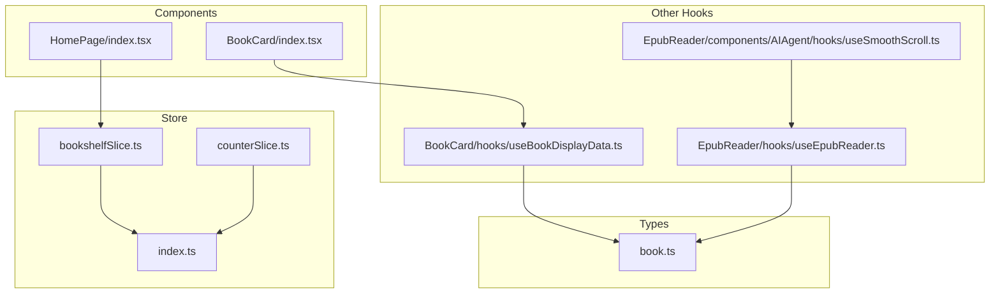
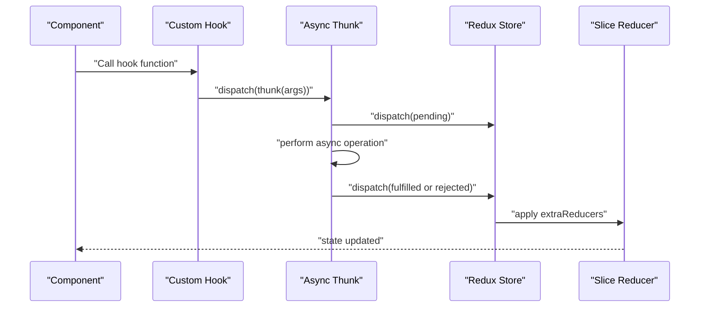
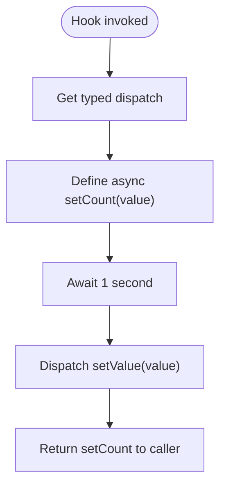
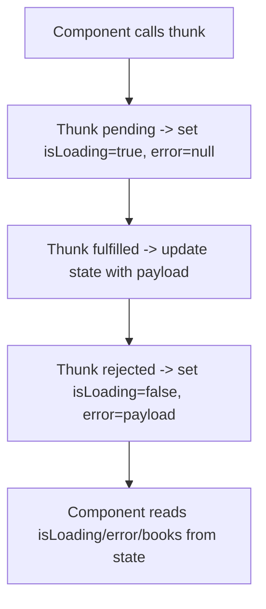
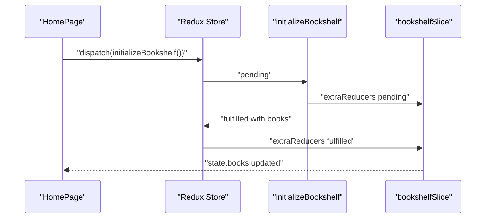
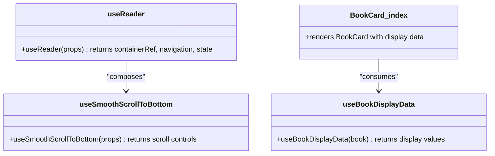
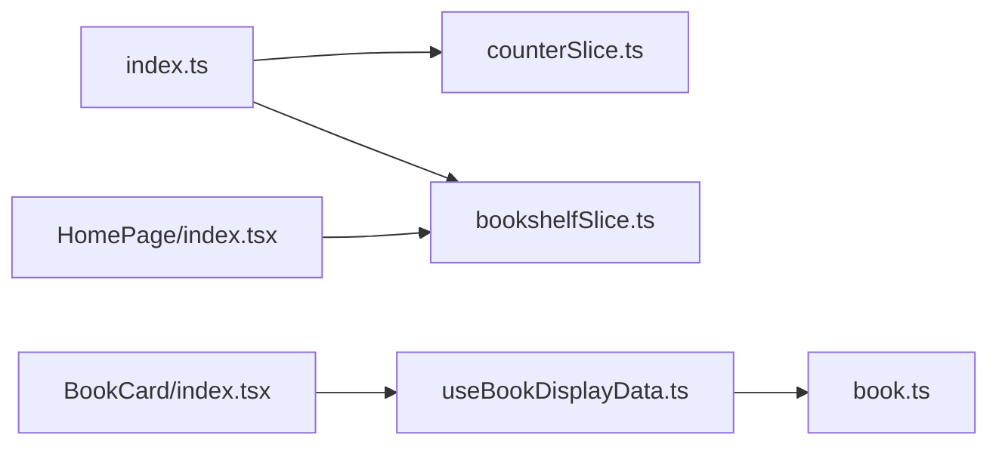

# Custom Hooks

<cite>
**Referenced Files in This Document**
- [counterSlice.ts](file://src/store/slices/counterSlice.ts)
- [bookshelfSlice.ts](file://src/store/slices/bookshelfSlice.ts)
- [index.ts](file://src/store/index.ts)
- [HomePage/index.tsx](file://src/pages/HomePage/index.tsx)
- [BookCard/index.tsx](file://src/components/BookCard/index.tsx)
- [BookCard/hooks/useBookDisplayData.ts](file://src/components/BookCard/hooks/useBookDisplayData.ts)
- [EpubReader/hooks/useEpubReader.ts](file://src/pages/EpubReader/hooks/useEpubReader.ts)
- [EpubReader/components/AIAgent/hooks/useSmoothScroll.ts](file://src/pages/EpubReader/components/AIAgent/hooks/useSmoothScroll.ts)
- [book.ts](file://src/types/book.ts)
</cite>

## Table of Contents
1. [Introduction](#introduction)
2. [Project Structure](#project-structure)
3. [Core Components](#core-components)
4. [Architecture Overview](#architecture-overview)
5. [Detailed Component Analysis](#detailed-component-analysis)
6. [Dependency Analysis](#dependency-analysis)
7. [Performance Considerations](#performance-considerations)
8. [Troubleshooting Guide](#troubleshooting-guide)
9. [Conclusion](#conclusion)
10. [Appendices](#appendices)

## Introduction
This document explains custom hooks used in the Redux state management system, focusing on how they encapsulate dispatch logic and side effects for predictable, reusable behaviors. It uses useSetCountThunk from counterSlice.ts as a representative example of a custom hook that abstracts asynchronous dispatch. It also analyzes how the bookshelf domain follows similar async thunk patterns with uploadBook, deleteBook, and initializeBookshelf, and demonstrates how components consume these hooks for state manipulation. The document covers error handling, loading states, and how actions are typed using PayloadAction. Finally, it provides best practices for naming, reusability, and testing custom hooks.

## Project Structure
The Redux-related code is organized under the store directory, with slices defining reducers and async thunks, and custom hooks encapsulating dispatch logic. Components consume these hooks and thunks to manage state and side effects.

**Diagram sources**
- [counterSlice.ts](file://src/store/slices/counterSlice.ts#L1-L46)
- [bookshelfSlice.ts](file://src/store/slices/bookshelfSlice.ts#L1-L188)
- [index.ts](file://src/store/index.ts#L1-L24)
- [BookCard/index.tsx](file://src/components/BookCard/index.tsx#L1-L86)
- [BookCard/hooks/useBookDisplayData.ts](file://src/components/BookCard/hooks/useBookDisplayData.ts#L1-L33)
- [EpubReader/hooks/useEpubReader.ts](file://src/pages/EpubReader/hooks/useEpubReader.ts#L1-L201)
- [EpubReader/components/AIAgent/hooks/useSmoothScroll.ts](file://src/pages/EpubReader/components/AIAgent/hooks/useSmoothScroll.ts#L1-L148)
- [book.ts](file://src/types/book.ts#L1-L116)

**Section sources**
- [counterSlice.ts](file://src/store/slices/counterSlice.ts#L1-L46)
- [bookshelfSlice.ts](file://src/store/slices/bookshelfSlice.ts#L1-L188)
- [index.ts](file://src/store/index.ts#L1-L24)
- [BookCard/index.tsx](file://src/components/BookCard/index.tsx#L1-L86)
- [BookCard/hooks/useBookDisplayData.ts](file://src/components/BookCard/hooks/useBookDisplayData.ts#L1-L33)
- [EpubReader/hooks/useEpubReader.ts](file://src/pages/EpubReader/hooks/useEpubReader.ts#L1-L201)
- [EpubReader/components/AIAgent/hooks/useSmoothScroll.ts](file://src/pages/EpubReader/components/AIAgent/hooks/useSmoothScroll.ts#L1-L148)
- [book.ts](file://src/types/book.ts#L1-L116)

## Core Components
- useSetCountThunk: A custom hook that abstracts dispatching a delayed setValue action. It encapsulates a 1-second delay and returns a function that performs the dispatch, hiding the dispatch call from consumers.
- Bookshelf async thunks: initializeBookshelf, uploadBook, deleteBook, and loadBooks define async operations with input validation, core processing, and output handling, updating the bookshelf state via extraReducers.
- Typed actions: PayloadAction is used to strongly type reducer arguments, ensuring type-safe state updates.

Key implementation references:
- useSetCountThunk definition and dispatch abstraction: [counterSlice.ts](file://src/store/slices/counterSlice.ts#L31-L46)
- Async thunks and extraReducers for bookshelf: [bookshelfSlice.ts](file://src/store/slices/bookshelfSlice.ts#L19-L188)
- Store configuration and typed hooks: [index.ts](file://src/store/index.ts#L1-L24)
- Component consumption of thunks: [HomePage/index.tsx](file://src/pages/HomePage/index.tsx#L1-L291)

**Section sources**
- [counterSlice.ts](file://src/store/slices/counterSlice.ts#L31-L46)
- [bookshelfSlice.ts](file://src/store/slices/bookshelfSlice.ts#L19-L188)
- [index.ts](file://src/store/index.ts#L1-L24)
- [HomePage/index.tsx](file://src/pages/HomePage/index.tsx#L1-L291)

## Architecture Overview
The Redux architecture integrates slices, thunks, and custom hooks to provide a clean separation of concerns:
- Slices define reducers and actions for synchronous state updates.
- Async thunks encapsulate side effects and dispatch lifecycle actions (pending/fulfilled/rejected).
- Custom hooks abstract dispatch logic and side effects, returning actionable functions to components.
- Components consume thunks and selectors, and use custom hooks to orchestrate state changes.

**Diagram sources**
- [counterSlice.ts](file://src/store/slices/counterSlice.ts#L31-L46)
- [bookshelfSlice.ts](file://src/store/slices/bookshelfSlice.ts#L19-L188)
- [index.ts](file://src/store/index.ts#L1-L24)
- [HomePage/index.tsx](file://src/pages/HomePage/index.tsx#L1-L291)

## Detailed Component Analysis

### useSetCountThunk: Encapsulating Delayed Dispatch
useSetCountThunk demonstrates how a custom hook abstracts dispatch logic:
- It obtains a typed dispatch via the typed useAppDispatch hook.
- It defines an async function that introduces a delay and then dispatches a synchronous action.
- It returns the function so components can trigger the delayed state update without dealing with dispatch directly.

**Diagram sources**
- [counterSlice.ts](file://src/store/slices/counterSlice.ts#L31-L46)
- [index.ts](file://src/store/index.ts#L1-L24)

**Section sources**
- [counterSlice.ts](file://src/store/slices/counterSlice.ts#L31-L46)
- [index.ts](file://src/store/index.ts#L1-L24)

### Bookshelf Operations: initializeBookshelf, uploadBook, deleteBook, loadBooks
These async thunks follow a consistent pattern:
- Input validation: validate inputs and throw errors when invalid.
- Core processing: perform async operations (e.g., OPFS operations).
- Output handling: return data on fulfillment or use rejectWithValue on rejection.
- ExtraReducers: update isLoading, error, and books arrays based on thunk lifecycle.

**Diagram sources**
- [bookshelfSlice.ts](file://src/store/slices/bookshelfSlice.ts#L19-L188)
- [HomePage/index.tsx](file://src/pages/HomePage/index.tsx#L1-L291)

**Section sources**
- [bookshelfSlice.ts](file://src/store/slices/bookshelfSlice.ts#L19-L188)
- [HomePage/index.tsx](file://src/pages/HomePage/index.tsx#L1-L291)

### Component Consumption Patterns
- HomePage/index.tsx initializes the bookshelf on mount by dispatching initializeBookshelf and unwrapping the result. It handles errors and navigates to the reader on success.
- It deletes a book by dispatching deleteBook and unwrapping the result, confirming deletion with the user.
- It uploads a book by validating the file, dispatching uploadBook, unwrapping the result, and then dispatching loadBooks to refresh the list.

**Diagram sources**
- [HomePage/index.tsx](file://src/pages/HomePage/index.tsx#L1-L291)
- [bookshelfSlice.ts](file://src/store/slices/bookshelfSlice.ts#L19-L188)

**Section sources**
- [HomePage/index.tsx](file://src/pages/HomePage/index.tsx#L1-L291)
- [bookshelfSlice.ts](file://src/store/slices/bookshelfSlice.ts#L19-L188)

### Supporting Custom Hooks in Other Domains
- useBookDisplayData: Formats book metadata with fallbacks for display, returning normalized values to components.
- useReader: Manages EPUB rendering, navigation, and selection events, returning refs and navigation functions.
- useSmoothScrollToBottom: Provides smooth scrolling behavior with pause/resume and wheel handling.

**Diagram sources**
- [BookCard/hooks/useBookDisplayData.ts](file://src/components/BookCard/hooks/useBookDisplayData.ts#L1-L33)
- [BookCard/index.tsx](file://src/components/BookCard/index.tsx#L1-L86)
- [EpubReader/hooks/useEpubReader.ts](file://src/pages/EpubReader/hooks/useEpubReader.ts#L1-L201)
- [EpubReader/components/AIAgent/hooks/useSmoothScroll.ts](file://src/pages/EpubReader/components/AIAgent/hooks/useSmoothScroll.ts#L1-L148)

**Section sources**
- [BookCard/hooks/useBookDisplayData.ts](file://src/components/BookCard/hooks/useBookDisplayData.ts#L1-L33)
- [BookCard/index.tsx](file://src/components/BookCard/index.tsx#L1-L86)
- [EpubReader/hooks/useEpubReader.ts](file://src/pages/EpubReader/hooks/useEpubReader.ts#L1-L201)
- [EpubReader/components/AIAgent/hooks/useSmoothScroll.ts](file://src/pages/EpubReader/components/AIAgent/hooks/useSmoothScroll.ts#L1-L148)

## Dependency Analysis
- counterSlice.ts depends on Redux Toolkit’s createSlice and useDispatch to define a typed reducer and a custom hook that abstracts dispatch.
- bookshelfSlice.ts depends on Redux Toolkit’s createAsyncThunk and createSlice to define async operations and state transitions.
- index.ts provides typed useAppDispatch and useAppSelector, enabling type-safe dispatch and selectors across the app.
- Components depend on these hooks and thunks to manage state and side effects.

**Diagram sources**
- [index.ts](file://src/store/index.ts#L1-L24)
- [counterSlice.ts](file://src/store/slices/counterSlice.ts#L1-L46)
- [bookshelfSlice.ts](file://src/store/slices/bookshelfSlice.ts#L1-L188)
- [HomePage/index.tsx](file://src/pages/HomePage/index.tsx#L1-L291)
- [BookCard/index.tsx](file://src/components/BookCard/index.tsx#L1-L86)
- [BookCard/hooks/useBookDisplayData.ts](file://src/components/BookCard/hooks/useBookDisplayData.ts#L1-L33)
- [book.ts](file://src/types/book.ts#L1-L116)

**Section sources**
- [index.ts](file://src/store/index.ts#L1-L24)
- [counterSlice.ts](file://src/store/slices/counterSlice.ts#L1-L46)
- [bookshelfSlice.ts](file://src/store/slices/bookshelfSlice.ts#L1-L188)
- [HomePage/index.tsx](file://src/pages/HomePage/index.tsx#L1-L291)
- [BookCard/index.tsx](file://src/components/BookCard/index.tsx#L1-L86)
- [BookCard/hooks/useBookDisplayData.ts](file://src/components/BookCard/hooks/useBookDisplayData.ts#L1-L33)
- [book.ts](file://src/types/book.ts#L1-L116)

## Performance Considerations
- Prefer batching and debouncing for frequent UI updates (e.g., selection or scroll events) to reduce re-renders.
- Use memoization for derived values and navigation functions to avoid unnecessary recalculations.
- Avoid long-running synchronous work inside hooks; defer to async thunks or requestAnimationFrame for animations.
- Keep custom hooks focused and composable to minimize re-render costs.

## Troubleshooting Guide
- Error handling in thunks: Use rejectWithValue to propagate errors and update the error field in state. Components should unwrap results and handle errors gracefully.
- Loading states: Ensure pending cases set isLoading to true and clear error before processing; fulfilled and rejected cases should reset isLoading and set error accordingly.
- PayloadAction typing: Verify reducer signatures use PayloadAction with the correct payload type to prevent runtime type mismatches.
- Hook lifecycle: For hooks that manage resources (e.g., RAF), cancel timers and subscriptions on unmount to prevent leaks.

Common references:
- Error propagation and state updates: [bookshelfSlice.ts](file://src/store/slices/bookshelfSlice.ts#L112-L181)
- Component unwrap and error handling: [HomePage/index.tsx](file://src/pages/HomePage/index.tsx#L1-L291)
- Typed reducer signatures: [counterSlice.ts](file://src/store/slices/counterSlice.ts#L20-L26)

**Section sources**
- [bookshelfSlice.ts](file://src/store/slices/bookshelfSlice.ts#L112-L181)
- [HomePage/index.tsx](file://src/pages/HomePage/index.tsx#L1-L291)
- [counterSlice.ts](file://src/store/slices/counterSlice.ts#L20-L26)

## Conclusion
Custom hooks in this codebase centralize dispatch logic and side effects, improving reusability and readability. useSetCountThunk exemplifies how to abstract dispatch while managing delays, and the bookshelf thunks demonstrate robust async patterns with input validation, lifecycle handling, and typed actions. Components consume these hooks and thunks to manipulate state declaratively, while maintaining clear error and loading states.

## Appendices

### Best Practices for Custom Hooks
- Naming: Use the use prefix and describe the behavior (e.g., useSetCountThunk, useBookDisplayData).
- Reusability: Keep hooks focused on a single concern and avoid coupling to specific UI components.
- Typing: Use TypeScript to type inputs, outputs, and dispatch return values.
- Testing: Mock dispatch and async operations; verify state updates and error handling paths.
- Composition: Compose smaller hooks to build complex behaviors without duplicating logic.

[No sources needed since this section provides general guidance]