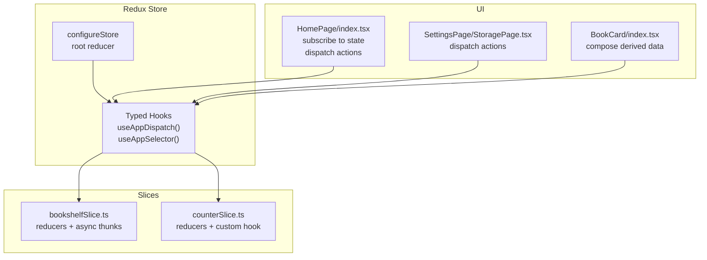
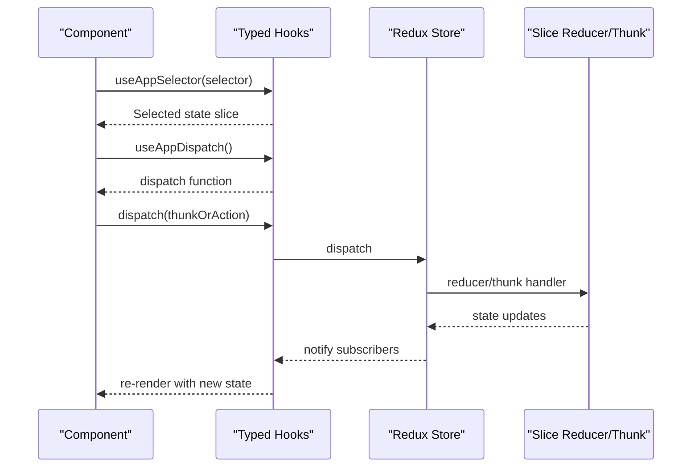
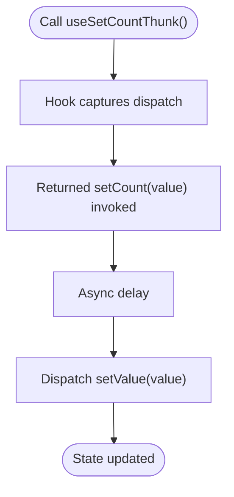
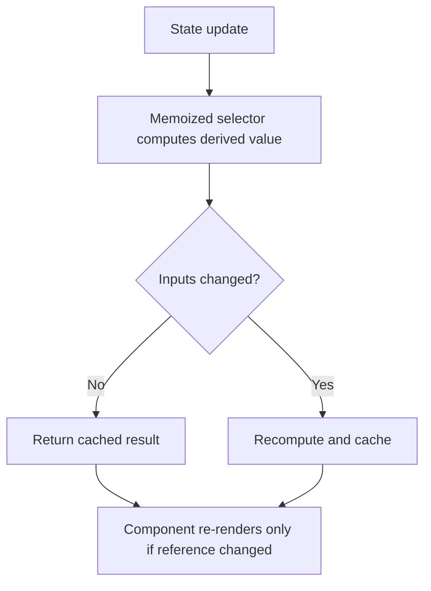
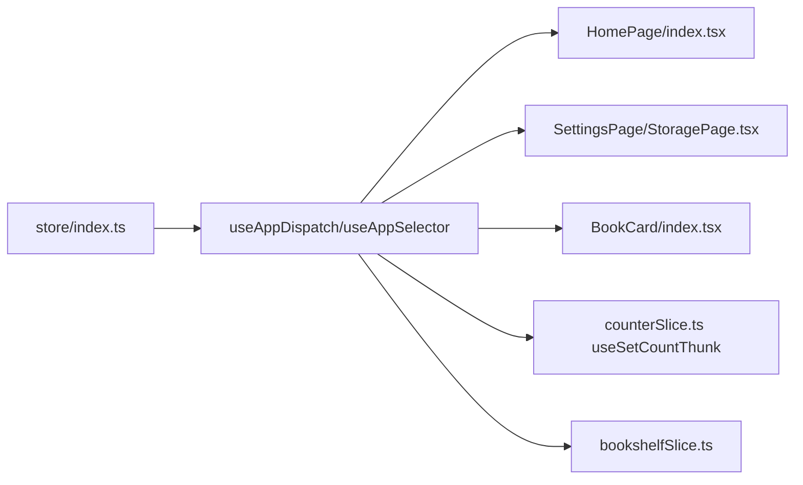

# Selectors and Custom Hooks

<cite>
**Referenced Files in This Document**
- [store/index.ts](file://src/store/index.ts)
- [store/slices/counterSlice.ts](file://src/store/slices/counterSlice.ts)
- [store/slices/bookshelfSlice.ts](file://src/store/slices/bookshelfSlice.ts)
- [pages/HomePage/index.tsx](file://src/pages/HomePage/index.tsx)
- [pages/SettingsPage/StoragePage.tsx](file://src/pages/SettingsPage/StoragePage.tsx)
- [components/BookCard/index.tsx](file://src/components/BookCard/index.tsx)
- [components/BookCard/hooks/useBookDisplayData.ts](file://src/components/BookCard/hooks/useBookDisplayData.ts)
- [types/book.ts](file://src/types/book.ts)
- [main.tsx](file://src/main.tsx)
</cite>

## Table of Contents
1. [Introduction](#introduction)
2. [Project Structure](#project-structure)
3. [Core Components](#core-components)
4. [Architecture Overview](#architecture-overview)
5. [Detailed Component Analysis](#detailed-component-analysis)
6. [Dependency Analysis](#dependency-analysis)
7. [Performance Considerations](#performance-considerations)
8. [Troubleshooting Guide](#troubleshooting-guide)
9. [Conclusion](#conclusion)

## Introduction
This document explains the selector and custom hook patterns used for state access and manipulation in the project. It focuses on:
- The type-safe useAppSelector with generic typing for selecting parts of the Redux state
- The useAppDispatch hook for type-safe dispatch operations
- A custom hook useSetCountThunk that encapsulates asynchronous dispatch logic
- Practical usage examples showing how components subscribe to state changes and dispatch actions
- Guidance on selector memoization and hook reusability, including suggestions for integrating createSelector-like patterns

## Project Structure
The state management is organized around a Redux Toolkit store with typed hooks and slices:
- The store is configured with a root reducer and exported typed hooks
- Slices define reducers and async thunks for domain logic
- Pages and components consume the store via typed hooks and dispatch actions

**Diagram sources**
- [store/index.ts](file://src/store/index.ts#L1-L24)
- [store/slices/bookshelfSlice.ts](file://src/store/slices/bookshelfSlice.ts#L1-L189)
- [store/slices/counterSlice.ts](file://src/store/slices/counterSlice.ts#L1-L47)
- [pages/HomePage/index.tsx](file://src/pages/HomePage/index.tsx#L1-L292)
- [pages/SettingsPage/StoragePage.tsx](file://src/pages/SettingsPage/StoragePage.tsx#L1-L190)
- [components/BookCard/index.tsx](file://src/components/BookCard/index.tsx#L1-L87)

**Section sources**
- [store/index.ts](file://src/store/index.ts#L1-L24)
- [main.tsx](file://src/main.tsx#L1-L12)

## Core Components
- Typed selector hook: useAppSelector<T>(selector) provides compile-time safety when selecting state slices
- Typed dispatch hook: useAppDispatch() ensures dispatched actions match the store’s dispatch type
- Custom hook for async dispatch: useSetCountThunk encapsulates delayed dispatch logic
- Domain slice: bookshelfSlice defines reducers and async thunks for managing EPUB bookshelf state

Key implementation references:
- Typed hooks and store configuration: [store/index.ts](file://src/store/index.ts#L1-L24)
- Counter custom hook: [store/slices/counterSlice.ts](file://src/store/slices/counterSlice.ts#L1-L47)
- Bookshelf slice with async thunks: [store/slices/bookshelfSlice.ts](file://src/store/slices/bookshelfSlice.ts#L1-L189)

**Section sources**
- [store/index.ts](file://src/store/index.ts#L1-L24)
- [store/slices/counterSlice.ts](file://src/store/slices/counterSlice.ts#L1-L47)
- [store/slices/bookshelfSlice.ts](file://src/store/slices/bookshelfSlice.ts#L1-L189)

## Architecture Overview
The UI subscribes to the Redux store via typed hooks and dispatches actions to update state. Components react to state changes and trigger async operations through thunks.

**Diagram sources**
- [store/index.ts](file://src/store/index.ts#L1-L24)
- [store/slices/bookshelfSlice.ts](file://src/store/slices/bookshelfSlice.ts#L1-L189)
- [pages/HomePage/index.tsx](file://src/pages/HomePage/index.tsx#L1-L292)

## Detailed Component Analysis

### Typed Selector Pattern with Generic Typing
The project defines a generic useAppSelector that accepts a selector function returning a specific slice of state. This enables type-safe selections and avoids manual casting.

Implementation highlights:
- Selector signature: useAppSelector<T>(selector: (state) => T)
- Root state type inferred from store.getState
- Used in components to select bookshelf state

Example usage:
- Selecting the bookshelf slice in a component: [pages/HomePage/index.tsx](file://src/pages/HomePage/index.tsx#L22-L26)

Benefits:
- Compile-time safety for state access
- Clear separation between state shape and component logic

**Section sources**
- [store/index.ts](file://src/store/index.ts#L16-L22)
- [pages/HomePage/index.tsx](file://src/pages/HomePage/index.tsx#L22-L26)

### Type-Safe Dispatch Operations
The useAppDispatch hook is typed to match the store’s dispatch function, ensuring dispatched actions are strongly typed.

Usage examples:
- Dispatching async thunks and actions in components:
  - [pages/HomePage/index.tsx](file://src/pages/HomePage/index.tsx#L32-L43)
  - [pages/HomePage/index.tsx](file://src/pages/HomePage/index.tsx#L50-L58)
  - [pages/HomePage/index.tsx](file://src/pages/HomePage/index.tsx#L60-L79)
  - [pages/SettingsPage/StoragePage.tsx](file://src/pages/SettingsPage/StoragePage.tsx#L9-L11)

**Section sources**
- [store/index.ts](file://src/store/index.ts#L16-L16)
- [pages/HomePage/index.tsx](file://src/pages/HomePage/index.tsx#L32-L79)
- [pages/SettingsPage/StoragePage.tsx](file://src/pages/SettingsPage/StoragePage.tsx#L9-L11)

### Custom Hook Encapsulating Async Dispatch: useSetCountThunk
The counter slice exports a custom hook that encapsulates asynchronous logic and dispatches a synchronous action after a delay. This pattern centralizes async side effects and exposes a simple function to components.

Key aspects:
- Encapsulates async behavior (e.g., delay) and dispatch
- Returns a function that components can call directly
- Demonstrates how to compose dispatch inside a custom hook

Reference:
- [store/slices/counterSlice.ts](file://src/store/slices/counterSlice.ts#L31-L47)

**Diagram sources**
- [store/slices/counterSlice.ts](file://src/store/slices/counterSlice.ts#L31-L47)

**Section sources**
- [store/slices/counterSlice.ts](file://src/store/slices/counterSlice.ts#L31-L47)

### Component Subscription and Dispatch Examples
- HomePage subscribes to bookshelf state and dispatches thunks to initialize, upload, delete, and refresh book data
- StoragePage demonstrates dispatching actions and loading OPFS statistics

References:
- [pages/HomePage/index.tsx](file://src/pages/HomePage/index.tsx#L22-L26)
- [pages/HomePage/index.tsx](file://src/pages/HomePage/index.tsx#L32-L43)
- [pages/HomePage/index.tsx](file://src/pages/HomePage/index.tsx#L50-L58)
- [pages/HomePage/index.tsx](file://src/pages/HomePage/index.tsx#L60-L79)
- [pages/SettingsPage/StoragePage.tsx](file://src/pages/SettingsPage/StoragePage.tsx#L9-L11)
- [pages/SettingsPage/StoragePage.tsx](file://src/pages/SettingsPage/StoragePage.tsx#L63-L87)

**Section sources**
- [pages/HomePage/index.tsx](file://src/pages/HomePage/index.tsx#L22-L79)
- [pages/SettingsPage/StoragePage.tsx](file://src/pages/SettingsPage/StoragePage.tsx#L9-L87)

### Derived Data Composition Without Redux Selectors
While the project uses typed hooks for subscription, it also composes derived UI data in custom hooks (e.g., formatting book display data) rather than relying on Redux selectors. This keeps UI logic close to components and reduces selector churn.

Reference:
- [components/BookCard/hooks/useBookDisplayData.ts](file://src/components/BookCard/hooks/useBookDisplayData.ts#L1-L33)
- [components/BookCard/index.tsx](file://src/components/BookCard/index.tsx#L22-L31)

**Section sources**
- [components/BookCard/hooks/useBookDisplayData.ts](file://src/components/BookCard/hooks/useBookDisplayData.ts#L1-L33)
- [components/BookCard/index.tsx](file://src/components/BookCard/index.tsx#L22-L31)

### Suggested createSelector Patterns (Not Currently Implemented)
Although the project does not currently use Redux’s createSelector, the patterns below illustrate how to introduce memoized selectors for performance and correctness:

- Memoized selector composition: create a selector that derives computed values from state and caches results until inputs change
- Stable reference for derived data: prevents unnecessary re-renders when the derived value has not changed
- Example pattern references:
  - [types/book.ts](file://src/types/book.ts#L96-L105) — BookshelfState shape informs selector design
  - [store/index.ts](file://src/store/index.ts#L16-L22) — useAppSelector<T>() provides the typed subscription surface

[No sources needed since this diagram shows conceptual workflow, not actual code structure]

## Dependency Analysis
The store is the central dependency for all components. Components depend on typed hooks to subscribe and dispatch. Slices encapsulate domain logic and are consumed by components.

**Diagram sources**
- [store/index.ts](file://src/store/index.ts#L1-L24)
- [pages/HomePage/index.tsx](file://src/pages/HomePage/index.tsx#L1-L292)
- [pages/SettingsPage/StoragePage.tsx](file://src/pages/SettingsPage/StoragePage.tsx#L1-L190)
- [components/BookCard/index.tsx](file://src/components/BookCard/index.tsx#L1-L87)
- [store/slices/counterSlice.ts](file://src/store/slices/counterSlice.ts#L1-L47)
- [store/slices/bookshelfSlice.ts](file://src/store/slices/bookshelfSlice.ts#L1-L189)

**Section sources**
- [store/index.ts](file://src/store/index.ts#L1-L24)
- [store/slices/bookshelfSlice.ts](file://src/store/slices/bookshelfSlice.ts#L1-L189)
- [store/slices/counterSlice.ts](file://src/store/slices/counterSlice.ts#L1-L47)
- [pages/HomePage/index.tsx](file://src/pages/HomePage/index.tsx#L1-L292)
- [pages/SettingsPage/StoragePage.tsx](file://src/pages/SettingsPage/StoragePage.tsx#L1-L190)
- [components/BookCard/index.tsx](file://src/components/BookCard/index.tsx#L1-L87)

## Performance Considerations
- useAppSelector<T>() provides efficient subscription to specific state slices without manual casting
- Memoization benefits:
  - Prefer stable references for derived data to prevent unnecessary re-renders
  - Consider introducing memoized selectors for expensive computations
  - Centralize derived logic in custom hooks when it is UI-specific and lightweight
- Hook reusability:
  - Encapsulate async dispatch logic in custom hooks (as seen with useSetCountThunk) to reduce duplication and improve testability
  - Keep selectors focused and composable to minimize recomputation

[No sources needed since this section provides general guidance]

## Troubleshooting Guide
- If components do not re-render on state changes, verify they are subscribing via useAppSelector and that the selector returns a new reference when state changes
- If dispatch types are not inferred correctly, ensure useAppDispatch is used instead of plain useDispatch
- For async thunks, confirm that unwrap() is used when expecting rejected values and that error handling is implemented in components

**Section sources**
- [store/index.ts](file://src/store/index.ts#L16-L22)
- [pages/HomePage/index.tsx](file://src/pages/HomePage/index.tsx#L32-L79)
- [store/slices/bookshelfSlice.ts](file://src/store/slices/bookshelfSlice.ts#L1-L189)

## Conclusion
The project employs typed Redux hooks for safe and ergonomic state access and dispatch. While it currently favors composing derived UI data in custom hooks, introducing memoized selectors would further optimize performance and maintainability. The useSetCountThunk pattern demonstrates a clean way to encapsulate async dispatch logic, and the HomePage and StoragePage components showcase practical subscription and dispatch usage.