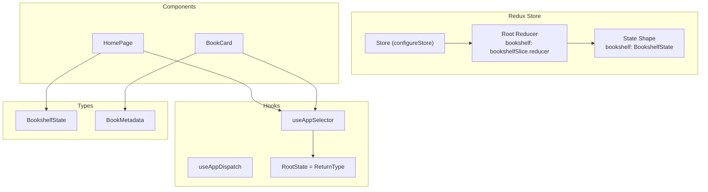
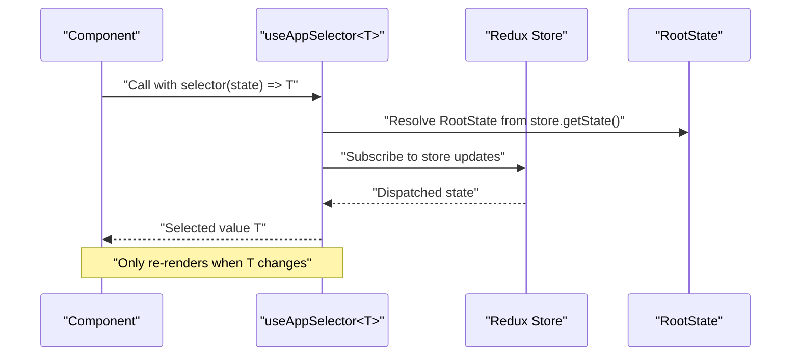
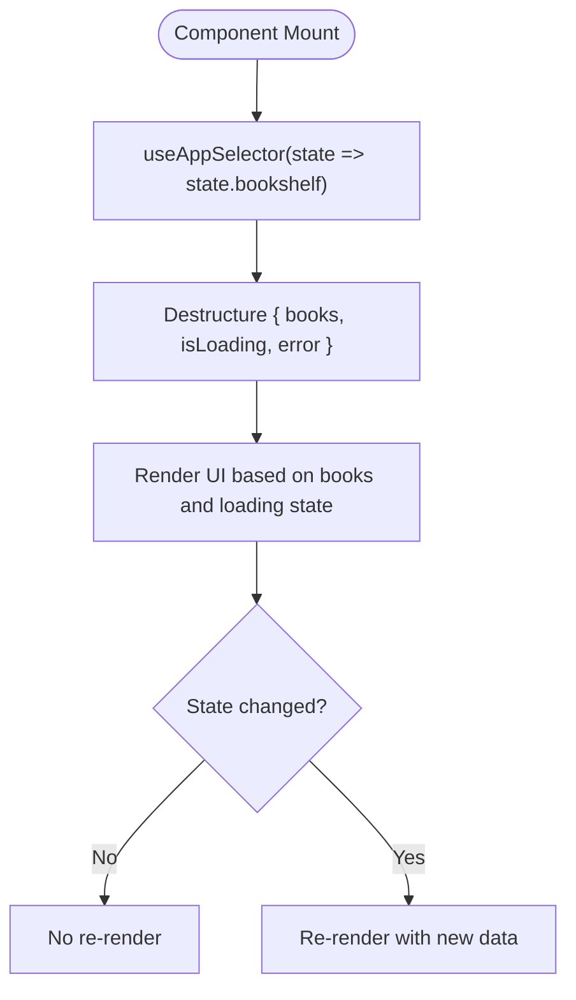
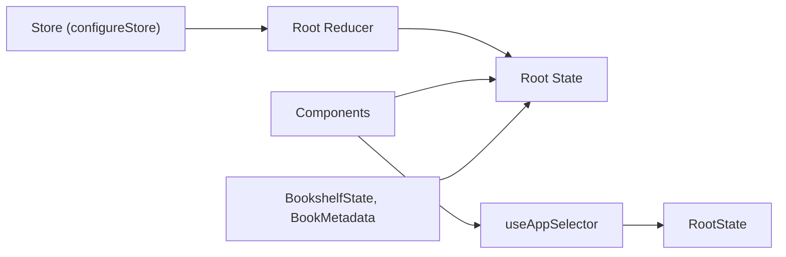

# State Selectors

<cite>
**Referenced Files in This Document**
- [src/store/index.ts](file://src/store/index.ts)
- [src/store/slices/bookshelfSlice.ts](file://src/store/slices/bookshelfSlice.ts)
- [src/store/slices/counterSlice.ts](file://src/store/slices/counterSlice.ts)
- [src/pages/HomePage/index.tsx](file://src/pages/HomePage/index.tsx)
- [src/components/BookCard/index.tsx](file://src/components/BookCard/index.tsx)
- [src/components/BookCard/hooks/useBookDisplayData.ts](file://src/components/BookCard/hooks/useBookDisplayData.ts)
- [src/types/book.ts](file://src/types/book.ts)
- [src/main.tsx](file://src/main.tsx)
</cite>

## Table of Contents
1. [Introduction](#introduction)
2. [Project Structure](#project-structure)
3. [Core Components](#core-components)
4. [Architecture Overview](#architecture-overview)
5. [Detailed Component Analysis](#detailed-component-analysis)
6. [Dependency Analysis](#dependency-analysis)
7. [Performance Considerations](#performance-considerations)
8. [Troubleshooting Guide](#troubleshooting-guide)
9. [Conclusion](#conclusion)

## Introduction
This document explains the state selector pattern used in the application, focusing on the type-safe useAppSelector hook and the RootState type. It demonstrates how components select specific slices of state (such as bookshelf data) using selector functions, and it highlights the benefits of centralized type definitions. It also outlines performance implications and provides guidance on designing selectors to avoid unnecessary re-renders, along with recommendations for memoized selectors.

## Project Structure
The state management is organized around a Redux Toolkit store with a dedicated store index and feature slices. Components consume state through a custom typed selector hook that derives its type from the store’s root state.

**Diagram sources**
- [src/store/index.ts](file://src/store/index.ts#L1-L23)
- [src/store/slices/bookshelfSlice.ts](file://src/store/slices/bookshelfSlice.ts#L90-L106)
- [src/pages/HomePage/index.tsx](file://src/pages/HomePage/index.tsx#L1-L30)
- [src/components/BookCard/index.tsx](file://src/components/BookCard/index.tsx#L1-L20)
- [src/types/book.ts](file://src/types/book.ts#L93-L106)

**Section sources**
- [src/store/index.ts](file://src/store/index.ts#L1-L23)
- [src/store/slices/bookshelfSlice.ts](file://src/store/slices/bookshelfSlice.ts#L90-L106)
- [src/pages/HomePage/index.tsx](file://src/pages/HomePage/index.tsx#L1-L30)
- [src/components/BookCard/index.tsx](file://src/components/BookCard/index.tsx#L1-L20)
- [src/types/book.ts](file://src/types/book.ts#L93-L106)

## Core Components
- Centralized store and typed hooks:
  - The store is configured with a root reducer that includes the bookshelf slice.
  - A typed useAppSelector hook is exported, parameterized by a generic type T, and bound to RootState.
  - RootState is derived from the store’s getState method, ensuring type-safe access across the app.
- Feature slice:
  - The bookshelf slice defines BookshelfState and reducers/actions for managing book metadata, loading, errors, and upload progress.
- Component usage:
  - HomePage selects the bookshelf slice using a selector function passed to useAppSelector.
  - BookCard consumes BookMetadata props and uses a local hook to compute display-friendly values.

Key implementation references:
- Store and typed hooks: [src/store/index.ts](file://src/store/index.ts#L1-L23)
- Bookshelf state shape: [src/store/slices/bookshelfSlice.ts](file://src/store/slices/bookshelfSlice.ts#L90-L106)
- Component selecting state: [src/pages/HomePage/index.tsx](file://src/pages/HomePage/index.tsx#L20-L30)
- Component props type: [src/types/book.ts](file://src/types/book.ts#L30-L55)

**Section sources**
- [src/store/index.ts](file://src/store/index.ts#L1-L23)
- [src/store/slices/bookshelfSlice.ts](file://src/store/slices/bookshelfSlice.ts#L90-L106)
- [src/pages/HomePage/index.tsx](file://src/pages/HomePage/index.tsx#L20-L30)
- [src/types/book.ts](file://src/types/book.ts#L30-L55)

## Architecture Overview
The selector pattern centers on a single typed hook that encapsulates the Redux useSelector with RootState. Components pass selector functions to extract specific parts of the state tree, enabling fine-grained subscriptions and predictable updates.

**Diagram sources**
- [src/store/index.ts](file://src/store/index.ts#L16-L22)
- [src/pages/HomePage/index.tsx](file://src/pages/HomePage/index.tsx#L20-L30)

## Detailed Component Analysis

### Typed Selector Hook: useAppSelector<T>
- Purpose:
  - Provides a strongly-typed wrapper around useSelector that accepts a selector function and infers the return type T.
- Implementation:
  - The hook is defined with a generic parameter T and binds the selector’s state argument to RootState.
  - RootState is derived from the store’s getState method, ensuring the selector receives the correct root state type.
- Benefits:
  - Prevents accidental access to non-existent state paths.
  - Improves developer experience with compile-time type checking and autocompletion.
  - Encourages centralized type definitions for the root state.

References:
- Hook definition and RootState derivation: [src/store/index.ts](file://src/store/index.ts#L16-L22)

**Section sources**
- [src/store/index.ts](file://src/store/index.ts#L16-L22)

### Root State Derivation and Centralized Types
- RootState:
  - Defined as ReturnType<typeof store.getState>, capturing the exact shape of the root state.
  - Exported as a type for reuse across the application.
- Centralized type definitions:
  - The BookshelfState interface centralizes the shape of the bookshelf slice, improving maintainability and reducing duplication.
  - BookMetadata and related types define the structure of individual book entries, enabling type-safe component props.

References:
- RootState export: [src/store/index.ts](file://src/store/index.ts#L17-L23)
- Bookshelf state shape: [src/store/slices/bookshelfSlice.ts](file://src/store/slices/bookshelfSlice.ts#L90-L106)
- Book metadata types: [src/types/book.ts](file://src/types/book.ts#L30-L55)

**Section sources**
- [src/store/index.ts](file://src/store/index.ts#L17-L23)
- [src/store/slices/bookshelfSlice.ts](file://src/store/slices/bookshelfSlice.ts#L90-L106)
- [src/types/book.ts](file://src/types/book.ts#L30-L55)

### Practical Example: Selecting Bookshelf Data in a Component
- HomePage selects the bookshelf slice using a selector function that returns state.bookshelf.
- The component destructures books, isLoading, and error from the selected slice.
- This pattern ensures the component subscribes only to the relevant portion of state, minimizing re-renders.

References:
- Selector usage in HomePage: [src/pages/HomePage/index.tsx](file://src/pages/HomePage/index.tsx#L20-L30)
- Bookshelf state shape: [src/store/slices/bookshelfSlice.ts](file://src/store/slices/bookshelfSlice.ts#L90-L106)

**Diagram sources**
- [src/pages/HomePage/index.tsx](file://src/pages/HomePage/index.tsx#L20-L30)
- [src/store/slices/bookshelfSlice.ts](file://src/store/slices/bookshelfSlice.ts#L90-L106)

**Section sources**
- [src/pages/HomePage/index.tsx](file://src/pages/HomePage/index.tsx#L20-L30)
- [src/store/slices/bookshelfSlice.ts](file://src/store/slices/bookshelfSlice.ts#L90-L106)

### Component Props and Local Computation
- BookCard consumes BookMetadata props and delegates presentation logic to a local hook that computes display-friendly values with fallbacks.
- This keeps selectors focused on state extraction while presentation logic remains encapsulated.

References:
- BookCard props and usage: [src/components/BookCard/index.tsx](file://src/components/BookCard/index.tsx#L1-L20)
- Local display computation hook: [src/components/BookCard/hooks/useBookDisplayData.ts](file://src/components/BookCard/hooks/useBookDisplayData.ts#L1-L33)
- Book metadata type: [src/types/book.ts](file://src/types/book.ts#L30-L55)

**Section sources**
- [src/components/BookCard/index.tsx](file://src/components/BookCard/index.tsx#L1-L20)
- [src/components/BookCard/hooks/useBookDisplayData.ts](file://src/components/BookCard/hooks/useBookDisplayData.ts#L1-L33)
- [src/types/book.ts](file://src/types/book.ts#L30-L55)

### Dispatch Hook and Provider Setup
- useAppDispatch is typed to match the store’s dispatch signature.
- The store is provided at the root level, ensuring all components can access typed selectors and dispatch actions.

References:
- Typed dispatch hook: [src/store/index.ts](file://src/store/index.ts#L16-L16)
- Provider setup: [src/main.tsx](file://src/main.tsx#L1-L12)

**Section sources**
- [src/store/index.ts](file://src/store/index.ts#L16-L16)
- [src/main.tsx](file://src/main.tsx#L1-L12)

## Dependency Analysis
The selector pattern relies on a tight coupling between the store’s root state and the typed selector hook. Components depend on the selector function to subscribe to specific slices, while the hook depends on RootState to enforce type safety.

**Diagram sources**
- [src/store/index.ts](file://src/store/index.ts#L1-L23)
- [src/store/slices/bookshelfSlice.ts](file://src/store/slices/bookshelfSlice.ts#L90-L106)
- [src/types/book.ts](file://src/types/book.ts#L93-L106)

**Section sources**
- [src/store/index.ts](file://src/store/index.ts#L1-L23)
- [src/store/slices/bookshelfSlice.ts](file://src/store/slices/bookshelfSlice.ts#L90-L106)
- [src/types/book.ts](file://src/types/book.ts#L93-L106)

## Performance Considerations
- Fine-grained subscriptions:
  - Using a selector function that returns a small slice of state (e.g., state.bookshelf) ensures components only re-render when that slice changes.
- Avoid unnecessary re-renders:
  - Prefer passing a selector that extracts only the needed fields rather than the entire state object.
  - Keep selectors pure and deterministic to prevent stale selections.
- Memoization recommendation:
  - For complex computed values, introduce memoized selectors to cache results and avoid recomputing expensive transformations on every render.
  - Even though memoized selectors are not currently implemented, adopting them would reduce CPU overhead for heavy computations.
- Local presentation logic:
  - Presentational computations (e.g., formatting display values) are handled in local hooks, keeping selectors lightweight and focused on state extraction.

[No sources needed since this section provides general guidance]

## Troubleshooting Guide
- Selector returns undefined or unexpected values:
  - Verify the selector function targets the correct slice and property (e.g., state.bookshelf).
  - Confirm the slice reducer initializes the expected state shape.
- Type errors when accessing state:
  - Ensure RootState is derived from the store’s getState method and that the selector’s state parameter aligns with RootState.
  - Check that the slice’s state interface matches the expected shape.
- Component not updating:
  - Ensure the selector returns a stable reference when the underlying data has not changed.
  - For complex selections, consider memoizing the selector to preserve referential equality.

**Section sources**
- [src/store/index.ts](file://src/store/index.ts#L16-L22)
- [src/store/slices/bookshelfSlice.ts](file://src/store/slices/bookshelfSlice.ts#L90-L106)

## Conclusion
The application employs a robust state selector pattern centered on a typed useAppSelector hook and a RootState derived from the store’s getState method. Components select specific slices of state using selector functions, improving type safety and developer experience. While the current implementation avoids unnecessary re-renders through targeted subscriptions, introducing memoized selectors for complex computations would further enhance performance. Centralized type definitions for state shapes and component props contribute to maintainability and consistency across the codebase.