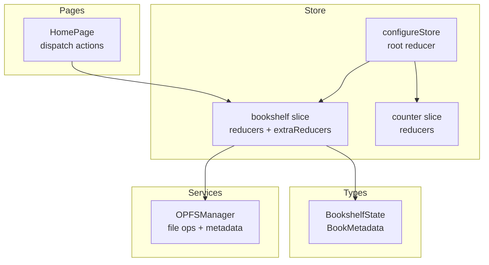
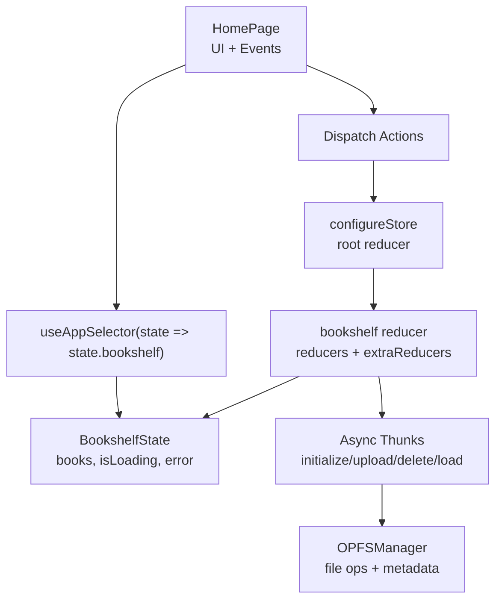
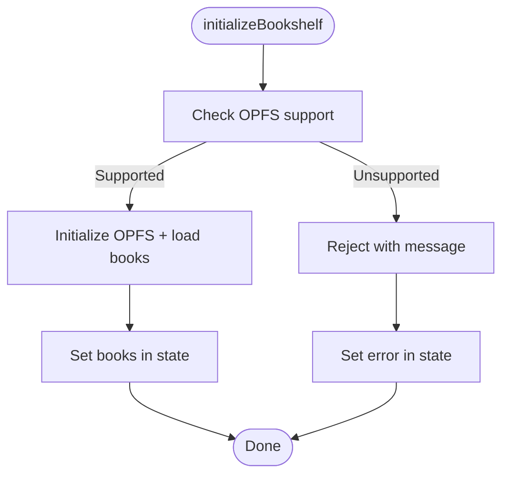
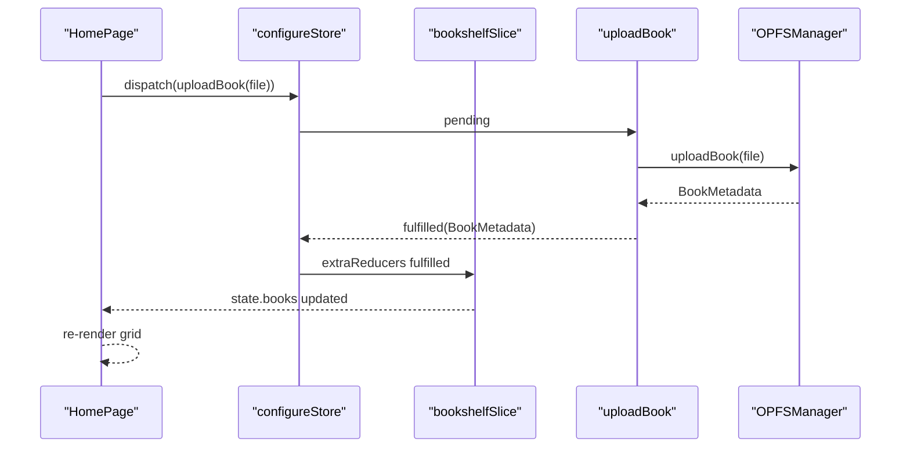
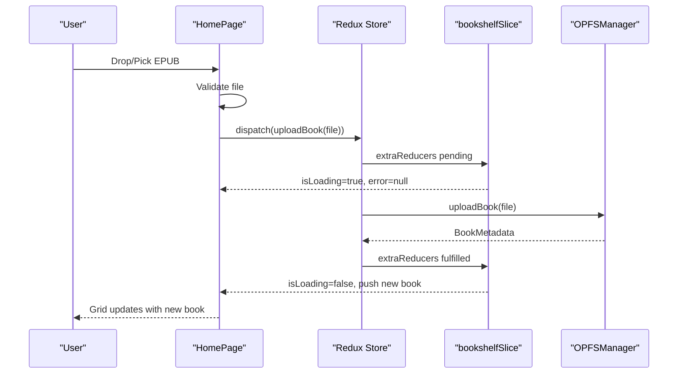
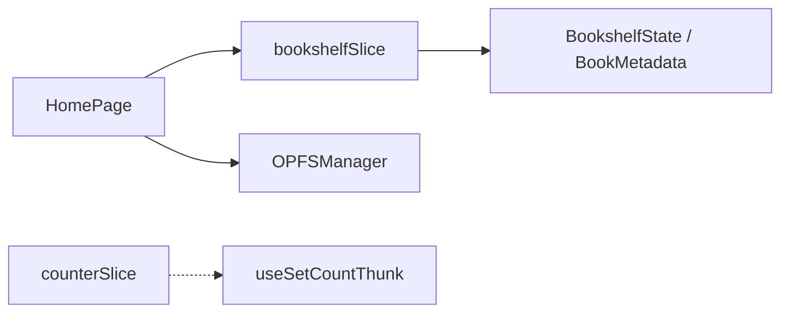

# State Management

<cite>
**Referenced Files in This Document**
- [index.ts](file://src/store/index.ts)
- [bookshelfSlice.ts](file://src/store/slices/bookshelfSlice.ts)
- [counterSlice.ts](file://src/store/slices/counterSlice.ts)
- [index.tsx](file://src/pages/HomePage/index.tsx)
- [book.ts](file://src/types/book.ts)
- [OPFSManager.ts](file://src/services/OPFSManager.ts)
- [index.tsx](file://src/components/BookCard/index.tsx)
- [useBookDisplayData.ts](file://src/components/BookCard/hooks/useBookDisplayData.ts)
</cite>

## Table of Contents
1. [Introduction](#introduction)
2. [Project Structure](#project-structure)
3. [Core Components](#core-components)
4. [Architecture Overview](#architecture-overview)
5. [Detailed Component Analysis](#detailed-component-analysis)
6. [Dependency Analysis](#dependency-analysis)
7. [Performance Considerations](#performance-considerations)
8. [Troubleshooting Guide](#troubleshooting-guide)
9. [Conclusion](#conclusion)
10. [Appendices](#appendices)

## Introduction
This document describes the Redux Toolkit implementation for state management in the application. It focuses on the store structure, the bookshelf domain slice, async thunk patterns for asynchronous operations, and how components interact with the store. It also outlines performance considerations and trade-offs compared to React Context.

## Project Structure
The state management is organized around a central store and domain-specific slices:
- Store configuration defines the root reducer and typed hooks.
- The bookshelf slice manages uploaded books, loading states, and errors.
- A minimal counter slice demonstrates a simple synchronous domain.
- Components consume state via typed selectors and dispatch actions.

**Diagram sources**
- [index.ts](file://src/store/index.ts#L1-L24)
- [bookshelfSlice.ts](file://src/store/slices/bookshelfSlice.ts#L90-L189)
- [counterSlice.ts](file://src/store/slices/counterSlice.ts#L1-L47)
- [index.tsx](file://src/pages/HomePage/index.tsx#L1-L292)
- [book.ts](file://src/types/book.ts#L93-L116)
- [OPFSManager.ts](file://src/services/OPFSManager.ts#L126-L219)

**Section sources**
- [index.ts](file://src/store/index.ts#L1-L24)
- [bookshelfSlice.ts](file://src/store/slices/bookshelfSlice.ts#L90-L189)
- [counterSlice.ts](file://src/store/slices/counterSlice.ts#L1-L47)
- [index.tsx](file://src/pages/HomePage/index.tsx#L1-L292)
- [book.ts](file://src/types/book.ts#L93-L116)
- [OPFSManager.ts](file://src/services/OPFSManager.ts#L126-L219)

## Core Components
- Store configuration: Defines the root reducer mapping and typed hooks for dispatch and selectors.
- Bookshelf slice: Manages the primary domain state for books, loading, and errors; integrates async thunks for initialization, upload, deletion, and refresh.
- Counter slice: Demonstrates a simple synchronous domain with a value and a setter action.
- HomePage: Dispatches actions to initialize the bookshelf, upload books, delete books, and refresh lists; renders loading and error states.

**Section sources**
- [index.ts](file://src/store/index.ts#L1-L24)
- [bookshelfSlice.ts](file://src/store/slices/bookshelfSlice.ts#L90-L189)
- [counterSlice.ts](file://src/store/slices/counterSlice.ts#L1-L47)
- [index.tsx](file://src/pages/HomePage/index.tsx#L1-L292)

## Architecture Overview
The Redux Toolkit setup uses a single root reducer keyed under the bookshelf domain. Async thunks encapsulate side effects and feed results into reducers via extraReducers. Components subscribe to state via typed selectors and dispatch actions to update state.

**Diagram sources**
- [index.ts](file://src/store/index.ts#L1-L24)
- [bookshelfSlice.ts](file://src/store/slices/bookshelfSlice.ts#L18-L88)
- [index.tsx](file://src/pages/HomePage/index.tsx#L1-L292)
- [OPFSManager.ts](file://src/services/OPFSManager.ts#L126-L219)

## Detailed Component Analysis

### Store Setup and Typed Hooks
- Root reducer maps the bookshelf slice to the bookshelf key.
- Typed hooks:
  - useAppDispatch: strongly typed dispatch bound to the store’s dispatch type.
  - useAppSelector: typed selector that accepts a selector function returning a derived value.

**Section sources**
- [index.ts](file://src/store/index.ts#L1-L24)

### Bookshelf Slice: Domain State and Reducers
- State shape:
  - books: array of BookMetadata.
  - isLoading: boolean flag for async operations.
  - error: string|null for error messages.
  - uploadProgress: UploadProgress|null for upload status.
- Synchronous reducers:
  - setUploadProgress: updates upload progress.
  - clearError: clears error state.
- Extra reducers (from async thunks):
  - initializeBookshelf: pending/fulfilled/rejected transitions for initial load.
  - uploadBook: pending/fulfilled/rejected transitions for adding a new book.
  - deleteBook: pending/fulfilled/rejected transitions for removing a book.
  - loadBooks: pending/fulfilled/rejected transitions for refreshing the list.

**Diagram sources**
- [bookshelfSlice.ts](file://src/store/slices/bookshelfSlice.ts#L18-L88)
- [OPFSManager.ts](file://src/services/OPFSManager.ts#L38-L60)

**Section sources**
- [bookshelfSlice.ts](file://src/store/slices/bookshelfSlice.ts#L90-L189)
- [book.ts](file://src/types/book.ts#L93-L116)

### Async Thunk Patterns
- Validation and orchestration:
  - File validation for uploads.
  - OPFS support checks before initialization.
- Thunks:
  - initializeBookshelf: initializes OPFS and loads persisted books.
  - uploadBook: validates file, persists EPUB, extracts metadata and cover, updates config.
  - deleteBook: removes book directory and updates config.
  - loadBooks: reads persisted books from config.
- Error handling:
  - rejectWithValue returns payload for rejected cases.
  - extraReducers set isLoading and error accordingly.

**Diagram sources**
- [index.tsx](file://src/pages/HomePage/index.tsx#L60-L80)
- [bookshelfSlice.ts](file://src/store/slices/bookshelfSlice.ts#L40-L76)
- [OPFSManager.ts](file://src/services/OPFSManager.ts#L126-L219)

**Section sources**
- [bookshelfSlice.ts](file://src/store/slices/bookshelfSlice.ts#L18-L88)
- [OPFSManager.ts](file://src/services/OPFSManager.ts#L126-L219)

### Selector Patterns and Memoization
- The HomePage selects the bookshelf domain via a typed selector.
- Components use local memoization and callbacks to optimize rendering:
  - useCallback for event handlers.
  - useMemo for derived values in other components (e.g., API config options).
- There is no explicit use of createSelector in the codebase; selectors are simple property accessors.

**Section sources**
- [index.tsx](file://src/pages/HomePage/index.tsx#L1-L292)
- [useBookDisplayData.ts](file://src/components/BookCard/hooks/useBookDisplayData.ts#L1-L33)

### Counter Slice: Simple Synchronous Domain
- Provides a value field and a setter action.
- Includes a custom hook that simulates async delay before dispatching the setter.

**Section sources**
- [counterSlice.ts](file://src/store/slices/counterSlice.ts#L1-L47)

### Data Flow: From User Action to UI Update
- User drags or picks an EPUB file.
- HomePage validates the file and dispatches uploadBook.
- Thunk executes upload and returns metadata.
- Reducer updates state; HomePage re-renders the bookshelf grid.

**Diagram sources**
- [index.tsx](file://src/pages/HomePage/index.tsx#L60-L80)
- [bookshelfSlice.ts](file://src/store/slices/bookshelfSlice.ts#L132-L146)
- [OPFSManager.ts](file://src/services/OPFSManager.ts#L126-L219)

## Dependency Analysis
- HomePage depends on:
  - Typed hooks from the store.
  - Actions exported by the bookshelf slice.
  - OPFSManager for file operations.
- Bookshelf slice depends on:
  - Types for state and metadata.
  - OPFSManager for persistence and metadata extraction.
- Counter slice is independent and does not depend on external services.

**Diagram sources**
- [index.tsx](file://src/pages/HomePage/index.tsx#L1-L292)
- [bookshelfSlice.ts](file://src/store/slices/bookshelfSlice.ts#L90-L189)
- [counterSlice.ts](file://src/store/slices/counterSlice.ts#L32-L47)
- [book.ts](file://src/types/book.ts#L93-L116)
- [OPFSManager.ts](file://src/services/OPFSManager.ts#L126-L219)

**Section sources**
- [index.tsx](file://src/pages/HomePage/index.tsx#L1-L292)
- [bookshelfSlice.ts](file://src/store/slices/bookshelfSlice.ts#L90-L189)
- [counterSlice.ts](file://src/store/slices/counterSlice.ts#L1-L47)
- [book.ts](file://src/types/book.ts#L93-L116)
- [OPFSManager.ts](file://src/services/OPFSManager.ts#L126-L219)

## Performance Considerations
- State normalization:
  - The current state stores an array of books. For frequent updates or large libraries, consider normalizing to an object keyed by id to enable O(1) lookups and reduce re-renders when updating a single book.
- Memoization:
  - Local memoization is used in components (e.g., useMemo in other parts of the app). For selectors, consider using createSelector to compute derived data efficiently and avoid unnecessary recalculations.
- Rendering:
  - HomePage renders a grid of BookCard components. Memoizing derived values (e.g., display data) reduces re-renders. The BookCard component already extracts display formatting into a hook to simplify props.
- Async operations:
  - OPFS operations are performed in thunks. Ensure UI remains responsive by avoiding long-running tasks on the main thread and batching updates where appropriate.

[No sources needed since this section provides general guidance]

## Troubleshooting Guide
- OPFS not supported:
  - The app checks for OPFS support and displays a compatibility notice. Initialization and uploads will fail gracefully with error messages propagated to the UI.
- Upload failures:
  - Validation errors and service errors are captured and surfaced via the error state. The UI shows an error banner with a dismiss action.
- Deletion issues:
  - If deletion fails, the error is shown and the list is not updated. Confirm browser permissions and retry.
- Loading states:
  - During initialization and uploads, isLoading is set to true. The UI shows a loader until the operation completes.

**Section sources**
- [index.tsx](file://src/pages/HomePage/index.tsx#L226-L244)
- [bookshelfSlice.ts](file://src/store/slices/bookshelfSlice.ts#L115-L163)
- [OPFSManager.ts](file://src/services/OPFSManager.ts#L38-L60)

## Conclusion
The Redux Toolkit implementation centers on a clean separation of concerns: a focused bookshelf domain slice orchestrating async operations, a typed store with strong typing for dispatch and selectors, and components that reactively render based on state. While the current codebase does not use createSelector, adopting memoized selectors and state normalization would further improve scalability and performance for larger datasets.

[No sources needed since this section summarizes without analyzing specific files]

## Appendices

### Example: HomePage Interactions
- Initializes the bookshelf on mount.
- Uploads EPUBs via drag-and-drop or file input.
- Deletes books with confirmation.
- Refreshes the list after uploads.

**Section sources**
- [index.tsx](file://src/pages/HomePage/index.tsx#L31-L80)
- [index.tsx](file://src/pages/HomePage/index.tsx#L111-L152)
- [index.tsx](file://src/pages/HomePage/index.tsx#L154-L292)

### Trade-offs: Redux Toolkit vs React Context
- Redux Toolkit:
  - Centralized, predictable state updates.
  - Excellent for cross-component coordination and complex async flows.
  - Strong typing with typed hooks.
- React Context:
  - Simpler for small, localized state.
  - Can become unwieldy for complex state machines and cross-cutting concerns.
- Recommendation:
  - Use Redux Toolkit for the bookshelf domain and complex async flows.
  - Consider Context for lightweight UI state (e.g., theme, modal visibility) to avoid over-engineering.

[No sources needed since this section provides general guidance]