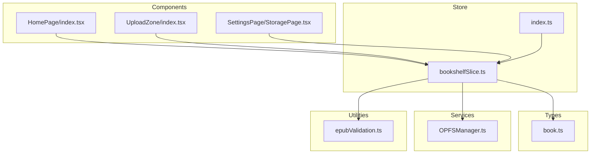
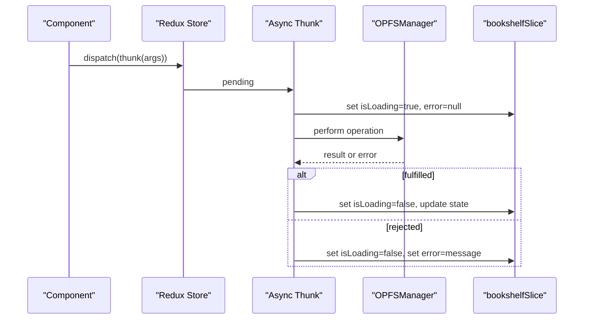
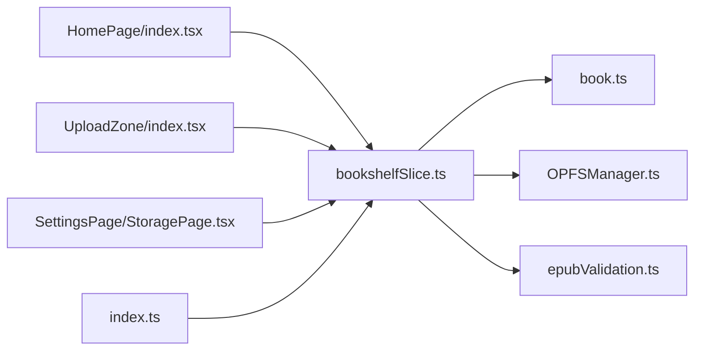

# Bookshelf Slice

<cite>
**Referenced Files in This Document**
- [bookshelfSlice.ts](file://src/store/slices/bookshelfSlice.ts)
- [book.ts](file://src/types/book.ts)
- [OPFSManager.ts](file://src/services/OPFSManager.ts)
- [index.ts](file://src/store/index.ts)
- [HomePage/index.tsx](file://src/pages/HomePage/index.tsx)
- [UploadZone/index.tsx](file://src/components/UploadZone/index.tsx)
- [epubValidation.ts](file://src/utils/epubValidation.ts)
- [StoragePage.tsx](file://src/pages/SettingsPage/StoragePage.tsx)
</cite>

## Table of Contents
1. [Introduction](#introduction)
2. [Project Structure](#project-structure)
3. [Core Components](#core-components)
4. [Architecture Overview](#architecture-overview)
5. [Detailed Component Analysis](#detailed-component-analysis)
6. [Dependency Analysis](#dependency-analysis)
7. [Performance Considerations](#performance-considerations)
8. [Troubleshooting Guide](#troubleshooting-guide)
9. [Conclusion](#conclusion)

## Introduction
This document provides comprehensive documentation for the bookshelfSlice, the core Redux slice responsible for managing the user’s EPUB book collection. It explains the state shape, async thunks, reducers, integration with OPFSManager for persistent storage, validation logic, error handling patterns, and practical guidance for dispatching actions and selecting state in components.

## Project Structure
The bookshelfSlice resides under the store module and integrates with services and utilities across the application. The key files involved are:
- Store slice and types
- OPFSManager service for persistent storage
- Validation utilities
- Components that dispatch actions and select state

**Diagram sources**
- [bookshelfSlice.ts](file://src/store/slices/bookshelfSlice.ts#L1-L189)
- [book.ts](file://src/types/book.ts#L1-L116)
- [OPFSManager.ts](file://src/services/OPFSManager.ts#L1-L510)
- [index.ts](file://src/store/index.ts#L1-L24)
- [HomePage/index.tsx](file://src/pages/HomePage/index.tsx#L1-L292)
- [UploadZone/index.tsx](file://src/components/UploadZone/index.tsx#L1-L129)
- [epubValidation.ts](file://src/utils/epubValidation.ts#L1-L76)
- [StoragePage.tsx](file://src/pages/SettingsPage/StoragePage.tsx#L1-L159)

**Section sources**
- [bookshelfSlice.ts](file://src/store/slices/bookshelfSlice.ts#L1-L189)
- [book.ts](file://src/types/book.ts#L1-L116)
- [OPFSManager.ts](file://src/services/OPFSManager.ts#L1-L510)
- [index.ts](file://src/store/index.ts#L1-L24)
- [HomePage/index.tsx](file://src/pages/HomePage/index.tsx#L1-L292)
- [UploadZone/index.tsx](file://src/components/UploadZone/index.tsx#L1-L129)
- [epubValidation.ts](file://src/utils/epubValidation.ts#L1-L76)
- [StoragePage.tsx](file://src/pages/SettingsPage/StoragePage.tsx#L1-L159)

## Core Components
- Slice name: bookshelf
- Initial state fields:
  - books: array of BookMetadata
  - isLoading: boolean flag for async operations
  - error: string|null for failure messages
  - uploadProgress: UploadProgress|null for file upload status
- Reducers:
  - setUploadProgress: updates uploadProgress
  - clearError: clears error state
- Async thunks:
  - initializeBookshelf: initializes OPFS and loads books
  - uploadBook: validates file and persists to OPFS
  - deleteBook: removes a book and updates config
  - loadBooks: refreshes the book list from OPFS

Key implementation references:
- Initial state and reducers: [bookshelfSlice.ts](file://src/store/slices/bookshelfSlice.ts#L90-L111)
- Async thunks and validation: [bookshelfSlice.ts](file://src/store/slices/bookshelfSlice.ts#L19-L88)
- OPFS integration: [OPFSManager.ts](file://src/services/OPFSManager.ts#L123-L219)
- Types: [book.ts](file://src/types/book.ts#L30-L105)

**Section sources**
- [bookshelfSlice.ts](file://src/store/slices/bookshelfSlice.ts#L90-L111)
- [bookshelfSlice.ts](file://src/store/slices/bookshelfSlice.ts#L19-L88)
- [OPFSManager.ts](file://src/services/OPFSManager.ts#L123-L219)
- [book.ts](file://src/types/book.ts#L30-L105)

## Architecture Overview
The bookshelfSlice orchestrates asynchronous operations via Redux Toolkit thunks. Each thunk interacts with OPFSManager to perform persistent storage operations. The slice updates the state based on pending, fulfilled, and rejected outcomes. Components dispatch actions and select state using typed hooks.

**Diagram sources**
- [bookshelfSlice.ts](file://src/store/slices/bookshelfSlice.ts#L112-L181)
- [OPFSManager.ts](file://src/services/OPFSManager.ts#L1-L510)

## Detailed Component Analysis

### State Shape and Normalization Strategy
- State fields:
  - books: normalized as an array of BookMetadata
  - isLoading: toggled around async operations
  - error: stores the latest error message
  - uploadProgress: structured UploadProgress for upload UI feedback
- Normalization:
  - The slice maintains a flat array of books. Deletion uses filtering by id.
  - No separate entity map is used; the array is the canonical source of truth for book records.

References:
- Initial state: [bookshelfSlice.ts](file://src/store/slices/bookshelfSlice.ts#L90-L96)
- Types: [book.ts](file://src/types/book.ts#L30-L105)

**Section sources**
- [bookshelfSlice.ts](file://src/store/slices/bookshelfSlice.ts#L90-L96)
- [book.ts](file://src/types/book.ts#L30-L105)

### Reducers
- setUploadProgress(state, action):
  - Updates uploadProgress with the provided payload or null.
- clearError(state):
  - Resets error to null.

References:
- Reducer definitions: [bookshelfSlice.ts](file://src/store/slices/bookshelfSlice.ts#L103-L111)

**Section sources**
- [bookshelfSlice.ts](file://src/store/slices/bookshelfSlice.ts#L103-L111)

### Async Thunks and ExtraReducers

#### initializeBookshelf
- Purpose: Check OPFS support, initialize storage, and load all books.
- Behavior:
  - Pending: sets isLoading=true and clears error.
  - Fulfilled: sets isLoading=false and replaces books with loaded list.
  - Rejected: sets isLoading=false and sets error to the payload message.

References:
- Thunk and extraReducers: [bookshelfSlice.ts](file://src/store/slices/bookshelfSlice.ts#L19-L38), [bookshelfSlice.ts](file://src/store/slices/bookshelfSlice.ts#L112-L130)
- OPFS initialization: [OPFSManager.ts](file://src/services/OPFSManager.ts#L38-L60), [OPFSManager.ts](file://src/services/OPFSManager.ts#L329-L332)

**Section sources**
- [bookshelfSlice.ts](file://src/store/slices/bookshelfSlice.ts#L19-L38)
- [bookshelfSlice.ts](file://src/store/slices/bookshelfSlice.ts#L112-L130)
- [OPFSManager.ts](file://src/services/OPFSManager.ts#L38-L60)
- [OPFSManager.ts](file://src/services/OPFSManager.ts#L329-L332)

#### uploadBook
- Purpose: Validate file and persist EPUB to OPFS, then add the new book to state.
- Validation:
  - Centralized validation via getEpubValidationError and MAX_EPUB_SIZE.
  - Additional internal validation in OPFSManager.uploadBook.
- Behavior:
  - Pending: sets isLoading=true and clears error.
  - Fulfilled: sets isLoading=false and pushes returned BookMetadata to books.
  - Rejected: sets isLoading=false and sets error to the payload message.

References:
- Thunk and validation: [bookshelfSlice.ts](file://src/store/slices/bookshelfSlice.ts#L40-L56), [bookshelfSlice.ts](file://src/store/slices/bookshelfSlice.ts#L6-L16)
- OPFS upload: [OPFSManager.ts](file://src/services/OPFSManager.ts#L123-L219)
- Validation utilities: [epubValidation.ts](file://src/utils/epubValidation.ts#L1-L76)

**Section sources**
- [bookshelfSlice.ts](file://src/store/slices/bookshelfSlice.ts#L40-L56)
- [bookshelfSlice.ts](file://src/store/slices/bookshelfSlice.ts#L6-L16)
- [OPFSManager.ts](file://src/services/OPFSManager.ts#L123-L219)
- [epubValidation.ts](file://src/utils/epubValidation.ts#L1-L76)

#### deleteBook
- Purpose: Remove a book directory and update config.
- Behavior:
  - Pending: sets isLoading=true and clears error.
  - Fulfilled: sets isLoading=false and filters out the deleted book by id.
  - Rejected: sets isLoading=false and sets error to the payload message.

References:
- Thunk and extraReducers: [bookshelfSlice.ts](file://src/store/slices/bookshelfSlice.ts#L58-L76), [bookshelfSlice.ts](file://src/store/slices/bookshelfSlice.ts#L148-L164)
- OPFS deletion: [OPFSManager.ts](file://src/services/OPFSManager.ts#L241-L261)

**Section sources**
- [bookshelfSlice.ts](file://src/store/slices/bookshelfSlice.ts#L58-L76)
- [bookshelfSlice.ts](file://src/store/slices/bookshelfSlice.ts#L148-L164)
- [OPFSManager.ts](file://src/services/OPFSManager.ts#L241-L261)

#### loadBooks
- Purpose: Refresh the book list from OPFS config.
- Behavior:
  - Pending: sets isLoading=true and clears error.
  - Fulfilled: sets isLoading=false and replaces books with loaded list.
  - Rejected: sets isLoading=false and sets error to the payload message.

References:
- Thunk and extraReducers: [bookshelfSlice.ts](file://src/store/slices/bookshelfSlice.ts#L78-L88), [bookshelfSlice.ts](file://src/store/slices/bookshelfSlice.ts#L165-L181)
- OPFS retrieval: [OPFSManager.ts](file://src/services/OPFSManager.ts#L329-L332)

**Section sources**
- [bookshelfSlice.ts](file://src/store/slices/bookshelfSlice.ts#L78-L88)
- [bookshelfSlice.ts](file://src/store/slices/bookshelfSlice.ts#L165-L181)
- [OPFSManager.ts](file://src/services/OPFSManager.ts#L329-L332)

### Validation Logic
- File validation:
  - Extension check (.epub), non-zero size, and maximum size (100 MB).
  - Centralized validation utilities provide consistent checks and error messages.
- OPFS support:
  - Both the slice and components check isSupported() to guard operations.

References:
- Internal validation: [bookshelfSlice.ts](file://src/store/slices/bookshelfSlice.ts#L6-L16)
- Validation utilities: [epubValidation.ts](file://src/utils/epubValidation.ts#L1-L76)
- OPFS support checks: [OPFSManager.ts](file://src/services/OPFSManager.ts#L28-L40), [HomePage/index.tsx](file://src/pages/HomePage/index.tsx#L227-L244), [StoragePage.tsx](file://src/pages/SettingsPage/StoragePage.tsx#L98-L103)

**Section sources**
- [bookshelfSlice.ts](file://src/store/slices/bookshelfSlice.ts#L6-L16)
- [epubValidation.ts](file://src/utils/epubValidation.ts#L1-L76)
- [OPFSManager.ts](file://src/services/OPFSManager.ts#L28-L40)
- [HomePage/index.tsx](file://src/pages/HomePage/index.tsx#L227-L244)
- [StoragePage.tsx](file://src/pages/SettingsPage/StoragePage.tsx#L98-L103)

### Integration with OPFSManager
- OPFSManager handles:
  - Initialization of the OPFS directory structure
  - Uploading EPUBs, extracting metadata and cover images
  - Deleting books and updating config.json
  - Retrieving all books from config
  - Storage statistics and reset operations

References:
- OPFS operations: [OPFSManager.ts](file://src/services/OPFSManager.ts#L38-L60), [OPFSManager.ts](file://src/services/OPFSManager.ts#L123-L219), [OPFSManager.ts](file://src/services/OPFSManager.ts#L241-L261), [OPFSManager.ts](file://src/services/OPFSManager.ts#L329-L332), [OPFSManager.ts](file://src/services/OPFSManager.ts#L365-L402)

**Section sources**
- [OPFSManager.ts](file://src/services/OPFSManager.ts#L38-L60)
- [OPFSManager.ts](file://src/services/OPFSManager.ts#L123-L219)
- [OPFSManager.ts](file://src/services/OPFSManager.ts#L241-L261)
- [OPFSManager.ts](file://src/services/OPFSManager.ts#L329-L332)
- [OPFSManager.ts](file://src/services/OPFSManager.ts#L365-L402)

### Dispatching Actions and Selecting State
- Components dispatch actions via useAppDispatch and select state via useAppSelector.
- Example usage:
  - Initialize on mount: [HomePage/index.tsx](file://src/pages/HomePage/index.tsx#L31-L43)
  - Upload via UploadZone: [UploadZone/index.tsx](file://src/components/UploadZone/index.tsx#L29-L46)
  - Delete book: [HomePage/index.tsx](file://src/pages/HomePage/index.tsx#L50-L58)
  - Load books after upload: [HomePage/index.tsx](file://src/pages/HomePage/index.tsx#L70-L77)
  - Clear error: [HomePage/index.tsx](file://src/pages/HomePage/index.tsx#L216-L223)
  - Select state: [HomePage/index.tsx](file://src/pages/HomePage/index.tsx#L25-L25)

References:
- Hooks and store setup: [index.ts](file://src/store/index.ts#L1-L24)

**Section sources**
- [HomePage/index.tsx](file://src/pages/HomePage/index.tsx#L31-L43)
- [HomePage/index.tsx](file://src/pages/HomePage/index.tsx#L50-L58)
- [HomePage/index.tsx](file://src/pages/HomePage/index.tsx#L70-L77)
- [HomePage/index.tsx](file://src/pages/HomePage/index.tsx#L216-L223)
- [HomePage/index.tsx](file://src/pages/HomePage/index.tsx#L25-L25)
- [UploadZone/index.tsx](file://src/components/UploadZone/index.tsx#L29-L46)
- [index.ts](file://src/store/index.ts#L1-L24)

## Dependency Analysis
The bookshelfSlice depends on:
- Types for state and payloads
- OPFSManager for persistence
- Validation utilities for file checks
- Components for dispatching actions and selecting state

**Diagram sources**
- [bookshelfSlice.ts](file://src/store/slices/bookshelfSlice.ts#L1-L189)
- [book.ts](file://src/types/book.ts#L1-L116)
- [OPFSManager.ts](file://src/services/OPFSManager.ts#L1-L510)
- [epubValidation.ts](file://src/utils/epubValidation.ts#L1-L76)
- [HomePage/index.tsx](file://src/pages/HomePage/index.tsx#L1-L292)
- [UploadZone/index.tsx](file://src/components/UploadZone/index.tsx#L1-L129)
- [StoragePage.tsx](file://src/pages/SettingsPage/StoragePage.tsx#L1-L159)
- [index.ts](file://src/store/index.ts#L1-L24)

**Section sources**
- [bookshelfSlice.ts](file://src/store/slices/bookshelfSlice.ts#L1-L189)
- [book.ts](file://src/types/book.ts#L1-L116)
- [OPFSManager.ts](file://src/services/OPFSManager.ts#L1-L510)
- [epubValidation.ts](file://src/utils/epubValidation.ts#L1-L76)
- [HomePage/index.tsx](file://src/pages/HomePage/index.tsx#L1-L292)
- [UploadZone/index.tsx](file://src/components/UploadZone/index.tsx#L1-L129)
- [StoragePage.tsx](file://src/pages/SettingsPage/StoragePage.tsx#L1-L159)
- [index.ts](file://src/store/index.ts#L1-L24)

## Performance Considerations
- Large book collections:
  - The slice maintains a flat array of books. Filtering and replacing arrays are O(n).
  - For very large libraries, consider virtualizing lists in UI components to reduce DOM overhead.
- OPFS operations:
  - Writing files and reading metadata can be expensive. Batch operations and avoid frequent re-renders by dispatching loadBooks after bulk changes.
- Validation:
  - Centralized validation avoids repeated checks and reduces UI thrashing.
- Loading indicators:
  - Use isLoading to prevent redundant operations and improve perceived performance.

[No sources needed since this section provides general guidance]

## Troubleshooting Guide
Common issues and resolutions:
- OPFS unsupported environment:
  - Symptom: Initialization fails or browser compatibility warning appears.
  - Resolution: Check isSupported() before performing operations. Provide fallback UI and guidance.
  - References: [OPFSManager.ts](file://src/services/OPFSManager.ts#L28-L40), [HomePage/index.tsx](file://src/pages/HomePage/index.tsx#L227-L244), [StoragePage.tsx](file://src/pages/SettingsPage/StoragePage.tsx#L98-L103)
- Upload validation errors:
  - Symptom: Upload fails with messages like unsupported extension, empty file, or size exceeded.
  - Resolution: Use getEpubValidationError and MAX_EPUB_SIZE to inform users before attempting upload.
  - References: [epubValidation.ts](file://src/utils/epubValidation.ts#L1-L76), [UploadZone/index.tsx](file://src/components/UploadZone/index.tsx#L29-L46)
- Failed initialization:
  - Symptom: initializeBookshelf rejected with error.
  - Resolution: Clear error with clearError, display user-friendly message, and retry after fixing environment.
  - References: [bookshelfSlice.ts](file://src/store/slices/bookshelfSlice.ts#L112-L130), [bookshelfSlice.ts](file://src/store/slices/bookshelfSlice.ts#L185-L186)
- Delete failures:
  - Symptom: deleteBook rejected.
  - Resolution: Confirm the book exists, retry, and refresh state with loadBooks.
  - References: [bookshelfSlice.ts](file://src/store/slices/bookshelfSlice.ts#L148-L164), [OPFSManager.ts](file://src/services/OPFSManager.ts#L241-L261)
- OPFS reset:
  - Symptom: Need to clear all cached data.
  - Resolution: Use resetAllData and dispatch loadBooks to rebuild state.
  - References: [OPFSManager.ts](file://src/services/OPFSManager.ts#L378-L402), [StoragePage.tsx](file://src/pages/SettingsPage/StoragePage.tsx#L63-L89)

**Section sources**
- [OPFSManager.ts](file://src/services/OPFSManager.ts#L28-L40)
- [HomePage/index.tsx](file://src/pages/HomePage/index.tsx#L227-L244)
- [StoragePage.tsx](file://src/pages/SettingsPage/StoragePage.tsx#L63-L89)
- [epubValidation.ts](file://src/utils/epubValidation.ts#L1-L76)
- [UploadZone/index.tsx](file://src/components/UploadZone/index.tsx#L29-L46)
- [bookshelfSlice.ts](file://src/store/slices/bookshelfSlice.ts#L112-L130)
- [bookshelfSlice.ts](file://src/store/slices/bookshelfSlice.ts#L148-L164)
- [OPFSManager.ts](file://src/services/OPFSManager.ts#L241-L261)
- [OPFSManager.ts](file://src/services/OPFSManager.ts#L378-L402)

## Conclusion
The bookshelfSlice provides a robust foundation for managing EPUB collections with clear async patterns, strong validation, and seamless integration with OPFS. By leveraging the provided hooks and thunks, components can reliably initialize, upload, delete, and refresh the bookshelf while maintaining a clean and predictable state model.