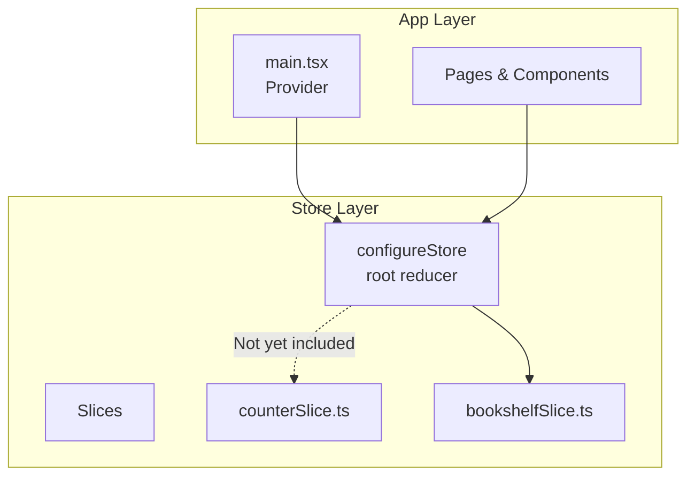
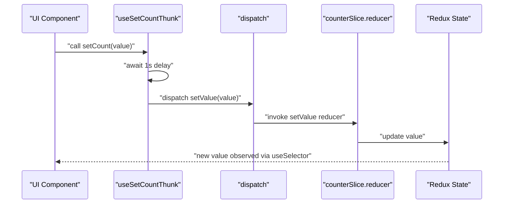
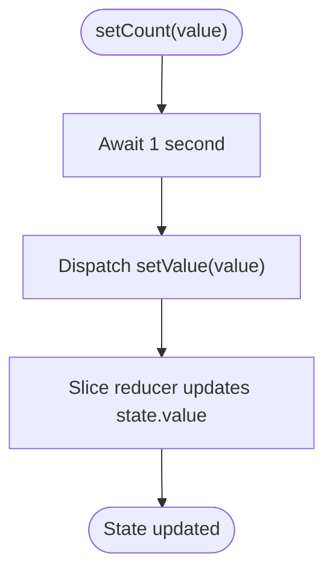
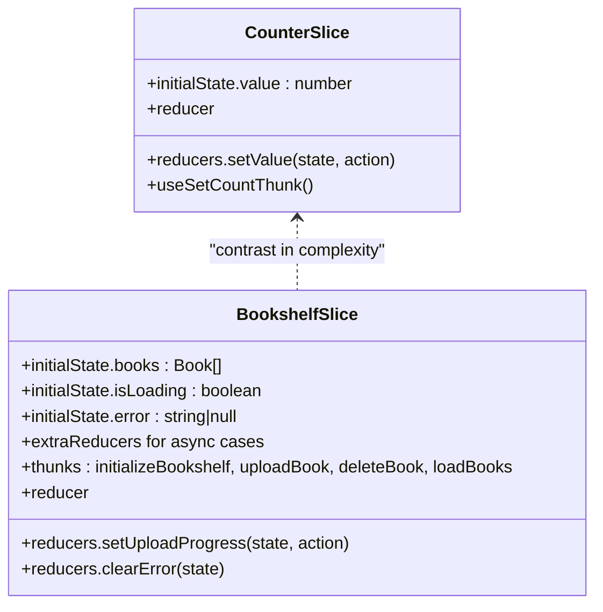
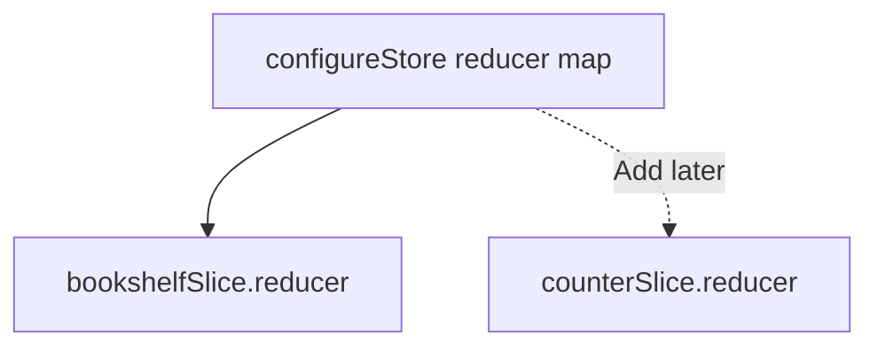
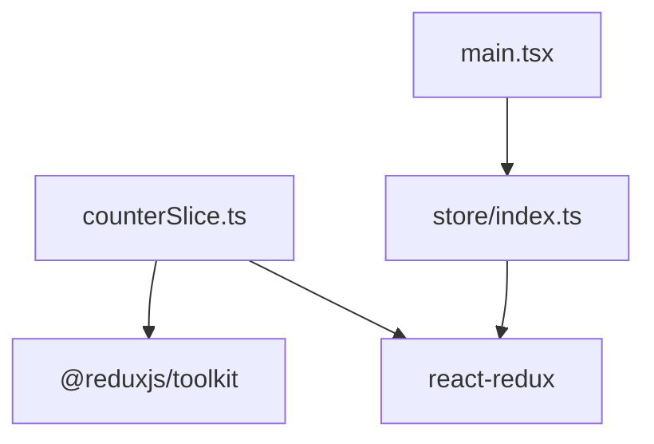

# Counter Slice

<cite>
**Referenced Files in This Document**
- [counterSlice.ts](file://src/store/slices/counterSlice.ts)
- [bookshelfSlice.ts](file://src/store/slices/bookshelfSlice.ts)
- [index.ts](file://src/store/index.ts)
- [main.tsx](file://src/main.tsx)
- [package.json](file://package.json)
</cite>

## Table of Contents
1. [Introduction](#introduction)
2. [Project Structure](#project-structure)
3. [Core Components](#core-components)
4. [Architecture Overview](#architecture-overview)
5. [Detailed Component Analysis](#detailed-component-analysis)
6. [Dependency Analysis](#dependency-analysis)
7. [Performance Considerations](#performance-considerations)
8. [Troubleshooting Guide](#troubleshooting-guide)
9. [Conclusion](#conclusion)
10. [Appendices](#appendices)

## Introduction
This document explains the counterSlice, a minimal Redux Toolkit slice designed for demonstration and testing. It showcases the simplest possible state management pattern: a single numeric value initialized to zero, updated by a straightforward reducer. It also demonstrates a custom hook that encapsulates asynchronous logic with a deliberate delay before dispatching an action. The slice is intentionally simple to contrast with the more complex bookshelfSlice, which uses async thunks and extraReducers for real-world data fetching and mutation workflows.

The counterSlice serves as a learning tool or testing utility rather than a production feature. It illustrates Redux Toolkit fundamentals without the overhead of async flows, making it ideal for teaching basic patterns such as defining a slice, exporting a reducer, and connecting components with useSelector and useDispatch.

## Project Structure
The counterSlice resides under the store’s slices directory and is currently not integrated into the root store. The store configuration defines a root reducer that includes only the bookshelf slice. The application provider wraps the app with the configured store.

**Diagram sources**
- [index.ts](file://src/store/index.ts#L1-L24)
- [main.tsx](file://src/main.tsx#L1-L12)
- [counterSlice.ts](file://src/store/slices/counterSlice.ts#L1-L46)
- [bookshelfSlice.ts](file://src/store/slices/bookshelfSlice.ts#L1-L189)

**Section sources**
- [index.ts](file://src/store/index.ts#L1-L24)
- [main.tsx](file://src/main.tsx#L1-L12)

## Core Components
- Minimal state shape: a single numeric value initialized to zero.
- Reducer: setValue updates the value directly.
- Exported reducer: the slice’s reducer is exported for potential integration.
- Custom hook: useSetCountThunk encapsulates async logic with a 1-second delay and dispatches setValue.

Key characteristics:
- No async thunks or extraReducers.
- No additional state fields beyond the value.
- Intended as a didactic example for simple state updates.

**Section sources**
- [counterSlice.ts](file://src/store/slices/counterSlice.ts#L1-L46)

## Architecture Overview
The counterSlice follows a minimal Redux Toolkit architecture:
- Define a typed state interface.
- Provide an initialState with a single field.
- Create a slice with reducers.
- Export the reducer for store integration.
- Provide a custom hook that performs async work and dispatches an action.

Contrast with bookshelfSlice:
- The bookshelfSlice uses createAsyncThunk for async operations and extraReducers to handle pending/fulfilled/rejected transitions.
- The counterSlice avoids async complexity to keep the example focused on synchronous updates.

**Diagram sources**
- [counterSlice.ts](file://src/store/slices/counterSlice.ts#L1-L46)

## Detailed Component Analysis

### counterSlice.ts
- Purpose: Demonstrate minimal Redux Toolkit usage.
- State shape: A single numeric value.
- Reducer: setValue updates the value from an action payload.
- Exported reducer: Available for integration into the store.
- Custom hook: useSetCountThunk returns a function that delays 1 second and then dispatches setValue.

**Diagram sources**
- [counterSlice.ts](file://src/store/slices/counterSlice.ts#L1-L46)

**Section sources**
- [counterSlice.ts](file://src/store/slices/counterSlice.ts#L1-L46)

### Comparison with bookshelfSlice.ts
- Complexity: The bookshelfSlice manages multiple async operations (initialize, upload, delete, load) and uses extraReducers to reflect loading and error states.
- Patterns: Uses createAsyncThunk and extraReducers to handle lifecycle transitions.
- Scope: Designed for real-world data management; includes validation and error handling.

**Diagram sources**
- [counterSlice.ts](file://src/store/slices/counterSlice.ts#L1-L46)
- [bookshelfSlice.ts](file://src/store/slices/bookshelfSlice.ts#L1-L189)

**Section sources**
- [bookshelfSlice.ts](file://src/store/slices/bookshelfSlice.ts#L1-L189)

### Store Integration Notes
- Current store configuration includes only the bookshelf slice.
- The counterSlice reducer is not yet included in the root reducer.
- To integrate, add the counter reducer to the store’s reducer map and connect components accordingly.

**Diagram sources**
- [index.ts](file://src/store/index.ts#L1-L24)
- [counterSlice.ts](file://src/store/slices/counterSlice.ts#L1-L46)

**Section sources**
- [index.ts](file://src/store/index.ts#L1-L24)

## Dependency Analysis
- Dependencies:
  - @reduxjs/toolkit: createSlice, PayloadAction.
  - react-redux: useDispatch for the custom hook.
- External integrations:
  - The app is wrapped with Provider in main.tsx.
  - The store exposes typed useAppDispatch and useAppSelector hooks.

**Diagram sources**
- [counterSlice.ts](file://src/store/slices/counterSlice.ts#L1-L46)
- [index.ts](file://src/store/index.ts#L1-L24)
- [main.tsx](file://src/main.tsx#L1-L12)
- [package.json](file://package.json#L1-L61)

**Section sources**
- [package.json](file://package.json#L1-L61)
- [index.ts](file://src/store/index.ts#L1-L24)
- [main.tsx](file://src/main.tsx#L1-L12)

## Performance Considerations
- The counterSlice reducer is O(1) for setValue.
- The custom hook introduces a 1-second delay; avoid unnecessary delays in production.
- Prefer batching updates and minimizing re-renders by selecting only necessary state.

## Troubleshooting Guide
- If setValue does not update the UI:
  - Ensure the component is connected with useSelector and subscribes to the correct slice path.
  - Verify the store includes the counter reducer if integrating.
- If the custom hook does not dispatch:
  - Confirm the hook is invoked from a component rendered inside Provider.
  - Check that the store is configured and the reducer is registered.
- If the app crashes on startup:
  - Verify Provider wraps the app and the store is correctly exported.

## Conclusion
The counterSlice exemplifies Redux Toolkit’s minimal capabilities: a simple state shape, a single reducer, and a custom hook for async orchestration. It contrasts sharply with the bookshelfSlice’s async thunk and extraReducers patterns. Use the counterSlice as a learning tool to understand foundational Redux concepts before progressing to more complex workflows.

## Appendices

### Usage Examples (Conceptual)
- Connecting a component:
  - Use useSelector to select the counter value from the store.
  - Use useDispatch to dispatch setValue.
- Custom hook usage:
  - Call the returned function from useSetCountThunk to trigger delayed updates.

Note: These examples describe patterns; refer to the referenced files for the actual implementation locations.

### Best Practices
- Choose simple reducers when state updates are synchronous and local.
- Use async thunks and extraReducers when dealing with network requests, validation, and lifecycle-aware state transitions.
- Keep slices focused and small; introduce complexity only when necessary.