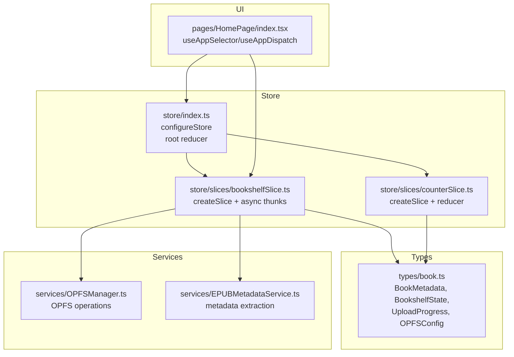
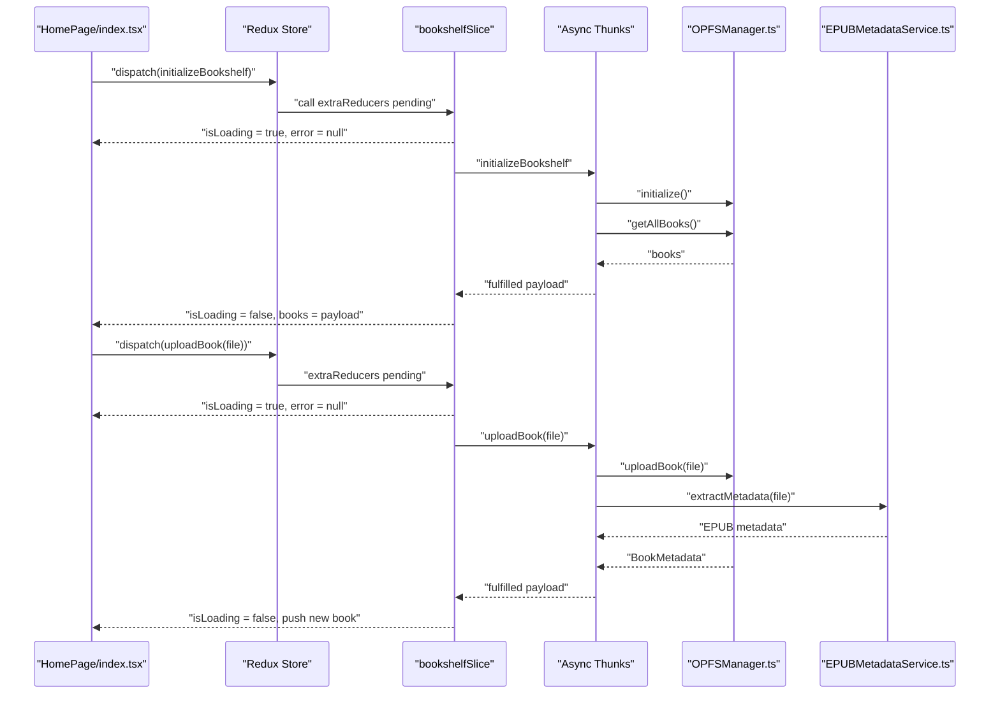
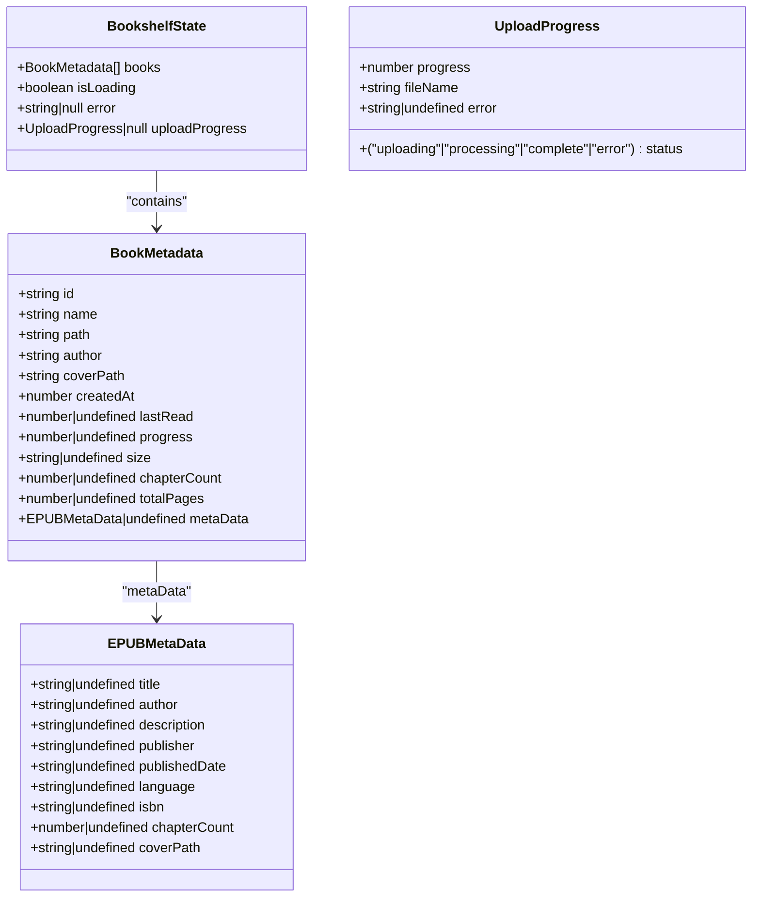
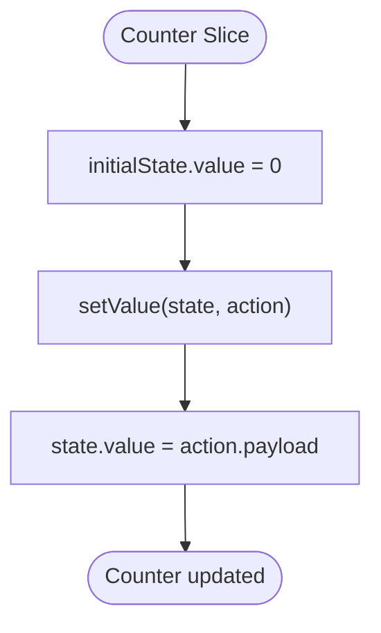
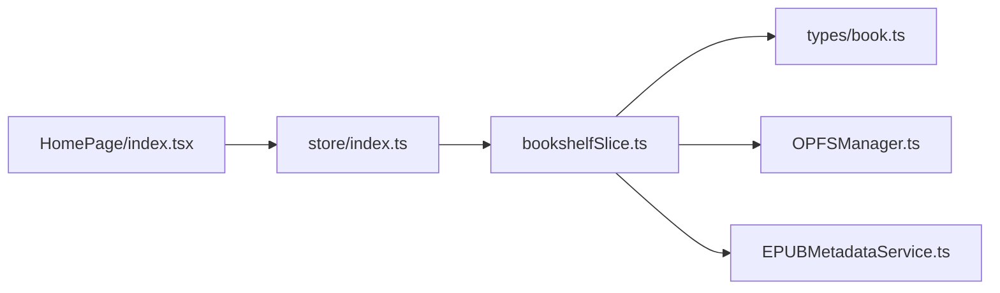

# State Slices

<cite>
**Referenced Files in This Document**
- [bookshelfSlice.ts](file://src/store/slices/bookshelfSlice.ts)
- [counterSlice.ts](file://src/store/slices/counterSlice.ts)
- [index.ts](file://src/store/index.ts)
- [book.ts](file://src/types/book.ts)
- [OPFSManager.ts](file://src/services/OPFSManager.ts)
- [EPUBMetadataService.ts](file://src/services/EPUBMetadataService.ts)
- [HomePage/index.tsx](file://src/pages/HomePage/index.tsx)
</cite>

## Table of Contents
1. [Introduction](#introduction)
2. [Project Structure](#project-structure)
3. [Core Components](#core-components)
4. [Architecture Overview](#architecture-overview)
5. [Detailed Component Analysis](#detailed-component-analysis)
6. [Dependency Analysis](#dependency-analysis)
7. [Performance Considerations](#performance-considerations)
8. [Troubleshooting Guide](#troubleshooting-guide)
9. [Conclusion](#conclusion)

## Introduction
This document explains the Redux slices that manage application state, with a focus on bookshelfSlice as the primary state container for the book library. It details the initialState structure, the createSlice pattern, reducers, async thunks, and integration with services. It contrasts bookshelfSlice with counterSlice to illustrate different state management patterns and discusses domain-specific state organization, normalization of book data, and scalability considerations for adding new slices.

## Project Structure
The state management is organized under a dedicated store module with slices and a central store configuration. The slices encapsulate domain logic for the bookshelf and a minimal counter example. Types define the shape of state and data models. Services handle external operations like OPFS file management and metadata extraction.

**Diagram sources**
- [index.ts](file://src/store/index.ts#L1-L24)
- [bookshelfSlice.ts](file://src/store/slices/bookshelfSlice.ts#L1-L189)
- [counterSlice.ts](file://src/store/slices/counterSlice.ts#L1-L47)
- [book.ts](file://src/types/book.ts#L1-L116)
- [OPFSManager.ts](file://src/services/OPFSManager.ts#L1-L510)
- [EPUBMetadataService.ts](file://src/services/EPUBMetadataService.ts#L1-L177)
- [HomePage/index.tsx](file://src/pages/HomePage/index.tsx#L20-L219)

**Section sources**
- [index.ts](file://src/store/index.ts#L1-L24)
- [bookshelfSlice.ts](file://src/store/slices/bookshelfSlice.ts#L1-L189)
- [counterSlice.ts](file://src/store/slices/counterSlice.ts#L1-L47)
- [book.ts](file://src/types/book.ts#L1-L116)
- [OPFSManager.ts](file://src/services/OPFSManager.ts#L1-L510)
- [EPUBMetadataService.ts](file://src/services/EPUBMetadataService.ts#L1-L177)
- [HomePage/index.tsx](file://src/pages/HomePage/index.tsx#L20-L219)

## Core Components
- bookshelfSlice: Manages the book library state, loading, errors, and upload progress. It defines async thunks for initialization, uploading, deleting, and loading books, and registers reducers for setting upload progress and clearing errors.
- counterSlice: Demonstrates a minimal reducer pattern with a single numeric value and a setter action.
- Store configuration: Registers the bookshelf reducer under the key "bookshelf" and exposes typed hooks for dispatch and selectors.

Key implementation references:
- Slice creation and reducers: [bookshelfSlice.ts](file://src/store/slices/bookshelfSlice.ts#L99-L182)
- Async thunks: [bookshelfSlice.ts](file://src/store/slices/bookshelfSlice.ts#L18-L88)
- Action exports: [bookshelfSlice.ts](file://src/store/slices/bookshelfSlice.ts#L184-L186)
- Reducer export and store registration: [bookshelfSlice.ts](file://src/store/slices/bookshelfSlice.ts#L187-L189), [index.ts](file://src/store/index.ts#L1-L24)
- Counter slice: [counterSlice.ts](file://src/store/slices/counterSlice.ts#L1-L47)

**Section sources**
- [bookshelfSlice.ts](file://src/store/slices/bookshelfSlice.ts#L1-L189)
- [counterSlice.ts](file://src/store/slices/counterSlice.ts#L1-L47)
- [index.ts](file://src/store/index.ts#L1-L24)

## Architecture Overview
The bookshelf state orchestrates domain operations through async thunks that call services. The UI subscribes to state via selectors and dispatches actions/thunks. The store is configured with a single reducer for the bookshelf.

**Diagram sources**
- [HomePage/index.tsx](file://src/pages/HomePage/index.tsx#L20-L219)
- [bookshelfSlice.ts](file://src/store/slices/bookshelfSlice.ts#L18-L188)
- [OPFSManager.ts](file://src/services/OPFSManager.ts#L123-L219)
- [EPUBMetadataService.ts](file://src/services/EPUBMetadataService.ts#L11-L63)

**Section sources**
- [HomePage/index.tsx](file://src/pages/HomePage/index.tsx#L20-L219)
- [bookshelfSlice.ts](file://src/store/slices/bookshelfSlice.ts#L18-L188)
- [OPFSManager.ts](file://src/services/OPFSManager.ts#L123-L219)
- [EPUBMetadataService.ts](file://src/services/EPUBMetadataService.ts#L11-L63)

## Detailed Component Analysis

### bookshelfSlice: Domain-Specific State Management
- initialState: Defines the shape of the bookshelf state with:
  - books: array of normalized BookMetadata
  - isLoading: boolean flag for async operations
  - error: string|null for error messages
  - uploadProgress: UploadProgress|null for upload UI feedback
  - Reference: [book.ts](file://src/types/book.ts#L93-L106)
- Async thunks:
  - initializeBookshelf: validates OPFS support, initializes OPFS, loads books, and returns them.
  - uploadBook: validates file, uploads to OPFS, extracts metadata and cover, updates config, and returns new BookMetadata.
  - deleteBook: removes a book directory and updates config.
  - loadBooks: refreshes the book list from config.
  - References: [bookshelfSlice.ts](file://src/store/slices/bookshelfSlice.ts#L18-L88), [OPFSManager.ts](file://src/services/OPFSManager.ts#L123-L219)
- Reducers:
  - setUploadProgress: updates uploadProgress state.
  - clearError: resets error to null.
  - References: [bookshelfSlice.ts](file://src/store/slices/bookshelfSlice.ts#L102-L111)
- Extra reducers (pending/fulfilled/rejected):
  - Manage loading flags and error propagation for each thunk.
  - References: [bookshelfSlice.ts](file://src/store/slices/bookshelfSlice.ts#L112-L181)
- Normalized book data:
  - BookMetadata consolidates file path, metadata, and derived fields (size, chapterCount, coverPath).
  - References: [book.ts](file://src/types/book.ts#L27-L55)
- Integration with services:
  - OPFSManager handles filesystem operations and config persistence.
  - EPUBMetadataService extracts metadata and cover images.
  - References: [OPFSManager.ts](file://src/services/OPFSManager.ts#L1-L510), [EPUBMetadataService.ts](file://src/services/EPUBMetadataService.ts#L1-L177)

**Diagram sources**
- [book.ts](file://src/types/book.ts#L27-L106)

**Section sources**
- [bookshelfSlice.ts](file://src/store/slices/bookshelfSlice.ts#L1-L189)
- [book.ts](file://src/types/book.ts#L27-L106)
- [OPFSManager.ts](file://src/services/OPFSManager.ts#L123-L219)
- [EPUBMetadataService.ts](file://src/services/EPUBMetadataService.ts#L11-L63)

### counterSlice: Minimal State Pattern
- Purpose: Demonstrates a simple reducer with a single numeric value and a setter action.
- initialState: value = 0
- Reducer: setValue sets the numeric value.
- Exported reducer and a custom hook example for dispatching actions.
- References: [counterSlice.ts](file://src/store/slices/counterSlice.ts#L1-L47)

**Diagram sources**
- [counterSlice.ts](file://src/store/slices/counterSlice.ts#L1-L47)

**Section sources**
- [counterSlice.ts](file://src/store/slices/counterSlice.ts#L1-L47)

### Slice Co-location and Registration
- Co-location: Both slices live under src/store/slices with types in src/types and services in src/services.
- Registration: The store registers the bookshelf reducer under the key "bookshelf".
- References: [index.ts](file://src/store/index.ts#L1-L24), [bookshelfSlice.ts](file://src/store/slices/bookshelfSlice.ts#L187-L189)

**Section sources**
- [index.ts](file://src/store/index.ts#L1-L24)
- [bookshelfSlice.ts](file://src/store/slices/bookshelfSlice.ts#L187-L189)

## Dependency Analysis
- bookshelfSlice depends on:
  - Types for state and data models
  - OPFSManager for filesystem operations
  - EPUBMetadataService for metadata extraction
- UI integration:
  - HomePage selects books, isLoading, and error from the store and dispatches thunks/actions.
- Dependencies are declared in package.json.

**Diagram sources**
- [HomePage/index.tsx](file://src/pages/HomePage/index.tsx#L20-L219)
- [index.ts](file://src/store/index.ts#L1-L24)
- [bookshelfSlice.ts](file://src/store/slices/bookshelfSlice.ts#L1-L189)
- [book.ts](file://src/types/book.ts#L1-L116)
- [OPFSManager.ts](file://src/services/OPFSManager.ts#L1-L510)
- [EPUBMetadataService.ts](file://src/services/EPUBMetadataService.ts#L1-L177)

**Section sources**
- [HomePage/index.tsx](file://src/pages/HomePage/index.tsx#L20-L219)
- [index.ts](file://src/store/index.ts#L1-L24)
- [bookshelfSlice.ts](file://src/store/slices/bookshelfSlice.ts#L1-L189)
- [book.ts](file://src/types/book.ts#L1-L116)
- [OPFSManager.ts](file://src/services/OPFSManager.ts#L1-L510)
- [EPUBMetadataService.ts](file://src/services/EPUBMetadataService.ts#L1-L177)

## Performance Considerations
- Prefer normalized data: Storing BookMetadata in an array allows efficient updates and avoids duplication. See [book.ts](file://src/types/book.ts#L27-L55).
- Minimize re-renders: Use selectors to pick only necessary fields (e.g., books, isLoading, error). See [HomePage/index.tsx](file://src/pages/HomePage/index.tsx#L20-L219).
- Batch updates: Use async thunks to coordinate multiple state changes atomically. See [bookshelfSlice.ts](file://src/store/slices/bookshelfSlice.ts#L112-L181).
- Avoid blocking UI: Keep heavy operations (metadata extraction, file writes) off the main thread; leverage services and thunks. See [OPFSManager.ts](file://src/services/OPFSManager.ts#L123-L219), [EPUBMetadataService.ts](file://src/services/EPUBMetadataService.ts#L11-L63).

[No sources needed since this section provides general guidance]

## Troubleshooting Guide
Common issues and resolutions:
- OPFS not supported: The initialize thunk checks support and returns an error payload; clear the error with clearError. See [bookshelfSlice.ts](file://src/store/slices/bookshelfSlice.ts#L18-L38), [bookshelfSlice.ts](file://src/store/slices/bookshelfSlice.ts#L108-L110).
- Upload failures: Validate file constraints (extension, size) and handle rejection payloads; display error messages and allow retry. See [bookshelfSlice.ts](file://src/store/slices/bookshelfSlice.ts#L40-L56), [OPFSManager.ts](file://src/services/OPFSManager.ts#L123-L140).
- Deletion errors: Ensure bookId is valid and handle rejection payloads; reload books afterward. See [bookshelfSlice.ts](file://src/store/slices/bookshelfSlice.ts#L58-L76), [OPFSManager.ts](file://src/services/OPFSManager.ts#L242-L261).
- Metadata extraction fallback: If metadata extraction fails, defaults are used; verify cover extraction and chapter counts. See [EPUBMetadataService.ts](file://src/services/EPUBMetadataService.ts#L51-L63).

**Section sources**
- [bookshelfSlice.ts](file://src/store/slices/bookshelfSlice.ts#L18-L76)
- [OPFSManager.ts](file://src/services/OPFSManager.ts#L123-L140)
- [EPUBMetadataService.ts](file://src/services/EPUBMetadataService.ts#L51-L63)

## Conclusion
bookshelfSlice exemplifies robust state management for a domain-rich feature by combining normalized data models, async thunks, and explicit loading/error handling. counterSlice illustrates a minimal reducer pattern for simple state. Together, they demonstrate scalable patterns: keep slices focused, colocate types and services, register reducers centrally, and integrate with UI via typed hooks. As the application grows, adopt similar patterns for new slices, normalize domain data, and encapsulate side effects in services.