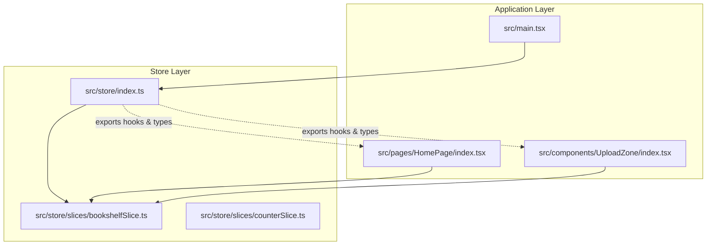
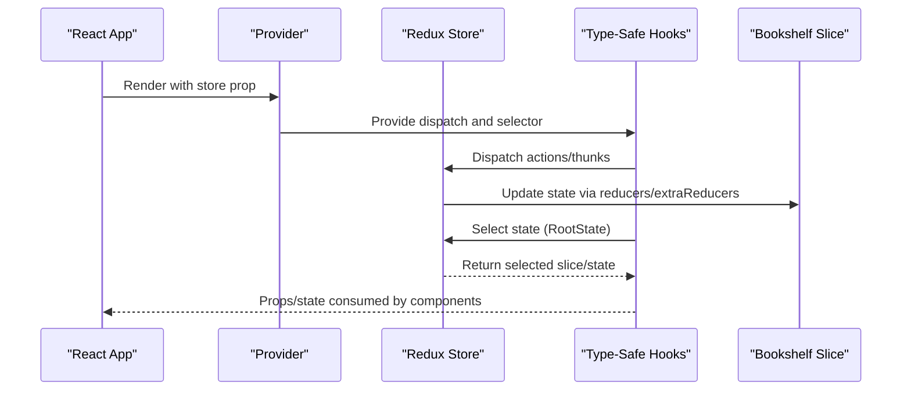
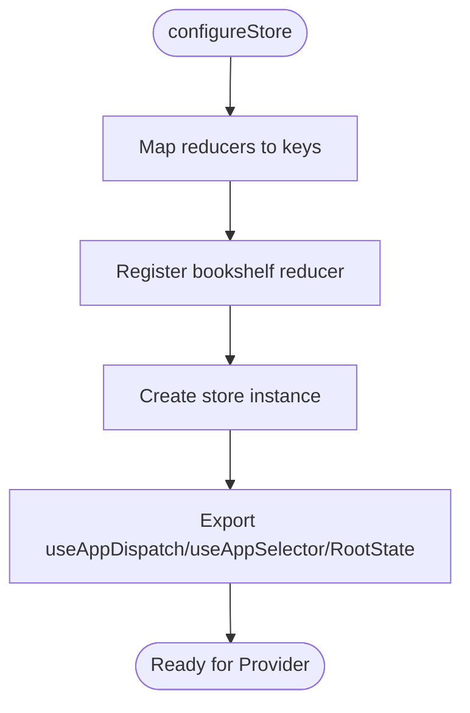
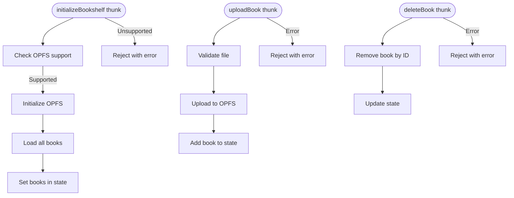
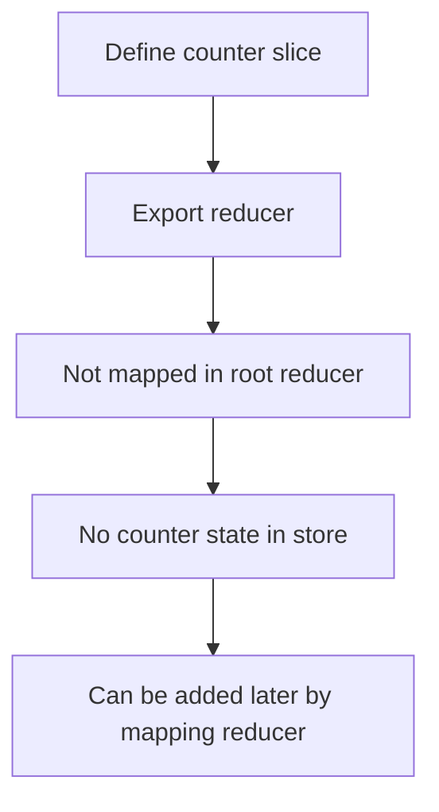
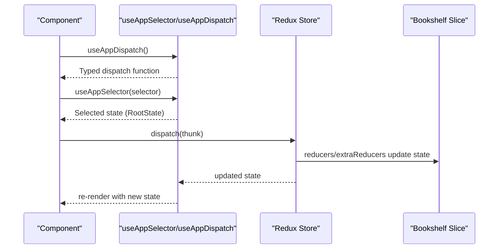
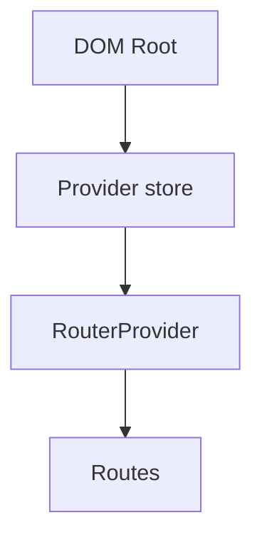
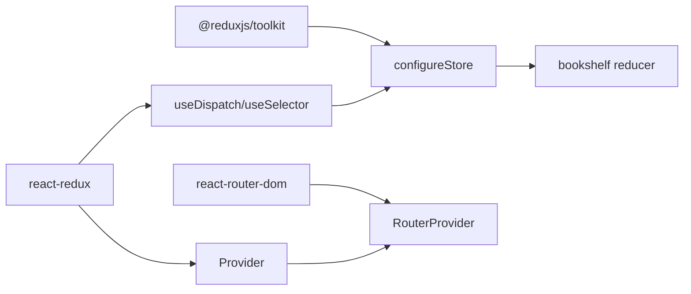

# Store Configuration

<cite>
**Referenced Files in This Document**
- [store/index.ts](file://src/store/index.ts)
- [store/slices/bookshelfSlice.ts](file://src/store/slices/bookshelfSlice.ts)
- [store/slices/counterSlice.ts](file://src/store/slices/counterSlice.ts)
- [types/book.ts](file://src/types/book.ts)
- [main.tsx](file://src/main.tsx)
- [pages/HomePage/index.tsx](file://src/pages/HomePage/index.tsx)
- [components/UploadZone/index.tsx](file://src/components/UploadZone/index.tsx)
- [package.json](file://package.json)
</cite>

## Table of Contents
1. [Introduction](#introduction)
2. [Project Structure](#project-structure)
3. [Core Components](#core-components)
4. [Architecture Overview](#architecture-overview)
5. [Detailed Component Analysis](#detailed-component-analysis)
6. [Dependency Analysis](#dependency-analysis)
7. [Performance Considerations](#performance-considerations)
8. [Troubleshooting Guide](#troubleshooting-guide)
9. [Conclusion](#conclusion)
10. [Appendices](#appendices)

## Introduction
This document explains the Redux store configuration for the project, focusing on how the store is created with a root reducer mapping, how the bookshelf slice is registered, and how type-safe hooks are implemented and exported. It also covers the integration with React Redux, usage examples from the application, and best practices around type safety, store modularity, and tree-shaking. Finally, it clarifies why counterSlice exists but is not included in the store and the implications for feature state management.

## Project Structure
The store is organized under a dedicated folder with a root store file and a slices directory. The slices encapsulate domain-specific state and logic, and the root store wires them into a single Redux store. The application bootstraps the store and provides it to the React tree.

**Diagram sources**
- [store/index.ts](file://src/store/index.ts#L1-L24)
- [store/slices/bookshelfSlice.ts](file://src/store/slices/bookshelfSlice.ts#L1-L189)
- [store/slices/counterSlice.ts](file://src/store/slices/counterSlice.ts#L1-L47)
- [main.tsx](file://src/main.tsx#L1-L13)
- [pages/HomePage/index.tsx](file://src/pages/HomePage/index.tsx#L1-L292)
- [components/UploadZone/index.tsx](file://src/components/UploadZone/index.tsx#L1-L129)

**Section sources**
- [store/index.ts](file://src/store/index.ts#L1-L24)
- [store/slices/bookshelfSlice.ts](file://src/store/slices/bookshelfSlice.ts#L1-L189)
- [store/slices/counterSlice.ts](file://src/store/slices/counterSlice.ts#L1-L47)
- [main.tsx](file://src/main.tsx#L1-L13)

## Core Components
- Root store configuration: Creates the Redux store with a root reducer mapping that registers the bookshelf slice.
- Type-safe hooks: Exposes useAppDispatch and useAppSelector with generic selector support and a RootState type derived from the store’s getState signature.
- Bookshelf slice: Defines reducers, async thunks, and state shape for managing the user’s EPUB library.
- Counter slice: Defined but not included in the store; serves as a potential example or future feature.

Key implementation references:
- Root store creation and reducer mapping: [store/index.ts](file://src/store/index.ts#L1-L24)
- Bookshelf slice definition and exports: [store/slices/bookshelfSlice.ts](file://src/store/slices/bookshelfSlice.ts#L1-L189)
- Counter slice definition: [store/slices/counterSlice.ts](file://src/store/slices/counterSlice.ts#L1-L47)
- Type-safe hooks and RootState: [store/index.ts](file://src/store/index.ts#L14-L24)
- Application bootstrap and Provider wiring: [main.tsx](file://src/main.tsx#L1-L13)

**Section sources**
- [store/index.ts](file://src/store/index.ts#L1-L24)
- [store/slices/bookshelfSlice.ts](file://src/store/slices/bookshelfSlice.ts#L1-L189)
- [store/slices/counterSlice.ts](file://src/store/slices/counterSlice.ts#L1-L47)
- [main.tsx](file://src/main.tsx#L1-L13)

## Architecture Overview
The store is configured using Redux Toolkit’s configureStore with a root reducer that maps to the bookshelf slice. React Redux’s Provider wraps the app to make the store available to components. Components consume type-safe hooks to dispatch actions and select state.

**Diagram sources**
- [main.tsx](file://src/main.tsx#L1-L13)
- [store/index.ts](file://src/store/index.ts#L1-L24)
- [store/slices/bookshelfSlice.ts](file://src/store/slices/bookshelfSlice.ts#L1-L189)

## Detailed Component Analysis

### Root Store Configuration
- Root reducer mapping: The store defines a reducer map with a single key for the bookshelf slice. This establishes the namespace under which the bookshelf state is accessed.
- Store creation: Uses Redux Toolkit’s configureStore with the reducer map.
- Type-safe hooks:
  - useAppDispatch: Typed to the store’s dispatch type, enabling strongly typed dispatch calls.
  - useAppSelector: Generic selector function that accepts a selector returning a value of type T and returns T, with the selector receiving RootState.
  - RootState: Derived from the store’s getState return type, ensuring selectors operate on the correct root state shape.

Implementation references:
- Root reducer mapping and store creation: [store/index.ts](file://src/store/index.ts#L1-L13)
- Type-safe hooks and RootState: [store/index.ts](file://src/store/index.ts#L14-L24)

**Diagram sources**
- [store/index.ts](file://src/store/index.ts#L1-L24)

**Section sources**
- [store/index.ts](file://src/store/index.ts#L1-L24)

### Bookshelf Slice
- Purpose: Manages the user’s EPUB bookshelf, including loading, uploading, deleting, and tracking upload progress.
- Thunks:
  - initializeBookshelf: Initializes OPFS and loads books.
  - uploadBook: Validates and uploads a book to OPFS.
  - deleteBook: Removes a book by ID.
  - loadBooks: Refreshes the list of books.
- Reducers:
  - setUploadProgress: Updates upload progress state.
  - clearError: Clears error messages.
- State shape: Defined by BookshelfState, including books, loading flags, error messages, and upload progress.

Implementation references:
- Slice definition and thunks: [store/slices/bookshelfSlice.ts](file://src/store/slices/bookshelfSlice.ts#L1-L189)
- Bookshelf state interface: [types/book.ts](file://src/types/book.ts#L93-L106)

**Diagram sources**
- [store/slices/bookshelfSlice.ts](file://src/store/slices/bookshelfSlice.ts#L1-L189)
- [types/book.ts](file://src/types/book.ts#L93-L106)

**Section sources**
- [store/slices/bookshelfSlice.ts](file://src/store/slices/bookshelfSlice.ts#L1-L189)
- [types/book.ts](file://src/types/book.ts#L93-L106)

### Counter Slice
- Purpose: Demonstrates a simple slice with a counter value and a thunk that sets the value after a delay.
- Registration: The slice is defined but not included in the root reducer mapping. As a result, its state does not exist in the store, and its actions are not dispatched through the store.

Implications:
- Feature isolation: Keeping unused slices out of the store avoids unnecessary state and improves modularity.
- Future-proofing: The slice can be integrated later by adding it to the reducer map and exporting its actions/selectors as needed.

Implementation references:
- Slice definition: [store/slices/counterSlice.ts](file://src/store/slices/counterSlice.ts#L1-L47)
- Root reducer mapping (no counter): [store/index.ts](file://src/store/index.ts#L1-L13)

**Diagram sources**
- [store/slices/counterSlice.ts](file://src/store/slices/counterSlice.ts#L1-L47)
- [store/index.ts](file://src/store/index.ts#L1-L13)

**Section sources**
- [store/slices/counterSlice.ts](file://src/store/slices/counterSlice.ts#L1-L47)
- [store/index.ts](file://src/store/index.ts#L1-L13)

### Type-Safe Hooks and RootState
- useAppDispatch: Typed to the store’s dispatch type, ensuring dispatch calls are strongly typed.
- useAppSelector: Generic selector that accepts a selector function from RootState to T and returns T, preventing selector mistakes and enabling precise typing.
- RootState: Derived from the store’s getState return type, reflecting the root state shape.

Usage examples:
- Home page consumes bookshelf state and dispatches thunks: [pages/HomePage/index.tsx](file://src/pages/HomePage/index.tsx#L1-L292)
- Upload zone dispatches uploadBook and handles loading state: [components/UploadZone/index.tsx](file://src/components/UploadZone/index.tsx#L1-L129)

Implementation references:
- Hook definitions and RootState: [store/index.ts](file://src/store/index.ts#L14-L24)

**Diagram sources**
- [store/index.ts](file://src/store/index.ts#L14-L24)
- [pages/HomePage/index.tsx](file://src/pages/HomePage/index.tsx#L1-L292)
- [components/UploadZone/index.tsx](file://src/components/UploadZone/index.tsx#L1-L129)
- [store/slices/bookshelfSlice.ts](file://src/store/slices/bookshelfSlice.ts#L1-L189)

**Section sources**
- [store/index.ts](file://src/store/index.ts#L14-L24)
- [pages/HomePage/index.tsx](file://src/pages/HomePage/index.tsx#L1-L292)
- [components/UploadZone/index.tsx](file://src/components/UploadZone/index.tsx#L1-L129)

### React Redux Integration
- Provider: The store is provided to the React application via React Redux’s Provider in the main entry file.
- Router: The RouterProvider wraps the application routes, maintaining routing alongside Redux state.

Implementation references:
- Provider setup: [main.tsx](file://src/main.tsx#L1-L13)

**Diagram sources**
- [main.tsx](file://src/main.tsx#L1-L13)

**Section sources**
- [main.tsx](file://src/main.tsx#L1-L13)

## Dependency Analysis
- External libraries:
  - @reduxjs/toolkit: configureStore, createSlice, createAsyncThunk.
  - react-redux: Provider, useDispatch, useSelector.
  - react-router-dom: RouterProvider.
- Internal dependencies:
  - Root store depends on the bookshelf reducer.
  - Components depend on the store’s hooks and bookshelf slice actions.

Implementation references:
- Dependencies: [package.json](file://package.json#L1-L61)
- Root store and hooks: [store/index.ts](file://src/store/index.ts#L1-L24)
- Bookshelf slice: [store/slices/bookshelfSlice.ts](file://src/store/slices/bookshelfSlice.ts#L1-L189)

**Diagram sources**
- [package.json](file://package.json#L1-L61)
- [store/index.ts](file://src/store/index.ts#L1-L24)
- [store/slices/bookshelfSlice.ts](file://src/store/slices/bookshelfSlice.ts#L1-L189)
- [main.tsx](file://src/main.tsx#L1-L13)

**Section sources**
- [package.json](file://package.json#L1-L61)
- [store/index.ts](file://src/store/index.ts#L1-L24)
- [store/slices/bookshelfSlice.ts](file://src/store/slices/bookshelfSlice.ts#L1-L189)
- [main.tsx](file://src/main.tsx#L1-L13)

## Performance Considerations
- Tree-shaking:
  - Keep reducers and slices modularized under the slices directory. Only include slices in the root reducer that are actively used to minimize bundle size.
  - Avoid importing unused slices or thunks in components; import only what is needed.
- Selector efficiency:
  - Prefer memoized selectors (e.g., createSelector) for complex computations to prevent unnecessary re-renders.
  - Keep selectors shallow and focused on the minimal state needed.
- Async thunks:
  - Use unwrap on dispatched thunks to handle errors cleanly and avoid unhandled promise rejections.
  - Debounce or batch UI updates when dispatching frequent actions.

[No sources needed since this section provides general guidance]

## Troubleshooting Guide
- Missing Provider:
  - Symptoms: Hooks throw errors indicating no store is provided.
  - Resolution: Ensure Provider wraps the application in the main entry file.
  - Reference: [main.tsx](file://src/main.tsx#L1-L13)
- Selector type errors:
  - Symptoms: TypeScript errors when selecting state.
  - Resolution: Use the exported useAppSelector with a selector that operates on RootState.
  - Reference: [store/index.ts](file://src/store/index.ts#L14-L24)
- Thunk errors:
  - Symptoms: Unhandled promise rejections when dispatching thunks.
  - Resolution: Call unwrap on dispatched thunks to surface errors.
  - References: [pages/HomePage/index.tsx](file://src/pages/HomePage/index.tsx#L1-L292), [components/UploadZone/index.tsx](file://src/components/UploadZone/index.tsx#L1-L129)
- Unused slice state:
  - Symptom: Counter state not present in the store.
  - Explanation: The counter slice is not mapped in the root reducer.
  - Reference: [store/index.ts](file://src/store/index.ts#L1-L13), [store/slices/counterSlice.ts](file://src/store/slices/counterSlice.ts#L1-L47)

**Section sources**
- [main.tsx](file://src/main.tsx#L1-L13)
- [store/index.ts](file://src/store/index.ts#L14-L24)
- [pages/HomePage/index.tsx](file://src/pages/HomePage/index.tsx#L1-L292)
- [components/UploadZone/index.tsx](file://src/components/UploadZone/index.tsx#L1-L129)
- [store/slices/counterSlice.ts](file://src/store/slices/counterSlice.ts#L1-L47)

## Conclusion
The store is configured with a clean, modular structure centered on the bookshelf slice. Type-safe hooks ensure strong typing across the application, while the Provider integrates Redux with React Router. The counter slice demonstrates a pattern for future feature inclusion without polluting the current store. Following the outlined best practices will help maintain a scalable, efficient, and type-safe Redux setup.

[No sources needed since this section summarizes without analyzing specific files]

## Appendices

### Best Practices Checklist
- Keep reducers and slices modularized; only include slices in the root reducer that are actively used.
- Use the exported useAppDispatch and useAppSelector with generic selectors operating on RootState.
- Wrap dispatched thunks with unwrap to handle errors consistently.
- Avoid unused imports and keep selectors focused and shallow.
- Consider memoization for complex selectors.

[No sources needed since this section provides general guidance]