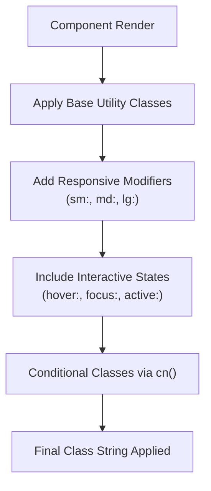

# Styling Strategy

<cite>
**Referenced Files in This Document**   
- [tailwind.config.js](file://tailwind.config.js)
- [src/index.css](file://src/index.css)
- [postcss.config.js](file://postcss.config.js)
- [src/components/BookCard/index.tsx](file://src/components/BookCard/index.tsx)
- [src/components/BookCard/BookCover.tsx](file://src/components/BookCard/BookCover.tsx)
- [src/components/BookCard/BookActions.tsx](file://src/components/BookCard/BookActions.tsx)
- [src/components/BookCard/ProgressBar.tsx](file://src/components/BookCard/ProgressBar.tsx)
- [src/utils/cssUtil.ts](file://src/utils/cssUtil.ts)
</cite>

## Table of Contents
1. [Introduction](#introduction)
2. [TailwindCSS Configuration](#tailwindcss-configuration)
3. [Styling Workflow](#styling-workflow)
4. [Global and Component-Specific Styles](#global-and-component-specific-styles)
5. [Responsive Design and Interactive States](#responsive-design-and-interactive-states)
6. [Dark Mode Implementation](#dark-mode-implementation)
7. [Accessibility and Performance](#accessibility-and-performance)
8. [Component Styling Guidelines](#component-styling-guidelines)
9. [Troubleshooting Common Issues](#troubleshooting-common-issues)

## Introduction
This document outlines the styling strategy for the epub-reader application, focusing on the implementation and usage of TailwindCSS. It covers configuration, workflow, global and component-level styling practices, responsive design patterns, accessibility considerations, and performance optimization. The goal is to ensure consistent, maintainable, and accessible UI development across the codebase.

## TailwindCSS Configuration

The TailwindCSS configuration is defined in `tailwind.config.js` and follows the standard setup for a modern React application. The configuration specifies the content sources where Tailwind should scan for class usage to ensure unused styles are purged in production builds.

The `content` array includes `./index.html` and all files under `./src/**/*.{js,ts,jsx,tsx}`, ensuring comprehensive coverage of JSX and TypeScript files. The theme configuration currently uses default values with no custom extensions, while the plugins array remains empty, indicating no additional Tailwind plugins are currently in use.

PostCSS is configured through `postcss.config.js` to process TailwindCSS and Autoprefixer, enabling automatic vendor prefixing for broader browser compatibility.

**Section sources**
- [tailwind.config.js](file://tailwind.config.js#L1-L8)
- [postcss.config.js](file://postcss.config.js#L1-L6)

## Styling Workflow

The styling workflow leverages TailwindCSS's utility-first approach, where classes are applied directly in JSX to build user interfaces. This eliminates the need for separate CSS files and enables rapid UI development through composition of utility classes.

Prettier is integrated with the `prettier-plugin-tailwindcss` to automatically sort Tailwind classes in a consistent order, improving readability and maintainability. The codebase follows a 2-space indentation convention for JSX and TypeScript files, ensuring consistent formatting across the project.

Utility functions like `cn()` in `src/utils/cssUtil.ts` provide type-safe class name concatenation, allowing conditional classes to be applied while filtering out undefined values.

**Section sources**
- [src/utils/cssUtil.ts](file://src/utils/cssUtil.ts#L1-L8)
- [tailwind.config.js](file://tailwind.config.js#L3-L3)

## Global and Component-Specific Styles

Global styles are managed in `src/index.css`, which serves as the entry point for CSS processing. The file defines base styles for the `:root` element, including font family, line height, font weight, and color scheme support for both light and dark modes.

The CSS file imports Tailwind's base, components, and utilities layers using the `@tailwind` directives. This ensures proper layering of styles, with base styles (normalize.css) applied first, followed by component classes, and finally utility classes that have the highest specificity.

Component-specific styles are handled entirely through Tailwind utility classes applied directly in JSX. This approach promotes consistency and reduces the cognitive load of managing separate CSS files. Components like `BookCard` use utility classes for layout, spacing, typography, and visual effects such as shadows and transitions.

**Section sources**
- [src/index.css](file://src/index.css#L1-L17)
- [src/components/BookCard/index.tsx](file://src/components/BookCard/index.tsx#L48-L50)

## Responsive Design and Interactive States

The application implements responsive design patterns using Tailwind's responsive prefixes. The `BookCard` component demonstrates this approach with utility classes that adapt to different screen sizes, ensuring optimal display across devices.

Interactive states are implemented using Tailwind's state modifiers. The `BookCard` container uses `hover:shadow-lg` to enhance the shadow on hover, providing visual feedback when users interact with the card. Focus states are properly handled through keyboard navigation support, with `tabIndex` and `onKeyDown` handlers enabling accessibility.

The `BookActions` component shows button hover states with `hover:bg-blue-700` for the read button and `hover:bg-red-50 hover:text-red-800` for the delete button, creating a clear visual indication of interactivity.

**Diagram sources**
- [src/components/BookCard/index.tsx](file://src/components/BookCard/index.tsx#L48-L50)
- [src/components/BookCard/BookActions.tsx](file://src/components/BookCard/BookActions.tsx#L33-L42)

**Section sources**
- [src/components/BookCard/index.tsx](file://src/components/BookCard/index.tsx#L48-L50)
- [src/components/BookCard/BookActions.tsx](file://src/components/BookCard/BookActions.tsx#L33-L42)

## Dark Mode Implementation

Dark mode is implemented through the `color-scheme: light dark` declaration in `:root`, which informs the browser that the application supports both color modes. This enables the browser to apply appropriate default styles based on the user's system preferences.

The base background color is set to `#242424` with text color `rgba(255, 255, 255, 0.87)`, providing a dark theme by default. Tailwind's dark mode variant can be used to apply alternative styles when dark mode is active, though specific dark mode classes are not yet implemented in the analyzed components.

The application leverages modern CSS properties like `-webkit-font-smoothing` and `-moz-osx-font-smoothing` to ensure text rendering quality across different operating systems.

**Section sources**
- [src/index.css](file://src/index.css#L5-L7)

## Accessibility and Performance

Accessibility is prioritized in the styling implementation. Interactive elements like the `BookCard` have proper ARIA attributes, including `role="button"` and `aria-label` for screen readers. Keyboard navigation is supported through `tabIndex` and `onKeyDown` handlers, ensuring all users can interact with the interface.

Performance is optimized through Tailwind's PurgeCSS integration, which automatically removes unused CSS classes from the production build. The `content` configuration in `tailwind.config.js` ensures accurate detection of used classes across all source files, minimizing the final CSS bundle size.

The utility-first approach reduces CSS bloat by reusing atomic classes across components, resulting in highly efficient style delivery. Image loading states in components like `BookCover` provide visual feedback during asynchronous operations, enhancing perceived performance.

**Section sources**
- [tailwind.config.js](file://tailwind.config.js#L3-L3)
- [src/components/BookCard/BookCover.tsx](file://src/components/BookCard/BookCover.tsx#L64-L73)

## Component Styling Guidelines

When creating new components, follow these styling guidelines to maintain consistency:

1. Use Tailwind utility classes directly in JSX rather than creating custom CSS
2. Leverage the `cn()` utility for conditional class application
3. Apply responsive prefixes (sm:, md:, lg:) for mobile-first design
4. Include appropriate hover, focus, and active states for interactive elements
5. Use semantic HTML and proper ARIA attributes for accessibility
6. Follow the 2-space indentation convention for JSX formatting
7. Use Prettier with the Tailwind plugin to ensure class order consistency

Components should be designed with reusability in mind, extracting common patterns into separate components as demonstrated by the `BookCard` implementation, which separates concerns into `BookCover`, `ProgressBar`, and `BookActions`.

**Section sources**
- [src/utils/cssUtil.ts](file://src/utils/cssUtil.ts#L6-L8)
- [src/components/BookCard/index.tsx](file://src/components/BookCard/index.tsx#L1-L87)

## Troubleshooting Common Issues

Common TailwindCSS issues and their solutions include:

- **Missing classes in production**: Ensure the file path is included in the `content` array in `tailwind.config.js`. The current configuration covers all necessary files.
- **Specificity conflicts**: Use Tailwind's `!important` modifier (`!modifier`) sparingly, or restructure classes to follow the utility-first principle without relying on custom CSS overrides.
- **Class sorting issues**: Verify Prettier with `prettier-plugin-tailwindcss` is properly configured in the development environment.
- **Responsive classes not working**: Check that the viewport meta tag is present in `index.html` (not shown in provided files but typically required).
- **Dark mode classes not applying**: Ensure the `color-scheme` property is set correctly and that dark mode variants are properly configured in `tailwind.config.js`.

When encountering styling issues, first verify that the class names are correctly spelled and that the file is included in the content configuration. Use browser developer tools to inspect the applied classes and check for any unexpected overrides.

**Section sources**
- [tailwind.config.js](file://tailwind.config.js#L3-L3)
- [postcss.config.js](file://postcss.config.js#L1-L6)