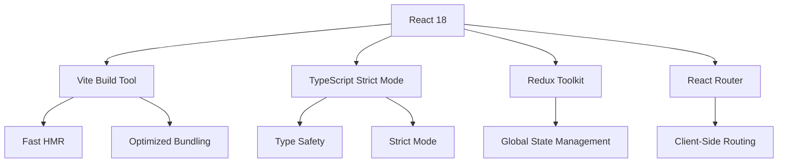
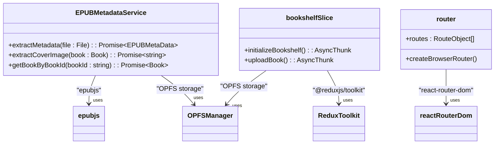
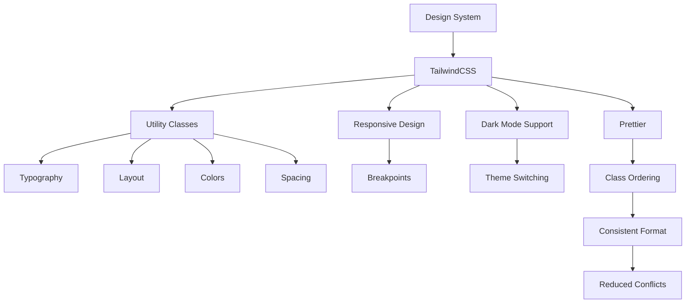
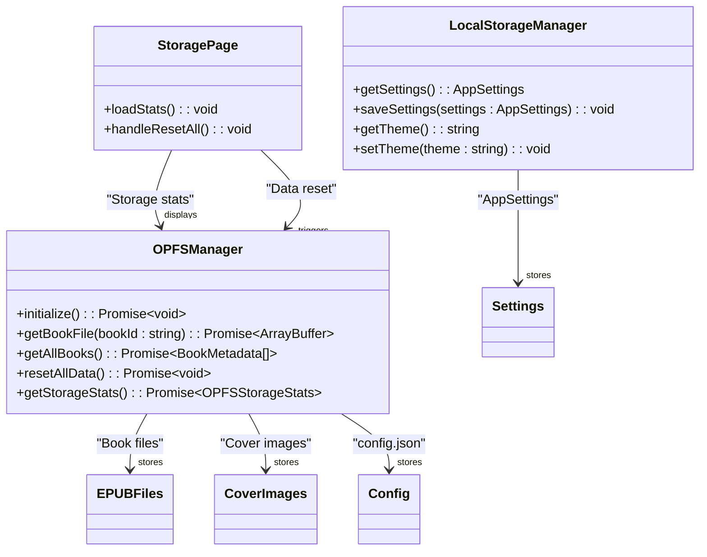
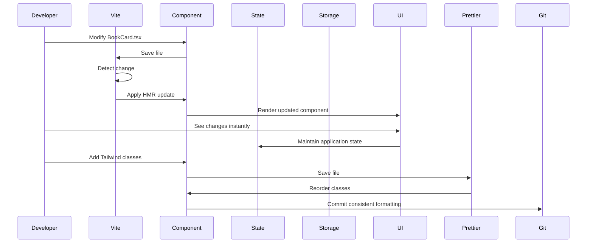

# Technology Stack & Dependencies

<cite>
**Referenced Files in This Document**   
- [package.json](file://package.json)
- [vite.config.ts](file://vite.config.ts)
- [tailwind.config.js](file://tailwind.config.js)
- [eslint.config.js](file://eslint.config.js)
- [tsconfig.json](file://tsconfig.json)
- [main.tsx](file://src/main.tsx)
- [router.tsx](file://src/config/router.tsx)
- [store/index.ts](file://src/store/index.ts)
- [config.ts](file://src/config/config.ts)
- [epub.ts](file://src/constants/epub.ts)
- [fileOperations.ts](file://src/utils/fileOperations.ts)
- [EPUBMetadataService.ts](file://src/services/EPUBMetadataService.ts)
- [bookshelfSlice.ts](file://src/store/slices/bookshelfSlice.ts)
- [book.ts](file://src/types/book.ts)
- [StoragePage.tsx](file://src/pages/SettingsPage/StoragePage.tsx)
- [BookCard/index.tsx](file://src/components/BookCard/index.tsx)
- [BookActions.tsx](file://src/components/BookCard/BookActions.tsx)
- [HomePage/index.tsx](file://src/pages/HomePage/index.tsx)
- [vite-env.d.ts](file://src/vite-env.d.ts)
</cite>

## Table of Contents
1. [Frontend Architecture](#frontend-architecture)
2. [Core Libraries & Frameworks](#core-libraries--frameworks)
3. [Styling & Code Formatting](#styling--code-formatting)
4. [Storage Mechanisms](#storage-mechanisms)
5. [Development Tooling](#development-tooling)
6. [Dependency Management](#dependency-management)
7. [Technology Integration Examples](#technology-integration-examples)
8. [Common Setup Issues](#common-setup-issues)

## Frontend Architecture

The EPUB reader application is built on a modern React 18 foundation with TypeScript strict mode enabled, ensuring type safety and robust development practices. The architecture follows a component-based design pattern with clear separation of concerns between UI components, business logic, and state management.

Vite serves as the build tool, providing an optimized development experience with fast cold starts and instant Hot Module Replacement (HMR). The application leverages React's concurrent features and server-side rendering capabilities through Vite's efficient bundling system. TypeScript configuration is managed through a composite setup with `tsconfig.app.json` and `tsconfig.node.json`, referenced in the root `tsconfig.json`.

The entry point `main.tsx` initializes the React application by creating a root and rendering the provider components for Redux and React Router. This setup ensures that the entire application has access to the global state and routing context.



**Diagram sources**
- [main.tsx](file://src/main.tsx#L1-L13)
- [vite.config.ts](file://vite.config.ts#L1-L23)
- [tsconfig.json](file://tsconfig.json#L1-L8)

**Section sources**
- [main.tsx](file://src/main.tsx#L1-L13)
- [vite.config.ts](file://vite.config.ts#L1-L23)
- [tsconfig.json](file://tsconfig.json#L1-L8)

## Core Libraries & Frameworks

The application relies on several key libraries that provide essential functionality for the EPUB reader. At the core is `epubjs`, which handles EPUB rendering, navigation, and metadata extraction. This library is integrated throughout the application, particularly in the `EpubReader` page and metadata services.

Redux Toolkit manages the global application state, with the store configured in `store/index.ts`. The state includes bookshelf data, reading progress, and application settings. The `bookshelfSlice` implements async thunks for initializing the bookshelf and uploading books, with proper error handling and validation.

React Router enables client-side navigation between different views of the application, including the home page, reader view, and settings pages. The routing configuration in `router.tsx` defines the application's navigation structure with nested routes for the settings section.

The `@dnd-kit` library provides drag-and-drop functionality, particularly useful for reorganizing books or managing reading lists. This is implemented as a collection of modular packages including `@dnd-kit/core`, `@dnd-kit/sortable`, and `@dnd-kit/utilities`.

AI integration is achieved through the OpenAI SDK, which connects to AI services for features like contextual word definitions and translations. This is configured in `config.ts` with predefined prompts for different AI tools.



**Diagram sources**
- [EPUBMetadataService.ts](file://src/services/EPUBMetadataService.ts#L1-L177)
- [bookshelfSlice.ts](file://src/store/slices/bookshelfSlice.ts#L1-L41)
- [router.tsx](file://src/config/router.tsx#L1-L58)

**Section sources**
- [EPUBMetadataService.ts](file://src/services/EPUBMetadataService.ts#L1-L177)
- [bookshelfSlice.ts](file://src/store/slices/bookshelfSlice.ts#L1-L41)
- [router.tsx](file://src/config/router.tsx#L1-L58)
- [config.ts](file://src/config/config.ts#L1-L116)

## Styling & Code Formatting

The application uses TailwindCSS for styling, providing a utility-first approach that enables rapid UI development. The Tailwind configuration in `tailwind.config.js` specifies content sources to ensure all classes are properly scanned and included in the build.

Prettier is integrated with the Tailwind plugin (`prettier-plugin-tailwindcss`) to automatically order Tailwind classes in a consistent, readable format. This ensures that class names are organized logically, improving code maintainability and reducing merge conflicts.

The `BookCard` component demonstrates the styling approach, using Tailwind classes for layout, typography, and interactive states. The component applies responsive grid classes, hover effects, and accessibility features through Tailwind's utility classes.



**Diagram sources**
- [tailwind.config.js](file://tailwind.config.js#L1-L9)
- [BookCard/index.tsx](file://src/components/BookCard/index.tsx#L1-L86)
- [BookActions.tsx](file://src/components/BookCard/BookActions.tsx#L1-L66)

**Section sources**
- [tailwind.config.js](file://tailwind.config.js#L1-L9)
- [BookCard/index.tsx](file://src/components/BookCard/index.tsx#L1-L86)
- [BookActions.tsx](file://src/components/BookCard/BookActions.tsx#L1-L66)

## Storage Mechanisms

The application implements a dual storage strategy using OPFS (Origin Private File System) for book persistence and LocalStorage for user settings. OPFS provides a file system API that allows the application to store EPUB files directly in the browser's private file system, enabling efficient handling of large book files.

The `OPFSManager` service (referenced in multiple files) handles all OPFS operations, including initializing the file system, storing and retrieving books, and managing metadata. The `initializeBookshelf` async thunk in `bookshelfSlice` demonstrates the OPFS initialization process, checking for browser support and loading existing books.

LocalStorage is used for lightweight data such as application settings, theme preferences, and UI state. This separation ensures that large book files don't impact the performance of frequently accessed settings data.

The `StoragePage` component provides a user interface for managing OPFS storage, displaying statistics about cached files and allowing users to reset all local data. This demonstrates the application's transparency about data storage and user control over their content.



**Diagram sources**
- [bookshelfSlice.ts](file://src/store/slices/bookshelfSlice.ts#L1-L41)
- [StoragePage.tsx](file://src/pages/SettingsPage/StoragePage.tsx#L1-L189)
- [EPUBMetadataService.ts](file://src/services/EPUBMetadataService.ts#L1-L177)

**Section sources**
- [bookshelfSlice.ts](file://src/store/slices/bookshelfSlice.ts#L1-L41)
- [StoragePage.tsx](file://src/pages/SettingsPage/StoragePage.tsx#L1-L189)
- [EPUBMetadataService.ts](file://src/services/EPUBMetadataService.ts#L1-L177)

## Development Tooling

The development environment is configured with a comprehensive set of tools to ensure code quality and consistency. ESLint is configured through `eslint.config.js` with TypeScript support, React hooks rules, and Prettier integration. The configuration extends recommended rules from JavaScript, TypeScript, and React ecosystems.

TypeScript is configured with strict mode enabled, providing comprehensive type checking and catching potential bugs at compile time. The project uses a composite configuration with separate files for app and node configurations, allowing different settings for different parts of the application.

Prettier handles code formatting automatically, with the Tailwind plugin ensuring consistent class ordering. This combination eliminates style debates and ensures a uniform codebase across the team.

Vite's development server provides fast hot module replacement, allowing developers to see changes instantly without full page reloads. The configuration in `vite.config.ts` includes React plugin support and path aliases (using `@` for `src` directory), improving import readability.

```mermaid
graph TD
A[Development Tooling] --> B[ESLint]
A --> C[TypeScript]
A --> D[Prettier]
A --> E[Vite]
B --> F[Code Quality]
B --> G[Error Detection]
C --> H[Type Safety]
C --> I[Strict Mode]
D --> J[Code Formatting]
D --> K[Class Ordering]
E --> L[Fast HMR]
E --> M[Optimized Builds]
B --> D : "Prettier integration"
C --> B : "TypeScript ESLint"
E --> B : "Vite ESLint plugin"
E --> C : "TypeScript support"
E --> D : "Prettier integration"
```

**Diagram sources**
- [eslint.config.js](file://eslint.config.js#L1-L39)
- [tsconfig.json](file://tsconfig.json#L1-L8)
- [vite.config.ts](file://vite.config.ts#L1-L23)
- [tailwind.config.js](file://tailwind.config.js#L1-L9)

**Section sources**
- [eslint.config.js](file://eslint.config.js#L1-L39)
- [tsconfig.json](file://tsconfig.json#L1-L8)
- [vite.config.ts](file://vite.config.ts#L1-L23)

## Dependency Management

The project uses pnpm as the preferred package manager, as indicated by the dependency versions in `package.json`. pnpm offers several advantages over other package managers, including disk space efficiency through hard linking, a strict dependency resolution algorithm that prevents phantom dependencies, and improved installation performance.

The `package.json` file lists all dependencies with specific versions, including React 18.3.1, epubjs 0.3.93, and Redux Toolkit 2.3.0. Development dependencies include Vite 5.4.8, TypeScript 5.5.3, and ESLint 9.11.1, representing a modern, up-to-date toolchain.

The dependency strategy follows a principle of minimalism, including only essential libraries for the application's functionality. Core dependencies are carefully selected for their maturity, maintenance status, and compatibility with the rest of the stack.

```mermaid
graph TD
    "react" --> "react-dom"
    "react" --> "react-router-dom"
    "react" --> "react-redux"
    "react" --> "@reduxjs/toolkit"
    "react" --> "@dnd-kit/core"
    "react" --> "epubjs"
    "react" --> "openai"
    "vite" --> "@vitejs/plugin-react"
    "typescript" --> "@typescript-eslint/parser"
    "eslint" --> "eslint-plugin-react-hooks"
    "eslint" --> "eslint-plugin-prettier"
    "prettier" --> "prettier-plugin-tailwindcss"
    "tailwindcss" --> "autoprefixer"
    "postcss" --> "tailwindcss"
```

**Diagram sources**
- [package.json](file://package.json#L1-L61)

**Section sources**
- [package.json](file://package.json#L1-L61)

## Technology Integration Examples

The technologies in this stack work together seamlessly to create a cohesive development and user experience. For example, when a user uploads an EPUB file, multiple technologies integrate to handle the process:

1. The `UploadZone` component captures the file input
2. `fileOperations.ts` handles the file with proper error handling
3. `EPUBMetadataService` extracts metadata using epubjs
4. The book is stored in OPFS through `OPFSManager`
5. Redux updates the bookshelf state
6. TailwindCSS styles the upload feedback

Vite enables fast HMR during development, allowing developers to modify components like `BookCard` and see changes instantly. When a developer saves changes to the `BookCard` component, Vite's HMR system updates only the changed module without a full page reload, preserving application state.

The styling workflow combines TailwindCSS with Prettier: developers can write utility classes in any order, and Prettier automatically reorders them according to the Tailwind sorting rules. This ensures consistency across the codebase while maintaining developer productivity.



**Diagram sources**
- [BookCard/index.tsx](file://src/components/BookCard/index.tsx#L1-L86)
- [vite.config.ts](file://vite.config.ts#L1-L23)
- [tailwind.config.js](file://tailwind.config.js#L1-L9)
- [eslint.config.js](file://eslint.config.js#L1-L39)

**Section sources**
- [BookCard/index.tsx](file://src/components/BookCard/index.tsx#L1-L86)
- [vite.config.ts](file://vite.config.ts#L1-L23)
- [tailwind.config.js](file://tailwind.config.js#L1-L9)

## Common Setup Issues

Several common setup issues may arise when working with this technology stack:

**OPFS Support Issues**: The application relies on OPFS for book storage, which is only supported in Chromium-based browsers. Users of Firefox or Safari will experience limited functionality. The `StoragePage` component includes appropriate error messaging when OPFS is not supported.

**TypeScript Configuration**: The composite tsconfig setup requires both `tsconfig.app.json` and `tsconfig.node.json` to be properly configured. Missing references in the root `tsconfig.json` can lead to type resolution issues.

**Vite Alias Configuration**: The `@` alias for the `src` directory must be properly configured in `vite.config.ts` and potentially in TypeScript configuration for IDE support. Without proper setup, imports using the alias will not resolve.

**ESLint-Prettier Conflicts**: With multiple formatting tools, configuration conflicts can occur. The current setup resolves this by using `eslint-config-prettier` to disable ESLint rules that conflict with Prettier and `eslint-plugin-prettier` to run Prettier as an ESLint rule.

**Dependency Version Conflicts**: As shown in `package.json`, the project uses specific versions of libraries. Upgrading dependencies without testing can lead to compatibility issues, particularly between React 18 and its ecosystem libraries.

**Build Script Issues**: The build process runs `tsc -b && vite build`, which first builds TypeScript references and then runs Vite. Issues with the TypeScript build can prevent the Vite build from executing, requiring developers to check TypeScript errors first.

**Section sources**
- [package.json](file://package.json#L1-L61)
- [vite.config.ts](file://vite.config.ts#L1-L23)
- [tsconfig.json](file://tsconfig.json#L1-L8)
- [eslint.config.js](file://eslint.config.js#L1-L39)
- [StoragePage.tsx](file://src/pages/SettingsPage/StoragePage.tsx#L1-L189)