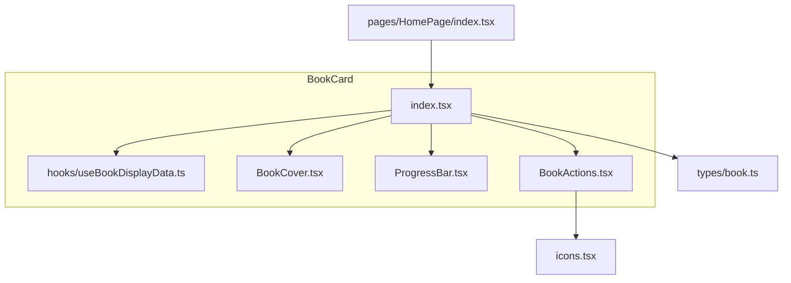
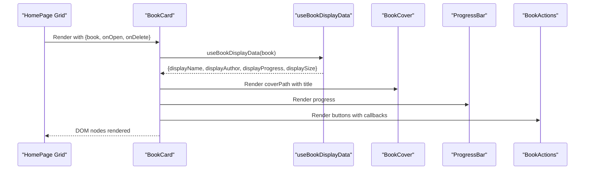
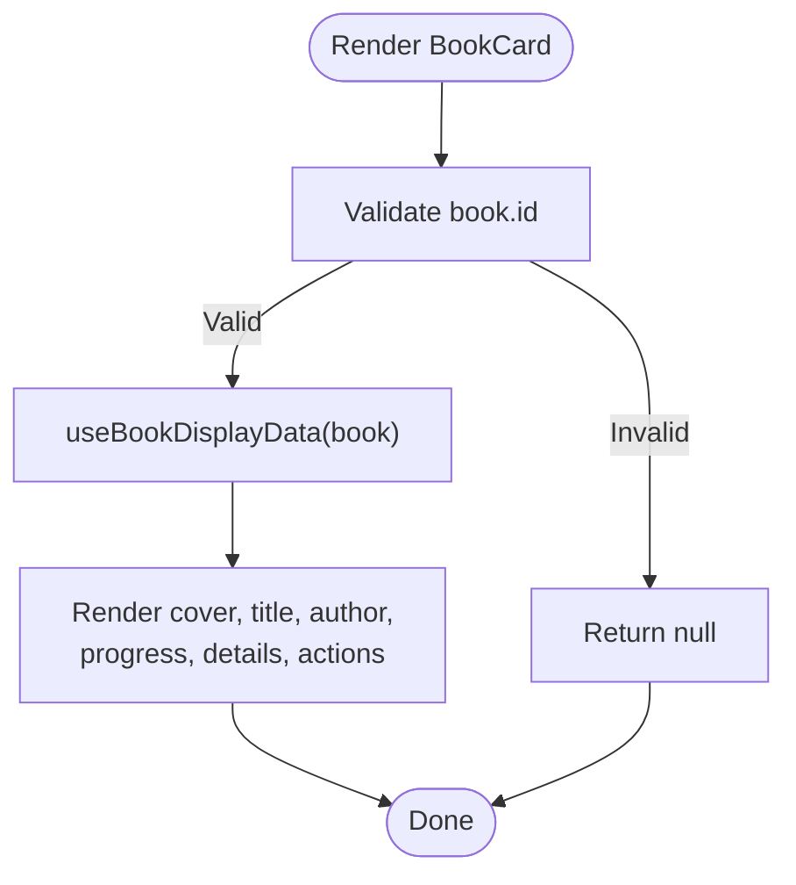
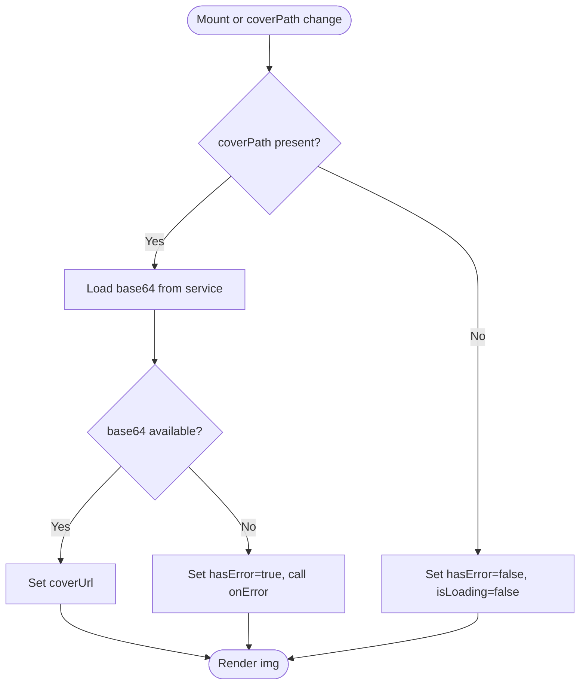
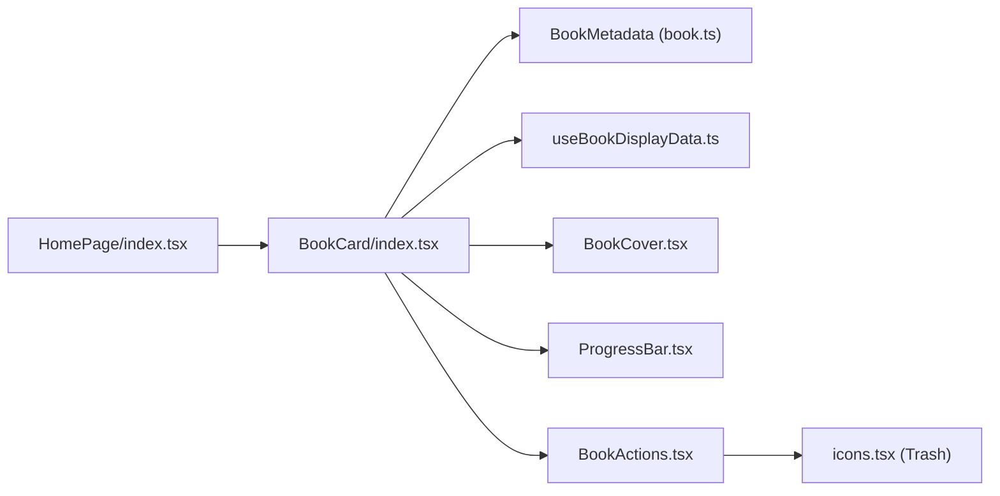
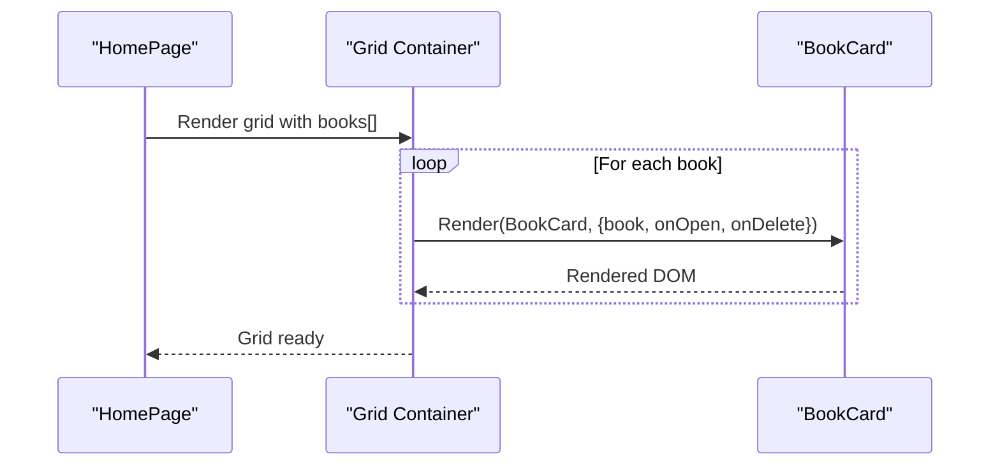

# BookCard

<cite>
**Referenced Files in This Document**
- [index.tsx](file://src/components/BookCard/index.tsx)
- [useBookDisplayData.ts](file://src/components/BookCard/hooks/useBookDisplayData.ts)
- [BookCover.tsx](file://src/components/BookCard/BookCover.tsx)
- [ProgressBar.tsx](file://src/components/BookCard/ProgressBar.tsx)
- [BookActions.tsx](file://src/components/BookCard/BookActions.tsx)
- [book.ts](file://src/types/book.ts)
- [icons.tsx](file://src/components/icons.tsx)
- [index.tsx](file://src/pages/HomePage/index.tsx)
</cite>

## Table of Contents
1. [Introduction](#introduction)
2. [Project Structure](#project-structure)
3. [Core Components](#core-components)
4. [Architecture Overview](#architecture-overview)
5. [Detailed Component Analysis](#detailed-component-analysis)
6. [Dependency Analysis](#dependency-analysis)
7. [Performance Considerations](#performance-considerations)
8. [Troubleshooting Guide](#troubleshooting-guide)
9. [Conclusion](#conclusion)
10. [Appendices](#appendices)

## Introduction
BookCard renders a single book’s metadata and reading progress in the bookshelf grid. It composes smaller, focused components for cover, progress, and actions, and exposes callbacks for opening and deleting a book. It also includes accessibility features for keyboard navigation and ARIA labeling.

## Project Structure
BookCard lives under src/components/BookCard and is composed of:
- index.tsx: Main component that orchestrates rendering and event handling
- hooks/useBookDisplayData.ts: Hook to normalize and provide safe display values
- BookCover.tsx: Renders the cover with loading and error states
- ProgressBar.tsx: Renders reading progress with accessible ARIA attributes
- BookActions.tsx: Renders Read/Delete buttons with consistent styling and ARIA labels

**Diagram sources**
- [index.tsx](file://src/components/BookCard/index.tsx#L1-L86)
- [useBookDisplayData.ts](file://src/components/BookCard/hooks/useBookDisplayData.ts#L1-L33)
- [BookCover.tsx](file://src/components/BookCard/BookCover.tsx#L1-L109)
- [ProgressBar.tsx](file://src/components/BookCard/ProgressBar.tsx#L1-L60)
- [BookActions.tsx](file://src/components/BookCard/BookActions.tsx#L1-L67)
- [book.ts](file://src/types/book.ts#L30-L55)
- [icons.tsx](file://src/components/icons.tsx#L96-L106)
- [index.tsx](file://src/pages/HomePage/index.tsx#L273-L283)

**Section sources**
- [index.tsx](file://src/components/BookCard/index.tsx#L1-L86)
- [book.ts](file://src/types/book.ts#L30-L55)
- [index.tsx](file://src/pages/HomePage/index.tsx#L273-L283)

## Core Components
- BookCard: Renders a single book card with cover, title, author, progress, details, and action buttons. It validates input, delegates display formatting to a hook, and wires up callbacks for open/delete.
- useBookDisplayData: Normalizes book metadata into safe display values with fallbacks.
- BookCover: Loads and displays a cover image with loading and error placeholders.
- ProgressBar: Renders a progress bar with optional percentage text and ARIA attributes.
- BookActions: Renders Read and Delete buttons with consistent styling and ARIA labels.

**Section sources**
- [index.tsx](file://src/components/BookCard/index.tsx#L1-L86)
- [useBookDisplayData.ts](file://src/components/BookCard/hooks/useBookDisplayData.ts#L1-L33)
- [BookCover.tsx](file://src/components/BookCard/BookCover.tsx#L1-L109)
- [ProgressBar.tsx](file://src/components/BookCard/ProgressBar.tsx#L1-L60)
- [BookActions.tsx](file://src/components/BookCard/BookActions.tsx#L1-L67)

## Architecture Overview
BookCard is a composition of small, reusable components. It receives book metadata and callbacks, formats display values, and delegates UI concerns to specialized components. The HomePage grid renders multiple BookCards in a responsive grid layout.

**Diagram sources**
- [index.tsx](file://src/pages/HomePage/index.tsx#L273-L283)
- [index.tsx](file://src/components/BookCard/index.tsx#L1-L86)
- [useBookDisplayData.ts](file://src/components/BookCard/hooks/useBookDisplayData.ts#L1-L33)
- [BookCover.tsx](file://src/components/BookCard/BookCover.tsx#L1-L109)
- [ProgressBar.tsx](file://src/components/BookCard/ProgressBar.tsx#L1-L60)
- [BookActions.tsx](file://src/components/BookCard/BookActions.tsx#L1-L67)

## Detailed Component Analysis

### BookCard
- Purpose: Single book tile in the bookshelf grid.
- Props:
  - book: BookMetadata
  - onOpen: (bookId: string) => void
  - onDelete: (bookId: string) => void
- Behavior:
  - Validates input and returns early if book is missing an id.
  - Uses useBookDisplayData to compute displayName, displayAuthor, displayProgress, displaySize.
  - Renders cover, title, author, progress bar, details, and action buttons.
  - Provides keyboard accessibility via role="button", tabIndex, and Enter/Space handling.
  - Delegates click to onOpen; delete click stops propagation and calls onDelete.
- Accessibility:
  - Role "button" and tabIndex 0 for keyboard activation.
  - ARIA label describing the action.
  - Buttons have aria-labels.

**Diagram sources**
- [index.tsx](file://src/components/BookCard/index.tsx#L1-L86)
- [useBookDisplayData.ts](file://src/components/BookCard/hooks/useBookDisplayData.ts#L1-L33)

**Section sources**
- [index.tsx](file://src/components/BookCard/index.tsx#L1-L86)
- [book.ts](file://src/types/book.ts#L30-L55)

### useBookDisplayData
- Purpose: Normalize and provide safe fallbacks for display values.
- Inputs: BookMetadata
- Outputs: displayName, displayAuthor, displayProgress, displaySize
- Edge cases: Returns safe defaults if book is missing or null.

**Section sources**
- [useBookDisplayData.ts](file://src/components/BookCard/hooks/useBookDisplayData.ts#L1-L33)
- [book.ts](file://src/types/book.ts#L30-L55)

### BookCover
- Purpose: Load and display a book cover with robust error handling.
- Props:
  - coverPath?: string
  - title: string
  - onError?: () => void
  - className?: string
- Behavior:
  - Loads cover via service and sets base64 URL.
  - Shows loading skeleton while fetching.
  - Falls back to gradient placeholder with title if loading fails.
  - Handles img onError to switch to placeholder and invoke onError callback.
- Accessibility:
  - Uses alt text from title.

**Diagram sources**
- [BookCover.tsx](file://src/components/BookCard/BookCover.tsx#L1-L109)

**Section sources**
- [BookCover.tsx](file://src/components/BookCard/BookCover.tsx#L1-L109)

### ProgressBar
- Purpose: Visualize reading progress with optional percentage text.
- Props:
  - progress: number (0–100)
  - className?: string
  - showPercentage?: boolean
  - color?: string
- Behavior:
  - Validates progress range; warns and returns null if invalid.
  - Hides progress when progress is zero.
  - Renders progress bar with ARIA attributes for screen readers.

**Section sources**
- [ProgressBar.tsx](file://src/components/BookCard/ProgressBar.tsx#L1-L60)

### BookActions
- Purpose: Render Read and Delete action buttons.
- Props:
  - onRead: () => void
  - onDelete: (e: React.MouseEvent) => void
  - className?: string
  - disabled?: boolean
- Behavior:
  - Validates callbacks are functions; logs error and returns null otherwise.
  - Renders styled buttons with disabled states and ARIA labels.
  - Delete button uses Trash icon.

**Section sources**
- [BookActions.tsx](file://src/components/BookCard/BookActions.tsx#L1-L67)
- [icons.tsx](file://src/components/icons.tsx#L96-L106)

## Dependency Analysis
- BookCard depends on:
  - BookMetadata type for shape and fields
  - useBookDisplayData for safe display values
  - BookCover, ProgressBar, BookActions for UI composition
- BookActions depends on Trash icon from icons.tsx
- HomePage grid composes multiple BookCards and passes callbacks

**Diagram sources**
- [index.tsx](file://src/components/BookCard/index.tsx#L1-L86)
- [book.ts](file://src/types/book.ts#L30-L55)
- [useBookDisplayData.ts](file://src/components/BookCard/hooks/useBookDisplayData.ts#L1-L33)
- [BookCover.tsx](file://src/components/BookCard/BookCover.tsx#L1-L109)
- [ProgressBar.tsx](file://src/components/BookCard/ProgressBar.tsx#L1-L60)
- [BookActions.tsx](file://src/components/BookCard/BookActions.tsx#L1-L67)
- [icons.tsx](file://src/components/icons.tsx#L96-L106)
- [index.tsx](file://src/pages/HomePage/index.tsx#L273-L283)

**Section sources**
- [index.tsx](file://src/components/BookCard/index.tsx#L1-L86)
- [book.ts](file://src/types/book.ts#L30-L55)
- [index.tsx](file://src/pages/HomePage/index.tsx#L273-L283)

## Performance Considerations
- Rendering large collections:
  - Use virtualization or pagination to limit DOM nodes when the bookshelf grows large.
  - Memoize derived values (e.g., display values) to avoid re-computation on re-renders.
  - Lazy-load images by deferring coverPath until the card is near viewport.
  - Avoid unnecessary re-renders by passing stable callbacks and memoized props.
- Image loading:
  - BookCover already handles loading and error states; ensure onError is used to track failures and retry if needed.
- Accessibility:
  - Keep role and tabIndex minimal; only add interactive roles where necessary.
- CSS:
  - Prefer Tailwind utilities for consistent styles; avoid heavy inline styles.

[No sources needed since this section provides general guidance]

## Troubleshooting Guide
- Invalid book data:
  - If book is null or lacks id, BookCard returns null early. Ensure callers guard against empty data before rendering.
- Cover loading errors:
  - BookCover falls back to a placeholder and invokes onError. Use this callback to log or retry.
  - If the image tag throws an error, BookCover switches to the placeholder and calls onError.
- Progress out of range:
  - ProgressBar validates progress is a number between 0 and 100. If invalid, it logs a warning and does not render.
- Action callbacks:
  - BookActions validates that onRead and onDelete are functions. If not, it logs an error and returns null.

**Section sources**
- [index.tsx](file://src/components/BookCard/index.tsx#L23-L44)
- [BookCover.tsx](file://src/components/BookCard/BookCover.tsx#L37-L60)
- [BookCover.tsx](file://src/components/BookCard/BookCover.tsx#L93-L108)
- [ProgressBar.tsx](file://src/components/BookCard/ProgressBar.tsx#L24-L28)
- [BookActions.tsx](file://src/components/BookCard/BookActions.tsx#L25-L29)

## Conclusion
BookCard is a modular, accessible, and resilient component that renders a single book tile in the bookshelf. It delegates UI concerns to specialized subcomponents, normalizes display data, and provides robust error handling and accessibility features. Integrate it into grids as shown in HomePage, and apply performance strategies for large collections.

[No sources needed since this section summarizes without analyzing specific files]

## Appendices

### Props Reference
- BookCard props:
  - book: BookMetadata
  - onOpen: (bookId: string) => void
  - onDelete: (bookId: string) => void

- useBookDisplayData:
  - Input: BookMetadata
  - Output: { displayName, displayAuthor, displayProgress, displaySize }

- BookCover props:
  - coverPath?: string
  - title: string
  - onError?: () => void
  - className?: string

- ProgressBar props:
  - progress: number
  - className?: string
  - showPercentage?: boolean
  - color?: string

- BookActions props:
  - onRead: () => void
  - onDelete: (e: React.MouseEvent) => void
  - className?: string
  - disabled?: boolean

**Section sources**
- [index.tsx](file://src/components/BookCard/index.tsx#L8-L15)
- [useBookDisplayData.ts](file://src/components/BookCard/hooks/useBookDisplayData.ts#L8-L32)
- [BookCover.tsx](file://src/components/BookCard/BookCover.tsx#L4-L13)
- [ProgressBar.tsx](file://src/components/BookCard/ProgressBar.tsx#L3-L12)
- [BookActions.tsx](file://src/components/BookCard/BookActions.tsx#L4-L13)

### Usage Example: Integrating BookCard in a Bookshelf Grid
- Render a responsive grid and map over books, passing onOpen and onDelete callbacks.

**Diagram sources**
- [index.tsx](file://src/pages/HomePage/index.tsx#L273-L283)
- [index.tsx](file://src/components/BookCard/index.tsx#L1-L86)

**Section sources**
- [index.tsx](file://src/pages/HomePage/index.tsx#L273-L283)

### Accessibility Features
- Keyboard navigation:
  - BookCard is focusable and triggers onOpen on Enter or Space.
- ARIA:
  - BookCard has role="button" and aria-label describing the action.
  - ProgressBar includes ARIA attributes for progress.
  - BookActions buttons include aria-labels.

**Section sources**
- [index.tsx](file://src/components/BookCard/index.tsx#L47-L59)
- [ProgressBar.tsx](file://src/components/BookCard/ProgressBar.tsx#L46-L56)
- [BookActions.tsx](file://src/components/BookCard/BookActions.tsx#L47-L61)

### Styling Guidelines with TailwindCSS
- Use consistent spacing and typography classes for title, author, and details.
- Apply rounded corners, shadows, and transitions for cards.
- Use color utilities for progress bar and button states.
- Keep hover and focus states accessible and visible.

[No sources needed since this section provides general guidance]