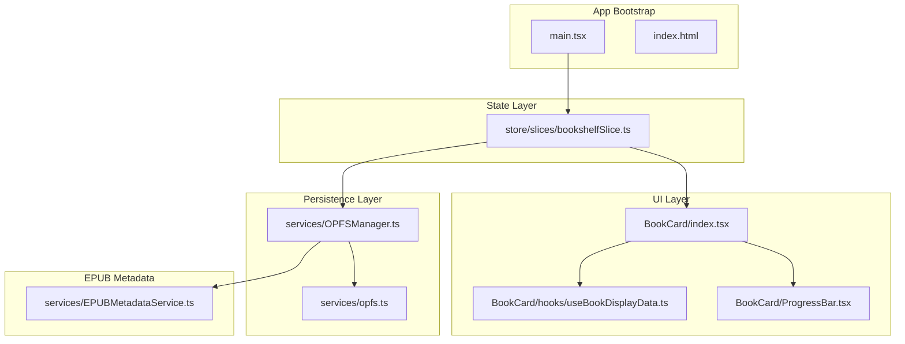
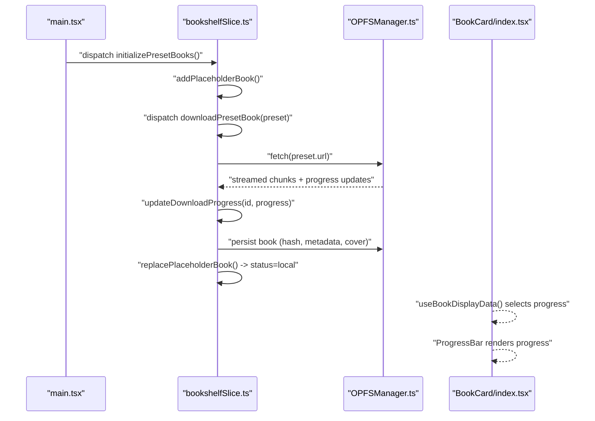
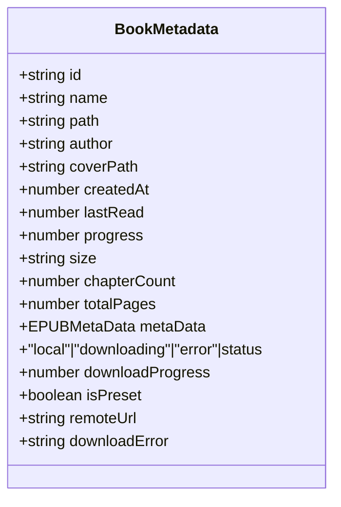
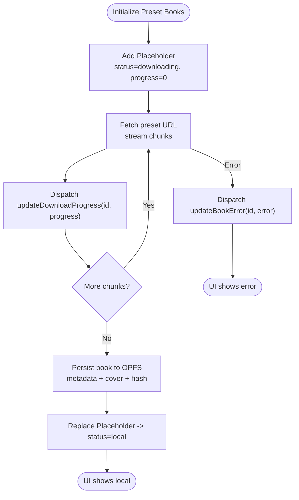
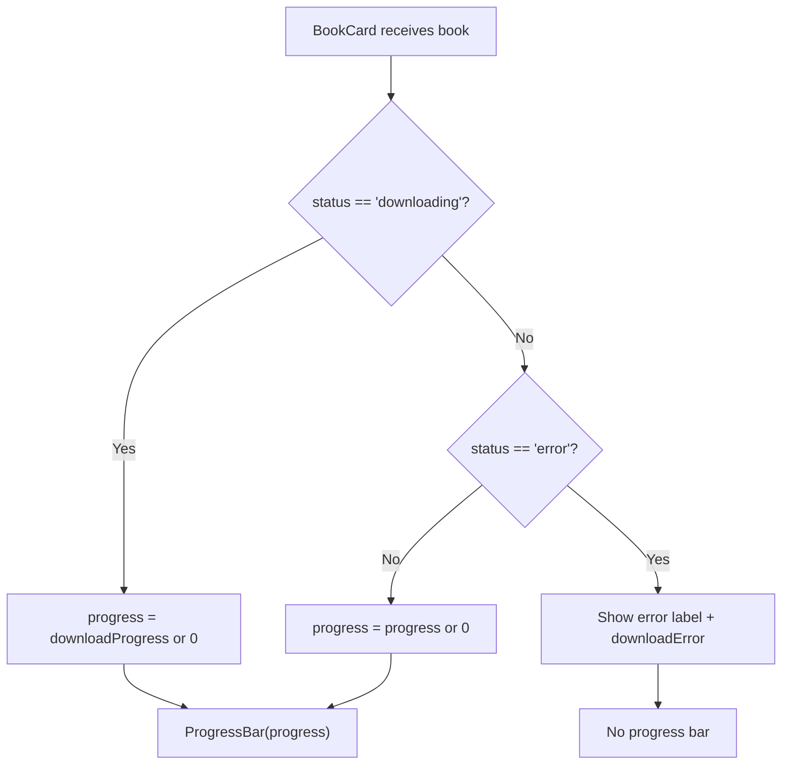
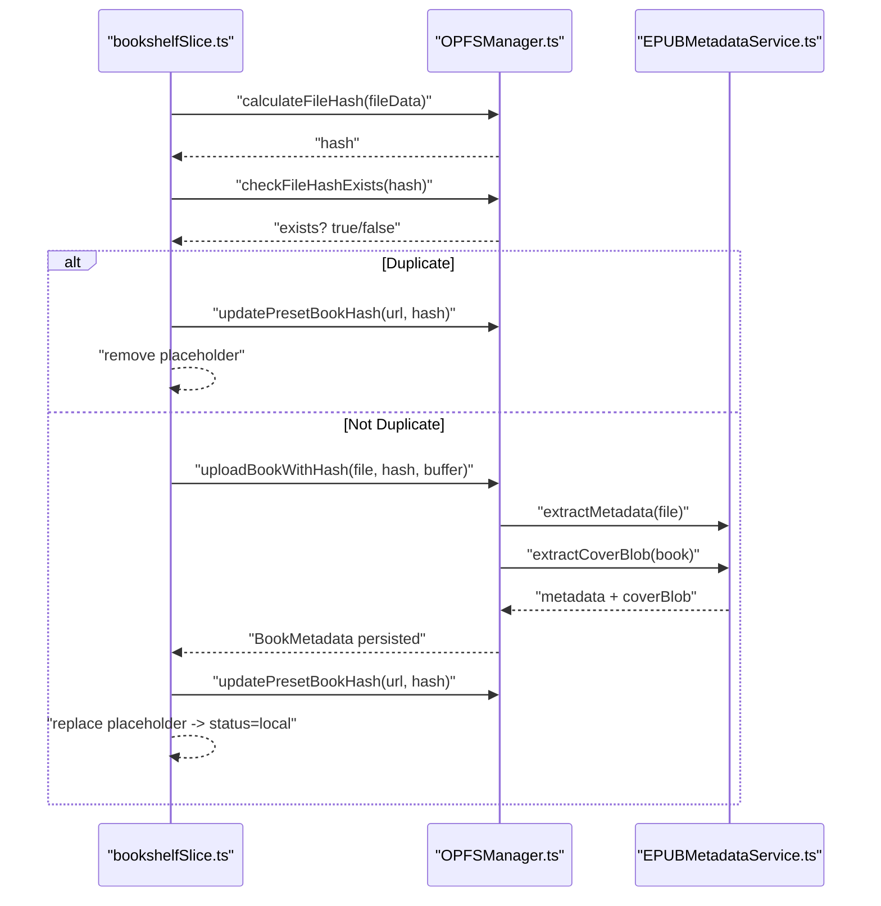
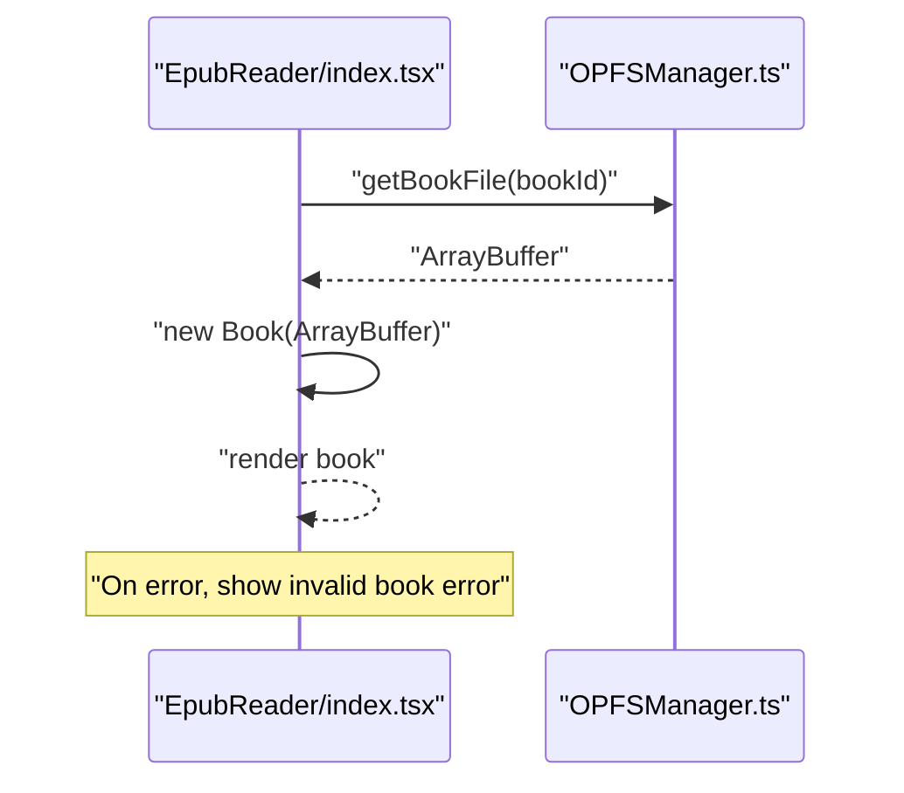
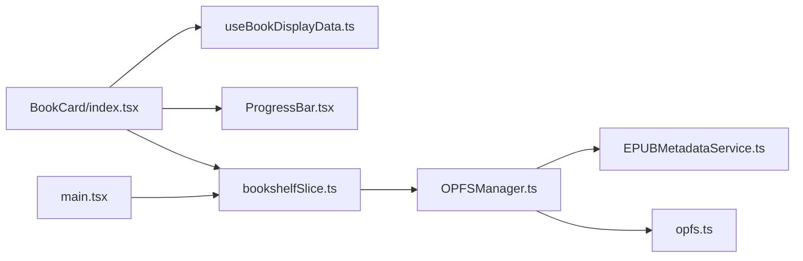

# Bookcard Download Status

<cite>
**Referenced Files in This Document**
- [index.html](file://index.html)
- [package.json](file://package.json)
- [main.tsx](file://src/main.tsx)
- [bookshelfSlice.ts](file://src/store/slices/bookshelfSlice.ts)
- [OPFSManager.ts](file://src/services/OPFSManager.ts)
- [opfs.ts](file://src/services/opfs.ts)
- [book.ts](file://src/types/book.ts)
- [BookCard/index.tsx](file://src/components/BookCard/index.tsx)
- [useBookDisplayData.ts](file://src/components/BookCard/hooks/useBookDisplayData.ts)
- [ProgressBar.tsx](file://src/components/BookCard/ProgressBar.tsx)
- [EPUBMetadataService.ts](file://src/services/EPUBMetadataService.ts)
- [EpubReader/index.tsx](file://src/pages/EpubReader/index.tsx)
</cite>

## Table of Contents
1. [Introduction](#introduction)
2. [Project Structure](#project-structure)
3. [Core Components](#core-components)
4. [Architecture Overview](#architecture-overview)
5. [Detailed Component Analysis](#detailed-component-analysis)
6. [Dependency Analysis](#dependency-analysis)
7. [Performance Considerations](#performance-considerations)
8. [Troubleshooting Guide](#troubleshooting-guide)
9. [Conclusion](#conclusion)

## Introduction
This document explains how the application displays and manages the download status of preset books in the Book Card component. It covers the end-to-end flow from initiating a preset book download to rendering the progress and status indicators on the book card, and how the UI reacts to completion or failure states.

## Project Structure
The download status is implemented across several layers:
- Redux slice orchestrates preset downloads and updates book metadata.
- OPFS manager persists downloaded books and metadata.
- Book Card renders the status, progress, and actions.
- Supporting services extract metadata and cover images.

**Diagram sources**
- [main.tsx](file://src/main.tsx#L1-L42)
- [bookshelfSlice.ts](file://src/store/slices/bookshelfSlice.ts#L1-L427)
- [OPFSManager.ts](file://src/services/OPFSManager.ts#L1-L725)
- [opfs.ts](file://src/services/opfs.ts#L1-L65)
- [BookCard/index.tsx](file://src/components/BookCard/index.tsx#L1-L333)
- [useBookDisplayData.ts](file://src/components/BookCard/hooks/useBookDisplayData.ts#L1-L37)
- [ProgressBar.tsx](file://src/components/BookCard/ProgressBar.tsx#L1-L65)
- [EPUBMetadataService.ts](file://src/services/EPUBMetadataService.ts#L124-L176)
- [index.html](file://index.html#L1-L30)

**Section sources**
- [main.tsx](file://src/main.tsx#L1-L42)
- [bookshelfSlice.ts](file://src/store/slices/bookshelfSlice.ts#L1-L427)
- [OPFSManager.ts](file://src/services/OPFSManager.ts#L1-L725)
- [opfs.ts](file://src/services/opfs.ts#L1-L65)
- [BookCard/index.tsx](file://src/components/BookCard/index.tsx#L1-L333)
- [useBookDisplayData.ts](file://src/components/BookCard/hooks/useBookDisplayData.ts#L1-L37)
- [ProgressBar.tsx](file://src/components/BookCard/ProgressBar.tsx#L1-L65)
- [EPUBMetadataService.ts](file://src/services/EPUBMetadataService.ts#L124-L176)
- [index.html](file://index.html#L1-L30)

## Core Components
- Redux slice: Manages preset book downloads, placeholders, progress updates, and error states.
- OPFS Manager: Persists books, metadata, and cover images; tracks duplicates via file hash.
- Book Card: Renders book details, download status, and progress bar.
- Display hook: Normalizes display values and selects progress based on status.
- Progress Bar: Reusable component to render progress percentage and visual bar.

**Section sources**
- [bookshelfSlice.ts](file://src/store/slices/bookshelfSlice.ts#L1-L427)
- [OPFSManager.ts](file://src/services/OPFSManager.ts#L1-L725)
- [BookCard/index.tsx](file://src/components/BookCard/index.tsx#L1-L333)
- [useBookDisplayData.ts](file://src/components/BookCard/hooks/useBookDisplayData.ts#L1-L37)
- [ProgressBar.tsx](file://src/components/BookCard/ProgressBar.tsx#L1-L65)

## Architecture Overview
The preset book download pipeline:
1. App initializes and triggers preset book initialization.
2. A placeholder book with status “downloading” is inserted.
3. Network stream reads bytes, computes progress, and dispatches updates.
4. On completion, the placeholder is replaced with a persisted local book.
5. The Book Card reflects the status and progress in real time.

**Diagram sources**
- [main.tsx](file://src/main.tsx#L1-L42)
- [bookshelfSlice.ts](file://src/store/slices/bookshelfSlice.ts#L125-L206)
- [OPFSManager.ts](file://src/services/OPFSManager.ts#L320-L394)
- [BookCard/index.tsx](file://src/components/BookCard/index.tsx#L1-L333)

## Detailed Component Analysis

### Download Status Data Model
- Book metadata includes status, download progress, and optional error fields.
- The Book Card uses these fields to decide whether to show downloading text, error text, and progress.

**Diagram sources**
- [book.ts](file://src/types/book.ts#L30-L65)

**Section sources**
- [book.ts](file://src/types/book.ts#L30-L65)

### Placeholder and Progress Updates
- A temporary placeholder is added with status “downloading” and initial progress 0.
- During streaming, progress updates are dispatched at intervals to keep UI responsive.
- On success, the placeholder is replaced with a fully persisted local book.
- On failure, the book’s status switches to “error” and an error message is stored.

**Diagram sources**
- [bookshelfSlice.ts](file://src/store/slices/bookshelfSlice.ts#L125-L206)
- [OPFSManager.ts](file://src/services/OPFSManager.ts#L320-L394)

**Section sources**
- [bookshelfSlice.ts](file://src/store/slices/bookshelfSlice.ts#L125-L206)
- [OPFSManager.ts](file://src/services/OPFSManager.ts#L320-L394)

### Book Card Rendering of Download Status
- The Book Card determines:
  - If the book is downloading, it shows a “downloading” label and a progress bar.
  - If the book is in error state, it shows an error label and message.
  - Otherwise, it shows local progress from metadata.
- The progress value is computed by the display hook, which prioritizes download progress when the status is “downloading”.

**Diagram sources**
- [BookCard/index.tsx](file://src/components/BookCard/index.tsx#L1-L333)
- [useBookDisplayData.ts](file://src/components/BookCard/hooks/useBookDisplayData.ts#L1-L37)
- [ProgressBar.tsx](file://src/components/BookCard/ProgressBar.tsx#L1-L65)

**Section sources**
- [BookCard/index.tsx](file://src/components/BookCard/index.tsx#L1-L333)
- [useBookDisplayData.ts](file://src/components/BookCard/hooks/useBookDisplayData.ts#L1-L37)
- [ProgressBar.tsx](file://src/components/BookCard/ProgressBar.tsx#L1-L65)

### OPFS Persistence and Deduplication
- After streaming completes, the file buffer is hashed and checked against existing hashes to prevent duplicates.
- If not a duplicate, the EPUB is saved under a directory named by its hash, metadata is extracted, and cover image is persisted.
- The config is updated with the new book and its hash mapping.

**Diagram sources**
- [bookshelfSlice.ts](file://src/store/slices/bookshelfSlice.ts#L125-L206)
- [OPFSManager.ts](file://src/services/OPFSManager.ts#L235-L394)
- [EPUBMetadataService.ts](file://src/services/EPUBMetadataService.ts#L124-L176)

**Section sources**
- [OPFSManager.ts](file://src/services/OPFSManager.ts#L235-L394)
- [EPUBMetadataService.ts](file://src/services/EPUBMetadataService.ts#L124-L176)

### Reader Initialization and Error Handling
- When opening a book, the application loads the EPUB from OPFS and renders it.
- If the book cannot be loaded, an error page is shown.

**Diagram sources**
- [EpubReader/index.tsx](file://src/pages/EpubReader/index.tsx#L32-L86)
- [OPFSManager.ts](file://src/services/OPFSManager.ts#L466-L485)

**Section sources**
- [EpubReader/index.tsx](file://src/pages/EpubReader/index.tsx#L32-L86)
- [OPFSManager.ts](file://src/services/OPFSManager.ts#L466-L485)

## Dependency Analysis
- The Book Card depends on:
  - Display hook for normalized progress.
  - Progress Bar for visual rendering.
  - Redux state for book metadata and status.
- Redux slice depends on:
  - OPFS Manager for persistence and hashing.
  - EPUB metadata service for cover extraction.
- OPFS Manager depends on:
  - OPFS storage APIs and file operations utilities.
  - EPUB metadata service for cover extraction.

**Diagram sources**
- [BookCard/index.tsx](file://src/components/BookCard/index.tsx#L1-L333)
- [useBookDisplayData.ts](file://src/components/BookCard/hooks/useBookDisplayData.ts#L1-L37)
- [ProgressBar.tsx](file://src/components/BookCard/ProgressBar.tsx#L1-L65)
- [bookshelfSlice.ts](file://src/store/slices/bookshelfSlice.ts#L1-L427)
- [OPFSManager.ts](file://src/services/OPFSManager.ts#L1-L725)
- [EPUBMetadataService.ts](file://src/services/EPUBMetadataService.ts#L124-L176)
- [opfs.ts](file://src/services/opfs.ts#L1-L65)
- [main.tsx](file://src/main.tsx#L1-L42)

**Section sources**
- [BookCard/index.tsx](file://src/components/BookCard/index.tsx#L1-L333)
- [bookshelfSlice.ts](file://src/store/slices/bookshelfSlice.ts#L1-L427)
- [OPFSManager.ts](file://src/services/OPFSManager.ts#L1-L725)
- [EPUBMetadataService.ts](file://src/services/EPUBMetadataService.ts#L124-L176)
- [opfs.ts](file://src/services/opfs.ts#L1-L65)
- [main.tsx](file://src/main.tsx#L1-L42)

## Performance Considerations
- Streaming progress updates are throttled to reduce dispatch frequency.
- Placeholder removal and replacement minimize re-renders by updating only affected records.
- Cover extraction and hashing occur after download completion to avoid blocking the UI during streaming.

[No sources needed since this section provides general guidance]

## Troubleshooting Guide
Common issues and remedies:
- Download stuck at 0%:
  - Verify network connectivity and that the preset URL is reachable.
  - Check that progress updates are dispatched and the placeholder remains until replaced.
- Duplicate book not added:
  - The system checks file hash and skips duplicates; confirm the hash exists in config.
- Error state not cleared:
  - Ensure the error action is dispatched and the placeholder is removed upon success.
- Cover not displayed:
  - Confirm cover extraction succeeds and the cover path is valid in metadata.

**Section sources**
- [bookshelfSlice.ts](file://src/store/slices/bookshelfSlice.ts#L125-L206)
- [OPFSManager.ts](file://src/services/OPFSManager.ts#L320-L394)
- [EPUBMetadataService.ts](file://src/services/EPUBMetadataService.ts#L124-L176)

## Conclusion
The Book Card download status is driven by a robust Redux-driven pipeline that streams preset EPUBs, updates progress in real time, and persists them to OPFS. The UI reacts dynamically to “downloading”, “local”, and “error” states, providing clear feedback to users. Deduplication and metadata extraction ensure efficient storage and reliable rendering.