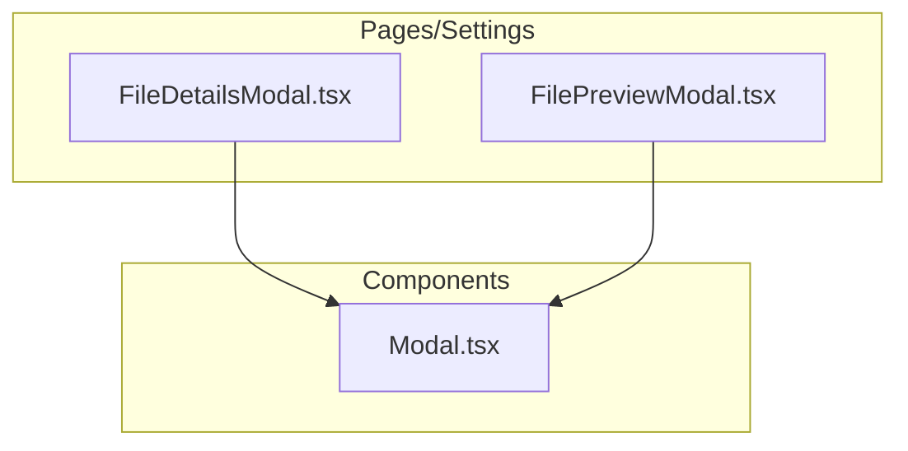
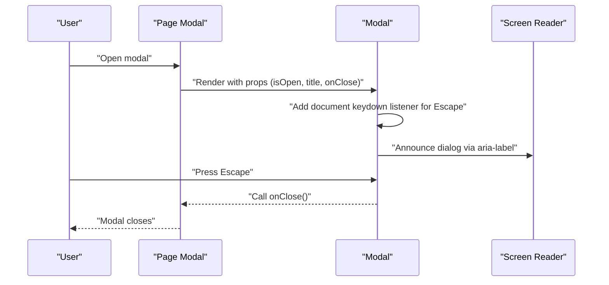
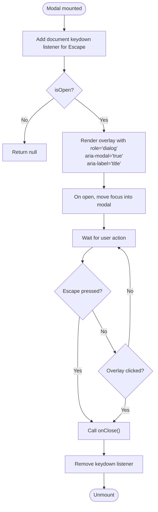
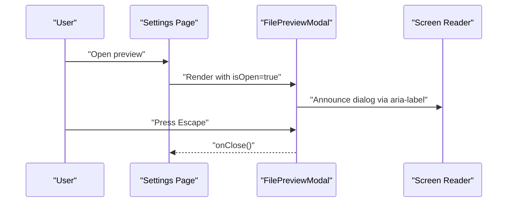
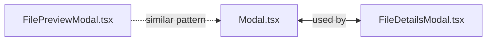

# Modal Component Accessibility

<cite>
**Referenced Files in This Document**
- [Modal.tsx](file://src/components/Modal.tsx)
- [FileDetailsModal.tsx](file://src/pages/SettingsPage/components/FileDetailsModal.tsx)
- [FilePreviewModal.tsx](file://src/pages/SettingsPage/components/FilePreviewModal.tsx)
</cite>

## Table of Contents
1. [Introduction](#introduction)
2. [Project Structure](#project-structure)
3. [Core Components](#core-components)
4. [Architecture Overview](#architecture-overview)
5. [Detailed Component Analysis](#detailed-component-analysis)
6. [Dependency Analysis](#dependency-analysis)
7. [Performance Considerations](#performance-considerations)
8. [Troubleshooting Guide](#troubleshooting-guide)
9. [Conclusion](#conclusion)

## Introduction
This document focuses on the accessibility characteristics of modal components in the project, specifically the shared Modal component and its usage in settings modals. It explains how the modal is implemented with ARIA roles and keyboard handling, highlights areas for improvement, and provides guidance for maintaining and extending accessibility across modal surfaces.

## Project Structure
The modal accessibility is implemented centrally in a reusable component and consumed by page-specific modals. The relevant files are:
- Shared modal component
- Settings page modals that use the shared modal



**Diagram sources**
- [Modal.tsx](file://src/components/Modal.tsx#L1-L83)
- [FileDetailsModal.tsx](file://src/pages/SettingsPage/components/FileDetailsModal.tsx#L1-L131)
- [FilePreviewModal.tsx](file://src/pages/SettingsPage/components/FilePreviewModal.tsx#L1-L267)

**Section sources**
- [Modal.tsx](file://src/components/Modal.tsx#L1-L83)
- [FileDetailsModal.tsx](file://src/pages/SettingsPage/components/FileDetailsModal.tsx#L1-L131)
- [FilePreviewModal.tsx](file://src/pages/SettingsPage/components/FilePreviewModal.tsx#L1-L267)

## Core Components
- Modal: A reusable dialog component that:
  - Uses ARIA role dialog and aria-modal to signal assistive technologies that a modal is active.
  - Provides an accessible label via aria-label derived from the title prop.
  - Supports Escape key closing via a document-level keydown listener.
  - Closes when clicking the backdrop overlay.
  - Exposes a close button with an accessible label.
  - Accepts optional footer actions and child content.

- FileDetailsModal: A page-level modal that wraps the shared Modal and renders file metadata inside it.

- FilePreviewModal: A page-level modal that also uses ARIA dialog and aria-modal, and supports Escape key handling and overlay click-to-close.

Key accessibility features present:
- ARIA role dialog and aria-modal on the overlay container.
- aria-label on the overlay container for screen readers.
- aria-label on the close button.
- Escape key handling to dismiss the modal.
- Overlay click-to-dismiss behavior.

Areas for improvement (see Detailed Component Analysis):
- Focus management and focus trap.
- Properly associating labels and descriptions for dynamic content.
- Ensuring focus returns appropriately when modals close.

**Section sources**
- [Modal.tsx](file://src/components/Modal.tsx#L1-L83)
- [FileDetailsModal.tsx](file://src/pages/SettingsPage/components/FileDetailsModal.tsx#L1-L131)
- [FilePreviewModal.tsx](file://src/pages/SettingsPage/components/FilePreviewModal.tsx#L1-L267)

## Architecture Overview
The modal architecture centers on a single, accessible dialog component reused across pages. Page-level modals pass props to the shared Modal, which handles ARIA attributes and keyboard interactions.



**Diagram sources**
- [Modal.tsx](file://src/components/Modal.tsx#L1-L83)
- [FileDetailsModal.tsx](file://src/pages/SettingsPage/components/FileDetailsModal.tsx#L1-L131)
- [FilePreviewModal.tsx](file://src/pages/SettingsPage/components/FilePreviewModal.tsx#L1-L267)

## Detailed Component Analysis

### Modal Component
The shared Modal component implements:
- ARIA role dialog and aria-modal to mark the overlay as a modal dialog.
- aria-label set to the provided title to give context to assistive technologies.
- Escape key handling to close the modal.
- Overlay click-to-dismiss behavior.
- Close button with an accessible label.

Accessibility strengths:
- Clear ARIA semantics for dialogs.
- Keyboard support for dismissal.
- Visual focus styles for the close button.

Accessibility gaps:
- No focus trap: focus does not move into the modal on open nor remain within it.
- No explicit labeling of the modal content beyond the overlay’s aria-label.
- No automatic focus restoration on close.

Recommended improvements:
- Add a focus trap to keep focus inside the modal while it is open.
- Ensure focus moves to the first interactive element or the modal container itself on open.
- Provide aria-labelledby and aria-describedby for richer context when content is dynamic.
- Restore focus to the trigger element when the modal closes.



**Diagram sources**
- [Modal.tsx](file://src/components/Modal.tsx#L1-L83)

**Section sources**
- [Modal.tsx](file://src/components/Modal.tsx#L1-L83)

### FileDetailsModal
This page-level modal composes the shared Modal and renders file metadata. It:
- Passes isOpen, title, and onClose to the shared Modal.
- Renders descriptive metadata inside the Modal’s body.
- Uses the shared Modal’s Escape handling and overlay click-to-dismiss.

Accessibility considerations:
- The shared Modal’s ARIA attributes apply here automatically.
- Ensure the title prop provides a meaningful label for the modal’s purpose.
- Keep the content inside the Modal accessible and properly labeled.

```mermaid
sequenceDiagram
participant User as "User"
participant Settings as "Settings Page"
participant Details as "FileDetailsModal"
participant Modal as "Modal"
User->>Settings : "Open file details"
Settings->>Details : "Render with isOpen=true"
Details->>Modal : "Pass isOpen, title, onClose"
Modal-->>User : "Dialog appears with ARIA semantics"
User->>Modal : "Press Escape or click overlay"
Modal-->>Details : "onClose()"
Details-->>Settings : "Close"
```

**Diagram sources**
- [FileDetailsModal.tsx](file://src/pages/SettingsPage/components/FileDetailsModal.tsx#L1-L131)
- [Modal.tsx](file://src/components/Modal.tsx#L1-L83)

**Section sources**
- [FileDetailsModal.tsx](file://src/pages/SettingsPage/components/FileDetailsModal.tsx#L1-L131)
- [Modal.tsx](file://src/components/Modal.tsx#L1-L83)

### FilePreviewModal
This page-level modal:
- Implements its own Escape key handling and overlay click-to-dismiss.
- Uses role="dialog" and aria-modal="true" on the overlay.
- Uses aria-label on the overlay for screen readers.
- Provides a close button with an accessible label.

Accessibility considerations:
- The overlay’s ARIA attributes signal a modal dialog.
- Escape key handling aligns with shared Modal behavior.
- Ensure focus moves into the modal on open and remains trapped.



**Diagram sources**
- [FilePreviewModal.tsx](file://src/pages/SettingsPage/components/FilePreviewModal.tsx#L1-L267)

**Section sources**
- [FilePreviewModal.tsx](file://src/pages/SettingsPage/components/FilePreviewModal.tsx#L1-L267)

## Dependency Analysis
- FileDetailsModal depends on Modal for rendering the dialog surface.
- FilePreviewModal duplicates the dialog surface and ARIA attributes but does not reuse Modal.
- Both share Escape key handling and overlay click-to-dismiss patterns.



**Diagram sources**
- [Modal.tsx](file://src/components/Modal.tsx#L1-L83)
- [FileDetailsModal.tsx](file://src/pages/SettingsPage/components/FileDetailsModal.tsx#L1-L131)
- [FilePreviewModal.tsx](file://src/pages/SettingsPage/components/FilePreviewModal.tsx#L1-L267)

**Section sources**
- [Modal.tsx](file://src/components/Modal.tsx#L1-L83)
- [FileDetailsModal.tsx](file://src/pages/SettingsPage/components/FileDetailsModal.tsx#L1-L131)
- [FilePreviewModal.tsx](file://src/pages/SettingsPage/components/FilePreviewModal.tsx#L1-L267)

## Performance Considerations
- Event listeners for Escape key are attached only when the modal is open and removed on unmount, minimizing overhead.
- Rendering the modal conditionally avoids unnecessary DOM nodes when closed.
- Reusing Modal reduces duplication and potential performance regressions from redundant listeners.

[No sources needed since this section provides general guidance]

## Troubleshooting Guide
Common issues and resolutions:
- Screen readers do not announce the modal:
  - Ensure the overlay has role="dialog" and aria-modal="true".
  - Provide a meaningful title prop so aria-label is descriptive.
  - Verify the modal is rendered when isOpen is true.

- Escape key does not close the modal:
  - Confirm the modal is open and the keydown listener is attached.
  - Ensure the onClose handler updates the isOpen state.

- Focus escapes the modal:
  - Implement a focus trap to move focus into the modal on open and keep it inside.
  - Restore focus to the trigger element when the modal closes.

- Overlay click does not close:
  - Verify the overlay click handler checks that the target is the overlay itself.

**Section sources**
- [Modal.tsx](file://src/components/Modal.tsx#L1-L83)
- [FileDetailsModal.tsx](file://src/pages/SettingsPage/components/FileDetailsModal.tsx#L1-L131)
- [FilePreviewModal.tsx](file://src/pages/SettingsPage/components/FilePreviewModal.tsx#L1-L267)

## Conclusion
The project’s modal components implement essential ARIA semantics and keyboard support for accessibility. The shared Modal centralizes dialog behavior, while page-level modals compose it to deliver specific content. To achieve robust accessibility, the team should implement a focus trap, improve labeling of dynamic content, and ensure focus restoration on close. These enhancements will strengthen the user experience for assistive technology users and align with best practices for accessible modals.