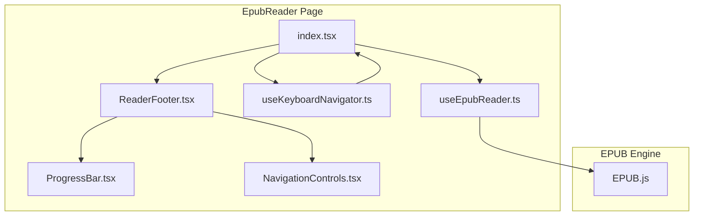
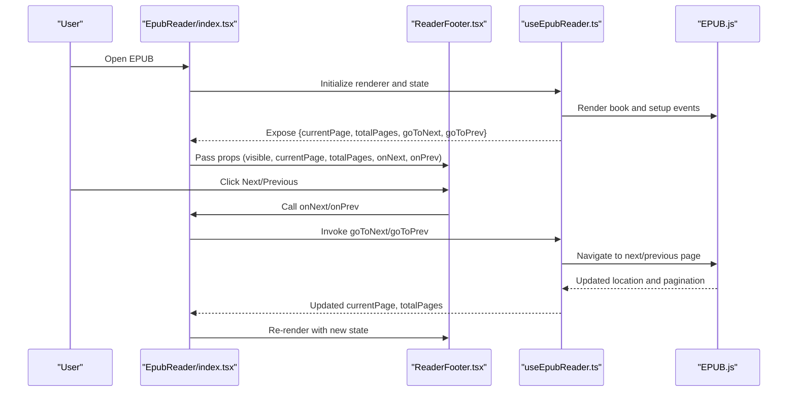
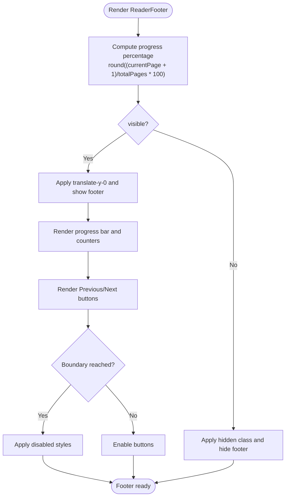
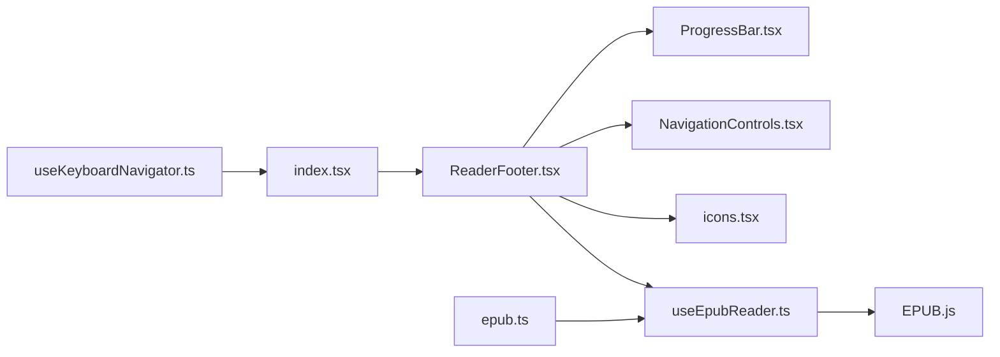

# ReaderFooter

<cite>
**Referenced Files in This Document**
- [ReaderFooter.tsx](file://src/pages/EpubReader/components/ReaderFooter.tsx)
- [ProgressBar.tsx](file://src/pages/EpubReader/components/ProgressBar.tsx)
- [NavigationControls.tsx](file://src/pages/EpubReader/components/NavigationControls.tsx)
- [useKeyboardNavigator.ts](file://src/pages/EpubReader/hooks/useKeyboardNavigator.ts)
- [useEpubReader.ts](file://src/pages/EpubReader/hooks/useEpubReader.ts)
- [index.tsx](file://src/pages/EpubReader/index.tsx)
- [icons.tsx](file://src/components/icons.tsx)
- [epub.ts](file://src/constants/epub.ts)
</cite>

## Table of Contents
1. [Introduction](#introduction)
2. [Project Structure](#project-structure)
3. [Core Components](#core-components)
4. [Architecture Overview](#architecture-overview)
5. [Detailed Component Analysis](#detailed-component-analysis)
6. [Dependency Analysis](#dependency-analysis)
7. [Performance Considerations](#performance-considerations)
8. [Troubleshooting Guide](#troubleshooting-guide)
9. [Conclusion](#conclusion)
10. [Appendices](#appendices)

## Introduction
ReaderFooter is the bottom navigation area of the EPUB reader that displays reading progress and page navigation controls. It shows a progress bar indicating the current position in the book, a page counter, and Previous/Next buttons. It integrates with the EPUB rendering system to reflect real-time page and chapter state, and supports keyboard navigation and accessibility features.

## Project Structure
ReaderFooter lives within the EpubReader page and is composed of several related components and hooks:
- ReaderFooter renders the footer UI and handles visibility and navigation.
- ProgressBar provides a reusable progress indicator.
- NavigationControls encapsulates the Previous/Next buttons with disabled states.
- useKeyboardNavigator adds keyboard shortcuts for navigation.
- useEpubReader manages EPUB rendering, pagination, and exposes navigation callbacks and state.
- index.tsx orchestrates the reader page and passes props to ReaderFooter.

**Diagram sources**
- [index.tsx](file://src/pages/EpubReader/index.tsx#L346-L402)
- [ReaderFooter.tsx](file://src/pages/EpubReader/components/ReaderFooter.tsx#L1-L66)
- [ProgressBar.tsx](file://src/pages/EpubReader/components/ProgressBar.tsx#L1-L36)
- [NavigationControls.tsx](file://src/pages/EpubReader/components/NavigationControls.tsx#L1-L49)
- [useKeyboardNavigator.ts](file://src/pages/EpubReader/hooks/useKeyboardNavigator.ts#L1-L48)
- [useEpubReader.ts](file://src/pages/EpubReader/hooks/useEpubReader.ts#L1-L201)

**Section sources**
- [index.tsx](file://src/pages/EpubReader/index.tsx#L346-L402)
- [ReaderFooter.tsx](file://src/pages/EpubReader/components/ReaderFooter.tsx#L1-L66)

## Core Components
- ReaderFooter: Renders the footer with progress bar, page counter, and navigation buttons. It receives visibility, current page, total pages, and navigation callbacks.
- ProgressBar: Reusable progress bar component for reading progress.
- NavigationControls: Encapsulates Previous/Next buttons with disabled states based on book boundaries.
- useKeyboardNavigator: Adds keyboard navigation (arrow keys and optional volume keys).
- useEpubReader: Manages EPUB rendering, pagination, and exposes navigation functions and state.

**Section sources**
- [ReaderFooter.tsx](file://src/pages/EpubReader/components/ReaderFooter.tsx#L1-L66)
- [ProgressBar.tsx](file://src/pages/EpubReader/components/ProgressBar.tsx#L1-L36)
- [NavigationControls.tsx](file://src/pages/EpubReader/components/NavigationControls.tsx#L1-L49)
- [useKeyboardNavigator.ts](file://src/pages/EpubReader/hooks/useKeyboardNavigator.ts#L1-L48)
- [useEpubReader.ts](file://src/pages/EpubReader/hooks/useEpubReader.ts#L1-L201)

## Architecture Overview
ReaderFooter participates in the reader’s control flow:
- The EpubReader page initializes the EPUB renderer and exposes navigation callbacks and state.
- ReaderFooter receives currentPage, totalPages, and navigation callbacks from useEpubReader.
- NavigationControls and ProgressBar are integrated inside ReaderFooter for a cohesive UI.
- Keyboard navigation is handled by useKeyboardNavigator and wired into the page.

**Diagram sources**
- [index.tsx](file://src/pages/EpubReader/index.tsx#L212-L231)
- [index.tsx](file://src/pages/EpubReader/index.tsx#L393-L399)
- [useEpubReader.ts](file://src/pages/EpubReader/hooks/useEpubReader.ts#L177-L180)
- [useEpubReader.ts](file://src/pages/EpubReader/hooks/useEpubReader.ts#L170-L175)

## Detailed Component Analysis

### ReaderFooter Component
- Purpose: Bottom navigation area with progress bar, page counter, and Previous/Next buttons.
- Props:
  - visible: Controls footer visibility and animation.
  - currentPage: Current page index (0-based).
  - totalPages: Total number of pages.
  - onNext: Callback invoked on Next button click.
  - onPrev: Callback invoked on Previous button click.
- Progress calculation:
  - Progress percentage is computed as round((currentPage + 1) / totalPages * 100) when totalPages > 0; otherwise 0.
  - The page counter shows "Page {currentPage + 1} of {totalPages}".
- Visual representation:
  - Progress bar is a horizontal bar with rounded ends and a blue fill whose width reflects the progress percentage.
  - Buttons use icons from the shared icons library and apply disabled styles when navigation is not available.
- Accessibility and keyboard navigation:
  - Buttons include titles and aria labels where applicable.
  - Keyboard navigation is handled by useKeyboardNavigator and wired into the page.
- Transition effects:
  - Footer uses a transform-based slide-up/down effect with a transition duration for smooth show/hide.
- Disabled state handling:
  - The component itself does not disable buttons; however, the underlying navigation functions prevent navigation at book boundaries.

**Diagram sources**
- [ReaderFooter.tsx](file://src/pages/EpubReader/components/ReaderFooter.tsx#L16-L66)

**Section sources**
- [ReaderFooter.tsx](file://src/pages/EpubReader/components/ReaderFooter.tsx#L1-L66)

### ProgressBar Component
- Purpose: Reusable progress indicator for reading progress.
- Props:
  - currentPage: Current page index (0-based).
  - totalPages: Total number of pages.
  - currentChapter: Optional chapter label for display.
- Behavior:
  - Calculates progress percentage as round(currentPage / totalPages * 100) when totalPages > 0; otherwise 0.
  - Displays percentage and chapter label above the progress bar.
  - Progress bar width reflects the calculated percentage.

**Section sources**
- [ProgressBar.tsx](file://src/pages/EpubReader/components/ProgressBar.tsx#L1-L36)

### NavigationControls Component
- Purpose: Encapsulates Previous/Next navigation buttons with disabled states.
- Props:
  - onPrevPage: Callback for Previous action.
  - onNextPage: Callback for Next action.
  - isAtStart: Indicates if at the start of the book.
  - isAtEnd: Indicates if at the end of the book.
- Behavior:
  - Buttons are disabled when at the start or end respectively.
  - Uses aria-labels for accessibility.

**Section sources**
- [NavigationControls.tsx](file://src/pages/EpubReader/components/NavigationControls.tsx#L1-L49)

### Keyboard Navigation Hook
- Purpose: Adds keyboard shortcuts for navigation.
- Features:
  - Arrow keys trigger Previous/Next actions.
  - Optional volume keys for mobile devices.
  - Prevents navigation during text selection to avoid conflicts.

**Section sources**
- [useKeyboardNavigator.ts](file://src/pages/EpubReader/hooks/useKeyboardNavigator.ts#L1-L48)

### Integration with EPUB Rendering
- useEpubReader:
  - Initializes EPUB renderer and sets up events.
  - Exposes currentPage, totalPages, and navigation functions.
  - Applies boundary checks to prevent navigation past the start/end.
- EpubReader page:
  - Passes navigation callbacks and state to ReaderFooter.
  - Wires keyboard navigation and viewport zones.

**Section sources**
- [useEpubReader.ts](file://src/pages/EpubReader/hooks/useEpubReader.ts#L170-L180)
- [index.tsx](file://src/pages/EpubReader/index.tsx#L212-L231)
- [index.tsx](file://src/pages/EpubReader/index.tsx#L393-L399)

## Dependency Analysis
- ReaderFooter depends on:
  - useEpubReader for currentPage, totalPages, and navigation callbacks.
  - ProgressBar and NavigationControls for UI composition.
  - icons.tsx for arrow icons.
- useKeyboardNavigator is used by the page to wire keyboard shortcuts.
- Rendering configuration constants influence pagination and rendering behavior.

**Diagram sources**
- [ReaderFooter.tsx](file://src/pages/EpubReader/components/ReaderFooter.tsx#L1-L66)
- [ProgressBar.tsx](file://src/pages/EpubReader/components/ProgressBar.tsx#L1-L36)
- [NavigationControls.tsx](file://src/pages/EpubReader/components/NavigationControls.tsx#L1-L49)
- [icons.tsx](file://src/components/icons.tsx#L53-L63)
- [useEpubReader.ts](file://src/pages/EpubReader/hooks/useEpubReader.ts#L1-L201)
- [useKeyboardNavigator.ts](file://src/pages/EpubReader/hooks/useKeyboardNavigator.ts#L1-L48)
- [epub.ts](file://src/constants/epub.ts#L53-L61)
- [index.tsx](file://src/pages/EpubReader/index.tsx#L346-L402)

**Section sources**
- [ReaderFooter.tsx](file://src/pages/EpubReader/components/ReaderFooter.tsx#L1-L66)
- [useEpubReader.ts](file://src/pages/EpubReader/hooks/useEpubReader.ts#L1-L201)
- [index.tsx](file://src/pages/EpubReader/index.tsx#L346-L402)

## Performance Considerations
- Progress calculation is constant-time and lightweight.
- The progress bar uses inline styles for width; ensure not to trigger layout thrashing by batching updates.
- Keyboard navigation uses a single event listener; avoid excessive re-renders in parent components to keep interactions smooth.
- Rendering configuration constants define paginated flow and spread behavior; adjust them to balance readability and performance.

[No sources needed since this section provides general guidance]

## Troubleshooting Guide
- Navigation buttons do nothing at book boundaries:
  - The navigation functions check boundary conditions and return early; ensure the underlying state reflects correct atStart/atEnd values.
- Progress percentage not updating:
  - Verify that totalPages is greater than 0 and that currentPage updates correctly from the EPUB engine.
- Footer not visible:
  - Ensure the visible prop is true and that the transition classes are applied correctly.
- Keyboard navigation conflicts:
  - Text selection detection prevents navigation while selecting; ensure selection is cleared when testing.

**Section sources**
- [useEpubReader.ts](file://src/pages/EpubReader/hooks/useEpubReader.ts#L72-L86)
- [useKeyboardNavigator.ts](file://src/pages/EpubReader/hooks/useKeyboardNavigator.ts#L19-L41)

## Conclusion
ReaderFooter provides a clean, accessible, and responsive bottom navigation area for EPUB reading. It integrates tightly with the EPUB rendering system to reflect real-time pagination and supports keyboard navigation. Its modular design allows reuse of the progress bar and navigation controls, and it adheres to TailwindCSS-based styling for consistent visuals.

[No sources needed since this section summarizes without analyzing specific files]

## Appendices

### Props Reference
- ReaderFooter props:
  - visible: boolean
  - currentPage: number
  - totalPages: number
  - onNext: () => void
  - onPrev: () => void

**Section sources**
- [ReaderFooter.tsx](file://src/pages/EpubReader/components/ReaderFooter.tsx#L4-L10)

### Accessibility Notes
- Buttons include titles and aria labels for navigation controls.
- Keyboard navigation supports arrow keys and optional volume keys for mobile.
- Disabled states are visually indicated for navigation buttons.

**Section sources**
- [ReaderFooter.tsx](file://src/pages/EpubReader/components/ReaderFooter.tsx#L44-L60)
- [NavigationControls.tsx](file://src/pages/EpubReader/components/NavigationControls.tsx#L20-L46)
- [useKeyboardNavigator.ts](file://src/pages/EpubReader/hooks/useKeyboardNavigator.ts#L19-L41)

### Styling and Responsive Behavior
- TailwindCSS classes define layout, spacing, colors, and transitions.
- Progress bar uses rounded ends and a smooth transition for width changes.
- Footer applies transform-based slide-up/down with a transition duration.
- Responsive behavior is achieved through container classes and max-width constraints.

**Section sources**
- [ReaderFooter.tsx](file://src/pages/EpubReader/components/ReaderFooter.tsx#L20-L66)
- [ProgressBar.tsx](file://src/pages/EpubReader/components/ProgressBar.tsx#L19-L33)

### Integration Example
- The EpubReader page composes ReaderFooter with navigation callbacks and state from useEpubReader.

**Section sources**
- [index.tsx](file://src/pages/EpubReader/index.tsx#L393-L399)
- [useEpubReader.ts](file://src/pages/EpubReader/hooks/useEpubReader.ts#L170-L180)