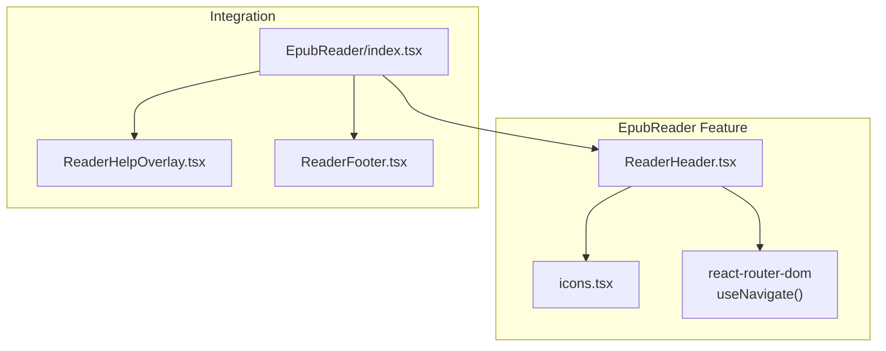
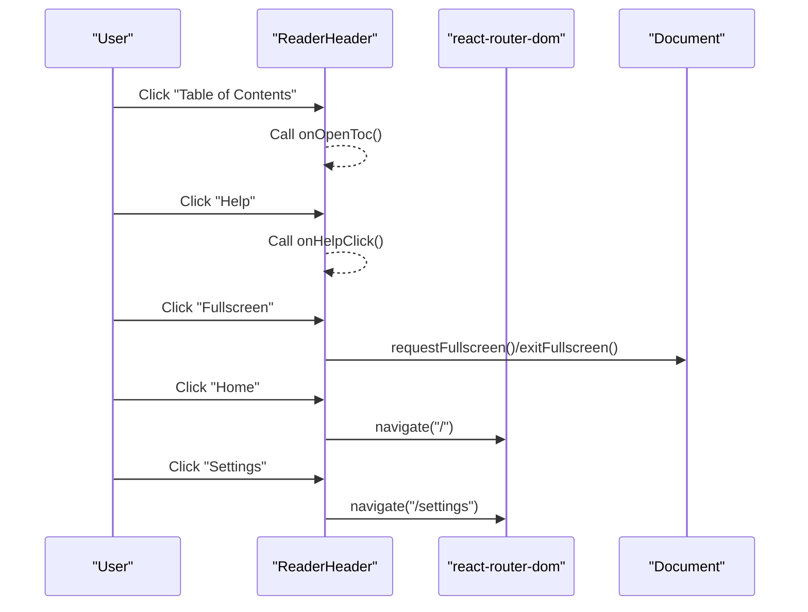
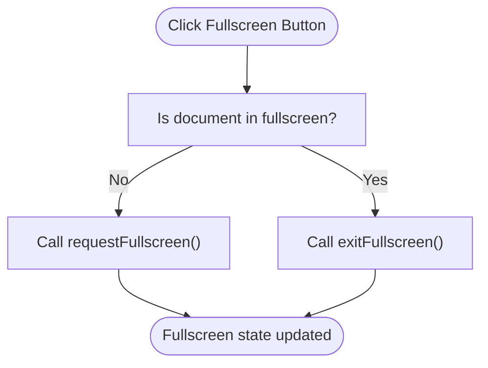
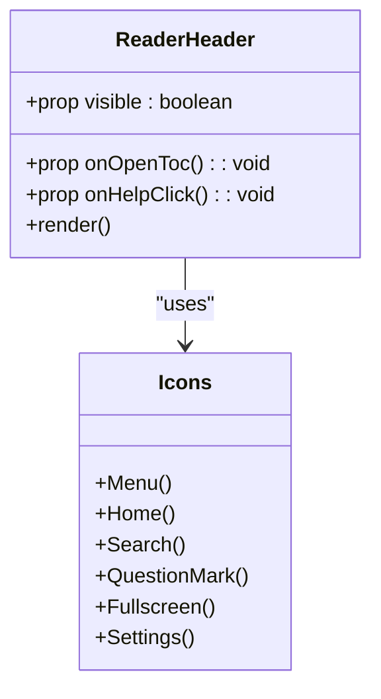
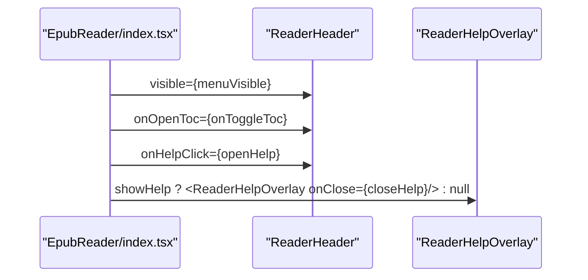
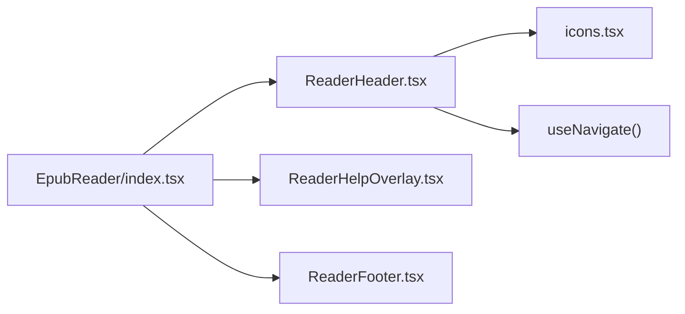

# ReaderHeader

<cite>
**Referenced Files in This Document**
- [ReaderHeader.tsx](file://src/pages/EpubReader/components/ReaderHeader.tsx)
- [icons.tsx](file://src/components/icons.tsx)
- [index.tsx](file://src/pages/EpubReader/index.tsx)
- [ReaderHelpOverlay.tsx](file://src/pages/EpubReader/components/ReaderHelpOverlay.tsx)
- [ReaderFooter.tsx](file://src/pages/EpubReader/components/ReaderFooter.tsx)
</cite>

## Table of Contents
1. [Introduction](#introduction)
2. [Project Structure](#project-structure)
3. [Core Components](#core-components)
4. [Architecture Overview](#architecture-overview)
5. [Detailed Component Analysis](#detailed-component-analysis)
6. [Dependency Analysis](#dependency-analysis)
7. [Performance Considerations](#performance-considerations)
8. [Troubleshooting Guide](#troubleshooting-guide)
9. [Conclusion](#conclusion)
10. [Appendices](#appendices)

## Introduction
ReaderHeader is the top navigation control panel for the EPUB reader. It provides quick access to the table of contents, home, search, help, fullscreen, and settings. It supports visibility control for smooth show/hide transitions and integrates with the shared icons system. This document explains its visual layout, props, behavior, accessibility, keyboard support, styling, responsiveness, and integration with the main reader view.

## Project Structure
ReaderHeader resides in the EpubReader feature module and is composed with shared icons and routing utilities.

**Diagram sources**
- [ReaderHeader.tsx](file://src/pages/EpubReader/components/ReaderHeader.tsx#L1-L86)
- [icons.tsx](file://src/components/icons.tsx#L1-L328)
- [index.tsx](file://src/pages/EpubReader/index.tsx#L346-L402)
- [ReaderHelpOverlay.tsx](file://src/pages/EpubReader/components/ReaderHelpOverlay.tsx#L1-L30)
- [ReaderFooter.tsx](file://src/pages/EpubReader/components/ReaderFooter.tsx#L1-L36)

**Section sources**
- [ReaderHeader.tsx](file://src/pages/EpubReader/components/ReaderHeader.tsx#L1-L86)
- [index.tsx](file://src/pages/EpubReader/index.tsx#L346-L402)

## Core Components
- ReaderHeader: Top bar with left, center, and right sections containing control buttons.
- Shared icons: Reusable SVG icon components used by ReaderHeader.
- Integration page: EpubReader page composes ReaderHeader with state-driven visibility and callbacks.

Key responsibilities:
- Visibility control via a boolean prop and CSS transforms for smooth slide-down/slide-up transitions.
- Callbacks for opening the table of contents and displaying help.
- Browser fullscreen toggle using the Fullscreen API.
- Navigation to home and settings using react-router’s programmatic navigation.
- Responsive layout using Tailwind utility classes.

**Section sources**
- [ReaderHeader.tsx](file://src/pages/EpubReader/components/ReaderHeader.tsx#L1-L86)
- [icons.tsx](file://src/components/icons.tsx#L1-L328)
- [index.tsx](file://src/pages/EpubReader/index.tsx#L346-L402)

## Architecture Overview
ReaderHeader is a presentational component that receives state and callbacks from the parent EpubReader page. It renders three sections:
- Left: TOC, Home, Search
- Center: Brand/title
- Right: Help, Fullscreen, Settings

**Diagram sources**
- [ReaderHeader.tsx](file://src/pages/EpubReader/components/ReaderHeader.tsx#L1-L86)
- [index.tsx](file://src/pages/EpubReader/index.tsx#L346-L402)

## Detailed Component Analysis

### Visual Layout and Sections
- Left section: TOC, Home, Search.
- Center section: Title text.
- Right section: Help, Fullscreen, Settings.

Each control is a button with an icon from the shared icons system and hover/focus affordances.

**Section sources**
- [ReaderHeader.tsx](file://src/pages/EpubReader/components/ReaderHeader.tsx#L33-L81)
- [icons.tsx](file://src/components/icons.tsx#L1-L328)

### Props and Behavior
- visible: Boolean controlling whether the header is shown.
- onOpenToc: Callback invoked when the TOC button is clicked.
- onHelpClick: Callback invoked when the Help button is clicked.

Visibility is animated using a transform class that moves the header vertically. The transition is configured with duration and easing.

**Section sources**
- [ReaderHeader.tsx](file://src/pages/EpubReader/components/ReaderHeader.tsx#L5-L9)
- [ReaderHeader.tsx](file://src/pages/EpubReader/components/ReaderHeader.tsx#L28-L30)

### Fullscreen Toggle
The component toggles fullscreen on the document element. It checks the presence of a fullscreen element and requests or exits fullscreen accordingly.

**Diagram sources**
- [ReaderHeader.tsx](file://src/pages/EpubReader/components/ReaderHeader.tsx#L16-L22)

**Section sources**
- [ReaderHeader.tsx](file://src/pages/EpubReader/components/ReaderHeader.tsx#L16-L22)

### Navigation Controls
- Home: Navigates to the root route.
- Settings: Navigates to the settings route.
- TOC: Invokes the onOpenToc callback.
- Help: Invokes the onHelpClick callback.

These are wired up via react-router’s navigate function and button click handlers.

**Section sources**
- [ReaderHeader.tsx](file://src/pages/EpubReader/components/ReaderHeader.tsx#L41-L43)
- [ReaderHeader.tsx](file://src/pages/EpubReader/components/ReaderHeader.tsx#L74-L78)
- [ReaderHeader.tsx](file://src/pages/EpubReader/components/ReaderHeader.tsx#L34-L40)
- [ReaderHeader.tsx](file://src/pages/EpubReader/components/ReaderHeader.tsx#L59-L65)

### Accessibility and Keyboard Support
- Buttons include titles for assistive technologies.
- The component does not define explicit ARIA roles or attributes beyond native semantics.
- Keyboard navigation relies on default focus order and tabbing; no dedicated keyboard shortcuts are implemented within ReaderHeader itself.

Note: The parent EpubReader page implements keyboard navigation for page turning and context menu behavior, separate from ReaderHeader.

**Section sources**
- [ReaderHeader.tsx](file://src/pages/EpubReader/components/ReaderHeader.tsx#L35-L37)
- [ReaderHeader.tsx](file://src/pages/EpubReader/components/ReaderHeader.tsx#L60-L63)
- [ReaderHeader.tsx](file://src/pages/EpubReader/components/ReaderHeader.tsx#L67-L70)
- [index.tsx](file://src/pages/EpubReader/index.tsx#L324-L344)

### Styling Guidelines and Responsiveness
- Uses Tailwind utility classes for layout and spacing.
- Responsive container with a max-width constraint centers content.
- Flexbox distributes items across three regions.
- Transition classes animate visibility changes.
- Shadow and border provide visual separation from the content below.

Responsive behavior:
- The header adapts to viewport width via flexbox and padding utilities.
- On smaller screens, the three-column layout remains intact; content reflows naturally.

**Section sources**
- [ReaderHeader.tsx](file://src/pages/EpubReader/components/ReaderHeader.tsx#L28-L32)
- [ReaderHeader.tsx](file://src/pages/EpubReader/components/ReaderHeader.tsx#L32-L81)

### Transition Effects for Show/Hide
- The header slides down into view when visible is true and slides up out of view when false.
- Transition timing and easing are defined via Tailwind classes.

**Section sources**
- [ReaderHeader.tsx](file://src/pages/EpubReader/components/ReaderHeader.tsx#L28-L30)

### Icon Implementation
ReaderHeader imports all icons from the shared icons module and renders them inside buttons. This ensures consistent iconography across the app.

**Diagram sources**
- [ReaderHeader.tsx](file://src/pages/EpubReader/components/ReaderHeader.tsx#L1-L86)
- [icons.tsx](file://src/components/icons.tsx#L1-L328)

**Section sources**
- [ReaderHeader.tsx](file://src/pages/EpubReader/components/ReaderHeader.tsx#L1-L86)
- [icons.tsx](file://src/components/icons.tsx#L1-L328)

### Integration with the Main Reader View
The EpubReader page composes ReaderHeader and passes:
- visible: Controlled by the page’s menu visibility state.
- onOpenToc: Toggles the table of contents sidebar.
- onHelpClick: Opens the help overlay.

It also manages the help overlay state and passes an onClose callback to ReaderHelpOverlay.

**Diagram sources**
- [index.tsx](file://src/pages/EpubReader/index.tsx#L346-L402)
- [ReaderHeader.tsx](file://src/pages/EpubReader/components/ReaderHeader.tsx#L1-L86)
- [ReaderHelpOverlay.tsx](file://src/pages/EpubReader/components/ReaderHelpOverlay.tsx#L1-L30)

**Section sources**
- [index.tsx](file://src/pages/EpubReader/index.tsx#L346-L402)
- [ReaderHeader.tsx](file://src/pages/EpubReader/components/ReaderHeader.tsx#L1-L86)
- [ReaderHelpOverlay.tsx](file://src/pages/EpubReader/components/ReaderHelpOverlay.tsx#L1-L30)

## Dependency Analysis
- ReaderHeader depends on:
  - Shared icons module for SVG icons.
  - react-router-dom for programmatic navigation.
  - The parent page for state and callbacks.

**Diagram sources**
- [ReaderHeader.tsx](file://src/pages/EpubReader/components/ReaderHeader.tsx#L1-L86)
- [icons.tsx](file://src/components/icons.tsx#L1-L328)
- [index.tsx](file://src/pages/EpubReader/index.tsx#L346-L402)
- [ReaderHelpOverlay.tsx](file://src/pages/EpubReader/components/ReaderHelpOverlay.tsx#L1-L30)
- [ReaderFooter.tsx](file://src/pages/EpubReader/components/ReaderFooter.tsx#L1-L36)

**Section sources**
- [ReaderHeader.tsx](file://src/pages/EpubReader/components/ReaderHeader.tsx#L1-L86)
- [index.tsx](file://src/pages/EpubReader/index.tsx#L346-L402)

## Performance Considerations
- The header uses lightweight CSS transforms for visibility transitions, which are GPU-accelerated and efficient.
- Fullscreen API calls are minimal overhead and only triggered on user interaction.
- Programmatic navigation via react-router is fast and avoids unnecessary re-renders when routed to existing routes.

[No sources needed since this section provides general guidance]

## Troubleshooting Guide
- Fullscreen does not toggle:
  - Ensure the browser allows fullscreen programmatically (user gesture requirement).
  - Verify the document element is not blocked by modal overlays.
- Navigation to home/settings fails:
  - Confirm routes exist and are correctly configured in the router.
  - Ensure the component is rendered within a Router context.
- Header not visible:
  - Check that the visible prop is true and not being overridden by external styles.
  - Verify the transition classes are not disabled by CSS overrides.

**Section sources**
- [ReaderHeader.tsx](file://src/pages/EpubReader/components/ReaderHeader.tsx#L16-L22)
- [ReaderHeader.tsx](file://src/pages/EpubReader/components/ReaderHeader.tsx#L41-L43)
- [ReaderHeader.tsx](file://src/pages/EpubReader/components/ReaderHeader.tsx#L74-L78)

## Conclusion
ReaderHeader provides a clean, accessible, and responsive top navigation bar for the EPUB reader. It integrates seamlessly with the shared icons system, react-router, and the parent EpubReader page. Its visibility transitions and fullscreen toggle offer a polished user experience while maintaining simplicity and performance.

[No sources needed since this section summarizes without analyzing specific files]

## Appendices

### Props Reference
- visible: Boolean indicating whether the header is visible.
- onOpenToc: Function invoked when the TOC button is clicked.
- onHelpClick: Function invoked when the Help button is clicked.

**Section sources**
- [ReaderHeader.tsx](file://src/pages/EpubReader/components/ReaderHeader.tsx#L5-L9)

### Usage Example (Integration)
- Pass visible from the parent state.
- Pass onOpenToc and onHelpClick callbacks.
- Optionally manage fullscreen via the component’s built-in handler.

**Section sources**
- [index.tsx](file://src/pages/EpubReader/index.tsx#L346-L402)
- [ReaderHeader.tsx](file://src/pages/EpubReader/components/ReaderHeader.tsx#L1-L86)