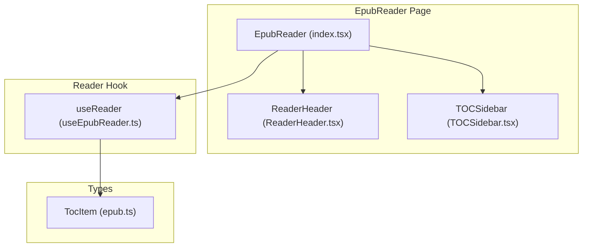
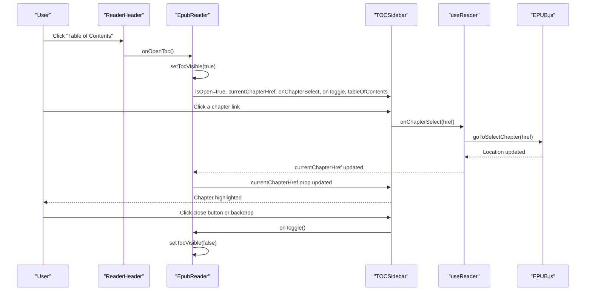
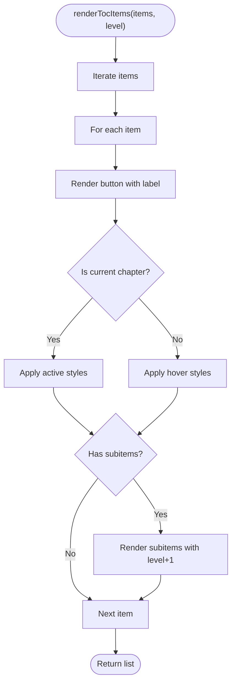
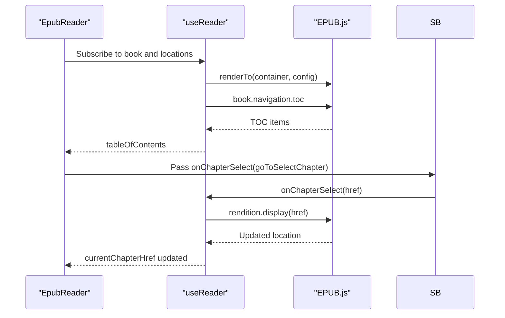

# TOCSidebar

<cite>
**Referenced Files in This Document**
- [TOCSidebar.tsx](file://src/pages/EpubReader/components/TOCSidebar.tsx)
- [epub.ts](file://src/types/epub.ts)
- [index.tsx](file://src/pages/EpubReader/index.tsx)
- [useEpubReader.ts](file://src/pages/EpubReader/hooks/useEpubReader.ts)
- [ReaderHeader.tsx](file://src/pages/EpubReader/components/ReaderHeader.tsx)
- [useKeyboardNavigator.ts](file://src/pages/EpubReader/hooks/useKeyboardNavigator.ts)
</cite>

## Table of Contents
1. [Introduction](#introduction)
2. [Project Structure](#project-structure)
3. [Core Components](#core-components)
4. [Architecture Overview](#architecture-overview)
5. [Detailed Component Analysis](#detailed-component-analysis)
6. [Dependency Analysis](#dependency-analysis)
7. [Performance Considerations](#performance-considerations)
8. [Troubleshooting Guide](#troubleshooting-guide)
9. [Conclusion](#conclusion)

## Introduction
TOCSidebar is a collapsible sidebar component that provides hierarchical chapter navigation within the EPUB reader. It displays a table of contents tree, highlights the current chapter, and integrates with EPUB.js navigation to jump to selected chapters. The component is designed to be responsive, with a mobile overlay/backdrop and accessibility features such as keyboard navigation and screen reader support.

## Project Structure
TOCSidebar resides under the EPUB reader’s components and is orchestrated by the main EpubReader page. It receives navigation state and callbacks from the useReader hook and integrates with ReaderHeader for opening/closing the sidebar.

**Diagram sources**
- [index.tsx](file://src/pages/EpubReader/index.tsx#L346-L402)
- [ReaderHeader.tsx](file://src/pages/EpubReader/components/ReaderHeader.tsx#L1-L85)
- [TOCSidebar.tsx](file://src/pages/EpubReader/components/TOCSidebar.tsx#L1-L101)
- [useEpubReader.ts](file://src/pages/EpubReader/hooks/useEpubReader.ts#L99-L201)
- [epub.ts](file://src/types/epub.ts#L1-L13)

**Section sources**
- [index.tsx](file://src/pages/EpubReader/index.tsx#L346-L402)
- [TOCSidebar.tsx](file://src/pages/EpubReader/components/TOCSidebar.tsx#L1-L101)
- [useEpubReader.ts](file://src/pages/EpubReader/hooks/useEpubReader.ts#L99-L201)
- [epub.ts](file://src/types/epub.ts#L1-L13)

## Core Components
- TOCSidebar: Renders the collapsible sidebar with hierarchical TOC entries, current chapter highlighting, and mobile overlay/backdrop.
- TocItem: Defines the shape of each TOC entry, including nested subitems.
- EpubReader page: Manages visibility state, passes props to TOCSidebar, and wires up navigation callbacks.
- useReader hook: Supplies tableOfContents, currentChapterHref, and goToSelectChapter to the UI.

**Section sources**
- [TOCSidebar.tsx](file://src/pages/EpubReader/components/TOCSidebar.tsx#L1-L101)
- [epub.ts](file://src/types/epub.ts#L1-L13)
- [index.tsx](file://src/pages/EpubReader/index.tsx#L346-L402)
- [useEpubReader.ts](file://src/pages/EpubReader/hooks/useEpubReader.ts#L99-L201)

## Architecture Overview
TOCSidebar is a pure presentational component that depends on props passed from the parent. It does not manage state internally. The parent orchestrates:
- isOpen: Controls sidebar visibility and transforms.
- currentChapter: Highlights the active chapter.
- onChapterSelect: Navigates to the selected chapter via EPUB.js.
- onToggle: Closes the sidebar.
- tableOfContents: Drives the hierarchical rendering.

**Diagram sources**
- [ReaderHeader.tsx](file://src/pages/EpubReader/components/ReaderHeader.tsx#L1-L85)
- [index.tsx](file://src/pages/EpubReader/index.tsx#L346-L402)
- [TOCSidebar.tsx](file://src/pages/EpubReader/components/TOCSidebar.tsx#L1-L101)
- [useEpubReader.ts](file://src/pages/EpubReader/hooks/useEpubReader.ts#L99-L201)

## Detailed Component Analysis

### Props and Behavior
- currentChapter: String or null; used to highlight the active chapter by prefix match against item href.
- onChapterSelect: Callback invoked with an href string to navigate to a chapter.
- isOpen: Boolean controlling sidebar visibility and transform animation.
- onToggle: Callback invoked to close the sidebar.
- tableOfContents: Array of TocItem, enabling recursive rendering of nested chapters.

Current chapter highlighting logic:
- The component checks if the currentChapter starts with the item’s href to determine active state.
- Active items receive emphasis styling; inactive items receive hover styling.

Responsive behavior:
- Desktop: Sidebar slides in/out using transform and duration transitions.
- Mobile: A backdrop overlay appears behind the sidebar and closes the sidebar when tapped.

Accessibility:
- Close button includes an aria-label for screen readers.
- Keyboard navigation is handled by the useKeyboardNavigator hook in the parent, enabling arrow keys and volume keys on mobile.

**Section sources**
- [TOCSidebar.tsx](file://src/pages/EpubReader/components/TOCSidebar.tsx#L1-L101)
- [epub.ts](file://src/types/epub.ts#L1-L13)
- [useKeyboardNavigator.ts](file://src/pages/EpubReader/hooks/useKeyboardNavigator.ts#L1-L48)

### Recursive Rendering and Indentation
TOCSidebar renders nested TOC items recursively:
- Each level increases indentation via inline padding calculation.
- Subitems are rendered only when present, preserving a clean visual hierarchy.

**Diagram sources**
- [TOCSidebar.tsx](file://src/pages/EpubReader/components/TOCSidebar.tsx#L31-L51)

**Section sources**
- [TOCSidebar.tsx](file://src/pages/EpubReader/components/TOCSidebar.tsx#L31-L51)

### Integration with EPUB.js Navigation
- The parent EpubReader page obtains tableOfContents and currentChapterHref from useReader.
- onChapterSelect is bound to goToSelectChapter, which calls EPUB.js rendition.display(href).
- The hook sets tableOfContents from the book navigation and updates currentChapterHref during rendering and events.

**Diagram sources**
- [index.tsx](file://src/pages/EpubReader/index.tsx#L212-L232)
- [useEpubReader.ts](file://src/pages/EpubReader/hooks/useEpubReader.ts#L146-L175)

**Section sources**
- [index.tsx](file://src/pages/EpubReader/index.tsx#L212-L232)
- [useEpubReader.ts](file://src/pages/EpubReader/hooks/useEpubReader.ts#L146-L175)

### Visual Appearance and Styling
- Sidebar layout: Fixed position, full height, 64-unit width, white background, shadow, and smooth transform transitions.
- Header: Contains a close button with aria-label and a title.
- Content area: Scrollable container with spacing and a fallback message when TOC is empty.
- Mobile overlay/backdrop: Semi-transparent overlay covers the viewport on mobile and closes the sidebar on tap.

Styling customization using TailwindCSS:
- The component uses Tailwind utility classes for layout, colors, shadows, and transitions.
- To customize, adjust the Tailwind utility classes directly in the component or extend the theme configuration.

**Section sources**
- [TOCSidebar.tsx](file://src/pages/EpubReader/components/TOCSidebar.tsx#L54-L99)
- [tailwind.config.js](file://tailwind.config.js#L1-L9)

### Accessibility Features
- Keyboard navigation: Arrow keys move between pages; on mobile devices, volume up/down keys are supported.
- Screen reader support: Close button includes aria-label; consider adding aria-expanded on the sidebar container and aria-current on the active item for improved semantics.

**Section sources**
- [useKeyboardNavigator.ts](file://src/pages/EpubReader/hooks/useKeyboardNavigator.ts#L1-L48)
- [TOCSidebar.tsx](file://src/pages/EpubReader/components/TOCSidebar.tsx#L63-L76)

### Usage Examples
- Open TOC from ReaderHeader:
  - The header exposes onOpenToc, which toggles the sidebar visibility in the parent.
- Navigate to a chapter:
  - Clicking a chapter button triggers onChapterSelect, which calls goToSelectChapter to jump to the chapter.
- Close TOC:
  - Clicking the close button or the mobile backdrop invokes onToggle to hide the sidebar.

Integration points:
- Parent manages state for tocVisible and passes isOpen, onToggle, currentChapterHref, onChapterSelect, and tableOfContents to TOCSidebar.
- ReaderHeader triggers onOpenToc to open the sidebar.

**Section sources**
- [ReaderHeader.tsx](file://src/pages/EpubReader/components/ReaderHeader.tsx#L1-L85)
- [index.tsx](file://src/pages/EpubReader/index.tsx#L346-L402)
- [TOCSidebar.tsx](file://src/pages/EpubReader/components/TOCSidebar.tsx#L1-L101)

## Dependency Analysis
- TOCSidebar depends on:
  - TocItem type for rendering hierarchical data.
  - Parent component for props: isOpen, currentChapter, onChapterSelect, onToggle, tableOfContents.
  - useReader hook for navigation functions and data.
- Coupling:
  - Low coupling to external libraries; relies on EPUB.js via the hook.
  - Cohesion: Rendering logic is self-contained within the component.

Potential circular dependencies:
- None observed; TOCSidebar is a leaf component in the reader UI.

External dependencies:
- EPUB.js through useReader hook.
- TailwindCSS for styling.

**Section sources**
- [TOCSidebar.tsx](file://src/pages/EpubReader/components/TOCSidebar.tsx#L1-L101)
- [useEpubReader.ts](file://src/pages/EpubReader/hooks/useEpubReader.ts#L99-L201)
- [epub.ts](file://src/types/epub.ts#L1-L13)

## Performance Considerations
- Large TOC structures:
  - Recursive rendering is efficient for typical TOC sizes. For very deep hierarchies, consider virtualizing long lists or limiting initial expansion to top-level items.
  - Avoid unnecessary re-renders by memoizing tableOfContents and currentChapter in the parent.
- Rendering cost:
  - Each button click recomputes highlight state based on prefix matching; this is O(n) per render pass. Keep TOC arrays reasonably sized.
- Mobile overlay:
  - The backdrop is conditionally rendered only when isOpen is true, minimizing DOM overhead.

[No sources needed since this section provides general guidance]

## Troubleshooting Guide
- No table of contents available:
  - When tableOfContents is empty, the component displays a neutral message. Ensure the book’s navigation is ready and TOC is populated by the hook.
- Current chapter not highlighted:
  - Verify that currentChapterHref starts with the item’s href. Prefix matching is used for highlighting.
- Sidebar does not close:
  - Confirm onToggle is wired correctly and isOpen is controlled by the parent state.
- Navigation does nothing:
  - Ensure onChapterSelect is bound to goToSelectChapter and that the book is fully initialized.

**Section sources**
- [TOCSidebar.tsx](file://src/pages/EpubReader/components/TOCSidebar.tsx#L80-L90)
- [useEpubReader.ts](file://src/pages/EpubReader/hooks/useEpubReader.ts#L146-L175)
- [index.tsx](file://src/pages/EpubReader/index.tsx#L377-L383)

## Conclusion
TOCSidebar delivers a clean, accessible, and responsive chapter navigation experience within the EPUB reader. Its props-driven design integrates seamlessly with EPUB.js via the useReader hook, while TailwindCSS enables straightforward styling customization. For large TOCs, consider performance optimizations such as virtualization or selective expansion to maintain responsiveness.