# UI Components

<cite>
**Referenced Files in This Document**   
- [BookCard/index.tsx](file://src/components/BookCard/index.tsx)
- [BookCard/BookCover.tsx](file://src/components/BookCard/BookCover.tsx)
- [BookCard/ProgressBar.tsx](file://src/components/BookCard/ProgressBar.tsx)
- [BookCard/BookActions.tsx](file://src/components/BookCard/BookActions.tsx)
- [BookCard/hooks/useBookDisplayData.ts](file://src/components/BookCard/hooks/useBookDisplayData.ts)
- [UploadZone/index.tsx](file://src/components/UploadZone/index.tsx)
- [TOCSidebar.tsx](file://src/pages/EpubReader/components/TOCSidebar.tsx)
- [ReaderHeader.tsx](file://src/pages/EpubReader/components/ReaderHeader.tsx)
- [ReaderFooter.tsx](file://src/pages/EpubReader/components/ReaderFooter.tsx)
- [types/book.ts](file://src/types/book.ts)
- [types/epub.ts](file://src/types/epub.ts)
- [utils/epubValidation.ts](file://src/utils/epubValidation.ts)
- [constants/epub.ts](file://src/constants/epub.ts)
- [components/icons.tsx](file://src/components/icons.tsx)
</cite>

## Table of Contents
1. [Introduction](#introduction)
2. [BookCard Component](#bookcard-component)
3. [UploadZone Component](#uploadzone-component)
4. [TOCSidebar Component](#tocsidebar-component)
5. [ReaderHeader and ReaderFooter Components](#readerheader-and-readerfooter-components)
6. [Accessibility and Responsive Design](#accessibility-and-responsive-design)
7. [Performance Optimization](#performance-optimization)
8. [Usage Examples](#usage-examples)

## Introduction
This document provides comprehensive documentation for the key UI components in the EPUB reader application. The components covered include BookCard for displaying book metadata and progress, UploadZone for drag-and-drop file handling, TOCSidebar for collapsible chapter navigation, and ReaderHeader/ReaderFooter for reading controls. Each component is documented with its visual appearance, behavior, props, events, and customization options. The documentation also includes accessibility guidelines, responsive design considerations, and performance optimization strategies.

## BookCard Component

The BookCard component displays individual books in the bookshelf interface, showing metadata such as title, author, cover image, and reading progress. It provides interactive elements for opening and deleting books.

### Visual Appearance and Behavior
The BookCard has a clean, modern design with the following visual elements:
- Book cover image at the top (3:4 aspect ratio)
- Book title and author below the cover
- Progress bar showing reading completion percentage
- Book size and chapter count information
- Action buttons for reading and deleting

The card has hover effects with enhanced shadows and responds to keyboard navigation. Clicking the card or pressing Enter/Space opens the book. The delete button uses event propagation stopping to prevent the card click handler from triggering.

### Props and Attributes
The BookCard component accepts the following props:

| Prop | Type | Required | Description |
|------|------|----------|-------------|
| book | BookMetadata | Yes | Book metadata object containing all display information |
| onOpen | (bookId: string) => void | Yes | Callback function triggered when the book is opened |
| onDelete | (bookId: string) => void | Yes | Callback function triggered when delete is clicked |

The BookMetadata interface includes properties such as id, name, author, coverPath, createdAt, progress, size, and chapterCount.

### Events and Callbacks
The component handles several user interactions:
- Card click: Triggers the onOpen callback with the book ID
- Read button click: Also triggers onOpen (alternative to card click)
- Delete button click: Triggers onDelete with book ID (stops event propagation)

### Customization Options
While the BookCard itself doesn't expose extensive customization options, its subcomponents provide some flexibility:
- The ProgressBar component supports custom colors and percentage display options
- The BookActions component accepts a className prop for additional styling
- The BookCover component allows custom className and handles error callbacks

**Section sources**
- [BookCard/index.tsx](file://src/components/BookCard/index.tsx#L8-L15)
- [types/book.ts](file://src/types/book.ts#L30-L55)

### Supporting Components

#### BookCover Component
The BookCover component handles the display of book cover images with proper loading states and error handling.


**Diagram sources**
- [BookCard/BookCover.tsx](file://src/components/BookCard/BookCover.tsx#L4-L13)

#### ProgressBar Component
The ProgressBar component displays reading progress with visual feedback and optional percentage text.


**Diagram sources**
- [BookCard/ProgressBar.tsx](file://src/components/BookCard/ProgressBar.tsx#L3-L12)

#### BookActions Component
The BookActions component provides consistent styling for the Read and Delete buttons.


**Diagram sources**
- [BookCard/BookActions.tsx](file://src/components/BookCard/BookActions.tsx#L4-L13)

#### useBookDisplayData Hook
The useBookDisplayData hook processes book metadata to provide display-ready values with appropriate fallbacks.


**Diagram sources**
- [BookCard/hooks/useBookDisplayData.ts](file://src/components/BookCard/hooks/useBookDisplayData.ts#L8-L32)

## UploadZone Component

The UploadZone component provides a drag-and-drop interface for uploading EPUB files with visual feedback during the upload process.

### Visual Appearance and Behavior
The UploadZone has a clean, intuitive design with the following states:
- Default state: Dashed border with upload icon, title, and description
- Drag-over state: Blue border and background indicating valid drop zone
- Uploading state: Spinner animation with "Uploading book..." text
- Disabled state: Reduced opacity and "not-allowed" cursor

Users can either drag and drop an EPUB file onto the zone or click to open a file picker. The component provides immediate feedback for invalid files.

### Props and Attributes
The UploadZone component accepts the following props:

| Prop | Type | Required | Description |
|------|------|----------|-------------|
| onUploadComplete | () => void | No | Optional callback triggered when upload is successfully completed |

### Events and Callbacks
The component handles several file upload interactions:
- Drag over: Changes visual state to indicate valid drop zone
- Drag leave: Reverts to default visual state
- Drop: Processes the dropped file, validates it, and initiates upload
- File input change: Handles file selection from the file picker
- Upload completion: Calls onUploadComplete callback if provided

### File Validation
The component uses centralized validation logic from epubValidation utilities:

```mermaid
flowchart TD
Start([File Received]) --> CheckExtension["Check file extension (.epub)"]
CheckExtension --> |Invalid| ShowError["Show 'Only EPUB files are supported'"]
CheckExtension --> |Valid| CheckSize["Check file size > 0"]
CheckSize --> |Empty| ShowError["Show 'File is empty'"]
CheckSize --> |Valid| CheckMaxSize["Check size ≤ 100MB"]
CheckMaxSize --> |Too large| ShowError["Show size limit exceeded"]
CheckMaxSize --> |Valid| InitiateUpload["Call handleFileUpload"]
```



**Diagram sources**
- [utils/epubValidation.ts](file://src/utils/epubValidation.ts#L28-L61)

### Customization Options
The UploadZone component has limited customization options, focusing on consistent behavior across the application. The maximum file size (100MB) is defined as a constant and used consistently throughout the validation process.

**Section sources**
- [UploadZone/index.tsx](file://src/components/UploadZone/index.tsx#L11-L14)
- [utils/epubValidation.ts](file://src/utils/epubValidation.ts#L9-L11)
- [constants/epub.ts](file://src/constants/epub.ts#L31-L38)

## TOCSidebar Component

The TOCSidebar component provides collapsible chapter navigation with synchronization to the current reading position.

### Visual Appearance and Behavior
The TOCSidebar has the following visual characteristics:
- Fixed position on the left side of the screen (64px width)
- Slide-in animation from the left when opened
- Semi-transparent overlay on mobile devices that closes the sidebar when clicked
- Current chapter highlighted in blue
- Hierarchical indentation for nested chapters (subitems)
- Scrollable content area that takes available viewport height

The sidebar can be toggled open or closed, and clicking any chapter navigates to that section of the book.

### Props and Attributes
The TOCSidebar component accepts the following props:

| Prop | Type | Required | Description |
|------|------|----------|-------------|
| currentChapter | string \| null | Yes | The href of the currently viewed chapter for highlighting |
| onChapterSelect | (href: string) => void | Yes | Callback when a chapter is selected |
| isOpen | boolean | Yes | Controls whether the sidebar is visible |
| onToggle | () => void | Yes | Callback to toggle the sidebar open/closed |
| tableOfContents | TocItem[] | Yes | Array of TOC items with href, label, and optional subitems |

The TocItem interface defines the structure of table of contents entries with href (navigation target), label (display text), and subitems (nested chapters).

### Events and Callbacks
The component handles chapter navigation and sidebar management:
- Chapter click: Triggers onChapterSelect with the chapter's href
- Close button click: Triggers onToggle to close the sidebar
- Overlay click (mobile): Triggers onToggle to close the sidebar
- Recursive rendering: Handles nested chapters through recursive function calls

### Customization Options
The TOCSidebar has minimal customization options, focusing on consistent behavior. The styling is fixed with:
- 16px level-based indentation for nested chapters
- Blue highlighting for the current chapter
- Fixed width of 64px
- Responsive behavior with mobile overlay


**Diagram sources**
- [TOCSidebar.tsx](file://src/pages/EpubReader/components/TOCSidebar.tsx#L8-L23)

**Section sources**
- [TOCSidebar.tsx](file://src/pages/EpubReader/components/TOCSidebar.tsx#L8-L23)
- [types/epub.ts](file://src/types/epub.ts#L2-L6)

## ReaderHeader and ReaderFooter Components

The ReaderHeader and ReaderFooter components provide navigation controls and reading assistance in the EPUB reader interface.

### ReaderHeader Component

#### Visual Appearance and Behavior
The ReaderHeader appears at the top of the reading interface with the following elements:
- Table of Contents button (menu icon)
- Home button (house icon) for returning to the bookshelf
- Search button (magnifying glass icon) - currently placeholder
- Application title ("EPUB Reader")
- Help button (question mark icon)
- Fullscreen toggle button
- Settings button (gear icon)

The header has a slide-down animation when visible and slides up when hidden. It has a white background with subtle shadow and border.

#### Props and Attributes
| Prop | Type | Required | Description |
|------|------|----------|-------------|
| visible | boolean | Yes | Controls whether the header is visible |
| onOpenToc | () => void | Yes | Callback to open the table of contents |
| onHelpClick | () => void | Yes | Callback when help is clicked |

#### Events and Callbacks
- Table of Contents button: Triggers onOpenToc
- Home button: Navigates to the root route using react-router
- Help button: Triggers onHelpClick
- Fullscreen button: Toggles fullscreen mode using browser API
- Settings button: Navigates to the settings page

### ReaderFooter Component

#### Visual Appearance and Behavior
The ReaderFooter appears at the bottom of the reading interface with:
- Progress bar showing current page position
- Page number display (e.g., "Page 5 of 20")
- Percentage completion
- Previous page button (left arrow)
- Next page button (right arrow)

The footer has a slide-up animation when visible and is hidden when not needed.

#### Props and Attributes
| Prop | Type | Required | Description |
|------|------|----------|-------------|
| visible | boolean | Yes | Controls whether the footer is visible |
| currentPage | number | Yes | Current page index (0-based) |
| totalPages | number | Yes | Total number of pages |
| onNext | () => void | Yes | Callback for next page navigation |
| onPrev | () => void | Yes | Callback for previous page navigation |

#### Events and Callbacks
- Previous button: Triggers onPrev callback
- Next button: Triggers onNext callback
- Progress calculation: Automatically calculates percentage based on currentPage and totalPages

### Shared Behavior and Design
Both components share the following characteristics:
- Fixed positioning at top/bottom of viewport
- Z-index of 50 to appear above content
- Smooth slide animations using CSS transitions
- White background with border and shadow
- Centered content within a max-width container
- Icon buttons with hover effects
- Accessibility features including proper ARIA labels


**Diagram sources**
- [ReaderHeader.tsx](file://src/pages/EpubReader/components/ReaderHeader.tsx#L5-L9)
- [ReaderFooter.tsx](file://src/pages/EpubReader/components/ReaderFooter.tsx#L4-L10)
- [components/icons.tsx](file://src/components/icons.tsx#L3-L328)

**Section sources**
- [ReaderHeader.tsx](file://src/pages/EpubReader/components/ReaderHeader.tsx#L5-L9)
- [ReaderFooter.tsx](file://src/pages/EpubReader/components/ReaderFooter.tsx#L4-L10)

## Accessibility and Responsive Design

### Accessibility Features
All components implement comprehensive accessibility features:

**BookCard**
- Role="button" for keyboard navigation
- tabIndex=0 for focusability
- onKeyDown handler for Enter and Space keys
- aria-label with book title
- Proper heading hierarchy (h3 for title)
- Semantic HTML structure

**UploadZone**
- Label element associated with file input
- Descriptive text for screen readers
- Visual feedback for different states
- Keyboard accessible through click target

**TOCSidebar**
- Button elements for chapter navigation
- ARIA labels for close button
- Logical tab order
- Sufficient color contrast
- Focus indicators

**ReaderHeader and Footer**
- Icon buttons with title attributes
- ARIA labels for all interactive elements
- Proper contrast ratios
- Keyboard navigable controls

### Responsive Design Considerations
The components are designed to work across different screen sizes:

**Mobile Considerations**
- TOCSidebar uses a full-screen overlay on mobile (md:hidden)
- Touch targets are appropriately sized (minimum 44px)
- Font sizes are readable on small screens
- Layout adapts to viewport width

**Tablet and Desktop**
- Fixed positioning works with various screen heights
- Max-width containers prevent overly wide content
- Hover states enhance desktop experience
- Sidebar width is fixed but content is scrollable

**Responsive Breakpoints**
- Mobile: Full-width components with simplified layouts
- Tablet: Balanced layout with adequate spacing
- Desktop: Full feature set with hover interactions

## Performance Optimization

### BookCard List Rendering
When rendering large lists of BookCards, consider the following optimizations:

**Virtualization**
For large book collections, implement virtual scrolling to render only visible cards:


**Image Loading Optimization**
The BookCover component already implements lazy loading patterns:
- Base64 encoding from OPFS reduces network requests
- Loading states prevent layout shifts
- Error handling prevents broken image displays
- Aspect ratio preservation maintains layout stability

### Component Memoization
Consider memoizing components to prevent unnecessary re-renders:
- Use React.memo for BookCard when props don't change frequently
- Memoize the useBookDisplayData hook results
- Implement shouldComponentUpdate logic for complex updates

### Event Handling Optimization
The current implementation efficiently handles events:
- Event delegation through parent click handlers
- Proper cleanup of async operations
- Debounced or throttled handlers where appropriate
- Cleanup of event listeners in useEffect cleanup functions

## Usage Examples

### BookCard Implementation
```jsx
<BookCard 
  book={bookMetadata}
  onOpen={(bookId) => navigate(`/reader/${bookId}`)}
  onDelete={(bookId) => dispatch(deleteBook(bookId))}
/>
```

### UploadZone Implementation
```jsx
<UploadZone 
  onUploadComplete={() => {
    toast.success('Book uploaded successfully');
    loadBooks();
  }}
/>
```

### TOCSidebar Implementation
```jsx
<TOCSidebar
  currentChapter={currentChapterHref}
  onChapterSelect={handleChapterNavigation}
  isOpen={tocOpen}
  onToggle={() => setTocOpen(!tocOpen)}
  tableOfContents={tableOfContents}
/>
```

### ReaderHeader Implementation
```jsx
<ReaderHeader
  visible={headerVisible}
  onOpenToc={() => setTocOpen(true)}
  onHelpClick={() => setShowHelp(true)}
/>
```

### ReaderFooter Implementation
```jsx
<ReaderFooter
  visible={footerVisible}
  currentPage={currentPage}
  totalPages={totalPages}
  onNext={handleNextPage}
  onPrev={handlePrevPage}
/>
```

**Section sources**
- [BookCard/index.tsx](file://src/components/BookCard/index.tsx)
- [UploadZone/index.tsx](file://src/components/UploadZone/index.tsx)
- [TOCSidebar.tsx](file://src/pages/EpubReader/components/TOCSidebar.tsx)
- [ReaderHeader.tsx](file://src/pages/EpubReader/components/ReaderHeader.tsx)
- [ReaderFooter.tsx](file://src/pages/EpubReader/components/ReaderFooter.tsx)