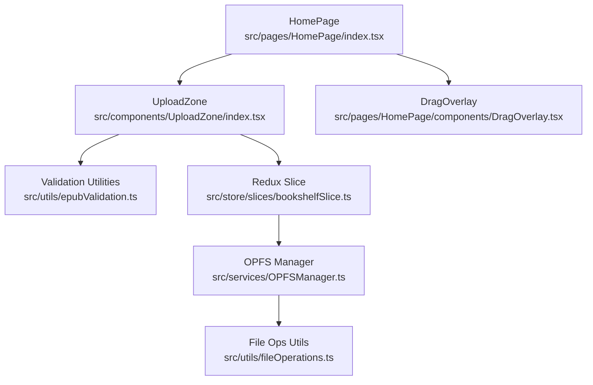
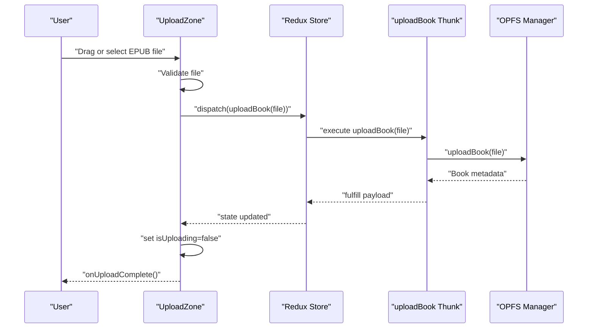
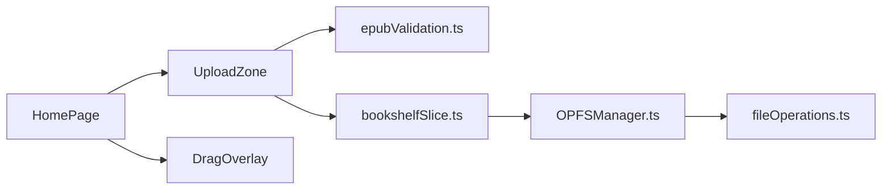
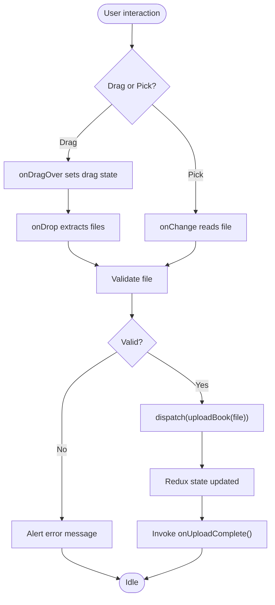

# UploadZone

<cite>
**Referenced Files in This Document**
- [index.tsx](file://src/components/UploadZone/index.tsx)
- [epubValidation.ts](file://src/utils/epubValidation.ts)
- [epub.ts](file://src/constants/epub.ts)
- [bookshelfSlice.ts](file://src/store/slices/bookshelfSlice.ts)
- [OPFSManager.ts](file://src/services/OPFSManager.ts)
- [index.tsx](file://src/pages/HomePage/index.tsx)
- [DragOverlay.tsx](file://src/pages/HomePage/components/DragOverlay.tsx)
- [fileOperations.ts](file://src/utils/fileOperations.ts)
</cite>

## Table of Contents
1. [Introduction](#introduction)
2. [Project Structure](#project-structure)
3. [Core Components](#core-components)
4. [Architecture Overview](#architecture-overview)
5. [Detailed Component Analysis](#detailed-component-analysis)
6. [Dependency Analysis](#dependency-analysis)
7. [Performance Considerations](#performance-considerations)
8. [Troubleshooting Guide](#troubleshooting-guide)
9. [Conclusion](#conclusion)
10. [Appendices](#appendices)

## Introduction
UploadZone is a React component that enables EPUB file uploads through drag-and-drop or file selection. It provides clear visual feedback for three states:
- Idle: Normal drop zone with instructions and a hidden file input trigger.
- Drag-over: Visual indication that a file is being dragged over the zone.
- Uploading: Disabled interactions with a spinner and a status message while dispatching the upload action.

It validates files using centralized utilities, integrates with the Redux store via the uploadBook async thunk, and surfaces errors to the user. The component is designed to be self-contained and reusable, with a minimal API surface focused on onUploadComplete.

## Project Structure
UploadZone resides under src/components/UploadZone and collaborates with:
- Validation utilities in src/utils/epubValidation.ts
- Store slice in src/store/slices/bookshelfSlice.ts
- OPFS storage manager in src/services/OPFSManager.ts
- Page-level drag-and-drop integration in src/pages/HomePage/index.tsx
- Optional visual overlay in src/pages/HomePage/components/DragOverlay.tsx

**Diagram sources**
- [index.tsx](file://src/components/UploadZone/index.tsx#L1-L128)
- [epubValidation.ts](file://src/utils/epubValidation.ts#L1-L77)
- [bookshelfSlice.ts](file://src/store/slices/bookshelfSlice.ts#L1-L189)
- [OPFSManager.ts](file://src/services/OPFSManager.ts#L1-L510)
- [index.tsx](file://src/pages/HomePage/index.tsx#L1-L200)
- [DragOverlay.tsx](file://src/pages/HomePage/components/DragOverlay.tsx#L1-L24)
- [fileOperations.ts](file://src/utils/fileOperations.ts#L1-L91)

**Section sources**
- [index.tsx](file://src/components/UploadZone/index.tsx#L1-L128)
- [epubValidation.ts](file://src/utils/epubValidation.ts#L1-L77)
- [bookshelfSlice.ts](file://src/store/slices/bookshelfSlice.ts#L1-L189)
- [OPFSManager.ts](file://src/services/OPFSManager.ts#L1-L510)
- [index.tsx](file://src/pages/HomePage/index.tsx#L1-L200)
- [DragOverlay.tsx](file://src/pages/HomePage/components/DragOverlay.tsx#L1-L24)
- [fileOperations.ts](file://src/utils/fileOperations.ts#L1-L91)

## Core Components
- UploadZone: The primary component that manages drag-and-drop, file input, validation, and upload flow.
- Validation utilities: Centralized helpers for EPUB validation and formatting.
- Redux slice: uploadBook async thunk orchestrating OPFS operations and state updates.
- OPFS manager: File system operations and metadata extraction.
- HomePage integration: Demonstrates drag-and-drop UX and optional overlay.

Key responsibilities:
- Visual state management (idle, drag-over, uploading).
- File validation and user feedback.
- Dispatching uploadBook and invoking onUploadComplete.
- Integrating with Redux store and handling errors.

**Section sources**
- [index.tsx](file://src/components/UploadZone/index.tsx#L1-L128)
- [epubValidation.ts](file://src/utils/epubValidation.ts#L1-L77)
- [bookshelfSlice.ts](file://src/store/slices/bookshelfSlice.ts#L40-L56)
- [OPFSManager.ts](file://src/services/OPFSManager.ts#L126-L219)

## Architecture Overview
UploadZone coordinates with Redux and OPFS to upload EPUBs. The flow is:
- User drags or selects an EPUB file.
- UploadZone validates the file using validation utilities.
- UploadZone dispatches uploadBook with the validated file.
- Redux slice executes the async thunk, which calls OPFS manager to write files and extract metadata.
- On completion, UploadZone invokes onUploadComplete.

**Diagram sources**
- [index.tsx](file://src/components/UploadZone/index.tsx#L28-L48)
- [bookshelfSlice.ts](file://src/store/slices/bookshelfSlice.ts#L40-L56)
- [OPFSManager.ts](file://src/services/OPFSManager.ts#L126-L219)

## Detailed Component Analysis

### Props and Behavior
- onUploadComplete: Optional callback invoked after a successful upload completes. This allows parent components to refresh lists or navigate to the newly added book.

Behavior highlights:
- Drag-and-drop: Tracks drag state and prevents default browser behavior to enable drop targets.
- File input: Hidden input triggered via label for accessibility and cross-browser compatibility.
- Uploading state: Disables interactions and shows a spinner with a status message.

**Section sources**
- [index.tsx](file://src/components/UploadZone/index.tsx#L11-L14)
- [index.tsx](file://src/components/UploadZone/index.tsx#L51-L76)
- [index.tsx](file://src/components/UploadZone/index.tsx#L78-L86)
- [index.tsx](file://src/components/UploadZone/index.tsx#L88-L127)

### Visual States
- Idle: Normal border and hover styles; shows instructions and a labeled button to open the file picker.
- Drag-over: Blue border and subtle background highlight to indicate drop target.
- Uploading: Spinner and status text; pointer becomes not-allowed and opacity reduces to indicate disabled interactions.

Accessibility note: The hidden input is associated with a visible label for keyboard and assistive technology users.

**Section sources**
- [index.tsx](file://src/components/UploadZone/index.tsx#L88-L127)

### Event Handling
- Drag events:
  - onDragOver toggles drag state.
  - onDragLeave resets drag state.
  - onDrop extracts files, validates, and triggers upload.
- File input change:
  - onChange reads the selected file and triggers upload.

These handlers prevent default browser behavior and coordinate with UploadZone’s internal state.

**Section sources**
- [index.tsx](file://src/components/UploadZone/index.tsx#L51-L76)
- [index.tsx](file://src/components/UploadZone/index.tsx#L78-L86)

### File Validation
UploadZone delegates validation to centralized utilities:
- isValidEpubFile: Checks extension, size, and MIME type.
- getEpubValidationError: Produces a user-friendly error message for invalid files.
- MAX_EPUB_SIZE and formatFileSize: Limits and human-readable size display.

Validation occurs before dispatching uploadBook.

**Section sources**
- [index.tsx](file://src/components/UploadZone/index.tsx#L25-L35)
- [epubValidation.ts](file://src/utils/epubValidation.ts#L23-L61)
- [epub.ts](file://src/constants/epub.ts#L31-L39)

### Redux Integration
- Dispatches uploadBook with the validated file.
- Uses unwrap() to handle async result synchronously and invoke onUploadComplete.
- Errors are surfaced via alerts; parent components can also subscribe to Redux state for centralized error handling.

Integration points:
- uploadBook async thunk in the slice.
- OPFS manager performing file writes and metadata extraction.

**Section sources**
- [index.tsx](file://src/components/UploadZone/index.tsx#L37-L45)
- [bookshelfSlice.ts](file://src/store/slices/bookshelfSlice.ts#L40-L56)
- [OPFSManager.ts](file://src/services/OPFSManager.ts#L126-L219)

### Usage Examples
- Basic integration: Render UploadZone and pass onUploadComplete to refresh the bookshelf or navigate to the new book.
- Page-level drag-and-drop: HomePage demonstrates a broader drag-and-drop experience with a visual overlay and file input fallback.

Example references:
- UploadZone usage and props: [index.tsx](file://src/components/UploadZone/index.tsx#L11-L14)
- HomePage drag-and-drop flow: [index.tsx](file://src/pages/HomePage/index.tsx#L81-L131)
- HomePage file input fallback: [index.tsx](file://src/pages/HomePage/index.tsx#L133-L152)
- Drag overlay component: [DragOverlay.tsx](file://src/pages/HomePage/components/DragOverlay.tsx#L1-L24)

**Section sources**
- [index.tsx](file://src/components/UploadZone/index.tsx#L11-L14)
- [index.tsx](file://src/pages/HomePage/index.tsx#L81-L131)
- [index.tsx](file://src/pages/HomePage/index.tsx#L133-L152)
- [DragOverlay.tsx](file://src/pages/HomePage/components/DragOverlay.tsx#L1-L24)

### Accessibility Considerations
- Keyboard users: The label element associates the hidden input with a visible button, enabling keyboard activation.
- Screen readers: The component exposes text content for instructions and status messages. Consider adding explicit aria-live regions or aria-describedby attributes if integrating into larger forms.
- Focus management: Ensure focus moves appropriately after upload completion if used within modals or dialogs.

[No sources needed since this section provides general guidance]

### Error Handling
- Validation errors: getEpubValidationError returns a message for unsupported extensions, empty files, or oversized files.
- Upload failures: Alerts display error messages; parent components can also observe Redux state for centralized error UI.
- OPFS errors: OPFS manager wraps operations and logs failures; uploadBook thunk rejects with user-friendly messages.

**Section sources**
- [epubValidation.ts](file://src/utils/epubValidation.ts#L43-L61)
- [index.tsx](file://src/components/UploadZone/index.tsx#L37-L45)
- [bookshelfSlice.ts](file://src/store/slices/bookshelfSlice.ts#L40-L56)
- [OPFSManager.ts](file://src/services/OPFSManager.ts#L126-L133)

### Customization Options
- Styling: Tailwind classes define borders, colors, spacing, and transitions. Adjust classes to match brand guidelines.
- Messages: Text content for instructions and status is inline; customize by passing children or wrapping the component.
- Feedback: Replace alerts with toast notifications or modal-based error displays by handling errors in parent components and subscribing to Redux state.

**Section sources**
- [index.tsx](file://src/components/UploadZone/index.tsx#L88-L127)
- [bookshelfSlice.ts](file://src/store/slices/bookshelfSlice.ts#L131-L146)

## Dependency Analysis
UploadZone depends on:
- Validation utilities for EPUB checks and formatting.
- Redux slice for dispatching uploadBook.
- OPFS manager for file system operations.

HomePage complements UploadZone with page-level drag-and-drop UX and an overlay.

**Diagram sources**
- [index.tsx](file://src/components/UploadZone/index.tsx#L1-L128)
- [epubValidation.ts](file://src/utils/epubValidation.ts#L1-L77)
- [bookshelfSlice.ts](file://src/store/slices/bookshelfSlice.ts#L1-L189)
- [OPFSManager.ts](file://src/services/OPFSManager.ts#L1-L510)
- [index.tsx](file://src/pages/HomePage/index.tsx#L1-L200)
- [DragOverlay.tsx](file://src/pages/HomePage/components/DragOverlay.tsx#L1-L24)
- [fileOperations.ts](file://src/utils/fileOperations.ts#L1-L91)

**Section sources**
- [index.tsx](file://src/components/UploadZone/index.tsx#L1-L128)
- [epubValidation.ts](file://src/utils/epubValidation.ts#L1-L77)
- [bookshelfSlice.ts](file://src/store/slices/bookshelfSlice.ts#L1-L189)
- [OPFSManager.ts](file://src/services/OPFSManager.ts#L1-L510)
- [index.tsx](file://src/pages/HomePage/index.tsx#L1-L200)
- [DragOverlay.tsx](file://src/pages/HomePage/components/DragOverlay.tsx#L1-L24)
- [fileOperations.ts](file://src/utils/fileOperations.ts#L1-L91)

## Performance Considerations
- File size limit: Enforced by MAX_EPUB_SIZE to prevent large uploads from blocking the UI or OPFS operations.
- Validation pre-check: Early rejection avoids unnecessary dispatches and network overhead.
- OPFS writes: File operations are asynchronous; avoid triggering multiple simultaneous uploads to reduce contention.
- Rendering: Spinner and status text are lightweight; keep customizations minimal to preserve responsiveness.

[No sources needed since this section provides general guidance]

## Troubleshooting Guide
Common issues and resolutions:
- Invalid file type: Ensure the file has a .epub extension and supported MIME types.
- Oversized file: Reduce file size below the maximum limit.
- Upload failure: Check browser support for OPFS and network conditions; retry after resolving underlying issues.
- Drag-and-drop not working: Verify that drag events are not prevented elsewhere and that the drop zone is visible.

Where to look:
- Validation messages and limits: [epubValidation.ts](file://src/utils/epubValidation.ts#L23-L61), [epub.ts](file://src/constants/epub.ts#L31-L39)
- Redux error handling: [bookshelfSlice.ts](file://src/store/slices/bookshelfSlice.ts#L131-L146)
- OPFS error handling: [OPFSManager.ts](file://src/services/OPFSManager.ts#L126-L133), [fileOperations.ts](file://src/utils/fileOperations.ts#L22-L36)

**Section sources**
- [epubValidation.ts](file://src/utils/epubValidation.ts#L23-L61)
- [epub.ts](file://src/constants/epub.ts#L31-L39)
- [bookshelfSlice.ts](file://src/store/slices/bookshelfSlice.ts#L131-L146)
- [OPFSManager.ts](file://src/services/OPFSManager.ts#L126-L133)
- [fileOperations.ts](file://src/utils/fileOperations.ts#L22-L36)

## Conclusion
UploadZone provides a robust, accessible, and visually clear way to upload EPUBs. It centralizes validation, integrates cleanly with Redux, and offers clear feedback during the upload lifecycle. By leveraging the provided props and callbacks, developers can integrate it seamlessly into applications requiring EPUB ingestion, while maintaining consistent UX and error handling.

[No sources needed since this section summarizes without analyzing specific files]

## Appendices

### Props Reference
- onUploadComplete: Optional callback invoked after a successful upload completes.

**Section sources**
- [index.tsx](file://src/components/UploadZone/index.tsx#L11-L14)

### Validation Rules and Limits
- Accepted extensions: .epub
- Accepted MIME types: application/epub+zip, application/x-zip-compressed, application/zip
- Maximum file size: 100 MB

**Section sources**
- [epub.ts](file://src/constants/epub.ts#L31-L39)
- [epubValidation.ts](file://src/utils/epubValidation.ts#L8-L11)

### Data Flow Diagram (Code-Level)

**Diagram sources**
- [index.tsx](file://src/components/UploadZone/index.tsx#L51-L86)
- [index.tsx](file://src/components/UploadZone/index.tsx#L28-L45)
- [bookshelfSlice.ts](file://src/store/slices/bookshelfSlice.ts#L40-L56)