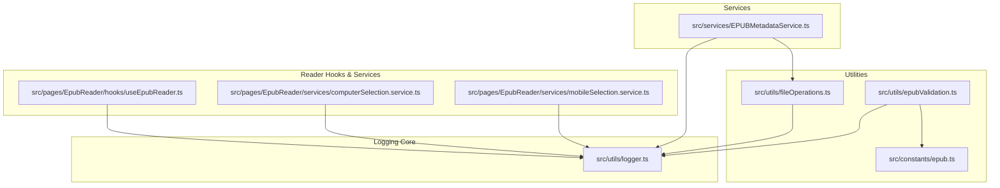
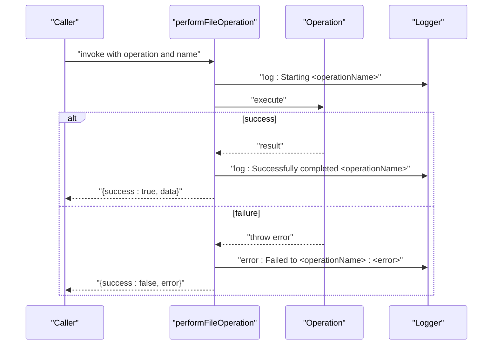
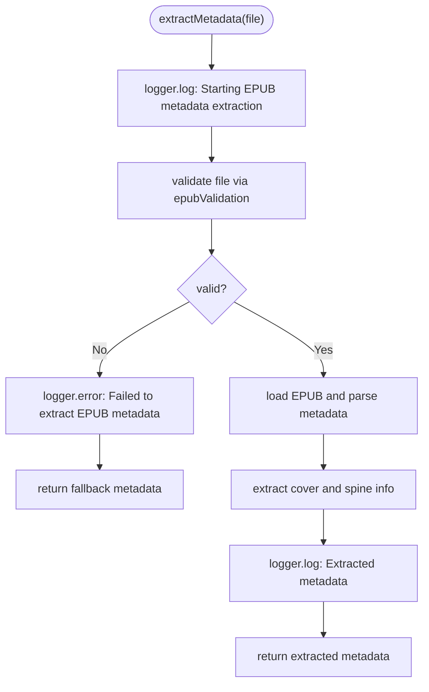
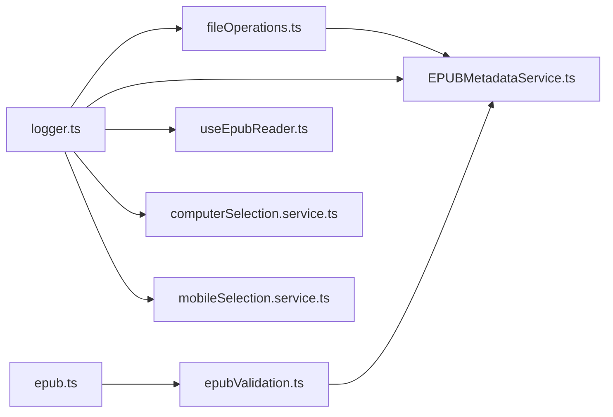

# Application Logging System

<cite>
**Referenced Files in This Document**
- [logger.ts](file://src/utils/logger.ts)
- [fileOperations.ts](file://src/utils/fileOperations.ts)
- [EPUBMetadataService.ts](file://src/services/EPUBMetadataService.ts)
- [useEpubReader.ts](file://src/pages/EpubReader/hooks/useEpubReader.ts)
- [computerSelection.service.ts](file://src/pages/EpubReader/services/computerSelection.service.ts)
- [mobileSelection.service.ts](file://src/pages/EpubReader/services/mobileSelection.service.ts)
- [epubValidation.ts](file://src/utils/epubValidation.ts)
- [epub.ts](file://src/constants/epub.ts)
- [package.json](file://package.json)
</cite>

## Table of Contents
1. [Introduction](#introduction)
2. [Project Structure](#project-structure)
3. [Core Components](#core-components)
4. [Architecture Overview](#architecture-overview)
5. [Detailed Component Analysis](#detailed-component-analysis)
6. [Dependency Analysis](#dependency-analysis)
7. [Performance Considerations](#performance-considerations)
8. [Troubleshooting Guide](#troubleshooting-guide)
9. [Conclusion](#conclusion)
10. [Appendices](#appendices)

## Introduction
This document explains the application’s logging system, focusing on the logger object and its consistent use across utilities and services. It covers how timestamps are formatted using dayjs, the available log levels, and practical examples of logging in EPUB metadata extraction and file operations. It also provides guidance on integrating the logger into new components and services, and outlines strategies for controlling verbosity in production environments.

## Project Structure
The logging system is centralized in a small utility module and consumed broadly across services and utilities. The key files are:
- Logger utility: src/utils/logger.ts
- File operation utilities: src/utils/fileOperations.ts
- EPUB metadata service: src/services/EPUBMetadataService.ts
- Reader hooks and selection services: src/pages/EpubReader/hooks/useEpubReader.ts, src/pages/EpubReader/services/computerSelection.service.ts, src/pages/EpubReader/services/mobileSelection.service.ts
- Validation utilities: src/utils/epubValidation.ts
- EPUB constants: src/constants/epub.ts
- Dependencies: package.json

**Diagram sources**
- [logger.ts](file://src/utils/logger.ts#L1-L18)
- [fileOperations.ts](file://src/utils/fileOperations.ts#L1-L91)
- [EPUBMetadataService.ts](file://src/services/EPUBMetadataService.ts#L1-L177)
- [useEpubReader.ts](file://src/pages/EpubReader/hooks/useEpubReader.ts#L70-L90)
- [computerSelection.service.ts](file://src/pages/EpubReader/services/computerSelection.service.ts#L1-L20)
- [mobileSelection.service.ts](file://src/pages/EpubReader/services/mobileSelection.service.ts#L1-L231)
- [epubValidation.ts](file://src/utils/epubValidation.ts#L1-L77)
- [epub.ts](file://src/constants/epub.ts#L1-L61)

**Section sources**
- [logger.ts](file://src/utils/logger.ts#L1-L18)
- [fileOperations.ts](file://src/utils/fileOperations.ts#L1-L91)
- [EPUBMetadataService.ts](file://src/services/EPUBMetadataService.ts#L1-L177)
- [useEpubReader.ts](file://src/pages/EpubReader/hooks/useEpubReader.ts#L70-L90)
- [computerSelection.service.ts](file://src/pages/EpubReader/services/computerSelection.service.ts#L1-L20)
- [mobileSelection.service.ts](file://src/pages/EpubReader/services/mobileSelection.service.ts#L1-L231)
- [epubValidation.ts](file://src/utils/epubValidation.ts#L1-L77)
- [epub.ts](file://src/constants/epub.ts#L1-L61)
- [package.json](file://package.json#L1-L61)

## Core Components
- Logger object with four methods:
  - log: general informational messages
  - info: neutral informational messages
  - warn: warning messages
  - error: error messages
- Timestamp formatting using dayjs with HH:mm:ss format
- Integration with console APIs for output

Key characteristics:
- Centralized import path for consumers
- Consistent prefixing with timestamp and level tag
- Simple and lightweight, suitable for browser environments

**Section sources**
- [logger.ts](file://src/utils/logger.ts#L1-L18)

## Architecture Overview
The logger is a thin wrapper around console APIs with timestamp formatting. Utilities and services import and use the logger directly. The file operations utility wraps async operations and logs lifecycle events and errors consistently. The EPUB metadata service orchestrates extraction steps and logs progress and outcomes.

**Diagram sources**
- [fileOperations.ts](file://src/utils/fileOperations.ts#L22-L36)
- [logger.ts](file://src/utils/logger.ts#L1-L18)

**Section sources**
- [fileOperations.ts](file://src/utils/fileOperations.ts#L22-L36)
- [logger.ts](file://src/utils/logger.ts#L1-L18)

## Detailed Component Analysis

### Logger Utility
- Purpose: Provide consistent timestamped logging across the app
- Methods:
  - log(...messages)
  - info(...messages)
  - warn(...messages)
  - error(...messages)
- Implementation details:
  - Uses dayjs to format current time as HH:mm:ss
  - Wraps console.log/console.warn/console.error with consistent prefixing
  - Accepts variadic arguments for flexible message composition

Integration pattern:
- Import from a single path and use across the codebase
- Encourages uniformity in log output and readability

**Section sources**
- [logger.ts](file://src/utils/logger.ts#L1-L18)

### File Operations Utility
- Purpose: Wrap async operations with consistent logging and error handling
- Key functions:
  - performFileOperation(operation, operationName): executes an async operation, logs lifecycle, and returns a structured result
  - fileToBase64(file): safe base64 conversion with error logging
  - safeGetFileHandle(getHandle, fileName): safe file handle retrieval with error logging
  - safeGetDirectoryHandle(getHandle, dirName): safe directory handle retrieval with error logging

Behavior:
- Logs start and completion of named operations
- On error, captures message and returns a result object with success=false and error string
- Uses logger.error for failures and logger.log for successful outcomes

**Section sources**
- [fileOperations.ts](file://src/utils/fileOperations.ts#L1-L91)

### EPUB Metadata Service
- Purpose: Extract metadata and cover-related data from EPUB files
- Key functions:
  - extractMetadata(file): orchestrates validation, loading, parsing, and extraction; logs progress and outcomes
  - extractCoverImage(book): attempts to get cover URL and logs results
  - getCoverFormat(book): extracts image format and logs results
  - extractCoverBlob(book): fetches cover blob, validates, and logs results
  - getBookByBookId(bookId): constructs a book instance and logs creation

Logging patterns:
- Uses logger.log for start/end and intermediate steps
- Uses logger.warn for recoverable issues (e.g., missing cover, empty blobs)
- Uses logger.error for failures (e.g., extraction errors, fetch failures)

Validation integration:
- Uses epubValidation utilities to validate files before processing
- Uses constants for file size limits and supported extensions/mime types

**Section sources**
- [EPUBMetadataService.ts](file://src/services/EPUBMetadataService.ts#L1-L177)
- [epubValidation.ts](file://src/utils/epubValidation.ts#L1-L77)
- [epub.ts](file://src/constants/epub.ts#L1-L61)

### Reader Hooks and Selection Services
- useEpubReader:
  - Logs navigation boundaries and selection events
  - Uses logger.warn for end-of-book and logger.log for start-of-book
- computerSelection.service:
  - Logs mouse/touch events during selection
- mobileSelection.service:
  - Logs selection lifecycle and handles errors with logger.error

These demonstrate how UI and interaction services integrate logging for debugging and monitoring.

**Section sources**
- [useEpubReader.ts](file://src/pages/EpubReader/hooks/useEpubReader.ts#L70-L90)
- [computerSelection.service.ts](file://src/pages/EpubReader/services/computerSelection.service.ts#L1-L20)
- [mobileSelection.service.ts](file://src/pages/EpubReader/services/mobileSelection.service.ts#L1-L231)

### Logging Flow for EPUB Metadata Extraction

**Diagram sources**
- [EPUBMetadataService.ts](file://src/services/EPUBMetadataService.ts#L11-L62)
- [epubValidation.ts](file://src/utils/epubValidation.ts#L43-L61)

**Section sources**
- [EPUBMetadataService.ts](file://src/services/EPUBMetadataService.ts#L11-L62)
- [epubValidation.ts](file://src/utils/epubValidation.ts#L43-L61)

## Dependency Analysis
- Logger dependency graph:
  - logger.ts is a leaf module with no internal dependencies
  - Consumers import logger from a single path and use it directly
- File operations utility depends on logger and exposes a typed result
- EPUB metadata service depends on:
  - logger for logging
  - fileOperations for consistent error handling
  - epubValidation for preconditions
  - constants for file size limits and supported formats
- Reader services depend on logger for UI and interaction logging

**Diagram sources**
- [logger.ts](file://src/utils/logger.ts#L1-L18)
- [fileOperations.ts](file://src/utils/fileOperations.ts#L1-L91)
- [EPUBMetadataService.ts](file://src/services/EPUBMetadataService.ts#L1-L177)
- [useEpubReader.ts](file://src/pages/EpubReader/hooks/useEpubReader.ts#L70-L90)
- [computerSelection.service.ts](file://src/pages/EpubReader/services/computerSelection.service.ts#L1-L20)
- [mobileSelection.service.ts](file://src/pages/EpubReader/services/mobileSelection.service.ts#L1-L231)
- [epubValidation.ts](file://src/utils/epubValidation.ts#L1-L77)
- [epub.ts](file://src/constants/epub.ts#L1-L61)

**Section sources**
- [logger.ts](file://src/utils/logger.ts#L1-L18)
- [fileOperations.ts](file://src/utils/fileOperations.ts#L1-L91)
- [EPUBMetadataService.ts](file://src/services/EPUBMetadataService.ts#L1-L177)
- [useEpubReader.ts](file://src/pages/EpubReader/hooks/useEpubReader.ts#L70-L90)
- [computerSelection.service.ts](file://src/pages/EpubReader/services/computerSelection.service.ts#L1-L20)
- [mobileSelection.service.ts](file://src/pages/EpubReader/services/mobileSelection.service.ts#L1-L231)
- [epubValidation.ts](file://src/utils/epubValidation.ts#L1-L77)
- [epub.ts](file://src/constants/epub.ts#L1-L61)

## Performance Considerations
- Logging overhead: Each logger call performs a dayjs formatting and console I/O. In high-frequency scenarios (e.g., selection events), consider batching or reducing log volume.
- Console output: Browser consoles can be a bottleneck under heavy logging. Prefer warn/error for exceptional cases and reserve log/info for routine progress.
- Timestamp formatting: dayjs formatting occurs per call. For extremely frequent logs, consider caching the formatted timestamp within a short interval if needed.

[No sources needed since this section provides general guidance]

## Troubleshooting Guide
Common issues and resolutions:
- Excessive logs in production:
  - Reduce log verbosity by removing or guarding low-signal log calls
  - Use warn/error for actionable events only
- Missing logs:
  - Ensure logger is imported from the central path and not duplicated
  - Verify that console is not filtered in the browser devtools
- Error handling:
  - File operations wrap failures and return structured results; inspect the error field for details
  - EPUB metadata extraction falls back gracefully; check error logs for causes

Practical references:
- File operation wrapper and error logging
  - [fileOperations.ts](file://src/utils/fileOperations.ts#L22-L36)
- EPUB metadata extraction error handling and fallback
  - [EPUBMetadataService.ts](file://src/services/EPUBMetadataService.ts#L51-L62)
- Selection service error logging
  - [mobileSelection.service.ts](file://src/pages/EpubReader/services/mobileSelection.service.ts#L155-L157)

**Section sources**
- [fileOperations.ts](file://src/utils/fileOperations.ts#L22-L36)
- [EPUBMetadataService.ts](file://src/services/EPUBMetadataService.ts#L51-L62)
- [mobileSelection.service.ts](file://src/pages/EpubReader/services/mobileSelection.service.ts#L155-L157)

## Conclusion
The logging system provides a consistent, timestamped, and level-aware approach to instrumentation across the application. By centralizing logging in a single utility and encouraging its use in utilities and services, the system improves traceability and debugging. For production, reduce verbosity by using warn/error judiciously and guard frequent logs. Extending the logger with filtering or external sinks is straightforward while preserving the existing interface.

[No sources needed since this section summarizes without analyzing specific files]

## Appendices

### Log Levels and Usage Guidelines
- log: general progress and routine events
- info: neutral informational messages
- warn: recoverable issues and edge cases
- error: failures and exceptions

Guidelines:
- Keep messages concise and include contextual identifiers (e.g., filenames, operation names)
- Use error for exceptions thrown by async wrappers
- Use warn for non-fatal anomalies (e.g., missing data)

**Section sources**
- [logger.ts](file://src/utils/logger.ts#L1-L18)
- [fileOperations.ts](file://src/utils/fileOperations.ts#L22-L36)
- [EPUBMetadataService.ts](file://src/services/EPUBMetadataService.ts#L86-L158)

### Extending the Logger
Recommended approaches while maintaining the existing interface:
- Add filtering by level or module:
  - Introduce a configuration object exported alongside the logger
  - Wrap console methods conditionally based on configuration
- Add external sink support:
  - Provide an adapter that forwards logs to external services
  - Keep the same method signatures and timestamp formatting
- Environment-based verbosity:
  - Export a flag indicating development vs production
  - Adjust log levels accordingly

Implementation anchors:
- Central logger export
  - [logger.ts](file://src/utils/logger.ts#L1-L18)
- Consumer imports across the codebase
  - [fileOperations.ts](file://src/utils/fileOperations.ts#L1-L91)
  - [EPUBMetadataService.ts](file://src/services/EPUBMetadataService.ts#L1-L177)
  - [useEpubReader.ts](file://src/pages/EpubReader/hooks/useEpubReader.ts#L70-L90)
  - [computerSelection.service.ts](file://src/pages/EpubReader/services/computerSelection.service.ts#L1-L20)
  - [mobileSelection.service.ts](file://src/pages/EpubReader/services/mobileSelection.service.ts#L1-L231)

**Section sources**
- [logger.ts](file://src/utils/logger.ts#L1-L18)
- [fileOperations.ts](file://src/utils/fileOperations.ts#L1-L91)
- [EPUBMetadataService.ts](file://src/services/EPUBMetadataService.ts#L1-L177)
- [useEpubReader.ts](file://src/pages/EpubReader/hooks/useEpubReader.ts#L70-L90)
- [computerSelection.service.ts](file://src/pages/EpubReader/services/computerSelection.service.ts#L1-L20)
- [mobileSelection.service.ts](file://src/pages/EpubReader/services/mobileSelection.service.ts#L1-L231)

### Example References
- EPUB metadata extraction and logging
  - [EPUBMetadataService.ts](file://src/services/EPUBMetadataService.ts#L11-L62)
- File operation wrapper and logging
  - [fileOperations.ts](file://src/utils/fileOperations.ts#L22-L36)
- Reader navigation and selection logging
  - [useEpubReader.ts](file://src/pages/EpubReader/hooks/useEpubReader.ts#L70-L90)
  - [computerSelection.service.ts](file://src/pages/EpubReader/services/computerSelection.service.ts#L1-L20)
  - [mobileSelection.service.ts](file://src/pages/EpubReader/services/mobileSelection.service.ts#L155-L157)

**Section sources**
- [EPUBMetadataService.ts](file://src/services/EPUBMetadataService.ts#L11-L62)
- [fileOperations.ts](file://src/utils/fileOperations.ts#L22-L36)
- [useEpubReader.ts](file://src/pages/EpubReader/hooks/useEpubReader.ts#L70-L90)
- [computerSelection.service.ts](file://src/pages/EpubReader/services/computerSelection.service.ts#L1-L20)
- [mobileSelection.service.ts](file://src/pages/EpubReader/services/mobileSelection.service.ts#L155-L157)