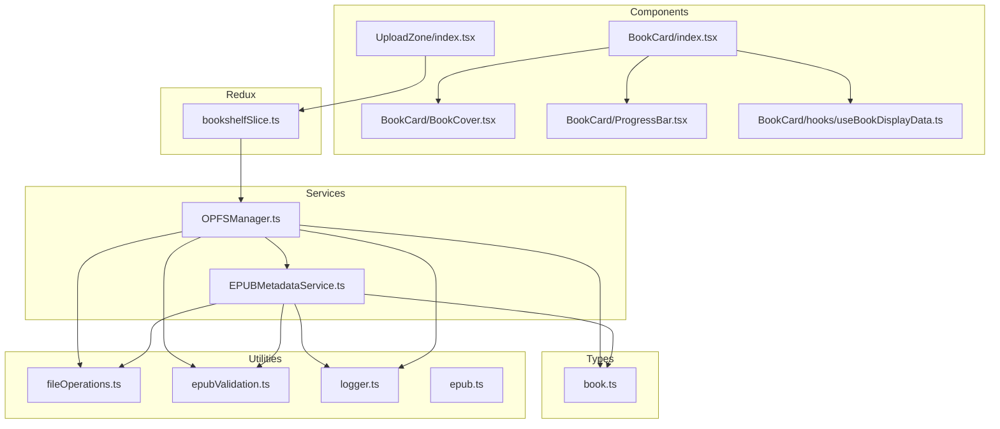
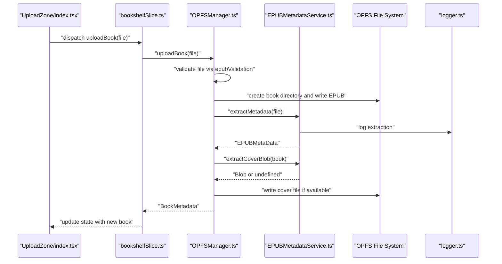
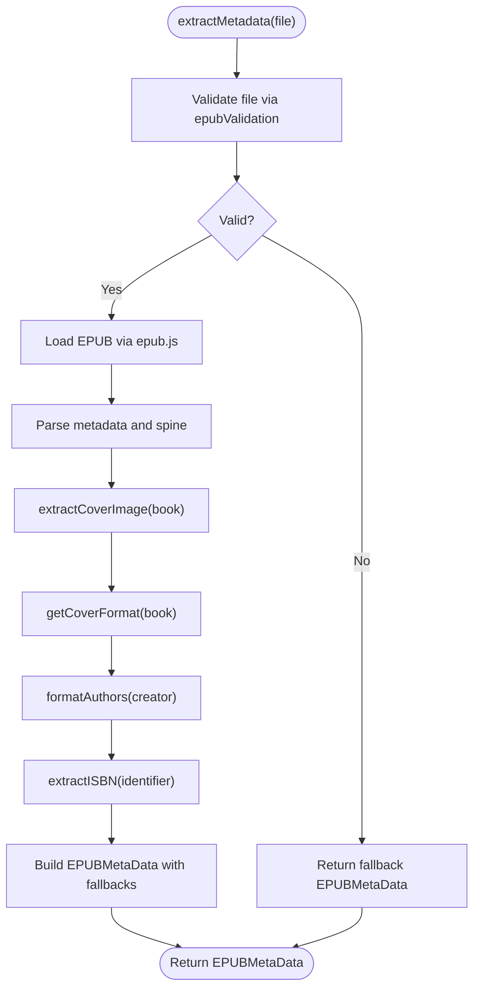
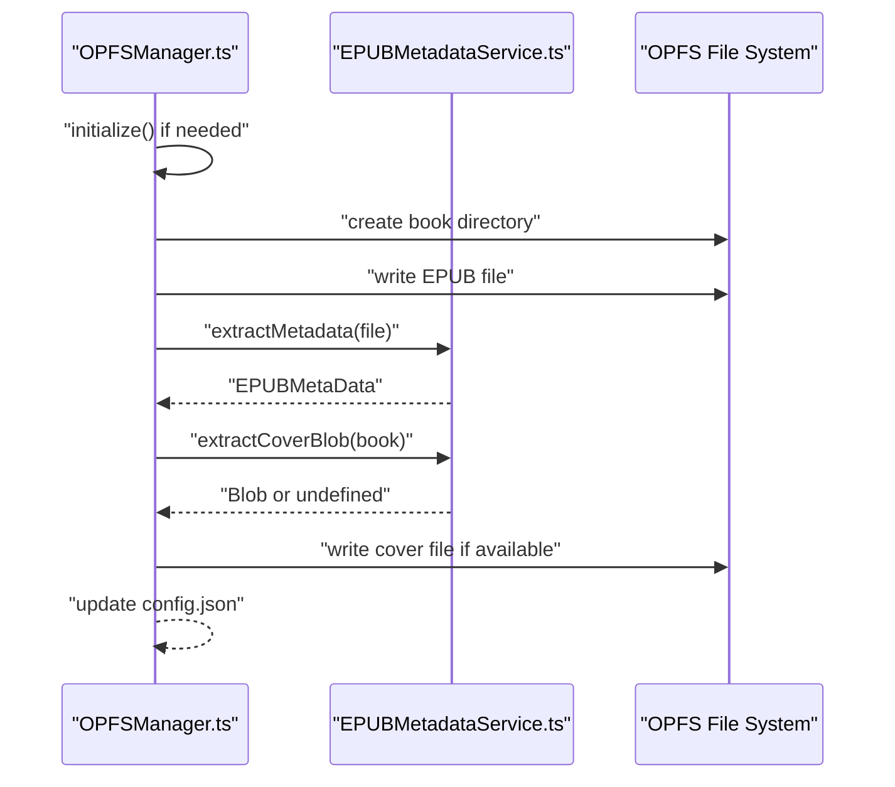
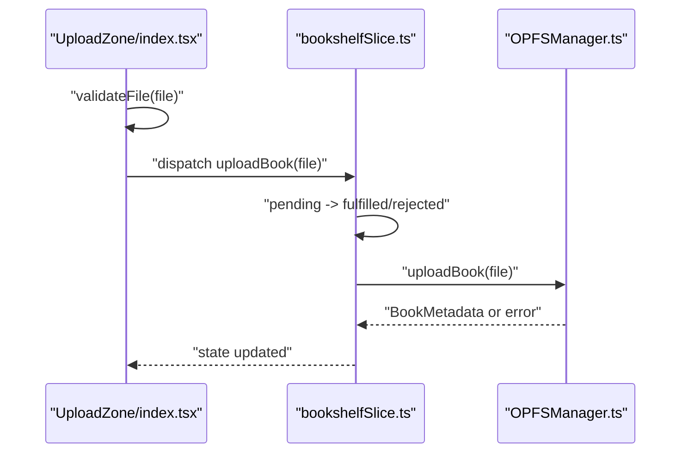
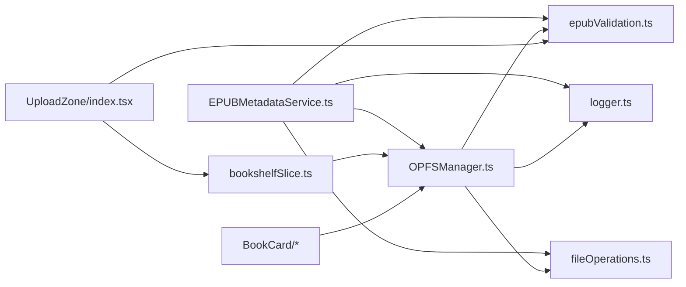

# EPUB Metadata Service

<cite>
**Referenced Files in This Document**
- [EPUBMetadataService.ts](file://src/services/EPUBMetadataService.ts)
- [OPFSManager.ts](file://src/services/OPFSManager.ts)
- [fileOperations.ts](file://src/utils/fileOperations.ts)
- [epubValidation.ts](file://src/utils/epubValidation.ts)
- [book.ts](file://src/types/book.ts)
- [UploadZone/index.tsx](file://src/components/UploadZone/index.tsx)
- [BookCard/index.tsx](file://src/components/BookCard/index.tsx)
- [BookCard/hooks/useBookDisplayData.ts](file://src/components/BookCard/hooks/useBookDisplayData.ts)
- [BookCard/BookCover.tsx](file://src/components/BookCard/BookCover.tsx)
- [BookCard/ProgressBar.tsx](file://src/components/BookCard/ProgressBar.tsx)
- [bookshelfSlice.ts](file://src/store/slices/bookshelfSlice.ts)
- [logger.ts](file://src/utils/logger.ts)
- [epub.ts](file://src/constants/epub.ts)
</cite>

## Table of Contents
1. [Introduction](#introduction)
2. [Project Structure](#project-structure)
3. [Core Components](#core-components)
4. [Architecture Overview](#architecture-overview)
5. [Detailed Component Analysis](#detailed-component-analysis)
6. [Dependency Analysis](#dependency-analysis)
7. [Performance Considerations](#performance-considerations)
8. [Troubleshooting Guide](#troubleshooting-guide)
9. [Conclusion](#conclusion)
10. [Appendices](#appendices)

## Introduction
This document describes the EPUB Metadata Service responsible for extracting comprehensive metadata from EPUB files, handling cover image extraction and processing, retrieving book instances from OPFS storage, and integrating with file operations and OPFS manager utilities. It also explains how the BookCard component uses metadata for display and how the upload process relies on this service. Guidance is provided for handling malformed EPUB files, missing metadata, and cover extraction failures with fallback values, along with performance considerations and extension points.

## Project Structure
The EPUB Metadata Service is implemented as a cohesive module with clear boundaries:
- EPUBMetadataService.ts: Core metadata extraction and cover handling functions
- OPFSManager.ts: OPFS storage integration, upload pipeline, and book retrieval
- fileOperations.ts: Consistent error handling and logging wrapper for file operations
- epubValidation.ts: Centralized EPUB validation logic
- book.ts: Shared types for EPUB metadata and book metadata
- UploadZone/index.tsx: Upload UI that triggers the upload pipeline
- BookCard/*: UI components that consume metadata for display
- bookshelfSlice.ts: Redux integration for upload and book lifecycle
- logger.ts: Logging utility used across services
- epub.ts: EPUB-related constants and configuration

**Diagram sources**
- [EPUBMetadataService.ts](file://src/services/EPUBMetadataService.ts#L1-L177)
- [OPFSManager.ts](file://src/services/OPFSManager.ts#L1-L510)
- [fileOperations.ts](file://src/utils/fileOperations.ts#L1-L91)
- [epubValidation.ts](file://src/utils/epubValidation.ts#L1-L77)
- [book.ts](file://src/types/book.ts#L1-L116)
- [UploadZone/index.tsx](file://src/components/UploadZone/index.tsx#L1-L129)
- [BookCard/index.tsx](file://src/components/BookCard/index.tsx#L1-L87)
- [BookCard/BookCover.tsx](file://src/components/BookCard/BookCover.tsx#L1-L109)
- [BookCard/ProgressBar.tsx](file://src/components/BookCard/ProgressBar.tsx#L1-L60)
- [BookCard/hooks/useBookDisplayData.ts](file://src/components/BookCard/hooks/useBookDisplayData.ts#L1-L33)
- [bookshelfSlice.ts](file://src/store/slices/bookshelfSlice.ts#L1-L189)
- [logger.ts](file://src/utils/logger.ts#L1-L19)
- [epub.ts](file://src/constants/epub.ts#L1-L61)

**Section sources**
- [EPUBMetadataService.ts](file://src/services/EPUBMetadataService.ts#L1-L177)
- [OPFSManager.ts](file://src/services/OPFSManager.ts#L1-L510)
- [fileOperations.ts](file://src/utils/fileOperations.ts#L1-L91)
- [epubValidation.ts](file://src/utils/epubValidation.ts#L1-L77)
- [book.ts](file://src/types/book.ts#L1-L116)
- [UploadZone/index.tsx](file://src/components/UploadZone/index.tsx#L1-L129)
- [BookCard/index.tsx](file://src/components/BookCard/index.tsx#L1-L87)
- [BookCard/BookCover.tsx](file://src/components/BookCard/BookCover.tsx#L1-L109)
- [BookCard/ProgressBar.tsx](file://src/components/BookCard/ProgressBar.tsx#L1-L60)
- [BookCard/hooks/useBookDisplayData.ts](file://src/components/BookCard/hooks/useBookDisplayData.ts#L1-L33)
- [bookshelfSlice.ts](file://src/store/slices/bookshelfSlice.ts#L1-L189)
- [logger.ts](file://src/utils/logger.ts#L1-L19)
- [epub.ts](file://src/constants/epub.ts#L1-L61)

## Core Components
- EPUBMetadataService: Provides extractMetadata, extractCoverImage, extractCoverBlob, getCoverFormat, and getBookByBookId. It validates EPUB files, parses metadata, formats authors, extracts ISBN, and handles cover images.
- OPFSManager: Manages OPFS initialization, upload pipeline, cover extraction, and book retrieval. Integrates with EPUBMetadataService for metadata and cover processing.
- fileOperations: Wraps operations with consistent error handling and logging.
- epubValidation: Centralized validation for EPUB files.
- book.ts: Defines EPUBMetaData and BookMetadata types used across the app.
- UploadZone: UI component that triggers uploadBook thunk and integrates validation.
- BookCard family: Renders book metadata, cover, progress, and actions.

**Section sources**
- [EPUBMetadataService.ts](file://src/services/EPUBMetadataService.ts#L1-L177)
- [OPFSManager.ts](file://src/services/OPFSManager.ts#L120-L219)
- [fileOperations.ts](file://src/utils/fileOperations.ts#L1-L91)
- [epubValidation.ts](file://src/utils/epubValidation.ts#L1-L77)
- [book.ts](file://src/types/book.ts#L1-L116)
- [UploadZone/index.tsx](file://src/components/UploadZone/index.tsx#L1-L129)
- [BookCard/index.tsx](file://src/components/BookCard/index.tsx#L1-L87)

## Architecture Overview
The upload flow integrates UI, Redux, OPFS storage, and metadata extraction:

**Diagram sources**
- [UploadZone/index.tsx](file://src/components/UploadZone/index.tsx#L1-L129)
- [bookshelfSlice.ts](file://src/store/slices/bookshelfSlice.ts#L40-L56)
- [OPFSManager.ts](file://src/services/OPFSManager.ts#L126-L219)
- [EPUBMetadataService.ts](file://src/services/EPUBMetadataService.ts#L11-L63)
- [epubValidation.ts](file://src/utils/epubValidation.ts#L43-L61)
- [logger.ts](file://src/utils/logger.ts#L1-L19)

## Detailed Component Analysis

### EPUBMetadataService
Key responsibilities:
- extractMetadata(file): Validates EPUB, loads EPUB via epub.js, extracts metadata, formats authors, extracts ISBN, counts chapters, and returns EPUBMetaData with fallbacks.
- extractCoverImage(book): Attempts to get cover via book.cover and logs/returns undefined on failure.
- extractCoverBlob(book): Uses book.coverUrl() to fetch cover Blob, with robust error handling and logging.
- getCoverFormat(book): Derives image format from Blob type.
- getBookByBookId(bookId): Retrieves ArrayBuffer from OPFS and constructs a Book instance for later rendering.

**Diagram sources**
- [EPUBMetadataService.ts](file://src/services/EPUBMetadataService.ts#L11-L63)
- [EPUBMetadataService.ts](file://src/services/EPUBMetadataService.ts#L86-L119)
- [EPUBMetadataService.ts](file://src/services/EPUBMetadataService.ts#L121-L177)
- [epubValidation.ts](file://src/utils/epubValidation.ts#L43-L61)

**Section sources**
- [EPUBMetadataService.ts](file://src/services/EPUBMetadataService.ts#L11-L63)
- [EPUBMetadataService.ts](file://src/services/EPUBMetadataService.ts#L86-L119)
- [EPUBMetadataService.ts](file://src/services/EPUBMetadataService.ts#L121-L177)

### OPFSManager Integration
- uploadBook(file): Orchestrates file validation, directory creation, EPUB writing, metadata extraction, cover extraction, and config updates.
- getBookFile(bookId): Retrieves EPUB ArrayBuffer from OPFS for rendering.
- getCoverBase64ByPath(coverPath): Reads cover file from OPFS and converts to Base64 for UI rendering.

**Diagram sources**
- [OPFSManager.ts](file://src/services/OPFSManager.ts#L126-L219)
- [EPUBMetadataService.ts](file://src/services/EPUBMetadataService.ts#L121-L177)

**Section sources**
- [OPFSManager.ts](file://src/services/OPFSManager.ts#L126-L219)
- [OPFSManager.ts](file://src/services/OPFSManager.ts#L263-L285)
- [OPFSManager.ts](file://src/services/OPFSManager.ts#L288-L324)

### Upload Zone and Redux Integration
- UploadZone validates EPUB files and dispatches uploadBook thunk.
- bookshelfSlice manages uploadBook async thunk, updating state and handling errors.

**Diagram sources**
- [UploadZone/index.tsx](file://src/components/UploadZone/index.tsx#L1-L129)
- [bookshelfSlice.ts](file://src/store/slices/bookshelfSlice.ts#L40-L56)
- [OPFSManager.ts](file://src/services/OPFSManager.ts#L126-L219)

**Section sources**
- [UploadZone/index.tsx](file://src/components/UploadZone/index.tsx#L1-L129)
- [bookshelfSlice.ts](file://src/store/slices/bookshelfSlice.ts#L40-L56)

### BookCard Rendering and Metadata Usage
- BookCard consumes BookMetadata to display cover, title, author, progress, chapter count, and actions.
- useBookDisplayData provides fallbacks for display values.
- BookCover loads cover via OPFSManager.getCoverBase64ByPath and falls back to a placeholder if unavailable.

**Diagram sources**
- [book.ts](file://src/types/book.ts#L1-L116)
- [BookCard/index.tsx](file://src/components/BookCard/index.tsx#L1-L87)
- [BookCard/hooks/useBookDisplayData.ts](file://src/components/BookCard/hooks/useBookDisplayData.ts#L1-L33)
- [BookCard/BookCover.tsx](file://src/components/BookCard/BookCover.tsx#L1-L109)

**Section sources**
- [BookCard/index.tsx](file://src/components/BookCard/index.tsx#L1-L87)
- [BookCard/hooks/useBookDisplayData.ts](file://src/components/BookCard/hooks/useBookDisplayData.ts#L1-L33)
- [BookCard/BookCover.tsx](file://src/components/BookCard/BookCover.tsx#L1-L109)
- [book.ts](file://src/types/book.ts#L1-L116)

## Dependency Analysis
- EPUBMetadataService depends on epub.js, logger, fileOperations, epubValidation, and OPFSManager for book retrieval.
- OPFSManager depends on EPUBMetadataService for metadata and cover extraction, fileOperations for safe filesystem operations, epubValidation for file checks, and logger for diagnostics.
- UploadZone depends on epubValidation and bookshelfSlice.
- BookCard components depend on OPFSManager for cover loading and useBookDisplayData for fallbacks.

**Diagram sources**
- [EPUBMetadataService.ts](file://src/services/EPUBMetadataService.ts#L1-L177)
- [OPFSManager.ts](file://src/services/OPFSManager.ts#L1-L510)
- [fileOperations.ts](file://src/utils/fileOperations.ts#L1-L91)
- [epubValidation.ts](file://src/utils/epubValidation.ts#L1-L77)
- [UploadZone/index.tsx](file://src/components/UploadZone/index.tsx#L1-L129)
- [bookshelfSlice.ts](file://src/store/slices/bookshelfSlice.ts#L1-L189)
- [BookCard/BookCover.tsx](file://src/components/BookCard/BookCover.tsx#L1-L109)

**Section sources**
- [EPUBMetadataService.ts](file://src/services/EPUBMetadataService.ts#L1-L177)
- [OPFSManager.ts](file://src/services/OPFSManager.ts#L1-L510)
- [fileOperations.ts](file://src/utils/fileOperations.ts#L1-L91)
- [epubValidation.ts](file://src/utils/epubValidation.ts#L1-L77)
- [UploadZone/index.tsx](file://src/components/UploadZone/index.tsx#L1-L129)
- [bookshelfSlice.ts](file://src/store/slices/bookshelfSlice.ts#L1-L189)
- [BookCard/BookCover.tsx](file://src/components/BookCard/BookCover.tsx#L1-L109)

## Performance Considerations
- Large EPUB parsing: EPUB parsing and cover extraction can be memory-intensive. Consider:
  - Debouncing or batching uploads to avoid UI jank.
  - Lazy-loading covers only when cards enter viewport.
  - Avoiding repeated cover conversions; reuse extracted blobs when possible.
- OPFS writes: Writing EPUB and cover files can block the main thread. Offload to background tasks or use streaming where feasible.
- Metadata extraction: Keep extractMetadata lightweight; defer heavy operations until needed.
- Caching: Cache extracted metadata and cover paths to reduce rework on subsequent renders.

[No sources needed since this section provides general guidance]

## Troubleshooting Guide
Common issues and resolutions:
- Malformed EPUB files:
  - Validation catches unsupported extensions, zero size, and oversized files. If validation passes but parsing fails, extractMetadata returns fallback metadata with minimal fields.
  - Reference: [epubValidation.ts](file://src/utils/epubValidation.ts#L43-L61), [EPUBMetadataService.ts](file://src/services/EPUBMetadataService.ts#L11-L63)
- Missing metadata:
  - extractMetadata formats authors and falls back to Unknown Author; title falls back to filename without extension; chapterCount defaults to 0.
  - Reference: [EPUBMetadataService.ts](file://src/services/EPUBMetadataService.ts#L38-L63)
- Cover extraction failures:
  - extractCoverImage and extractCoverBlob return undefined on errors; getCoverFormat returns undefined if no blob; BookCover falls back to a placeholder.
  - Reference: [EPUBMetadataService.ts](file://src/services/EPUBMetadataService.ts#L86-L119), [BookCard/BookCover.tsx](file://src/components/BookCard/BookCover.tsx#L1-L109)
- OPFS errors:
  - OPFSManager wraps filesystem operations with safe getters and logs errors; uploadBook and getBookFile throw descriptive messages.
  - Reference: [OPFSManager.ts](file://src/services/OPFSManager.ts#L140-L219), [OPFSManager.ts](file://src/services/OPFSManager.ts#L263-L285)

**Section sources**
- [epubValidation.ts](file://src/utils/epubValidation.ts#L43-L61)
- [EPUBMetadataService.ts](file://src/services/EPUBMetadataService.ts#L11-L63)
- [EPUBMetadataService.ts](file://src/services/EPUBMetadataService.ts#L86-L119)
- [BookCard/BookCover.tsx](file://src/components/BookCard/BookCover.tsx#L1-L109)
- [OPFSManager.ts](file://src/services/OPFSManager.ts#L140-L219)
- [OPFSManager.ts](file://src/services/OPFSManager.ts#L263-L285)

## Conclusion
The EPUB Metadata Service provides robust, resilient metadata extraction and cover handling integrated with OPFS storage. It offers strong fallbacks for malformed or incomplete EPUBs, integrates cleanly with the upload pipeline, and powers the BookCard UI with reliable display data. Extending the service involves adding new metadata fields and cover formats while maintaining consistent error handling and logging.

[No sources needed since this section summarizes without analyzing specific files]

## Appendices

### API Definitions and Behaviors
- extractMetadata(file): Returns EPUBMetaData with fallbacks; throws on validation failure.
- extractCoverImage(book): Returns cover path or undefined.
- extractCoverBlob(book): Returns Blob or undefined; logs warnings on failures.
- getCoverFormat(book): Returns image format or undefined.
- getBookByBookId(bookId): Returns Book instance constructed from OPFS ArrayBuffer.

**Section sources**
- [EPUBMetadataService.ts](file://src/services/EPUBMetadataService.ts#L11-L63)
- [EPUBMetadataService.ts](file://src/services/EPUBMetadataService.ts#L86-L119)
- [EPUBMetadataService.ts](file://src/services/EPUBMetadataService.ts#L121-L177)
- [OPFSManager.ts](file://src/services/OPFSManager.ts#L263-L285)

### Extension Points
- Additional metadata fields: Extend EPUBMetaData and update extractMetadata to parse and map new fields.
- Cover formats: Update getCoverFormat and cover writing logic to support new formats.
- Validation enhancements: Add more epubValidation rules as needed.
- Performance improvements: Introduce caching, lazy loading, and background processing.

[No sources needed since this section provides general guidance]