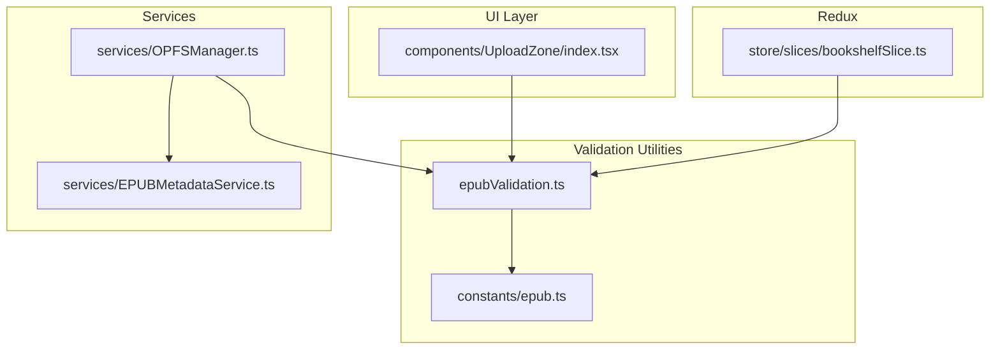
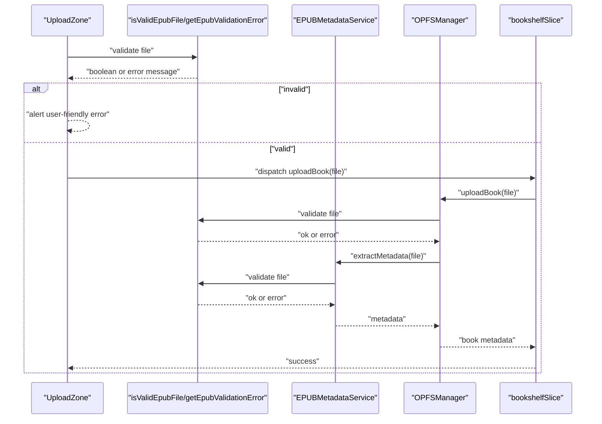
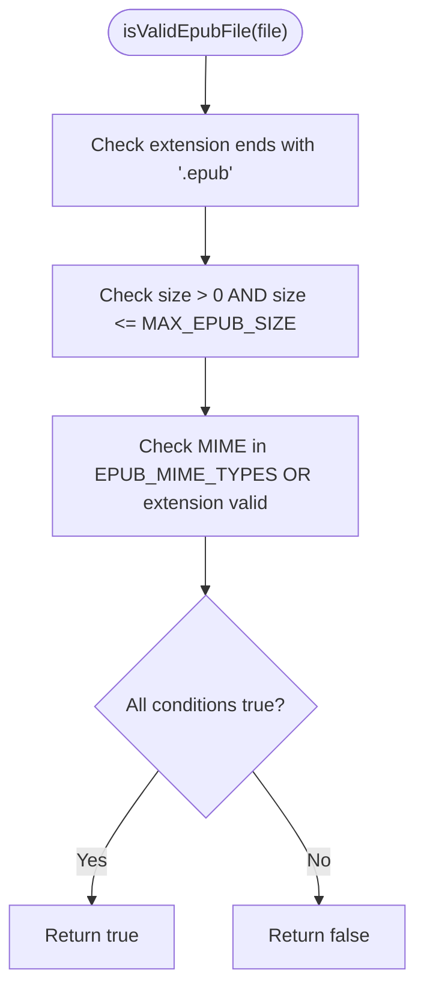
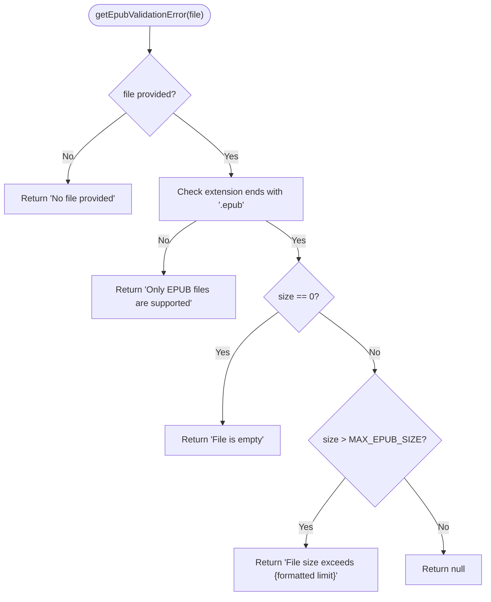
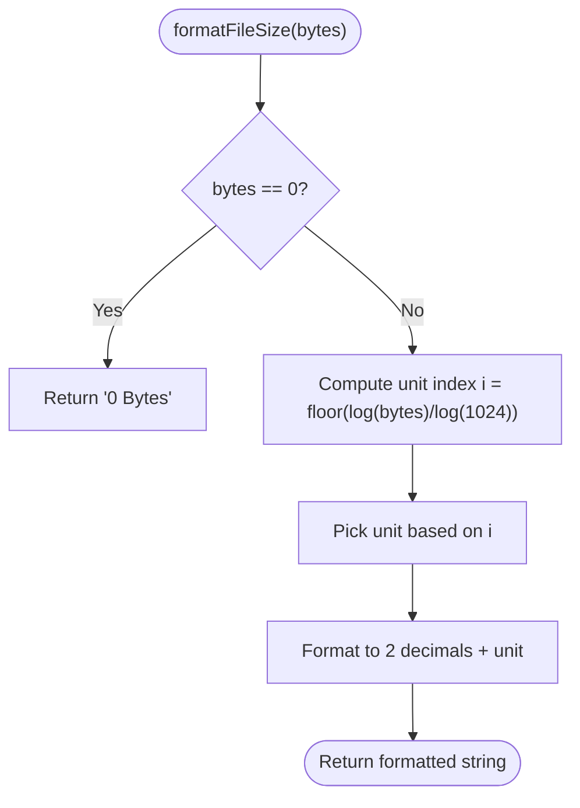
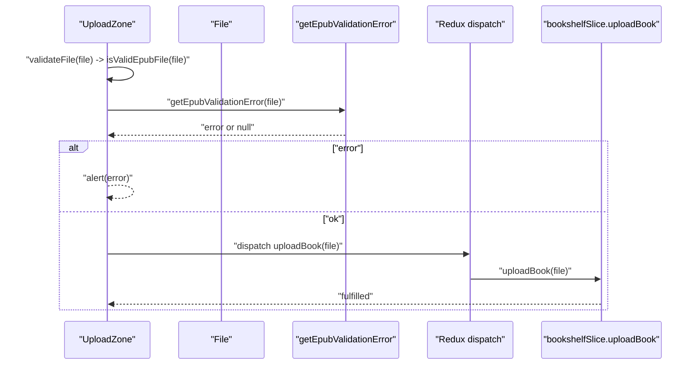
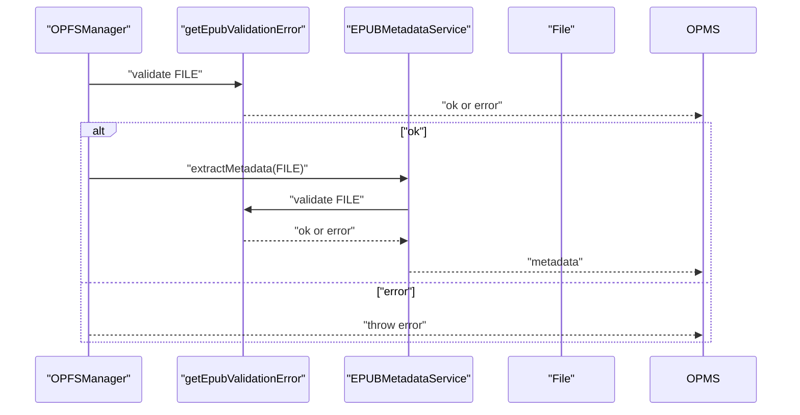
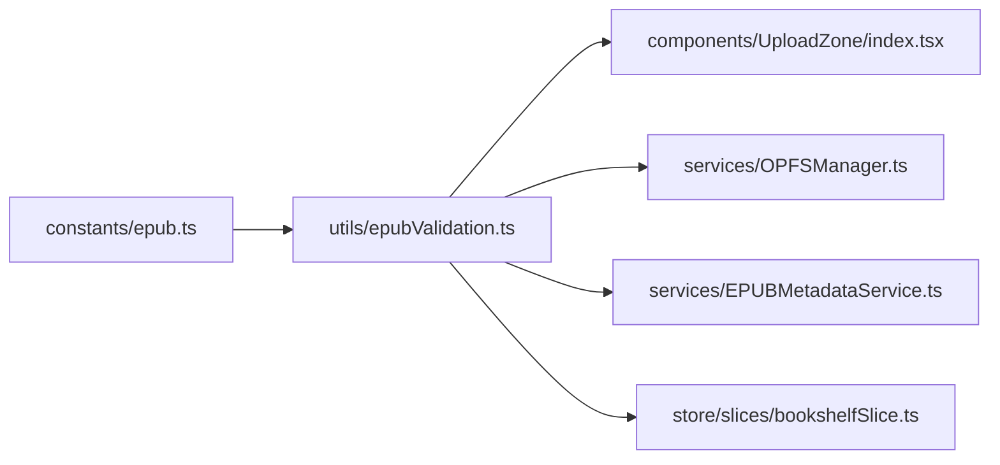

# EPUB Validation Utilities

<cite>
**Referenced Files in This Document**
- [epubValidation.ts](file://src/utils/epubValidation.ts)
- [epub.ts](file://src/constants/epub.ts)
- [EPUBMetadataService.ts](file://src/services/EPUBMetadataService.ts)
- [UploadZone/index.tsx](file://src/components/UploadZone/index.tsx)
- [bookshelfSlice.ts](file://src/store/slices/bookshelfSlice.ts)
- [OPFSManager.ts](file://src/services/OPFSManager.ts)
- [fileOperations.ts](file://src/utils/fileOperations.ts)
</cite>

## Table of Contents
1. [Introduction](#introduction)
2. [Project Structure](#project-structure)
3. [Core Components](#core-components)
4. [Architecture Overview](#architecture-overview)
5. [Detailed Component Analysis](#detailed-component-analysis)
6. [Dependency Analysis](#dependency-analysis)
7. [Performance Considerations](#performance-considerations)
8. [Troubleshooting Guide](#troubleshooting-guide)
9. [Conclusion](#conclusion)
10. [Appendices](#appendices)

## Introduction
This document explains the EPUB validation utilities that ensure only valid EPUB files are processed by the application. It covers:
- isValidEpubFile: central validation function that checks extension, size, and MIME type
- MAX_EPUB_SIZE, EPUB_EXTENSIONS, EPUB_MIME_TYPES: constants that define valid EPUB characteristics
- getEpubValidationError: user-friendly error messaging for invalid files
- formatFileSize: utility to display human-readable file sizes
- How UploadZone uses these utilities to validate and upload files
- Relationship with EPUBMetadataService and OPFSManager
- Common issues and edge cases
- Guidance for extending validation rules

## Project Structure
The EPUB validation utilities live under src/utils and are consumed by components, services, and Redux slices across the app.

**Diagram sources**
- [epubValidation.ts](file://src/utils/epubValidation.ts#L1-L77)
- [epub.ts](file://src/constants/epub.ts#L28-L40)
- [UploadZone/index.tsx](file://src/components/UploadZone/index.tsx#L1-L129)
- [EPUBMetadataService.ts](file://src/services/EPUBMetadataService.ts#L1-L177)
- [OPFSManager.ts](file://src/services/OPFSManager.ts#L1-L219)
- [bookshelfSlice.ts](file://src/store/slices/bookshelfSlice.ts#L1-L189)

**Section sources**
- [epubValidation.ts](file://src/utils/epubValidation.ts#L1-L77)
- [epub.ts](file://src/constants/epub.ts#L28-L40)
- [UploadZone/index.tsx](file://src/components/UploadZone/index.tsx#L1-L129)
- [EPUBMetadataService.ts](file://src/services/EPUBMetadataService.ts#L1-L177)
- [OPFSManager.ts](file://src/services/OPFSManager.ts#L1-L219)
- [bookshelfSlice.ts](file://src/store/slices/bookshelfSlice.ts#L1-L189)

## Core Components
- MAX_EPUB_SIZE: maximum allowed EPUB file size (100 MB)
- EPUB_EXTENSIONS: supported file extensions (e.g., .epub)
- EPUB_MIME_TYPES: accepted MIME types for EPUB files
- isValidEpubFile: returns true if a file meets all criteria
- getEpubValidationError: returns a user-friendly error message or null
- formatFileSize: converts bytes to human-readable format (Bytes, KB, MB, GB)

These components are defined in epubValidation.ts and backed by constants in epub.ts.

**Section sources**
- [epubValidation.ts](file://src/utils/epubValidation.ts#L8-L21)
- [epub.ts](file://src/constants/epub.ts#L31-L39)

## Architecture Overview
The validation pipeline ensures early rejection of invalid files before expensive operations (metadata extraction, OPFS writes) occur.

**Diagram sources**
- [UploadZone/index.tsx](file://src/components/UploadZone/index.tsx#L25-L48)
- [epubValidation.ts](file://src/utils/epubValidation.ts#L24-L61)
- [EPUBMetadataService.ts](file://src/services/EPUBMetadataService.ts#L11-L21)
- [OPFSManager.ts](file://src/services/OPFSManager.ts#L126-L171)
- [bookshelfSlice.ts](file://src/store/slices/bookshelfSlice.ts#L40-L56)

## Detailed Component Analysis

### isValidEpubFile
- Purpose: Centralized EPUB validation that checks:
  - Extension ends with .epub
  - Size > 0 and ≤ MAX_EPUB_SIZE
  - MIME type is in EPUB_MIME_TYPES OR file extension is valid
- Behavior: Returns true only if all conditions pass; otherwise false
- Edge cases handled:
  - Zero-size files are rejected
  - Files with unsupported extensions are rejected
  - MIME type mismatch is tolerated if extension is valid

**Diagram sources**
- [epubValidation.ts](file://src/utils/epubValidation.ts#L24-L36)

**Section sources**
- [epubValidation.ts](file://src/utils/epubValidation.ts#L24-L36)

### getEpubValidationError
- Purpose: Provide user-friendly error messages for invalid files
- Messages:
  - No file provided
  - Only EPUB files are supported
  - File is empty
  - File size exceeds human-readable limit
- Uses formatFileSize to render the size limit

**Diagram sources**
- [epubValidation.ts](file://src/utils/epubValidation.ts#L40-L61)

**Section sources**
- [epubValidation.ts](file://src/utils/epubValidation.ts#L40-L61)

### formatFileSize
- Purpose: Convert bytes to human-readable format (Bytes, KB, MB, GB)
- Behavior: Handles zero bytes and uses logarithmic scaling to pick units

**Diagram sources**
- [epubValidation.ts](file://src/utils/epubValidation.ts#L63-L77)

**Section sources**
- [epubValidation.ts](file://src/utils/epubValidation.ts#L63-L77)

### Constants: MAX_EPUB_SIZE, EPUB_EXTENSIONS, EPUB_MIME_TYPES
- MAX_EPUB_SIZE: 100 MB
- EPUB_EXTENSIONS: ['.epub']
- EPUB_MIME_TYPES: ['application/epub+zip', 'application/x-zip-compressed', 'application/zip']

These constants are exported from epub.ts and imported by epubValidation.ts.

**Section sources**
- [epub.ts](file://src/constants/epub.ts#L31-L39)
- [epubValidation.ts](file://src/utils/epubValidation.ts#L8-L21)

### UploadZone Integration
- Uses isValidEpubFile to pre-validate files before upload
- Uses getEpubValidationError to show friendly alerts
- Uses formatFileSize to display the maximum file size in the UI
- Uses MAX_EPUB_SIZE to inform users of the limit

**Diagram sources**
- [UploadZone/index.tsx](file://src/components/UploadZone/index.tsx#L25-L48)
- [epubValidation.ts](file://src/utils/epubValidation.ts#L40-L61)
- [bookshelfSlice.ts](file://src/store/slices/bookshelfSlice.ts#L40-L56)

**Section sources**
- [UploadZone/index.tsx](file://src/components/UploadZone/index.tsx#L1-L129)
- [epubValidation.ts](file://src/utils/epubValidation.ts#L40-L61)
- [bookshelfSlice.ts](file://src/store/slices/bookshelfSlice.ts#L40-L56)

### Relationship with EPUBMetadataService and OPFSManager
- EPUBMetadataService calls getEpubValidationError before parsing EPUB metadata
- OPFSManager calls getEpubValidationError during uploadBook to prevent invalid files from being persisted
- Both services rely on the centralized validation logic to fail fast and avoid expensive operations

**Diagram sources**
- [OPFSManager.ts](file://src/services/OPFSManager.ts#L126-L171)
- [EPUBMetadataService.ts](file://src/services/EPUBMetadataService.ts#L11-L21)
- [epubValidation.ts](file://src/utils/epubValidation.ts#L40-L61)

**Section sources**
- [OPFSManager.ts](file://src/services/OPFSManager.ts#L126-L171)
- [EPUBMetadataService.ts](file://src/services/EPUBMetadataService.ts#L11-L21)
- [epubValidation.ts](file://src/utils/epubValidation.ts#L40-L61)

## Dependency Analysis
- epubValidation.ts depends on constants from epub.ts
- UploadZone imports and uses all validation utilities
- OPFSManager and EPUBMetadataService import getEpubValidationError and formatFileSize
- bookshelfSlice.ts defines its own validation internally and could benefit from reusing epubValidation utilities

**Diagram sources**
- [epub.ts](file://src/constants/epub.ts#L31-L39)
- [epubValidation.ts](file://src/utils/epubValidation.ts#L1-L77)
- [UploadZone/index.tsx](file://src/components/UploadZone/index.tsx#L1-L129)
- [OPFSManager.ts](file://src/services/OPFSManager.ts#L1-L219)
- [EPUBMetadataService.ts](file://src/services/EPUBMetadataService.ts#L1-L177)
- [bookshelfSlice.ts](file://src/store/slices/bookshelfSlice.ts#L1-L189)

**Section sources**
- [epub.ts](file://src/constants/epub.ts#L31-L39)
- [epubValidation.ts](file://src/utils/epubValidation.ts#L1-L77)
- [UploadZone/index.tsx](file://src/components/UploadZone/index.tsx#L1-L129)
- [OPFSManager.ts](file://src/services/OPFSManager.ts#L1-L219)
- [EPUBMetadataService.ts](file://src/services/EPUBMetadataService.ts#L1-L177)
- [bookshelfSlice.ts](file://src/store/slices/bookshelfSlice.ts#L1-L189)

## Performance Considerations
- isValidEpubFile performs constant-time checks (extension match, size comparison, MIME inclusion) and short-circuits on failure
- getEpubValidationError avoids heavy computation and returns immediately upon detecting invalid conditions
- formatFileSize uses logarithmic scaling and minimal allocations
- Early validation prevents unnecessary metadata extraction and OPFS writes, reducing memory and CPU usage

[No sources needed since this section provides general guidance]

## Troubleshooting Guide
Common issues and resolutions:
- Incorrectly identified MIME types
  - Symptom: Files with valid .epub extension but incorrect MIME type are still accepted due to the validation logic tolerating extension-based MIME fallback
  - Resolution: Ensure browsers send correct MIME types; if not, rely on extension validation
- Empty files
  - Symptom: getEpubValidationError reports "File is empty"
  - Resolution: Verify the file is not empty before upload
- Oversized files
  - Symptom: getEpubValidationError reports size limit exceeded
  - Resolution: Compress or split the EPUB; the UI displays the limit using formatFileSize
- UI feedback
  - UploadZone alerts user-friendly errors and disables interactions during upload
- Service-level validation
  - OPFSManager and EPUBMetadataService also validate files before processing, preventing invalid data from persisting

**Section sources**
- [epubValidation.ts](file://src/utils/epubValidation.ts#L40-L61)
- [UploadZone/index.tsx](file://src/components/UploadZone/index.tsx#L29-L48)
- [OPFSManager.ts](file://src/services/OPFSManager.ts#L126-L171)
- [EPUBMetadataService.ts](file://src/services/EPUBMetadataService.ts#L11-L21)

## Conclusion
The EPUB validation utilities provide a robust, centralized mechanism to validate EPUB files across the application. They enforce extension, size, and MIME-type rules, offer user-friendly error messages, and integrate cleanly with UI components, services, and Redux slices. Early validation reduces resource usage and improves reliability.

[No sources needed since this section summarizes without analyzing specific files]

## Appendices

### Extending Validation Rules
Guidance for adding new rules or custom requirements:
- Add new constants to constants/epub.ts (e.g., stricter size limits, additional MIME types)
- Update epubValidation.ts to incorporate new checks while preserving backward compatibility
- Ensure UploadZone, OPFSManager, and EPUBMetadataService continue to use getEpubValidationError for consistent UX
- Consider adding a dedicated validation function for EPUB-specific checks (e.g., ZIP structure verification) and call it from EPUBMetadataService or OPFSManager

[No sources needed since this section provides general guidance]