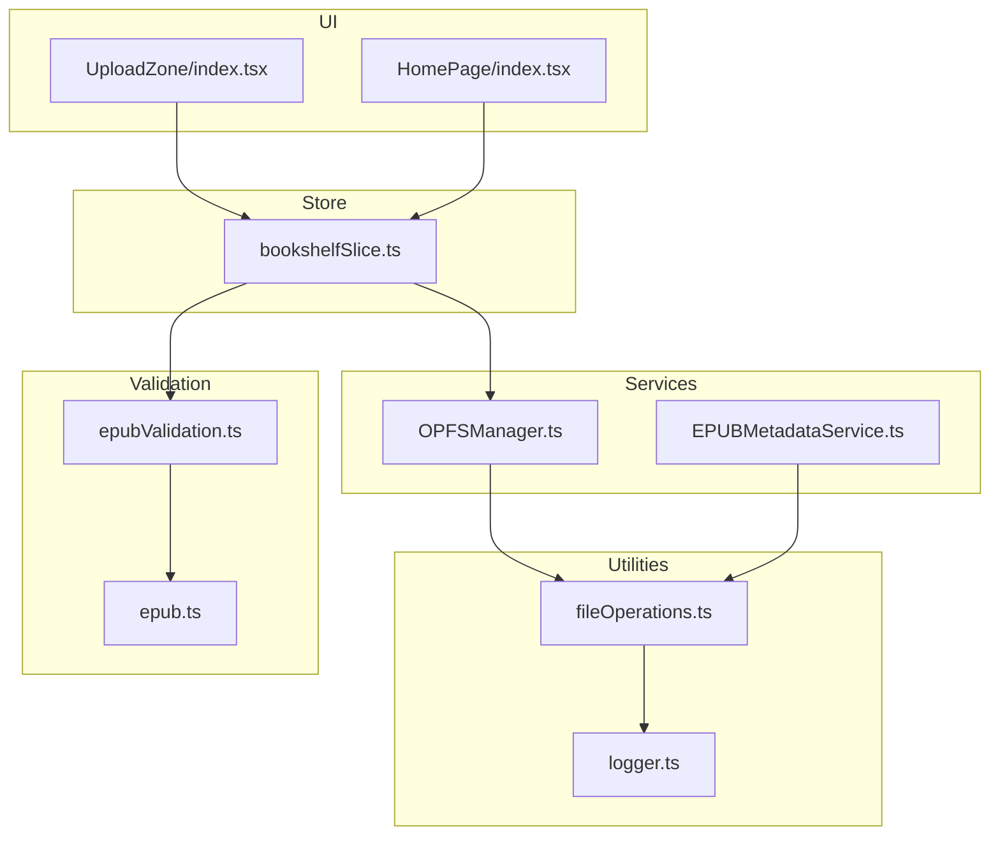
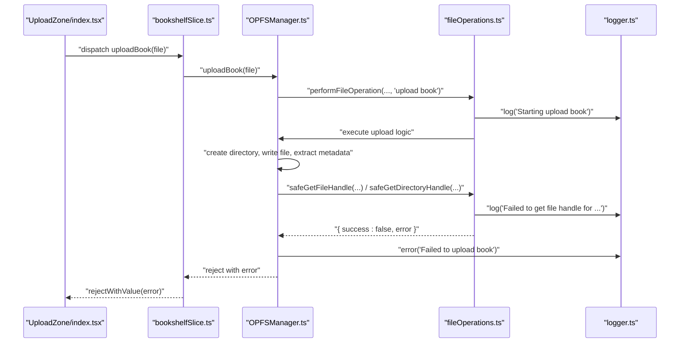
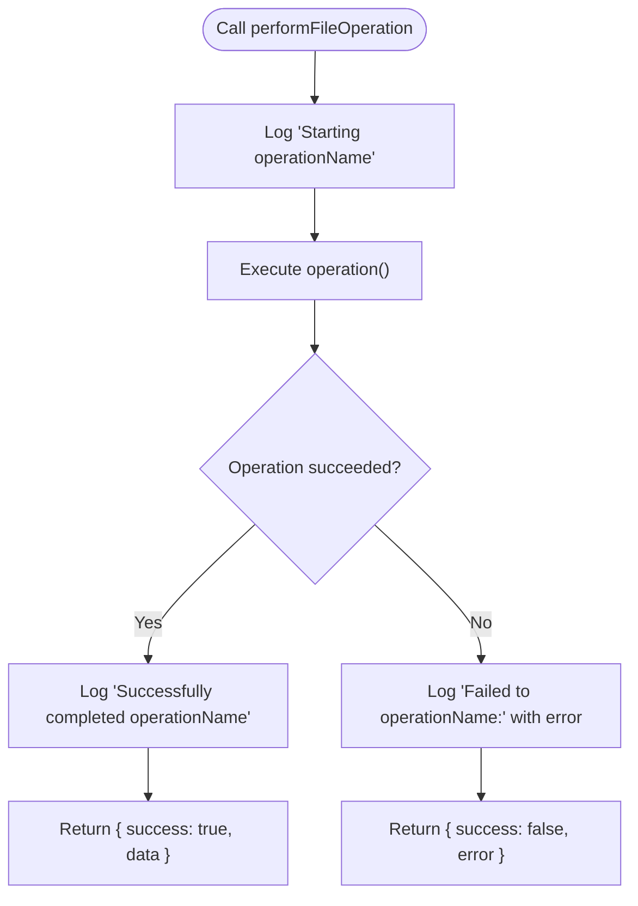
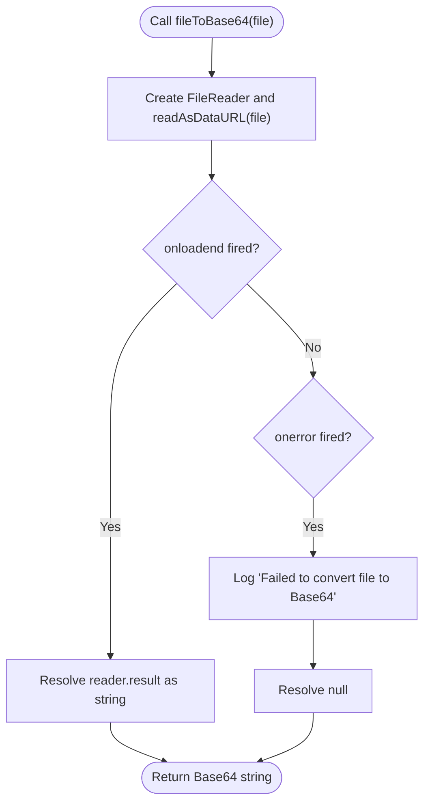
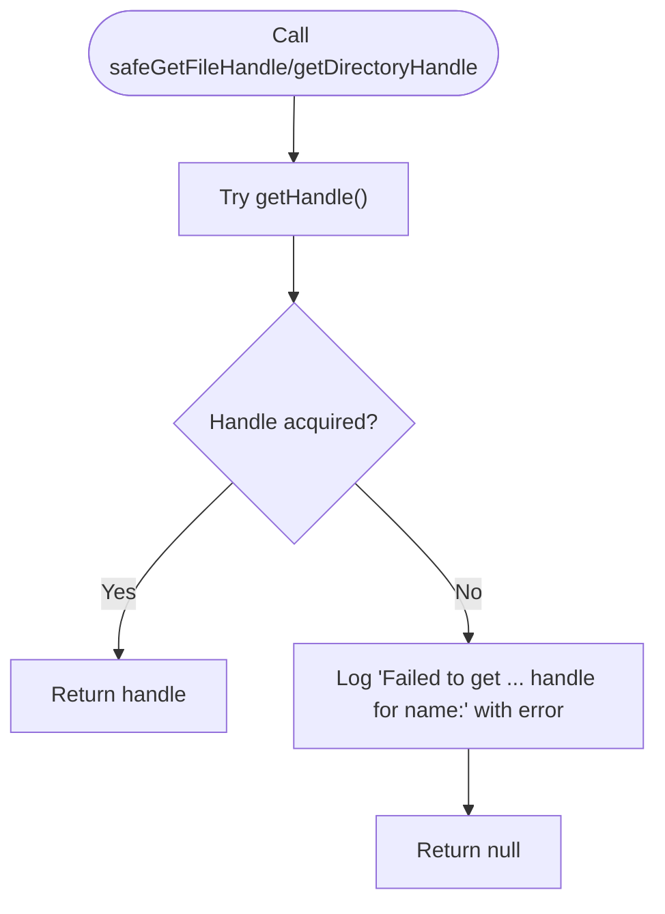
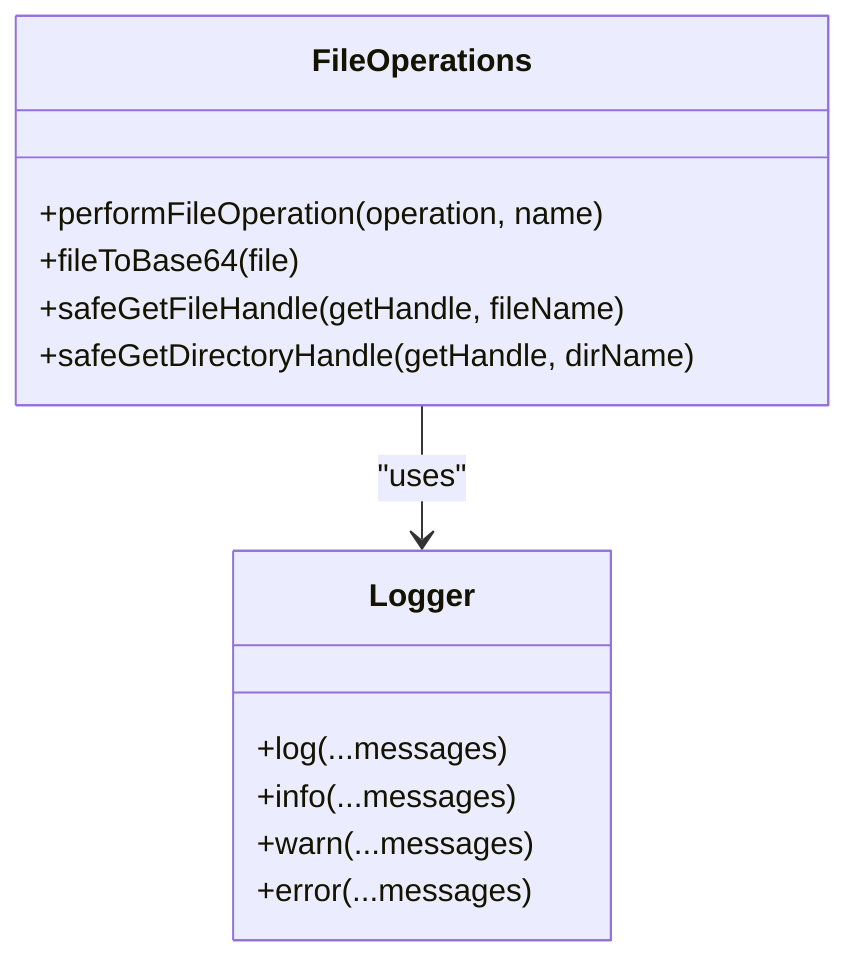
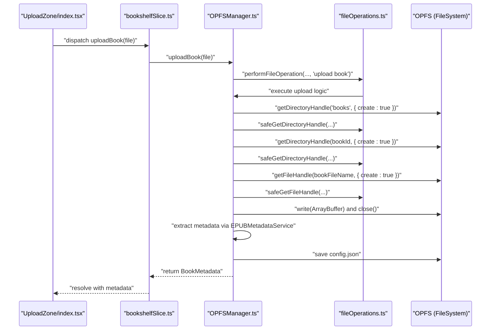
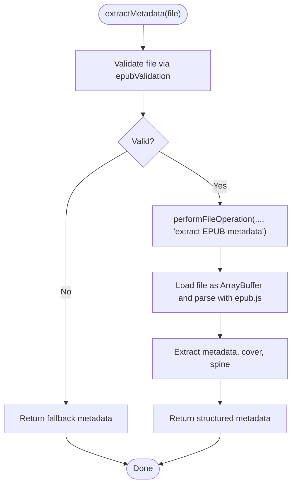
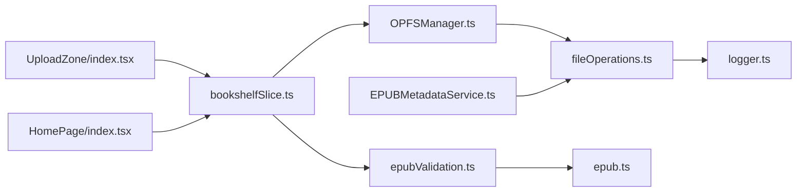

# File Operations Utilities

<cite>
**Referenced Files in This Document**
- [fileOperations.ts](file://src/utils/fileOperations.ts)
- [logger.ts](file://src/utils/logger.ts)
- [OPFSManager.ts](file://src/services/OPFSManager.ts)
- [EPUBMetadataService.ts](file://src/services/EPUBMetadataService.ts)
- [bookshelfSlice.ts](file://src/store/slices/bookshelfSlice.ts)
- [UploadZone/index.tsx](file://src/components/UploadZone/index.tsx)
- [HomePage/index.tsx](file://src/pages/HomePage/index.tsx)
- [epubValidation.ts](file://src/utils/epubValidation.ts)
- [epub.ts](file://src/constants/epub.ts)
</cite>

## Table of Contents
1. [Introduction](#introduction)
2. [Project Structure](#project-structure)
3. [Core Components](#core-components)
4. [Architecture Overview](#architecture-overview)
5. [Detailed Component Analysis](#detailed-component-analysis)
6. [Dependency Analysis](#dependency-analysis)
7. [Performance Considerations](#performance-considerations)
8. [Troubleshooting Guide](#troubleshooting-guide)
9. [Conclusion](#conclusion)
10. [Appendices](#appendices)

## Introduction
This document explains the file operations utilities that provide consistent error handling and logging for all file-related operations in the application. It focuses on:
- The performFileOperation wrapper that standardizes try/catch and logging around file operations
- The fileToBase64 utility for converting files to Base64 format with robust error handling
- The safeGetFileHandle and safeGetDirectoryHandle helpers that safely retrieve file and directory handles with appropriate error logging
- How these utilities integrate with the logger utility for consistent application logging
- Real-world usage examples from EPUB file uploads and OPFS interactions
- Guidance on handling common issues such as permission errors and file access failures
- Best practices for extending these utilities with new file operations

## Project Structure
The file operations utilities live under src/utils and are consumed by services and UI components across the app. The primary files involved are:
- src/utils/fileOperations.ts: Contains the three core utilities and a shared result type
- src/utils/logger.ts: Provides unified logging across the app
- src/services/OPFSManager.ts: Orchestrates OPFS operations and uses the utilities extensively
- src/services/EPUBMetadataService.ts: Uses performFileOperation to wrap metadata extraction
- src/store/slices/bookshelfSlice.ts: Uses performFileOperation to wrap upload operations
- src/components/UploadZone/index.tsx and src/pages/HomePage/index.tsx: UI components that trigger file operations and rely on validation and services
- src/utils/epubValidation.ts and src/constants/epub.ts: Provide EPUB-specific validation and constants

**Diagram sources**
- [fileOperations.ts](file://src/utils/fileOperations.ts#L1-L91)
- [logger.ts](file://src/utils/logger.ts#L1-L19)
- [OPFSManager.ts](file://src/services/OPFSManager.ts#L1-L510)
- [EPUBMetadataService.ts](file://src/services/EPUBMetadataService.ts#L1-L177)
- [bookshelfSlice.ts](file://src/store/slices/bookshelfSlice.ts#L1-L85)
- [UploadZone/index.tsx](file://src/components/UploadZone/index.tsx#L1-L116)
- [HomePage/index.tsx](file://src/pages/HomePage/index.tsx#L33-L246)
- [epubValidation.ts](file://src/utils/epubValidation.ts#L1-L77)
- [epub.ts](file://src/constants/epub.ts#L1-L61)

**Section sources**
- [fileOperations.ts](file://src/utils/fileOperations.ts#L1-L91)
- [logger.ts](file://src/utils/logger.ts#L1-L19)
- [OPFSManager.ts](file://src/services/OPFSManager.ts#L1-L510)
- [EPUBMetadataService.ts](file://src/services/EPUBMetadataService.ts#L1-L177)
- [bookshelfSlice.ts](file://src/store/slices/bookshelfSlice.ts#L1-L85)
- [UploadZone/index.tsx](file://src/components/UploadZone/index.tsx#L1-L116)
- [HomePage/index.tsx](file://src/pages/HomePage/index.tsx#L33-L246)
- [epubValidation.ts](file://src/utils/epubValidation.ts#L1-L77)
- [epub.ts](file://src/constants/epub.ts#L1-L61)

## Core Components
This section documents the three core utilities and their roles in the system.

- performFileOperation<T>(operation, operationName): A generic wrapper that:
  - Logs the start and completion of an operation
  - Executes the provided async operation
  - Catches errors, logs them, and returns a structured result with success flag, data, or error message
  - Returns a FileOperationResult<T> shaped object

- fileToBase64(file): Converts a File to a Base64-encoded data URL string. On failure, logs an error and resolves to null.

- safeGetFileHandle(getHandle, fileName): Safely retrieves a FileSystemFileHandle. On failure, logs an error and returns null.

- safeGetDirectoryHandle(getHandle, dirName): Safely retrieves a FileSystemDirectoryHandle. On failure, logs an error and returns null.

These utilities centralize error handling and logging, ensuring consistent behavior across file operations.

**Section sources**
- [fileOperations.ts](file://src/utils/fileOperations.ts#L1-L91)

## Architecture Overview
The file operations utilities integrate with services and UI components to provide a cohesive file handling pipeline. The logger utility ensures all operations are consistently logged. Services orchestrate higher-level tasks (e.g., uploading EPUBs, loading metadata), while UI components trigger these flows.

**Diagram sources**
- [UploadZone/index.tsx](file://src/components/UploadZone/index.tsx#L1-L116)
- [bookshelfSlice.ts](file://src/store/slices/bookshelfSlice.ts#L40-L56)
- [OPFSManager.ts](file://src/services/OPFSManager.ts#L126-L219)
- [fileOperations.ts](file://src/utils/fileOperations.ts#L22-L36)
- [logger.ts](file://src/utils/logger.ts#L1-L19)

## Detailed Component Analysis

### performFileOperation<T>(operation, operationName)
- Purpose: Standardize error handling and logging for any async file operation
- Behavior:
  - Logs a start message
  - Executes the operation
  - Logs a success message
  - Returns a structured result with either success=true and data or success=false and error
- Complexity: O(1) overhead plus the complexity of the wrapped operation
- Error handling: Catches any thrown error, extracts a message, logs it, and returns a failure result

**Diagram sources**
- [fileOperations.ts](file://src/utils/fileOperations.ts#L22-L36)
- [logger.ts](file://src/utils/logger.ts#L1-L19)

**Section sources**
- [fileOperations.ts](file://src/utils/fileOperations.ts#L22-L36)

### fileToBase64(file)
- Purpose: Convert a File to a Base64 data URL string
- Behavior:
  - Uses FileReader to read the file as a data URL
  - Resolves to the result on onloadend
  - On error, logs an error and resolves to null
- Complexity: O(n) where n is the file size
- Notes: Suitable for small files; for large files, consider streaming or chunked reads

**Diagram sources**
- [fileOperations.ts](file://src/utils/fileOperations.ts#L43-L54)
- [logger.ts](file://src/utils/logger.ts#L1-L19)

**Section sources**
- [fileOperations.ts](file://src/utils/fileOperations.ts#L43-L54)

### safeGetFileHandle(getHandle, fileName) and safeGetDirectoryHandle(getHandle, dirName)
- Purpose: Wrap retrieval of FileSystemFileHandle and FileSystemDirectoryHandle with error logging
- Behavior:
  - Attempt to call getHandle()
  - On success, return the handle
  - On failure, log an error and return null
- Complexity: O(1) plus underlying handle retrieval cost
- Use cases:
  - Creating directories and files in OPFS
  - Retrieving handles for subsequent write/close operations

**Diagram sources**
- [fileOperations.ts](file://src/utils/fileOperations.ts#L62-L90)
- [logger.ts](file://src/utils/logger.ts#L1-L19)

**Section sources**
- [fileOperations.ts](file://src/utils/fileOperations.ts#L62-L90)

### Integration with Logger Utility
- All utilities log messages using the logger utility, ensuring consistent timestamps and prefixes
- Logging levels:
  - log: general operational logs
  - error: error conditions
  - warn/info: warnings and informational messages

**Diagram sources**
- [logger.ts](file://src/utils/logger.ts#L1-L19)
- [fileOperations.ts](file://src/utils/fileOperations.ts#L1-L91)

**Section sources**
- [logger.ts](file://src/utils/logger.ts#L1-L19)
- [fileOperations.ts](file://src/utils/fileOperations.ts#L1-L91)

### EPUB Upload Workflow Using File Operations Utilities
This workflow demonstrates how the utilities are used during EPUB uploads and OPFS interactions.

**Diagram sources**
- [UploadZone/index.tsx](file://src/components/UploadZone/index.tsx#L1-L116)
- [bookshelfSlice.ts](file://src/store/slices/bookshelfSlice.ts#L40-L56)
- [OPFSManager.ts](file://src/services/OPFSManager.ts#L126-L219)
- [EPUBMetadataService.ts](file://src/services/EPUBMetadataService.ts#L1-L177)
- [fileOperations.ts](file://src/utils/fileOperations.ts#L62-L90)

**Section sources**
- [OPFSManager.ts](file://src/services/OPFSManager.ts#L126-L219)
- [EPUBMetadataService.ts](file://src/services/EPUBMetadataService.ts#L1-L177)
- [bookshelfSlice.ts](file://src/store/slices/bookshelfSlice.ts#L40-L56)
- [UploadZone/index.tsx](file://src/components/UploadZone/index.tsx#L1-L116)

### Metadata Extraction Using performFileOperation
- The metadata extraction service wraps its logic inside performFileOperation to ensure consistent logging and error handling
- On failure, it falls back to basic metadata fields and logs the error

**Diagram sources**
- [EPUBMetadataService.ts](file://src/services/EPUBMetadataService.ts#L1-L63)
- [epubValidation.ts](file://src/utils/epubValidation.ts#L1-L77)
- [fileOperations.ts](file://src/utils/fileOperations.ts#L22-L36)

**Section sources**
- [EPUBMetadataService.ts](file://src/services/EPUBMetadataService.ts#L1-L63)
- [epubValidation.ts](file://src/utils/epubValidation.ts#L1-L77)
- [fileOperations.ts](file://src/utils/fileOperations.ts#L22-L36)

## Dependency Analysis
- fileOperations.ts depends on logger.ts for logging
- OPFSManager.ts imports performFileOperation, safeGetFileHandle, and safeGetDirectoryHandle to orchestrate OPFS operations
- EPUBMetadataService.ts imports performFileOperation to wrap metadata extraction
- bookshelfSlice.ts imports OPFSManager and uses performFileOperation to wrap upload operations
- UploadZone/index.tsx and HomePage/index.tsx depend on validation and store slices to trigger uploads

**Diagram sources**
- [fileOperations.ts](file://src/utils/fileOperations.ts#L1-L91)
- [logger.ts](file://src/utils/logger.ts#L1-L19)
- [OPFSManager.ts](file://src/services/OPFSManager.ts#L1-L510)
- [EPUBMetadataService.ts](file://src/services/EPUBMetadataService.ts#L1-L177)
- [bookshelfSlice.ts](file://src/store/slices/bookshelfSlice.ts#L1-L85)
- [UploadZone/index.tsx](file://src/components/UploadZone/index.tsx#L1-L116)
- [HomePage/index.tsx](file://src/pages/HomePage/index.tsx#L33-L246)
- [epubValidation.ts](file://src/utils/epubValidation.ts#L1-L77)
- [epub.ts](file://src/constants/epub.ts#L1-L61)

**Section sources**
- [fileOperations.ts](file://src/utils/fileOperations.ts#L1-L91)
- [OPFSManager.ts](file://src/services/OPFSManager.ts#L1-L510)
- [EPUBMetadataService.ts](file://src/services/EPUBMetadataService.ts#L1-L177)
- [bookshelfSlice.ts](file://src/store/slices/bookshelfSlice.ts#L1-L85)
- [UploadZone/index.tsx](file://src/components/UploadZone/index.tsx#L1-L116)
- [HomePage/index.tsx](file://src/pages/HomePage/index.tsx#L33-L246)
- [epubValidation.ts](file://src/utils/epubValidation.ts#L1-L77)
- [epub.ts](file://src/constants/epub.ts#L1-L61)

## Performance Considerations
- Large EPUB files:
  - fileToBase64 converts the entire file into memory as a Base64 string, which increases memory usage by approximately 33% compared to raw binary. For very large files, prefer streaming or chunked reads and avoid storing large Base64 strings unnecessarily.
  - OPFS writes are asynchronous and buffered by the browser. For large files, consider breaking writes into chunks and monitoring progress.
- Metadata extraction:
  - Loading the entire EPUB into memory for parsing is unavoidable with epub.js. Ensure UI remains responsive by performing extraction off the main thread or batching operations.
- Logging overhead:
  - Logging is lightweight but can add up in frequent operations. Use appropriate log levels and avoid excessive logging in tight loops.

[No sources needed since this section provides general guidance]

## Troubleshooting Guide
Common issues and how the utilities handle them:

- Permission errors and unsupported browsers:
  - OPFSManager checks support and throws descriptive errors if OPFS is unavailable. The UI components display a compatibility warning and prevent uploads until supported.
  - Example references:
    - [OPFSManager.ts](file://src/services/OPFSManager.ts#L31-L40)
    - [HomePage/index.tsx](file://src/pages/HomePage/index.tsx#L227-L244)

- File access failures:
  - safeGetFileHandle and safeGetDirectoryHandle catch errors and log them, returning null. Higher-level logic should guard against null handles and fail gracefully.
  - Example references:
    - [fileOperations.ts](file://src/utils/fileOperations.ts#L62-L90)
    - [OPFSManager.ts](file://src/services/OPFSManager.ts#L140-L219)

- Validation failures:
  - EPUB validation rejects unsupported extensions, empty files, and oversized files. The UI alerts users with specific messages.
  - Example references:
    - [epubValidation.ts](file://src/utils/epubValidation.ts#L28-L61)
    - [UploadZone/index.tsx](file://src/components/UploadZone/index.tsx#L25-L48)

- Metadata extraction errors:
  - performFileOperation wraps extraction and logs failures. The service falls back to basic metadata when extraction fails.
  - Example references:
    - [EPUBMetadataService.ts](file://src/services/EPUBMetadataService.ts#L1-L63)

- Config load/write errors:
  - OPFSManager.loadConfig handles empty or corrupted files by recreating defaults and saving a fresh config.
  - Example references:
    - [OPFSManager.ts](file://src/services/OPFSManager.ts#L478-L509)

**Section sources**
- [OPFSManager.ts](file://src/services/OPFSManager.ts#L31-L40)
- [OPFSManager.ts](file://src/services/OPFSManager.ts#L140-L219)
- [OPFSManager.ts](file://src/services/OPFSManager.ts#L478-L509)
- [epubValidation.ts](file://src/utils/epubValidation.ts#L28-L61)
- [UploadZone/index.tsx](file://src/components/UploadZone/index.tsx#L25-L48)
- [EPUBMetadataService.ts](file://src/services/EPUBMetadataService.ts#L1-L63)
- [HomePage/index.tsx](file://src/pages/HomePage/index.tsx#L227-L244)

## Conclusion
The file operations utilities provide a consistent foundation for handling file operations across the application. By wrapping operations with performFileOperation, centralizing Base64 conversion with fileToBase64, and safely retrieving handles with safeGetFileHandle and safeGetDirectoryHandle, the system achieves predictable error handling and logging. These patterns are evident in EPUB upload workflows and metadata extraction, and they enable graceful degradation and clear diagnostics when issues arise.

[No sources needed since this section summarizes without analyzing specific files]

## Appendices

### Best Practices for Extending File Operations Utilities
- Always wrap new file operations with performFileOperation to ensure consistent logging and error handling
- Prefer streaming APIs for large files to reduce memory pressure
- Use safeGetFileHandle and safeGetDirectoryHandle for all OPFS handle retrievals to centralize error logging
- Keep error messages actionable and include the operation name for easier tracing
- Avoid storing large Base64 strings for long-lived operations; prefer direct ArrayBuffer usage when possible

[No sources needed since this section provides general guidance]