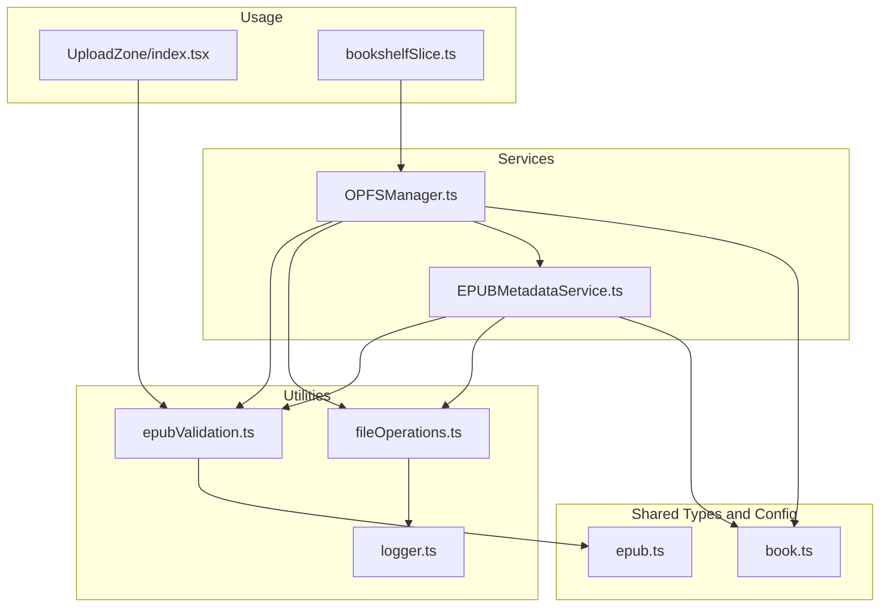
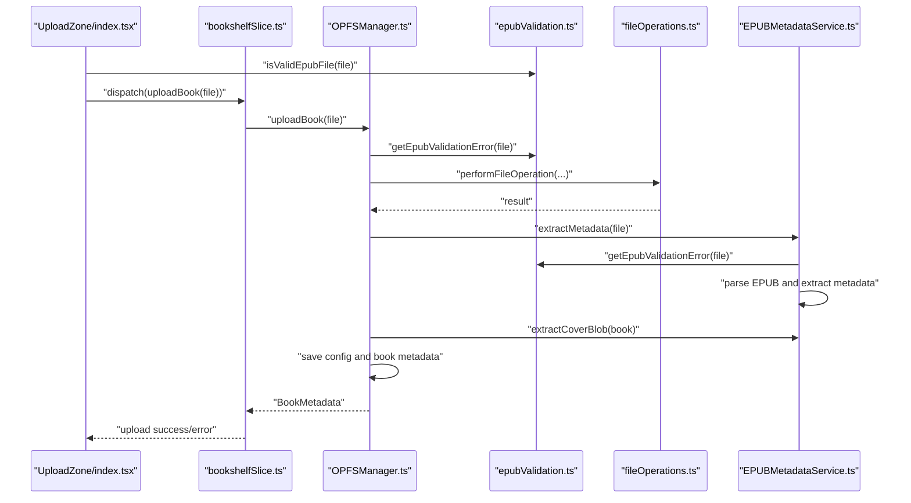
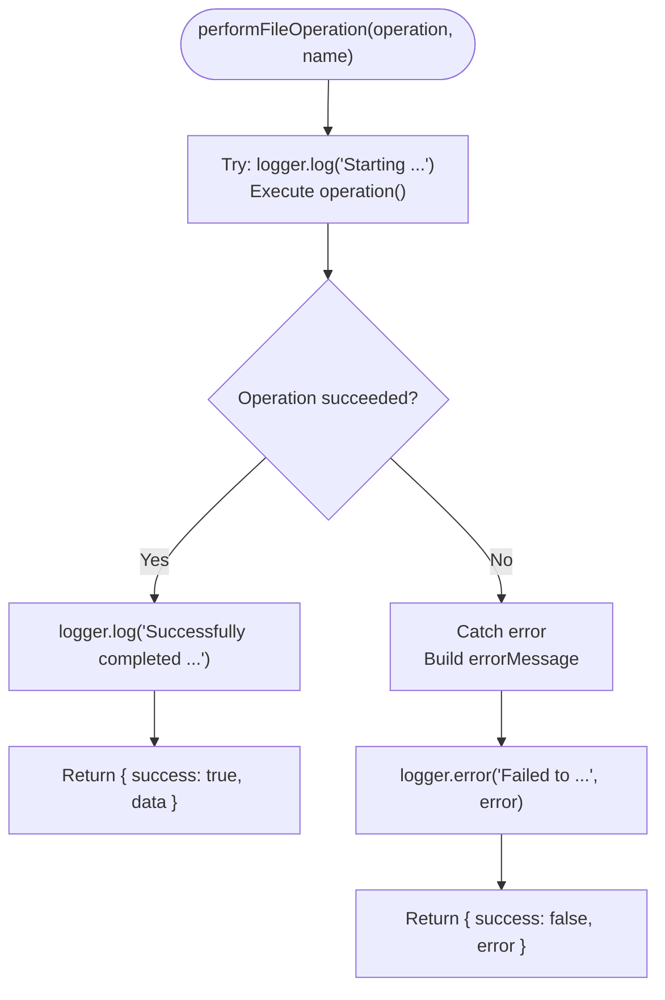
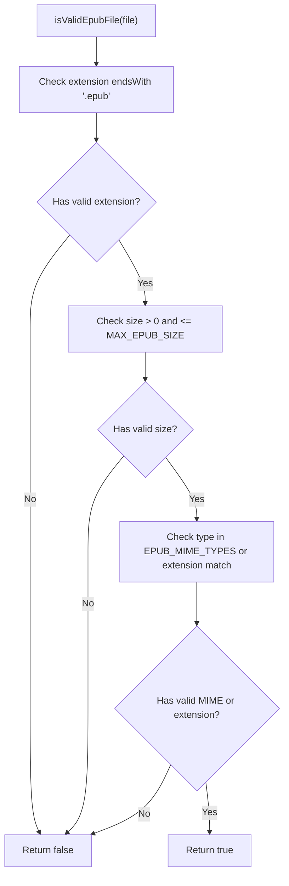
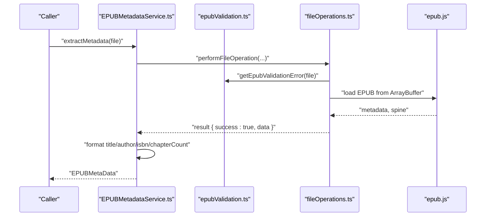
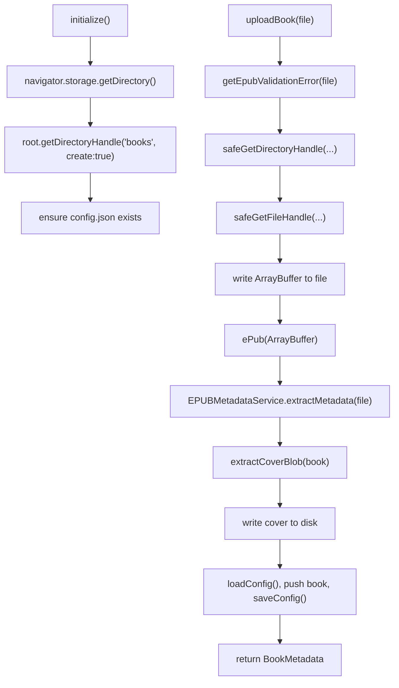
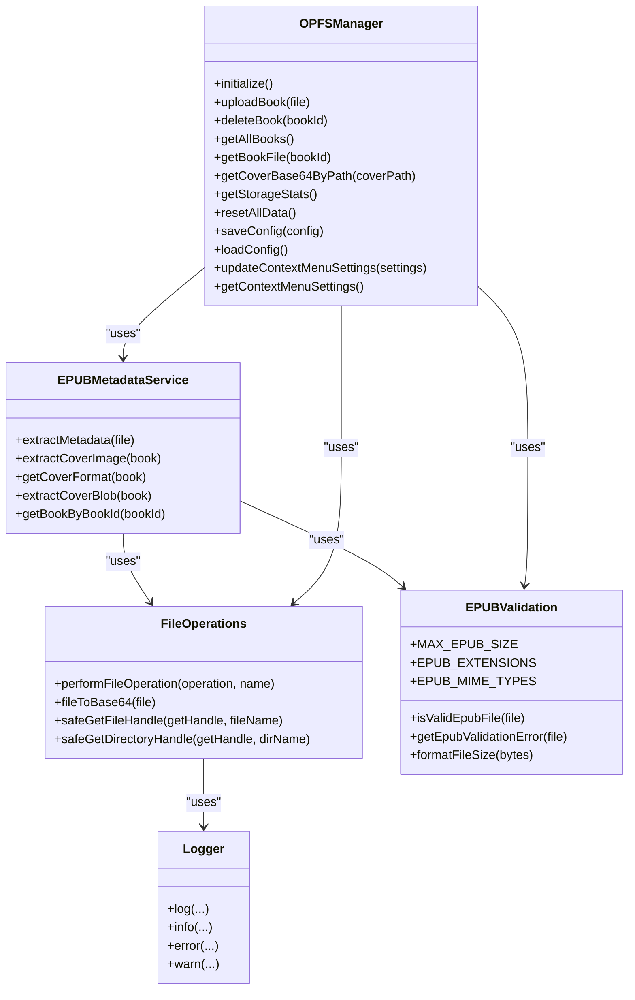
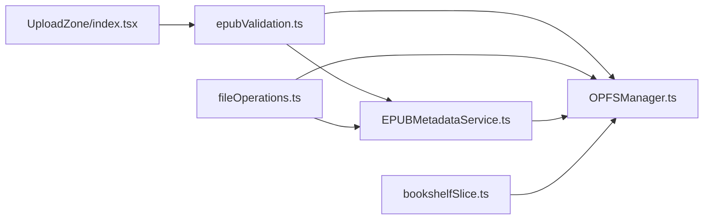

# Utility Functions and Services

<cite>
**Referenced Files in This Document**
- [fileOperations.ts](file://src/utils/fileOperations.ts)
- [epubValidation.ts](file://src/utils/epubValidation.ts)
- [logger.ts](file://src/utils/logger.ts)
- [EPUBMetadataService.ts](file://src/services/EPUBMetadataService.ts)
- [OPFSManager.ts](file://src/services/OPFSManager.ts)
- [epub.ts](file://src/constants/epub.ts)
- [book.ts](file://src/types/book.ts)
- [UploadZone/index.tsx](file://src/components/UploadZone/index.tsx)
- [bookshelfSlice.ts](file://src/store/slices/bookshelfSlice.ts)
</cite>

## Table of Contents
1. [Introduction](#introduction)
2. [Project Structure](#project-structure)
3. [Core Components](#core-components)
4. [Architecture Overview](#architecture-overview)
5. [Detailed Component Analysis](#detailed-component-analysis)
6. [Dependency Analysis](#dependency-analysis)
7. [Performance Considerations](#performance-considerations)
8. [Troubleshooting Guide](#troubleshooting-guide)
9. [Conclusion](#conclusion)
10. [Appendices](#appendices)

## Introduction
This section documents the utility functions and service layer that power file handling, EPUB validation, logging, and metadata extraction. It explains how fileOperations.ts centralizes error handling and logging for file-intensive operations, how epubValidation.ts enforces consistent EPUB file validation, how logger.ts provides unified logging across the app, and how EPUBMetadataService.ts extracts meaningful metadata from EPUB files. It also clarifies the separation of concerns between general-purpose utilities and business logic services, and offers guidance on extending the utility library while maintaining code quality.

## Project Structure
The utility and service layer spans several modules:
- Utilities: fileOperations.ts, epubValidation.ts, logger.ts
- Services: EPUBMetadataService.ts, OPFSManager.ts
- Shared types and constants: book.ts, epub.ts
- Usage examples: UploadZone/index.tsx, bookshelfSlice.ts

**Diagram sources**
- [fileOperations.ts](file://src/utils/fileOperations.ts#L1-L91)
- [epubValidation.ts](file://src/utils/epubValidation.ts#L1-L77)
- [logger.ts](file://src/utils/logger.ts#L1-L19)
- [EPUBMetadataService.ts](file://src/services/EPUBMetadataService.ts#L1-L177)
- [OPFSManager.ts](file://src/services/OPFSManager.ts#L1-L510)
- [book.ts](file://src/types/book.ts#L1-L116)
- [epub.ts](file://src/constants/epub.ts#L1-L61)
- [UploadZone/index.tsx](file://src/components/UploadZone/index.tsx#L1-L42)
- [bookshelfSlice.ts](file://src/store/slices/bookshelfSlice.ts#L1-L85)

**Section sources**
- [fileOperations.ts](file://src/utils/fileOperations.ts#L1-L91)
- [epubValidation.ts](file://src/utils/epubValidation.ts#L1-L77)
- [logger.ts](file://src/utils/logger.ts#L1-L19)
- [EPUBMetadataService.ts](file://src/services/EPUBMetadataService.ts#L1-L177)
- [OPFSManager.ts](file://src/services/OPFSManager.ts#L1-L510)
- [book.ts](file://src/types/book.ts#L1-L116)
- [epub.ts](file://src/constants/epub.ts#L1-L61)
- [UploadZone/index.tsx](file://src/components/UploadZone/index.tsx#L1-L42)
- [bookshelfSlice.ts](file://src/store/slices/bookshelfSlice.ts#L1-L85)

## Core Components
- fileOperations.ts: Provides a uniform wrapper for file operations with consistent logging and error reporting, plus helpers for Base64 conversion and safe handle retrieval for OPFS.
- epubValidation.ts: Centralizes EPUB validation rules and messages, including size limits, supported extensions, and MIME types.
- logger.ts: Standardizes log levels and timestamps for consistent diagnostics.
- EPUBMetadataService.ts: Orchestrates EPUB metadata extraction, cover image handling, and fallbacks when parsing fails.
- OPFSManager.ts: Implements OPFS-backed storage operations, integrates validation and utilities, and manages book lifecycle.

**Section sources**
- [fileOperations.ts](file://src/utils/fileOperations.ts#L1-L91)
- [epubValidation.ts](file://src/utils/epubValidation.ts#L1-L77)
- [logger.ts](file://src/utils/logger.ts#L1-L19)
- [EPUBMetadataService.ts](file://src/services/EPUBMetadataService.ts#L1-L177)
- [OPFSManager.ts](file://src/services/OPFSManager.ts#L1-L510)

## Architecture Overview
The utilities and services collaborate to enforce validation, handle file operations safely, and extract metadata from EPUBs. The service layer coordinates between validation, file operations, and external libraries (e.g., epub.js), while the UI components rely on centralized validation and services for robust user experiences.

**Diagram sources**
- [UploadZone/index.tsx](file://src/components/UploadZone/index.tsx#L1-L42)
- [bookshelfSlice.ts](file://src/store/slices/bookshelfSlice.ts#L1-L85)
- [OPFSManager.ts](file://src/services/OPFSManager.ts#L120-L219)
- [epubValidation.ts](file://src/utils/epubValidation.ts#L23-L61)
- [fileOperations.ts](file://src/utils/fileOperations.ts#L22-L36)
- [EPUBMetadataService.ts](file://src/services/EPUBMetadataService.ts#L11-L63)

## Detailed Component Analysis

### fileOperations.ts
- Purpose: Provide a consistent pattern for wrapping file operations with logging and error handling, and offer safe helpers for OPFS handles and Base64 conversions.
- Key exports:
  - FileOperationResult<T>: standardized shape for operation outcomes.
  - performFileOperation<T>(operation, operationName): wraps an async operation, logs start/end, and returns success/data or failure/error.
  - fileToBase64(file): converts a File to a data URL (Base64) with error logging.
  - safeGetFileHandle(getHandle, fileName): wraps a file handle acquisition with error logging and returns null on failure.
  - safeGetDirectoryHandle(getHandle, dirName): same for directories.
- Error handling pattern:
  - Catches exceptions, logs failures with context, and returns structured results for callers to branch on success/failure.
- Logging integration:
  - Uses logger.log for lifecycle events and logger.error for failures.

**Diagram sources**
- [fileOperations.ts](file://src/utils/fileOperations.ts#L22-L36)

**Section sources**
- [fileOperations.ts](file://src/utils/fileOperations.ts#L1-L91)
- [logger.ts](file://src/utils/logger.ts#L1-L19)

### epubValidation.ts
- Purpose: Centralize EPUB validation rules and messaging to ensure consistent checks across the app.
- Key exports:
  - MAX_EPUB_SIZE: maximum allowed file size.
  - EPUB_EXTENSIONS: supported file extensions.
  - EPUB_MIME_TYPES: accepted MIME types.
  - isValidEpubFile(file): returns whether a file meets extension, size, and MIME criteria.
  - getEpubValidationError(file): returns a human-readable error message or null if valid.
  - formatFileSize(bytes): converts bytes to a human-readable string.
- Validation logic:
  - Extension check ensures .epub.
  - Size check enforces a positive, bounded size.
  - MIME check allows EPUB-specific types or falls back to extension match.
- Usage:
  - Components and services import and reuse these constants and functions to validate EPUBs consistently.

**Diagram sources**
- [epubValidation.ts](file://src/utils/epubValidation.ts#L23-L36)
- [epub.ts](file://src/constants/epub.ts#L28-L39)

**Section sources**
- [epubValidation.ts](file://src/utils/epubValidation.ts#L1-L77)
- [epub.ts](file://src/constants/epub.ts#L28-L39)

### logger.ts
- Purpose: Provide a simple, consistent logging interface with timestamps and severity levels.
- Exports:
  - log(...messages)
  - info(...messages)
  - error(...messages)
  - warn(...messages)
- Behavior:
  - Prefixes each log line with a formatted timestamp and level tag.
  - Uses console.log/info/warn/error internally for browser compatibility.

**Section sources**
- [logger.ts](file://src/utils/logger.ts#L1-L19)

### EPUBMetadataService.ts
- Purpose: Extract comprehensive metadata from EPUB files and handle cover image extraction and fallbacks.
- Key responsibilities:
  - Input handling: validates file via getEpubValidationError and wraps processing with performFileOperation.
  - Core processing: loads EPUB using epub.js, reads metadata and spine length, and formats authors.
  - Output handling: constructs EPUBMetaData with fallbacks when extraction fails.
  - Cover handling: attempts to extract cover URL, fetch as blob, infer format, and return coverPath.
  - Book retrieval: creates a Book instance from OPFS-stored ArrayBuffer for downstream rendering.
- Error handling:
  - Uses logger.error for failures and returns conservative fallback metadata on errors.
- Integration:
  - Depends on epubValidation.ts for pre-checks and fileOperations.ts for consistent operation wrappers.

**Diagram sources**
- [EPUBMetadataService.ts](file://src/services/EPUBMetadataService.ts#L11-L63)
- [epubValidation.ts](file://src/utils/epubValidation.ts#L43-L61)
- [fileOperations.ts](file://src/utils/fileOperations.ts#L22-L36)

**Section sources**
- [EPUBMetadataService.ts](file://src/services/EPUBMetadataService.ts#L1-L177)
- [epubValidation.ts](file://src/utils/epubValidation.ts#L23-L61)
- [fileOperations.ts](file://src/utils/fileOperations.ts#L22-L36)
- [book.ts](file://src/types/book.ts#L1-L25)

### OPFSManager.ts
- Purpose: Manage OPFS-backed storage for EPUBs, including initialization, upload, deletion, and configuration persistence.
- Key responsibilities:
  - Initialization: ensures OPFS is supported and creates a root directory with a books subdirectory and config.json.
  - Upload: validates file, writes EPUB to a per-book directory, extracts metadata and cover, persists config, and returns BookMetadata.
  - Deletion: removes a book’s directory and updates config.
  - Retrieval: returns a book’s ArrayBuffer for rendering and fetches cover images by path.
  - Storage stats: enumerates entries and computes totals.
  - Config management: load/save/update context menu settings with defaults and recovery.
- Integration:
  - Uses epubValidation.ts for validation and fileOperations.ts for safe handle acquisition and consistent operation wrappers.
  - Uses EPUBMetadataService.ts for metadata and cover extraction.

**Diagram sources**
- [OPFSManager.ts](file://src/services/OPFSManager.ts#L38-L121)
- [OPFSManager.ts](file://src/services/OPFSManager.ts#L126-L219)
- [OPFSManager.ts](file://src/services/OPFSManager.ts#L224-L237)
- [OPFSManager.ts](file://src/services/OPFSManager.ts#L242-L261)
- [OPFSManager.ts](file://src/services/OPFSManager.ts#L266-L285)
- [OPFSManager.ts](file://src/services/OPFSManager.ts#L288-L324)
- [OPFSManager.ts](file://src/services/OPFSManager.ts#L329-L377)
- [OPFSManager.ts](file://src/services/OPFSManager.ts#L381-L402)
- [OPFSManager.ts](file://src/services/OPFSManager.ts#L404-L474)
- [OPFSManager.ts](file://src/services/OPFSManager.ts#L478-L510)

**Section sources**
- [OPFSManager.ts](file://src/services/OPFSManager.ts#L1-L510)
- [epubValidation.ts](file://src/utils/epubValidation.ts#L23-L61)
- [fileOperations.ts](file://src/utils/fileOperations.ts#L22-L36)
- [EPUBMetadataService.ts](file://src/services/EPUBMetadataService.ts#L1-L177)
- [book.ts](file://src/types/book.ts#L27-L55)

### Separation of Concerns: Utils vs Services
- Utilities (utils):
  - Provide reusable, low-level helpers for file operations, validation, and logging.
  - They are stateless and function-based, enabling reuse across services and components.
  - Example: fileOperations.ts encapsulates consistent error handling and logging; epubValidation.ts centralizes validation rules; logger.ts standardizes log output.
- Services (services):
  - Implement business logic and orchestrate cross-cutting concerns.
  - They depend on utilities and external libraries to perform domain-specific tasks.
  - Example: EPUBMetadataService orchestrates EPUB parsing and metadata extraction; OPFSManager coordinates OPFS operations, validation, and configuration.

**Diagram sources**
- [logger.ts](file://src/utils/logger.ts#L1-L19)
- [fileOperations.ts](file://src/utils/fileOperations.ts#L1-L91)
- [epubValidation.ts](file://src/utils/epubValidation.ts#L1-L77)
- [EPUBMetadataService.ts](file://src/services/EPUBMetadataService.ts#L1-L177)
- [OPFSManager.ts](file://src/services/OPFSManager.ts#L1-L510)

**Section sources**
- [logger.ts](file://src/utils/logger.ts#L1-L19)
- [fileOperations.ts](file://src/utils/fileOperations.ts#L1-L91)
- [epubValidation.ts](file://src/utils/epubValidation.ts#L1-L77)
- [EPUBMetadataService.ts](file://src/services/EPUBMetadataService.ts#L1-L177)
- [OPFSManager.ts](file://src/services/OPFSManager.ts#L1-L510)

### Examples of How Components Use These Utilities and Services
- UploadZone/index.tsx:
  - Validates EPUB files using isValidEpubFile and getEpubValidationError.
  - Dispatches uploadBook thunk and handles success/error feedback.
- bookshelfSlice.ts:
  - Wraps OPFSManager operations with async thunks, validates inputs, and returns structured payloads or error messages.

These examples demonstrate how UI components delegate validation and heavy lifting to utilities and services, keeping components thin and testable.

**Section sources**
- [UploadZone/index.tsx](file://src/components/UploadZone/index.tsx#L1-L42)
- [bookshelfSlice.ts](file://src/store/slices/bookshelfSlice.ts#L1-L85)

## Dependency Analysis
- Internal dependencies:
  - EPUBMetadataService depends on epubValidation.ts and fileOperations.ts.
  - OPFSManager depends on epubValidation.ts, fileOperations.ts, and EPUBMetadataService.
  - Components depend on epubValidation.ts and services for validation and orchestration.
- External dependencies:
  - epub.js for EPUB parsing and cover URL resolution.
  - Web APIs for OPFS (navigator.storage, FileSystemDirectoryHandle, FileSystemFileHandle).
- Cohesion and coupling:
  - Utilities are cohesive and low-coupling, suitable for reuse.
  - Services coordinate multiple utilities and external systems, increasing coupling intentionally for business logic.

**Diagram sources**
- [epubValidation.ts](file://src/utils/epubValidation.ts#L1-L77)
- [fileOperations.ts](file://src/utils/fileOperations.ts#L1-L91)
- [EPUBMetadataService.ts](file://src/services/EPUBMetadataService.ts#L1-L177)
- [OPFSManager.ts](file://src/services/OPFSManager.ts#L1-L510)
- [UploadZone/index.tsx](file://src/components/UploadZone/index.tsx#L1-L42)
- [bookshelfSlice.ts](file://src/store/slices/bookshelfSlice.ts#L1-L85)

**Section sources**
- [epubValidation.ts](file://src/utils/epubValidation.ts#L1-L77)
- [fileOperations.ts](file://src/utils/fileOperations.ts#L1-L91)
- [EPUBMetadataService.ts](file://src/services/EPUBMetadataService.ts#L1-L177)
- [OPFSManager.ts](file://src/services/OPFSManager.ts#L1-L510)
- [UploadZone/index.tsx](file://src/components/UploadZone/index.tsx#L1-L42)
- [bookshelfSlice.ts](file://src/store/slices/bookshelfSlice.ts#L1-L85)

## Performance Considerations
- File-intensive operations:
  - EPUB parsing and cover extraction involve ArrayBuffer and Blob operations. Prefer streaming or chunked processing when possible.
  - Avoid redundant parsing by caching parsed Book instances when reusing the same EPUB.
- Logging overhead:
  - Excessive logging can slow down UI; use logger.warn for recoverable issues and logger.error sparingly.
- OPFS enumeration:
  - getStorageStats iterates directories; cache results when feasible and avoid repeated scans.
- Validation cost:
  - isValidEpubFile is O(1) checks; keep validations lightweight and centralized to reduce duplication.
- Memory usage:
  - Large EPUBs and cover blobs increase memory pressure; consider releasing references promptly and using streaming where applicable.

[No sources needed since this section provides general guidance]

## Troubleshooting Guide
- Validation failures:
  - If getEpubValidationError returns a message, display it to the user and prevent upload.
  - Verify file size and extension align with constants in epub.ts.
- Metadata extraction errors:
  - EPUBMetadataService logs failures and returns fallback metadata; check logs for detailed error context.
- OPFS errors:
  - OPFSManager wraps operations with performFileOperation and logs failures; confirm OPFS support and permissions.
- Cover extraction issues:
  - If cover URL is unavailable or fetch fails, EPUBMetadataService returns undefined; UI should fall back to placeholder images.

**Section sources**
- [epubValidation.ts](file://src/utils/epubValidation.ts#L43-L61)
- [EPUBMetadataService.ts](file://src/services/EPUBMetadataService.ts#L86-L102)
- [EPUBMetadataService.ts](file://src/services/EPUBMetadataService.ts#L104-L158)
- [OPFSManager.ts](file://src/services/OPFSManager.ts#L126-L219)
- [fileOperations.ts](file://src/utils/fileOperations.ts#L22-L36)

## Conclusion
The utility and service layer establishes a robust foundation for EPUB handling:
- fileOperations.ts ensures consistent error handling and logging for file operations.
- epubValidation.ts centralizes EPUB validation rules for reliability and consistency.
- logger.ts standardizes diagnostics across the application.
- EPUBMetadataService and OPFSManager implement business logic with clear boundaries, leveraging utilities for cross-cutting concerns.
Adhering to these patterns enables maintainable extensions and scalable enhancements.

[No sources needed since this section summarizes without analyzing specific files]

## Appendices

### Extending the Utility Library
Guidelines for adding new functions while maintaining quality:
- Reuse existing patterns:
  - Wrap async operations with performFileOperation for consistent logging and error handling.
  - Use logger.log/info/error/warn for diagnostics.
- Keep utilities stateless:
  - Prefer pure functions or small, focused helpers.
- Centralize shared constants:
  - Add new constants to epub.ts or dedicated config files to avoid duplication.
- Validate inputs early:
  - Use epubValidation.ts helpers to enforce constraints before heavy operations.
- Testable and observable:
  - Export clear functions with explicit inputs/outputs; add minimal logging for traceability.

[No sources needed since this section provides general guidance]