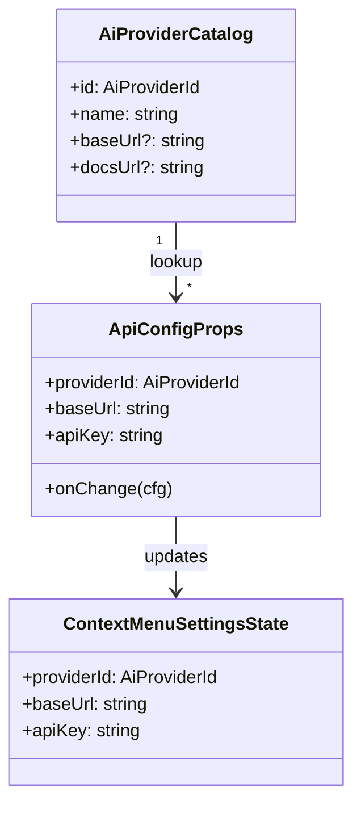
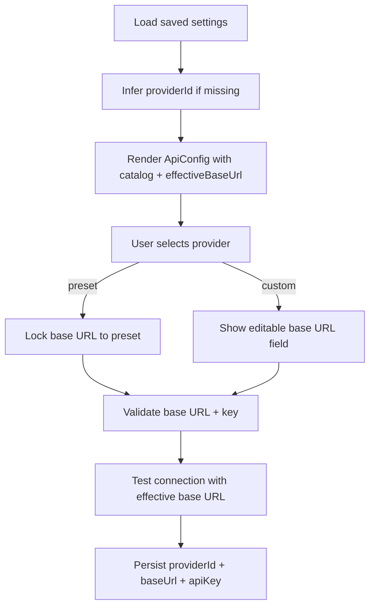

# AI Provider Selector Refactor Spec

## Goal
- Add an "API provider" select to Context Menu Configuration so users can pick a known OpenAI-compatible provider and only enter
  an API key for that provider.
- Include an "OpenAI compatible (custom)" option that reveals a "Base URL" input (renaming the current API endpoint) for any
  custom-compatible service.
- Auto-fill base URLs for built-in providers; keep backward compatibility with existing stored endpoint/key settings.

## Current State
- UI: `ApiConfig` shows `API Endpoint` + `API Key` fields with live validation and connection test.
- State: Upstream page owns `apiEndpoint` + `apiKey` strings; no notion of provider catalog or provider id.
- Behavior: Connection test hits `<endpoint>/models` with bearer token.

## Proposed UX
- New select labeled "API Provider" above the endpoint/key fields.
- **Support filtering/searching by typing to narrow down the provider list.**
- Options:
  - Curated providers with preset base URLs.
  - `OpenAI compatible (custom)` reveals editable "Base URL" (the existing endpoint field) and allows any valid URL.
  - `Manual` fallback keeps both fields editable for edge cases (optional if we keep custom covering it).
- **Endpoint (Base URL) field is HIDDEN unless `OpenAI compatible (custom)` is selected.**
- Helper text under select summarizing base URL + docs link (static for now).
- Preserve API key field + visibility toggle; validation now checks provider + base URL consistency.
- **Model selector simplification:** replace complex dropdown styling with a simple standard input/select to reduce clutter.

## Component/State Plan
- `ApiConfig` refactor:
  - Props: `providerId`, `baseUrl`, `apiKey`, `onChange({ providerId, baseUrl, apiKey })`.
  - Render provider select **(as a Combobox/Searchable Select to support filtering)**.
  - **Hide "Base URL" input field completely when a preset provider is selected; only show it for "custom".**
  - Keep key input + toggle; reuse validation and testing, updated to use `effectiveBaseUrl`.
  - **Move validation/connection status messages to the very bottom of the component.**
- `SearchableSelect` component update:
  - **Do not display the URL (note) in the option list dropdown, only the provider name.**
- `ContextMenuSettingsPage` (or parent) owns provider catalog constant and persists selection.

## UX Notes
- Provider select appears above the Base URL and API Key fields.
- Base URL label replaces "API Endpoint".
- Base URL field disabled when a preset provider is chosen; editable and required for `OpenAI compatible (custom)`.
- Helper text under the select shows selected provider base URL and docs link (if available).
- Connection/validation status message bar stays pinned at the bottom of the section, below all inputs, so the field layout stays compact.

## Migration Strategy
- On load: if stored providerId missing, infer `custom` and hydrate `baseUrl` from existing `apiEndpoint`.
- Seed `providerApiKeys` with the existing `apiKey` under the inferred provider id (likely `custom`) so the current key persists.
- Save: store providerId + baseUrl + apiKey; keep writing `apiEndpoint` for backward compatibility if needed by other code, and update `providerApiKeys[providerId]` with the current key.

## Testing & QA
- Lint: `pnpm lint`.
- Manual:
  - Each preset provider: select, see locked base URL, enter dummy key, ensure validation and connection attempts use preset URL.
  - Custom: select "OpenAI compatible (custom)", enter custom URL + key, ensure validation and test respect typed URL.
  - Migration: load existing data with only endpoint/key and confirm select defaults to custom with field prefilled.
  - Provider key cache: switch across providers, enter different keys, switch back and confirm each provider restores its cached key from OPFS.
  - Edge: invalid URL, missing key, slow/failing connection still shows warnings/errors.

## UML Sketches

## Open Questions
- Manual vs custom: merge; keep only `OpenAI compatible (custom)` for user-entered base URLs (no separate Manual).
- Do we need per-provider model filters (e.g., different endpoints or auth headers)?
- Should we surface provider documentation links inline for each option? Yes; include in helper text and append to failure banner when available.
