# Feature Specification: Context Menu Routing and AI Response Caching

## 1. Overview

This feature makes context menus **visible in the URL** and implements **intelligent AI response caching** to avoid redundant API calls when users query the same word in the same context multiple times.

### Key Objectives

1. **URL-based Context Menu Management**: Multiple context menus can be opened simultaneously, with their state reflected in the URL query parameter `?contextMenu=<id1>,<id2>,<id3>`
2. **Persistent Caching System**: AI tool responses are cached in OPFS based on context hash, eliminating duplicate API calls for identical queries
3. **Automatic Cache Retrieval**: When a user selects the same text in the same context, cached responses are displayed instantly
4. **Shareable State**: URLs can be bookmarked or shared to recreate the exact reader state with all context menus

---

## 2. Problem Statement

### Current Limitations

- Context menus disappear on page refresh and cannot be restored
- The same AI query for identical text/context triggers new API calls, wasting tokens and time
- Multiple context menus cannot be managed or tracked systematically
- No URL-based navigation or shareability for reader states with context menus

### Proposed Solution

Implement a routing-based context menu system with intelligent caching:

- Store context menu state in URL query parameters
- Create an OPFS-based caching system organized by context hash
- Automatically rehydrate context menus from URL on page load
- Cache all AI tool responses for instant retrieval on repeated queries

---

## 3. Technical Architecture

### 3.1 OPFS Directory Structure

```
OPFS Root/
├── books/                          (existing)
├── config.json                     (existing)
└── contextMenu/                    (NEW)
    ├── latest-id.json              (Tracks latest context ID)
    ├── hashMapId/                  (Maps context hash → context ID)
    │   ├── a7f3c2e1d4b6...json    (hash → ID mapping)
    │   └── b8g4d3f2e5c7...json
    └── cache/                      (Context data & AI responses)
        ├── 1/                      (Context ID 1)
        │   ├── cache.json          (Context metadata: words, context)
        │   ├── 语境.json            (AI tool "语境" conversation cache)
        │   └── 同义词.json           (AI tool "同义词" conversation cache)
        ├── 2/
        │   ├── cache.json
        │   ├── Translation.json
        │   └── Summary.json
        └── 3/
            └── cache.json
```

### 3.2 Data Structures

#### 3.2.1 `latest-id.json`

```typescript
{
  "latestId": 3  // Incremental counter, starts at 0
}
```

#### 3.2.2 `hashMapId/<hash>.json`

```typescript
{
  "id": 2,           // Context ID
  "hash": "a7f3c2e1d4b6...",
  "createdAt": "2025-12-03 10:30:00"
}
```

#### 3.2.3 `cache/<id>/cache.json` (Context Metadata)

```typescript
{
  "id": 2,
  "words": "repository",
  "context": "... only repositories owned by your personal account may be <selected>repository</selected> used to publish ...",
  "createdAt": "2025-12-03 10:30:00"
}
```

#### 3.2.4 `cache/<id>/<toolName>.json` (AI Tool Cache)

```typescript
{
  "toolName": "语境",
  "conversations": [
    {
      "role": "user",
      "content": "Explain 'repository' in this context..."
    },
    {
      "role": "assistant",
      "content": "In this context, 'repository' refers to..."
    }
  ],
  "tokenUsage": {
    "prompt": 150,
    "completion": 200,
    "total": 350
  },
  "updatedAt": "2025-12-03 10:30:15",
  "model": "gpt-4o-mini"  // Model used for this response
}
```

---

## 4. Detailed Workflow

### 4.1 Text Selection Flow (Creating New Context)


### 4.4 Context Menu Closing Flow

**Closing Triggers** (Multiple sources):

1. **Close button (X)**: User clicks the close icon on context menu
2. **Outside click**: User clicks anywhere outside the context menu (e.g., on the book content, empty space)
3. **New selection**: User selects new text (closes all existing menus before opening new one)
4. **ESC key**: User presses ESC to dismiss context menu
5. **Navigation**: User navigates to different page/chapter


**Important Notes:**

- **Multiple closing triggers**: Close button, outside click, ESC key, new selection, navigation
- Closing a context menu **removes its ID from the URL** but **does NOT decrement** `latest-id.json`
- The ID counter is **monotonically increasing** (never goes backward)
- Closed context menu data remains in cache for future reuse
- Example: Open menu (ID=5), close it (any trigger), open new menu → still gets ID=6 (not reusing 5)
- **Outside clicks** are detected by the existing click handler in `EpubReader/index.tsx` (see lines 268-303)

### 4.2 AI Tool Execution Flow (with Cache Check)

```mermaid
sequenceDiagram
    participant ContextMenu
    participant AIAgent
    participant CacheService
    participant OPFS
    participant AIProvider

    ContextMenu->>AIAgent: Render AI tool "语境"
    AIAgent->>CacheService: checkCache(contextId=4, toolName="语境")
    CacheService->>OPFS: Read cache/4/语境.json

    alt Cache exists
        OPFS-->>CacheService: Return cached conversations
        CacheService-->>AIAgent: Display cached response instantly
        AIAgent->>ContextMenu: Render messages (from cache)
    else Cache doesn't exist
        CacheService-->>AIAgent: No cache found
        AIAgent->>AIProvider: Send API request
        AIProvider-->>AIAgent: Stream response
        AIAgent->>AIAgent: Accumulate response
        AIAgent->>CacheService: saveCache(contextId, toolName, conversations, tokenUsage)
        CacheService->>OPFS: Write cache/4/语境.json
        AIAgent->>ContextMenu: Render streamed messages
    end
```



### 4.3 URL Rehydration Flow (Page Load)

**Context Menu Stacking Order:**

- URL format: `?contextMenu=1,2,3` (left to right = bottom to top)
- **ID 1** = Bottom layer (opened first, z-index lowest)
- **ID 2** = Middle layer (opened second, z-index medium)
- **ID 3** = Top layer (opened last, z-index highest, most recent)

**Visual Representation:**

```
┌─────────────────┐
│  Context Menu 3 │ ← Top (z-index: 52, most recent)
│  (ID=3)         │
└─────────────────┘
  ┌─────────────────┐
  │  Context Menu 2 │ ← Middle (z-index: 51)
  │  (ID=2)         │
  └─────────────────┘
    ┌─────────────────┐
    │  Context Menu 1 │ ← Bottom (z-index: 50, oldest)
    │  (ID=1)         │
    └─────────────────┘
```


**Important Ordering Rules:**

1. **URL order = Rendering order**: `?contextMenu=1,2,3` means render ID 1 first (bottom), then ID 2, then ID 3 (top)
2. **Z-index calculation**: `baseZIndex + index` where index is position in array (0, 1, 2...)
3. **Latest = Topmost**: Rightmost ID in URL is the most recent (highest z-index)
4. **Closing middle menu**: Removing ID 2 from `1,2,3` → URL becomes `1,3` (order preserved)
5. **Adding new menu**: Always appends to right → `1,2,3` + new ID 4 → `1,2,3,4`

---

## 5. Implementation Plan

### **Coding Style: Functional Programming**

**All code will follow functional programming paradigms:**

- ✅ **Pure functions** - No side effects, same input = same output
- ✅ **Immutability** - No mutation of data, use spread operators and `map`/`filter`/`reduce`
- ✅ **Function composition** - Small, composable functions
- ✅ **No classes** - Use functions and closures instead
- ✅ **Declarative** - Express WHAT, not HOW
- ✅ **Higher-order functions** - Functions that take/return functions
- ✅ **Avoid loops** - Use `map`, `filter`, `reduce`, `forEach` instead of `for`/`while`

**Example functional style:**

```typescript
// ❌ Classic/OOP style (avoid)
class CacheService {
  private cache = new Map();

  saveData(key: string, value: any) {
    this.cache.set(key, value);
  }
}

// ✅ Functional style (preferred)
const createCacheService = () => {
  const saveData = async (key: string, value: unknown): Promise<void> => {
    // Pure function, no mutation
    await writeFile(key, JSON.stringify(value));
  };

  return { saveData };
};
```

### 5.1 Phase 1: OPFS Infrastructure

**Files to Create:**

- `src/services/ContextMenuCacheService.ts` - Core caching logic
- `src/types/contextMenuCache.ts` - Type definitions

**Key Functions:**

- `initializeContextMenuCache()` - Create OPFS directory structure
- `generateContextHash(context: string): string` - MD5/SHA256 hash (32 chars)
- `getOrCreateContextId(words: string, context: string): Promise<number>`
- `saveContextMetadata(id: number, words: string, context: string)`
- `getContextMetadata(id: number): Promise<{words: string, context: string} | null>`

### 5.2 Phase 2: Cache Management

**Functions:**

- `checkAIToolCache(contextId: number, toolName: string): Promise<AIToolCache | null>`
- `saveAIToolCache(contextId: number, toolName: string, cache: AIToolCache)`
- `updateLatestId(newId: number)`
- `getLatestId(): Promise<number>`

### 5.3 Phase 3: URL State Management

**Files to Modify:**

- `src/pages/EpubReader/index.tsx`

**Changes:**

- Add `useSearchParams()` from `react-router-dom`
- Parse `contextMenu` query parameter on mount
- **Add context menu to URL**: When `pushBaseMenu()` or `pushDrilldownMenu()` succeeds, append new ID to query param
- **Remove context menu from URL**: When `removeMenuAndChildren()` is called, remove ID and all child IDs from query param
- Implement `rehydrateContextMenusFromURL(ids: number[])` to restore menus on page load
- Sync `menuStack` state changes to URL automatically

### 5.5 Phase 5: Help System & UX Improvements

**Files to Modify:**

- Context menu header component (where pin icon is located)

**New Features:**

1. **Help Icon Button (?)**

   - Location: Near the pin icon button in context menu header
   - Visual: Question mark icon (?) with hover effect
   - Action: Click to show help popup overlay

2. **Help Popup Content**

   - **Title**: "How to Use Context Menu"
   - **Content**:

     ```
     📖 Context Menu Quick Guide

     ✅ Opening Context Menu:
     • Select any word or phrase in the book
     • Context menu appears automatically

     ❌ Closing Context Menu:
     • Press ESC key (recommended)
     • Click the X button in the header
     • Click anywhere outside the menu

     📌 Features:
     • Pin icon: Keep menu maximized
     • Multiple menus: Open several at once
     • Cached responses: Instant results for repeated queries

     ⚠️ Note: You cannot select new text while menus are open.
          Close existing menus first (press ESC).
     ```

   - **Close button**: X or "Got it" button to dismiss popup
   - **Design**: Modal overlay with semi-transparent backdrop

3. **Implementation Details**
   - Help icon appears on ALL context menus (not just topmost)
   - Popup is modal (blocks interaction with background)
   - First-time users see auto-popup on first context menu open (optional)
   - User preference stored in localStorage to avoid repeat popups

**Files to Modify:**

- `src/pages/EpubReader/components/AIAgent/AIAgent.tsx`
- `src/pages/EpubReader/components/AIAgent/components/MessageList/useFetchAIMessage.ts`

**Changes:**

- Check cache before making API calls
- Save responses to cache after successful completion
- Display cache metadata (timestamp, token usage) in UI

---

## 6. API Design

### 6.1 ContextMenuCacheService

```typescript
// src/services/ContextMenuCacheService.ts

export interface ContextMetadata {
  id: number;
  words: string;
  context: string;
  createdAt: string;
}

export interface AIToolCache {
  toolName: string;
  conversations: Array<{ role: 'user' | 'assistant'; content: string }>;
  tokenUsage: {
    prompt: number;
    completion: number;
    total: number;
  };
  updatedAt: string;
  model: string;
}

export async function initializeContextMenuCache(): Promise<void>;

export function generateContextHash(context: string): string;

export async function getOrCreateContextId(words: string, context: string): Promise<number>;

export async function getContextMetadata(id: number): Promise<ContextMetadata | null>;

export async function checkAIToolCache(
  contextId: number,
  toolName: string
): Promise<AIToolCache | null>;

export async function saveAIToolCache(
  contextId: number,
  toolName: string,
  cache: AIToolCache
): Promise<void>;
```

### 6.2 URL Query Parameter Format

```
/reader/:bookId?contextMenu=<id1>,<id2>,<id3>,...
```

**Examples:**

- Single context menu: `/reader/book-123?contextMenu=5`
- Multiple context menus: `/reader/book-123?contextMenu=1,3,7`
- No context menus: `/reader/book-123` (no query parameter)

**Rules:**

- IDs are comma-separated, no spaces
- Order matters: rightmost ID = topmost/latest menu
- Invalid IDs are silently ignored during rehydration

---

## 7. Edge Cases & Error Handling

### 7.1 Hash Collisions

- **Probability**: Extremely low with SHA256 (32-char hex)
- **Handling**: If collision detected (same hash, different context), append `-1`, `-2` suffix to hash

### 7.2 Missing Cache Files

- **Scenario**: `cache/<id>/cache.json` missing but ID in URL
- **Handling**: Skip that context menu, log warning, continue with other IDs

### 7.3 Corrupted Cache

- **Scenario**: JSON parse error when reading cache files
- **Handling**: Delete corrupted file, treat as cache miss, regenerate

### 7.4 URL Too Long

- **Scenario**: >100 context menus in URL
- **Limit**: Browser URL limit ~2000 chars
- **Handling**: Show warning after 50+ menus, suggest clearing old ones

### 7.5 Cache Invalidation

- **Manual**: Add "Clear Cache" button in Settings > Storage
- **Automatic**: No TTL for now (cache never expires)
- **Future**: Add `expiresAt` field for time-based invalidation

---

## 8. User Experience

### 8.1 Visual Indicators

- **Cache Hit**: Show ⚡️ icon next to AI tool name + "Loaded from cache" tooltip
- **Cache Miss**: Show normal loading spinner
- **Token Savings**: Display "Saved ~350 tokens" badge for cached responses

### 8.2 URL Behavior

- **Auto-update**: URL updates immediately when context menu opens/closes
- **Browser Back/Forward**: Fully supported - navigating history restores menu state
- **Copy/Paste URL**: Share URL with friends to show exact page + context menus

### 8.3 Performance

- **Cache Read**: <10ms (OPFS file read)
- **Hash Generation**: <5ms (SHA256 on ~500 char context)
- **URL Update**: Instant (React state → query params)

---

## 9. Testing Strategy

### 9.1 Unit Tests

- [ ] `generateContextHash()` produces consistent 32-char hashes
- [ ] `getOrCreateContextId()` reuses existing IDs for same context
- [ ] `getOrCreateContextId()` creates new IDs for different contexts
- [ ] Cache read/write functions handle OPFS errors gracefully

### 9.2 Integration Tests

- [ ] Select text → verify URL updates with new context ID appended
- [ ] Reload page with `?contextMenu=X` → context menu rehydrates
- [ ] Open 3 menus → close middle one → URL updates to remove only that ID (e.g., `1,2,3` → `1,3`)
- [ ] Close menu with children → all child IDs removed from URL
- [ ] Verify ID counter never decrements (close ID=5, open new → still gets ID=6)
- [ ] Cache AI response → select same text → instant load from cache

### 9.3 Manual Tests

- [ ] Select same word in different contexts → different IDs assigned
- [ ] Select same word in same context (different session) → same ID reused
- [ ] Bookmark URL → reopen later → all menus restored
- [ ] Clear all menus → URL becomes `/reader/:bookId` (no query param)
- [ ] Open menu (ID=3) → close it → open new menu → verify new ID=4 (not reusing 3)
- [ ] Close middle menu in stack of 5 → verify only that ID removed from URL

---

## 10. Migration & Backward Compatibility

### 10.1 First-Time Initialization

- On first use, `initializeContextMenuCache()` creates `contextMenu/` directory
- `latest-id.json` initialized to `{"latestId": 0}`
- No migration needed (new feature, no old data)

### 10.2 Future Schema Changes

- Version field in `cache.json` for future upgrades
- Graceful fallback if new fields are missing

---

## 11. Security & Privacy

### 11.1 Data Storage

- All cache stored in **local OPFS** (never sent to server)
- Hashes are one-way (cannot reverse-engineer original context)
- No personally identifiable information (PII) in cache files

### 11.2 URL Sharing

- URLs only contain **context IDs** (numbers), not actual text
- Sharing URL requires recipient to have same book + same context ID in their local OPFS
- **Risk**: Low (IDs are meaningless without local cache)

---

## 12. Future Enhancements

### 12.1 Cache Analytics

- Track cache hit rate (hits / total queries)
- Show "Total tokens saved this month" in Settings

### 12.2 Cross-Device Sync

- Export cache to JSON file
- Import cache on another device
- Cloud sync (Google Drive, Dropbox)

### 12.3 Cache Expiration

- Add TTL (time-to-live) for cache entries
- Automatically purge entries older than 30 days

### 12.4 Smart Cache Warming

- Preload AI responses for frequently queried words
- Background cache regeneration for updated models

---

## 13. Success Metrics

### 13.1 Performance

- **Target**: 90%+ cache hit rate for repeated queries
- **Target**: <50ms to rehydrate 5 context menus from URL
- **Target**: 80% reduction in API calls for returning users

### 13.2 User Adoption

- **Target**: 50%+ of users share URLs with context menus
- **Target**: 70%+ of users benefit from cache (see "loaded from cache" message)

---

## 14. Implementation Checklist

### Phase 1: Core Infrastructure ✅

- [ ] Create `src/services/ContextMenuCacheService.ts`
- [ ] Create `src/types/contextMenuCache.ts`
- [ ] Implement OPFS directory initialization
- [ ] Implement hash generation (use `crypto.subtle.digest`)
- [ ] Implement `getOrCreateContextId()`
- [ ] Implement `getContextMetadata()`
- [ ] Unit tests for cache service

### Phase 2: URL State Management

- [ ] Update `EpubReader/index.tsx` to read `?contextMenu` param
- [ ] Implement `rehydrateContextMenusFromURL()`
- [ ] Update `pushBaseMenu()` to **append** new ID to URL query param
- [ ] Update `removeMenuAndChildren()` to **remove** closed ID(s) from URL query param
- [ ] Ensure ID counter in `latest-id.json` is **never decremented** (monotonic increment only)
- [ ] Handle browser back/forward navigation
- [ ] Integration tests for URL sync (add, remove, rehydrate)

### Phase 3: AI Cache Integration

- [ ] Modify `AIAgent.tsx` to check cache before API call
- [ ] Modify `useFetchAIMessage.ts` to save response to cache
- [ ] Add cache indicators in UI (⚡️ icon, timestamp)
- [ ] Add token usage tracking
- [ ] Manual tests for cache hit/miss

### Phase 4: Settings & Cleanup

- [ ] Add "Context Menu Cache" section to Storage page
- [ ] Display total cache size + file count
- [ ] Add "Clear Context Menu Cache" button
- [ ] Add cache statistics (hit rate, tokens saved)
- [ ] Documentation update

---

## 15. Open Questions

1. **Hash Algorithm**: MD5 (fast) vs SHA256 (secure)? → **Decision: SHA256 for collision resistance**
2. **URL Encoding**: Should IDs be comma-separated or use array format `?contextMenu[]=1&contextMenu[]=2`? → **Decision: Comma-separated for brevity**
3. **Cache Limit**: Should we limit total cache size (e.g., max 100 contexts)? → **Decision: No hard limit initially, add if storage issues arise**
4. **Conflict Resolution**: What if two users with different books share the same context hash? → **Decision: Hash includes book ID (low priority for v1)**

---

## 16. Appendix: Example Scenarios

### Scenario A: First-Time Selection

```
1. User selects "repository" in context X
2. Context hash: "a7f3c2e1d4b6f8e9..."
3. Check hashMapId/a7f3c2e1....json → not found
4. Read latest-id.json → 0
5. Create context ID = 1
6. Save hashMapId/a7f3c2e1....json → {id: 1}
7. Save cache/1/cache.json → {words: "repository", context: "..."}
8. Update URL → ?contextMenu=1
9. AI tool "语境" executes → save cache/1/语境.json
```

### Scenario B: Repeated Selection (Same Session)

```
1. User selects "repository" in context X again
2. Context hash: "a7f3c2e1d4b6f8e9..." (same)
3. Check hashMapId/a7f3c2e1....json → found, id=1
4. Context menu opens with id=1
5. URL already has ?contextMenu=1 → no change
6. AI tool "语境" checks cache/1/语境.json → found!
7. Display cached response instantly (no API call)
```

### Scenario C: Page Reload with URL (Stacking Order)

```
1. User has URL: /reader/book-123?contextMenu=1,3,5
2. Page loads → parse query params → [1, 3, 5]
3. For each ID IN ORDER (left to right):
   - Read cache/1/cache.json → {words: "repository", context: "..."}
   - Read cache/3/cache.json → {words: "function", context: "..."}
   - Read cache/5/cache.json → {words: "async", context: "..."}
4. Create 3 ContextMenuEntry objects: [entry1, entry3, entry5]
5. Render menus with z-index stacking:
   - entry1 (ID=1): z-index = 50 (BOTTOM layer, index=0)
   - entry3 (ID=3): z-index = 51 (MIDDLE layer, index=1)
   - entry5 (ID=5): z-index = 52 (TOP layer, index=2, most recent)
6. Visual result:
   ┌─────────────────┐
   │ Menu 5 (async)  │ ← Top (z-index: 52)
   └─────────────────┘
     ┌────────────────────┐
     │ Menu 3 (function)│ ← Middle (z-index: 51)
     └────────────────────┘
       ┌───────────────────────┐
       │ Menu 1 (repository)│ ← Bottom (z-index: 50)
       └───────────────────────┘
7. Each AI tool checks its cache file → instant load
```

### Scenario D: Opening Multiple Menus (Stacking Order)

```
1. User selects "repository" → URL: ?contextMenu=1 (one menu, z-index: 50)
2. User selects "function" → URL: ?contextMenu=1,2 (two menus stacked)
   - Menu 1 (repository): z-index = 50 (bottom)
   - Menu 2 (function): z-index = 51 (top)
3. User selects "async" → URL: ?contextMenu=1,2,3 (three menus stacked)
   - Menu 1 (repository): z-index = 50 (bottom)
   - Menu 2 (function): z-index = 51 (middle)
   - Menu 3 (async): z-index = 52 (top, most recent)
4. Visual result matches URL order: 1 (bottom) → 2 (middle) → 3 (top)
```

### Scenario E: Closing Middle Menu (Order Preserved)

```
1. Current state: ?contextMenu=1,2,3 (three menus stacked)
2. User closes Menu 2 (middle menu)
3. Remove ID=2 from URL → ?contextMenu=1,3
4. Re-render with preserved order:
   - Menu 1 (repository): z-index = 50 (bottom, index=0)
   - Menu 3 (async): z-index = 51 (top, index=1)
5. Menu 3 is now the topmost (rightmost in URL)
6. Visual result:
   ┌─────────────────┐
   │ Menu 3 (async)  │ ← Top (z-index: 51)
   └─────────────────┘
     ┌───────────────────────┐
     │ Menu 1 (repository)│ ← Bottom (z-index: 50)
     └───────────────────────┘
```

---

## 17. References

- **OPFS API**: [MDN - Origin Private File System](https://developer.mozilla.org/en-US/docs/Web/API/File_System_API/Origin_private_file_system)
- **React Router Search Params**: [useSearchParams](https://reactrouter.com/en/main/hooks/use-search-params)
- **Web Crypto API**: [SubtleCrypto.digest()](https://developer.mozilla.org/en-US/docs/Web/API/SubtleCrypto/digest)
- **Project Context**: See `src/services/OPFSManager.ts` for existing OPFS patterns

---

**Document Version**: 1.1  
**Author**: AI Assistant  
**Date**: 2025-12-03  
**Status**: Draft - Awaiting User Approval  
**Changelog**:

- v1.1: Added functional programming style requirements, clarified context menu stacking order (bottom to top), added multiple closing triggers, enhanced scenarios with visual stacking examples
- v1.0: Initial specification
