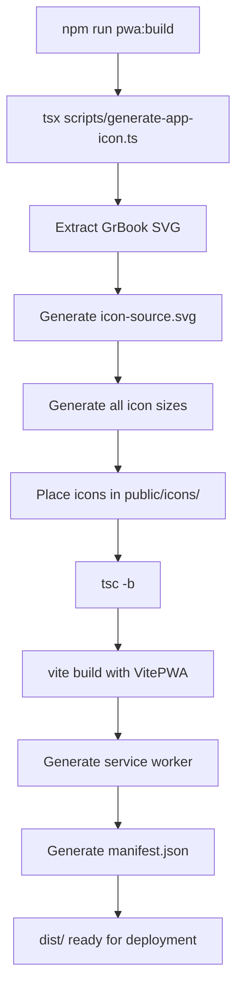

# Feature Specification: Progressive Web App (PWA) Implementation

## Overview

This specification outlines the implementation of Progressive Web App (PWA) capabilities for the EPUB Reader application, including automated app icon generation from a React icon SVG and complete PWA configuration using Vite.

## 1. Icon Generation System

### 1.1 Source Icon Definition

The app will use the **GrBook** icon SVG path as the source for all PWA assets.

**SVG Source:**

```svg
<svg stroke="currentColor" fill="currentColor" stroke-width="0" viewBox="0 0 24 24" height="200px" width="200px" xmlns="http://www.w3.org/2000/svg">
  <path fill="none" stroke-width="2" d="M10,1 L10,11 L13,9 L16,11 L16,1 M5.5,18 C4.11928813,18 3,19.1192881 3,20.5 C3,21.8807119 4.11928813,23 5.5,23 L22,23 M3,20.5 L3,3.5 C3,2.11928813 4.11928813,1 5.5,1 L21,1 L21,18.0073514 L5.49217286,18.0073514 M20.5,18 C19.1192881,18 18,19.1192881 18,20.5 C18,21.8807119 19.1192881,23 20.5,23 L20.5,23"></path>
</svg>
```

**Note:** The current `public/logo.svg` contains a different custom book design. This implementation will use the GrBook path directly without needing to import from react-icons.

### 1.2 Icon Generation Script

**Location:** `/scripts/generate-app-icon.ts`

**Purpose:**

- Create styled SVG file from GrBook path data
- Generate all required PWA icons using `@vite-pwa/assets-generator`
- Generate favicon, Apple touch icons, and Android icons

**Features:**

- TypeScript script executed via `tsx` runtime
- Direct use of SVG path (no React icon import needed)
- Generation of all required icon sizes (192x192, 512x512, 180x180, etc.)
- Favicon generation (ICO and SVG formats)
- Customizable colors and styling

**Output Directory:** `public/icons/` (all generated icons)

### 1.3 Icon Sizes and Formats

Generated icons will include:

**PWA Manifest Icons:**

- 192x192 (minimum required)
- 512x512 (minimum required)
- 384x384 (recommended)
- 256x256 (recommended)

**iOS/MacOS Icons:**

- 180x180 (Apple touch icon)

**Windows Icons:**

- 64x64 (optional)

**Favicons:**

- favicon.ico (16x16, 32x32, 48x48)
- favicon.svg

## 2. PWA Configuration

### 2.1 Dependencies

**Production Dependencies:**

- None (PWA runs purely on web standards)

**Development Dependencies:**

- `vite-plugin-pwa` - Zero-config PWA plugin for Vite
- `@vite-pwa/assets-generator` - Generate PWA assets from source SVG
- `tsx` - TypeScript runtime for executing generation scripts
- `workbox-window` (included with vite-plugin-pwa) - Service worker runtime

### 2.2 Vite Configuration

**File:** `vite.config.ts`

**Changes:**

- Import and register `VitePWA` plugin
- Configure service worker strategy (generateSW recommended)
- Define manifest properties
- Configure workbox caching strategies

**Manifest Configuration:**

```typescript
{
  name: 'EPUB Reader - Immersive AI-Enhanced Reader',
  short_name: 'EPUB Reader',
  description: 'An AI-enhanced EPUB reader with offline support',
  theme_color: '#ffffff',
  background_color: '#ffffff',
  display: 'standalone',
  orientation: 'any',
  scope: '/',
  start_url: '/',
  icons: [
    // Auto-generated by assets generator
  ]
}
```

**Service Worker Strategy:**

- **generateSW** (recommended) - Auto-generate service worker
- **Workbox Strategies:**
  - `NetworkFirst` for EPUB files and API calls
  - `CacheFirst` for static assets (JS, CSS, images)
  - `StaleWhileRevalidate` for HTML pages

### 2.3 Caching Strategy

**Cache Names:**

- `epub-static-v1` - Static assets (JS, CSS, fonts)
- `epub-books-v1` - EPUB files and book data
- `epub-images-v1` - Book covers and images
- `epub-runtime-v1` - Runtime API responses

**OPFS Integration:**

- EPUB files stored in OPFS are already persistent
- Service worker will cache metadata and UI assets
- No duplication of book content between OPFS and Cache API

## 3. Package.json Scripts

### 3.1 New Scripts

```json
{
  "scripts": {
    "icon:generate": "tsx scripts/generate-app-icon.ts",
    "pwa:assets": "pwa-assets-generator --preset minimal-2023 public/icon-source.svg",
    "pwa:dev": "vite --open",
    "pwa:build": "npm run icon:generate && tsc -b && vite build",
    "pwa:preview": "vite preview --open"
  }
}
```

**Script Descriptions:**

- `icon:generate` - Extract GrBook SVG and generate all PWA icons
- `pwa:assets` - Generate assets using Vite PWA asset generator (optional alternative)
- `pwa:dev` - Development server with PWA support
- `pwa:build` - Full build including icon generation
- `pwa:preview` - Preview production PWA build

### 3.2 Build Workflow



## 4. Implementation Details

### 4.1 Icon Generation Script (`scripts/generate-app-icon.ts`)

**Approach:**

1. **Define SVG source**

   ```typescript
   const iconPath =
     'M10,1 L10,11 L13,9 L16,11 L16,1 M5.5,18 C4.11928813,18 3,19.1192881 3,20.5 C3,21.8807119 4.11928813,23 5.5,23 L22,23 M3,20.5 L3,3.5 C3,2.11928813 4.11928813,1 5.5,1 L21,1 L21,18.0073514 L5.49217286,18.0073514 M20.5,18 C19.1192881,18 18,19.1192881 18,20.5 C18,21.8807119 19.1192881,23 20.5,23 L20.5,23';
   ```

2. **Create styled SVG**

   - Build complete SVG with viewBox="0 0 24 24"
   - Apply custom colors and styling
   - Add background or padding if needed
   - Ensure square aspect ratio

3. **Generate source SVG file**

   - Write styled SVG to `public/icon-source.svg`
   - Use white theme colors (#ffffff background with dark strokes)
   - Create clean, minimal design suitable for icons

4. **Generate icon sizes**

   - Use `@vite-pwa/assets-generator` CLI or API
   - Generate all required sizes
   - Place output in `public/icons/` directory

5. **Generate favicon**
   - Create favicon.ico with multiple sizes
   - Create favicon.svg as alternative

**Dependencies in Script:**

- `@vite-pwa/assets-generator` - For generating assets
- `fs/promises` - For file operations
- `path` - For path resolution

**Note:** No need to import `react` or `react-icons` - we use the pure SVG path directly.

### 4.2 HTML Updates

**File:** `index.html`

**Changes:**

```html
<head>
  <meta charset="UTF-8" />

  <!-- Favicon -->
  <link rel="icon" type="image/svg+xml" href="/icons/favicon.svg" />
  <link rel="alternate icon" href="/icons/favicon.ico" />

  <!-- Apple Touch Icon -->
  <link rel="apple-touch-icon" href="/icons/apple-touch-icon-180x180.png" />

  <!-- PWA Meta -->
  <meta name="theme-color" content="#ffffff" />
  <meta name="viewport" content="width=device-width, initial-scale=1.0" />

  <!-- PWA Manifest (auto-injected by vite-plugin-pwa) -->

  <title>EPUB Reader</title>
</head>
```

### 4.3 Service Worker Registration

**File:** `src/main.tsx`

**Changes:**

```typescript
import { registerSW } from 'virtual:pwa-register';

// Register service worker
const updateSW = registerSW({
  onNeedRefresh() {
    // Show update notification to user
    if (confirm('New version available! Reload to update?')) {
      updateSW(true);
    }
  },
  onOfflineReady() {
    console.log('App ready to work offline');
  },
});
```

### 4.4 TypeScript Support

**File:** `src/vite-env.d.ts`

**Changes:**

```typescript
/// <reference types="vite/client" />
/// <reference types="vite-plugin-pwa/client" />
```

## 5. Directory Structure

```
/home/wuchuheng/myProjects/com.wuchuheng.epub-reader/
├── public/
│   ├── icon-source.svg           # Generated source SVG from GrBook
│   ├── icons/                    # Generated PWA icons
│   │   ├── favicon.ico
│   │   ├── favicon.svg
│   │   ├── apple-touch-icon-180x180.png
│   │   ├── pwa-192x192.png
│   │   ├── pwa-512x512.png
│   │   ├── pwa-384x384.png
│   │   └── pwa-256x256.png
│   └── logo.svg                  # Existing logo (kept for reference)
├── scripts/
│   └── generate-app-icon.ts      # Icon generation script
├── src/
│   ├── main.tsx                  # Updated with SW registration
│   └── vite-env.d.ts             # Updated with PWA types
├── index.html                    # Updated with icon links
├── vite.config.ts                # Updated with VitePWA plugin
└── package.json                  # Updated with new scripts
```

## 6. Testing & Validation

### 6.1 Development Testing

1. Run `npm run pwa:dev`
2. Open DevTools → Application → Manifest
3. Verify manifest properties
4. Check Service Workers tab
5. Test offline mode (Network tab → Offline)

### 6.2 Lighthouse Audit

Run Lighthouse PWA audit:

- **Score Target:** 100
- **Requirements:**
  - Valid manifest
  - Service worker registered
  - Works offline
  - Installable
  - Proper icons

### 6.3 Manual Testing

**Desktop:**

- Chrome: Install via address bar icon
- Edge: Install via Settings menu
- Safari: Check Add to Dock (MacOS Sonoma+)

**Mobile:**

- iOS Safari: Add to Home Screen
- Android Chrome: Install prompt
- Test offline functionality

## 7. Icon Generation Technical Details

### 7.1 GrBook Icon SVG Structure

The **GrBook** icon path represents:

- Simple, clean book outline
- Bookmark ribbon detail
- Scalable vector design
- ViewBox: 0 0 24 24

**SVG Path Breakdown:**

- Book spine and bookmark: `M10,1 L10,11 L13,9 L16,11 L16,1`
- Bottom curve (left): `M5.5,18 C4.11928813,18 3,19.1192881 3,20.5 C3,21.8807119 4.11928813,23 5.5,23 L22,23`
- Left edge and top: `M3,20.5 L3,3.5 C3,2.11928813 4.11928813,1 5.5,1 L21,1 L21,18.0073514 L5.49217286,18.0073514`
- Bottom curve (right): `M20.5,18 C19.1192881,18 18,19.1192881 18,20.5 C18,21.8807119 19.1192881,23 20.5,23 L20.5,23`

**Icon Styling Template:**

```typescript
const styledSvg = `
<svg xmlns="http://www.w3.org/2000/svg" viewBox="0 0 24 24" width="512" height="512">
  <rect width="24" height="24" fill="#ffffff"/>
  <path fill="none" stroke="#222222" stroke-width="2" 
        d="M10,1 L10,11 L13,9 L16,11 L16,1 M5.5,18 C4.11928813,18 3,19.1192881 3,20.5 C3,21.8807119 4.11928813,23 5.5,23 L22,23 M3,20.5 L3,3.5 C3,2.11928813 4.11928813,1 5.5,1 L21,1 L21,18.0073514 L5.49217286,18.0073514 M20.5,18 C19.1192881,18 18,19.1192881 18,20.5 C18,21.8807119 19.1192881,23 20.5,23 L20.5,23"
        transform="translate(0.5, 0.5)"/>
</svg>
`;
```

### 7.2 Color Scheme

**Primary Colors:**

- Background: `#ffffff` (white base)
- Foreground: `#222222` (dark strokes for contrast)
- Theme: `#ffffff` (matches PWA chrome)

**Dark Mode Alternative:**

- Background: `#f8fafc` (soft light surface)
- Foreground: `#111827` (Tailwind gray-900)

### 7.3 Asset Generator Configuration

**File:** `pwa-assets.config.ts` (optional)

```typescript
import { defineConfig, minimal2023Preset } from '@vite-pwa/assets-generator/config';

export default defineConfig({
  preset: {
    ...minimal2023Preset,
    png: {
      compressionLevel: 9,
      quality: 90,
    },
    appleSplashScreens: false, // Disable splash screens for simplicity
  },
  images: ['public/icon-source.svg'],
});
```

## 8. Implementation Phases

### Phase 1: Setup & Dependencies

- [ ] Install dependencies (`vite-plugin-pwa`, `@vite-pwa/assets-generator`, `tsx`)
- [ ] Create `/scripts` directory
- [ ] Update `package.json` with new scripts

### Phase 2: Icon Generation Script

- [ ] Create `scripts/generate-app-icon.ts`
- [ ] Implement GrBook SVG extraction
- [ ] Implement icon generation logic
- [ ] Test script execution with `npm run icon:generate`

### Phase 3: PWA Configuration

- [ ] Update `vite.config.ts` with VitePWA plugin
- [ ] Configure manifest properties
- [ ] Configure service worker caching strategies
- [ ] Update TypeScript definitions

### Phase 4: HTML & Registration

- [ ] Update `index.html` with icon links
- [ ] Add service worker registration to `main.tsx`
- [ ] Test PWA installation flow

### Phase 5: Testing & Optimization

- [ ] Run Lighthouse audit
- [ ] Test offline functionality
- [ ] Test on multiple devices/browsers
- [ ] Optimize caching strategies

## 9. User Stories

- As a user, I want to install the EPUB reader as a standalone app on my device
- As a user, I want the app to work offline so I can read my books without internet
- As a user, I want a professional app icon that represents the book reading experience
- As a developer, I want automated icon generation so I don't have to manually create all sizes
- As a developer, I want a simple build process that handles all PWA assets automatically

## 10. Success Criteria

**Functional Requirements:**

- ✅ PWA installs successfully on desktop and mobile
- ✅ App works offline after first load
- ✅ Service worker caches all necessary assets
- ✅ OPFS book storage works with PWA
- ✅ Icons display correctly in all contexts

**Technical Requirements:**

- ✅ Lighthouse PWA score ≥ 95
- ✅ All required manifest fields present
- ✅ Service worker registers without errors
- ✅ Icon generation automated via npm script
- ✅ TypeScript compilation succeeds

**Performance Requirements:**

- ✅ First load performance not degraded
- ✅ Cache size remains reasonable (<50MB for assets)
- ✅ Service worker doesn't interfere with OPFS operations

## 11. Future Enhancements

**Post-MVP Features:**

- Periodic background sync for AI model updates
- Push notifications for reading reminders
- Share target API for importing EPUB files
- File handling API for opening EPUB files directly
- Advanced caching strategies (AI response caching)

## 12. References

**Documentation:**

- [Vite PWA Plugin Guide](https://vite-pwa-org.netlify.app/guide/)
- [PWA Assets Generator](https://vite-pwa-org.netlify.app/assets-generator/)
- [Workbox Documentation](https://developer.chrome.com/docs/workbox)
- [Web App Manifest Spec](https://www.w3.org/TR/appmanifest/)

**Tools:**

- `vite-plugin-pwa` - Main PWA plugin
- `@vite-pwa/assets-generator` - Icon generation
- `tsx` - TypeScript execution
- Pure SVG path from GrBook (no react-icons import needed)

**Best Practices:**

- Use `generateSW` strategy for simplicity
- Cache static assets aggressively
- Use `NetworkFirst` for dynamic content
- Keep service worker simple and maintainable
- Test on real devices, not just emulators

## 13. PWA Install Button Feature

### 13.1 Feature Overview

Add a dynamic install button to the home page header that appears when the PWA is not installed and provides a user-friendly way to install the app.

### 13.2 Requirements

**Button Behavior:**

- Display install button only when PWA is not installed
- Use `MdInstallDesktop` icon from `react-icons/md`
- Position button in home page header next to existing action buttons
- Show install prompt when clicked
- Hide button after successful installation

**Technical Implementation:**

- Detect PWA installation status using `beforeinstallprompt` event
- Store install prompt for later use when button is clicked
- Handle both desktop and mobile install flows
- Provide visual feedback during installation process

### 13.3 UI/UX Specifications

**Button Design:**

- Icon: `MdInstallDesktop` from react-icons library
- Position: Right side of header, next to Settings and Upload buttons
- Styling: Match existing header button design (gray-600, hover:gray-900)
- Tooltip: "Install EPUB Reader" on hover
- Responsive: Same behavior on mobile and desktop

**Visibility Logic:**

- Show: When app is running in browser (not installed)
- Hide: When app is running as installed PWA
- Hide: After successful installation
- Hide: If browser doesn't support PWA installation

### 13.4 Implementation Details

**Install Detection Hook:**

```typescript
const usePWAInstall = () => {
  const [deferredPrompt, setDeferredPrompt] = useState<any>(null);
  const [isInstalled, setIsInstalled] = useState(false);

  useEffect(() => {
    const handleBeforeInstallPrompt = (e: Event) => {
      e.preventDefault();
      setDeferredPrompt(e);
    };

    const handleAppInstalled = () => {
      setIsInstalled(true);
      setDeferredPrompt(null);
    };

    window.addEventListener('beforeinstallprompt', handleBeforeInstallPrompt);
    window.addEventListener('appinstalled', handleAppInstalled);

    // Check if already installed
    if (window.matchMedia('(display-mode: standalone)').matches) {
      setIsInstalled(true);
    }

    return () => {
      window.removeEventListener('beforeinstallprompt', handleBeforeInstallPrompt);
      window.removeEventListener('appinstalled', handleAppInstalled);
    };
  }, []);

  const installPWA = async () => {
    if (deferredPrompt) {
      deferredPrompt.prompt();
      const { outcome } = await deferredPrompt.userChoice;
      if (outcome === 'accepted') {
        setIsInstalled(true);
      }
      setDeferredPrompt(null);
    }
  };

  return { isInstalled, installPWA, canInstall: !!deferredPrompt };
};
```

**Header Integration:**

```typescript
import { MdInstallDesktop } from 'react-icons/md';
import { usePWAInstall } from '../../hooks/usePWAInstall';

const BookshelfPage: React.FC = () => {
  const { isInstalled, installPWA, canInstall } = usePWAInstall();

  return (
    <header className="border-b bg-white shadow-sm">
      <div className="mx-auto max-w-7xl px-4 py-4 sm:px-6 lg:px-8">
        <div className="flex items-center justify-between">
          <h1 className="text-2xl font-bold text-gray-900">Epub reader</h1>
          <div className="flex items-center gap-4">
            {!isInstalled && canInstall && (
              <button
                onClick={installPWA}
                className="text-gray-600 hover:text-gray-900"
                aria-label="Install App"
                title="Install EPUB Reader"
              >
                <MdInstallDesktop />
              </button>
            )}
            <button
              onClick={() => navigate('/settings')}
              className="text-gray-600 hover:text-gray-900"
              aria-label="Settings"
              title="Settings"
            >
              <Settings />
            </button>
            <button
              onClick={handleUploadBtnClick}
              className="text-gray-600 hover:text-gray-900"
              aria-label="Upload Book"
              title="Upload Book"
            >
              <Plus />
            </button>
          </div>
        </div>
      </div>
    </header>
  );
};
```

### 13.5 Dependencies

**New Dependencies:**

- `react-icons` - For MdInstallDesktop icon (likely already installed)

**No Additional Dependencies Required:**

- Uses standard Web APIs for PWA detection
- Integrates with existing PWA implementation

### 13.6 Browser Compatibility

**Supported Browsers:**

- Chrome/Edge 76+ (full support)
- Firefox (limited install support)
- Safari (iOS Safari supports Add to Home Screen)

**Fallback Behavior:**

- Button hidden if browser doesn't support PWA
- No errors if `beforeinstallprompt` is not available
- Graceful degradation for unsupported browsers

### 13.7 Testing Requirements

**Manual Testing:**

- Test install button visibility in browser vs installed PWA
- Test successful installation flow
- Test button hiding after installation
- Test on both desktop and mobile devices

**Browser Testing:**

- Chrome desktop (primary)
- Chrome mobile/Android
- Safari iOS
- Edge desktop

### 13.8 Success Criteria

**Functional Requirements:**

- ✅ Install button appears when PWA is not installed
- ✅ Button uses correct MdInstallDesktop icon
- ✅ Clicking button triggers install prompt
- ✅ Button disappears after successful installation
- ✅ Button hidden when running as installed PWA

**Technical Requirements:**

- ✅ No console errors during detection
- ✅ Proper event listener cleanup
- ✅ Responsive design maintained
- ✅ Accessibility standards met (ARIA labels)

**Performance Requirements:**

- ✅ No impact on page load performance
- ✅ Minimal memory footprint
- ✅ Efficient event handling
